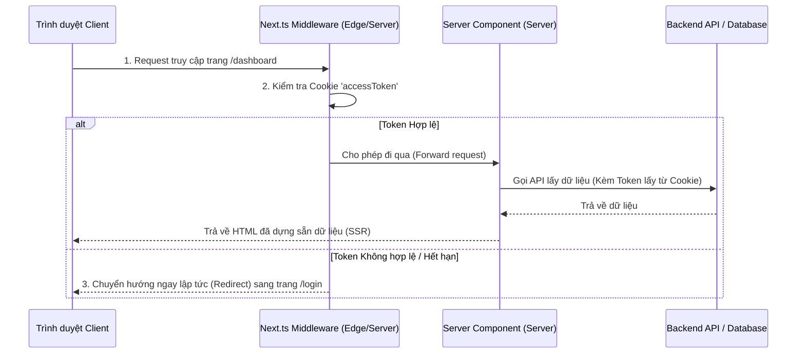

# Luồng Xác Thực (Authentication) & Phân Quyền (Authorization) trong Next.js (App Router)

Trong Next.js (đặc biệt là App Router), mô hình xác thực có sự khác biệt rất lớn so với React SPA thông thường. Next.js chạy cả ở Server (Server-Side Rendering - SSR, Server Components) và Client. Vì vậy, các thông tin xác thực bắt buộc phải được lưu trữ trong **Cookie** để máy chủ có thể đọc được ngay từ request đầu tiên, tránh hiện tượng nhấp nháy giao diện (Flickering UI) và bảo vệ ứng dụng ngay từ tầng máy chủ.

---

## 1. Khác Biệt Cốt Lõi: Next.js vs React SPA

| Tiêu chí | React SPA (Client-side) | Next.js App Router (SSR / Server-side) |
| :--- | :--- | :--- |
| **Nơi lưu trữ Token** | RAM (Access Token) + Cookie (Refresh Token). | **Cookie** (cả Access Token & Refresh Token hoặc Session ID). |
| **Lý do lưu trữ** | RAM để chống XSS trên SPA thuần. | Cookie để **Server** đọc được ngay trong request HTTP để dựng HTML (SSR) và chạy Middleware. |
| **Cách chặn Route** | Chặn ở Client bằng React Router (Route Guards). | Chặn ở Server bằng **Middleware** (`middleware.ts`) trước khi HTML được dựng. |
| **Tính bảo mật** | Javascript chạy trên Client dễ bị tấn công XSS hơn. | An toàn hơn nhờ sử dụng Cookie **HttpOnly, Secure, SameSite=Lax/Strict** và xử lý logic trên môi trường Server khép kín. |

---

## 2. Kiến Trúc Luồng Xác Thực Trong Next.js App Router



---

## 3. Triển Khai Chi Tiết Từng Thành Phần

### 3.1. Đăng Nhập qua Server Action & Cấu Hình Cookie
Server Actions cho phép thực thi code trực tiếp trên Server khi Client gửi form submit.

```typescript
// app/actions/auth.ts
"use server";

import { cookies } from "next/headers";
import { redirect } from "next/navigation";

export async function login(formData: FormData) {
  const email = formData.get("email");
  const password = formData.get("password");

  // 1. Gọi API Backend để kiểm tra thông tin
  const response = await fetch("https://api.yourdomain.com/login", {
    method: "POST",
    headers: { "Content-Type": "application/json" },
    body: JSON.stringify({ email, password }),
  });

  if (!response.ok) {
    return { error: "Thông tin đăng nhập không chính xác" };
  }

  const { accessToken, refreshToken, user } = await response.json();

  // 2. Lưu Access Token và Refresh Token vào Cookie bảo mật HttpOnly
  const cookieStore = await cookies();

  cookieStore.set("accessToken", accessToken, {
    httpOnly: true, // Javascript client không thể đọc được -> Chống XSS
    secure: process.env.NODE_ENV === "production", // Chỉ gửi qua HTTPS
    sameSite: "lax", // Chống CSRF cơ bản
    path: "/", // Áp dụng cho toàn bộ domain
    maxAge: 15 * 60, // Hết hạn sau 15 phút (Access Token)
  });

  cookieStore.set("refreshToken", refreshToken, {
    httpOnly: true,
    secure: process.env.NODE_ENV === "production",
    sameSite: "lax",
    path: "/",
    maxAge: 7 * 24 * 60 * 60, // Hết hạn sau 7 ngày
  });

  // 3. Chuyển hướng sang trang Dashboard
  redirect("/dashboard");
}
```

---

### 3.2. Bảo Vệ Route Tầng Mạng Với `middleware.ts`
Middleware chạy tại tầng Edge (trước khi request chạm tới Server Component hay Page). Đây là nơi lý tưởng để chặn và chuyển hướng người dùng chưa đăng nhập.

> [!IMPORTANT]
> Môi trường chạy của Next.js Middleware là **Edge Runtime** chứ không phải Node.js truyền thống. Các thư viện nặng như `jsonwebtoken` (dùng thư viện mã hóa của Node.js) sẽ không chạy được ở đây. Chúng ta nên dùng thư viện siêu nhẹ **`jose`** để giải mã JWT trong Middleware.

```typescript
// middleware.ts
import { NextResponse } from "next/server";
import type { NextRequest } from "next/server";
import { jwtVerify } from "jose"; // Thư viện nhẹ tương thích Edge Runtime

const JWT_SECRET = new TextEncoder().encode(
  process.env.JWT_SECRET || "your-secret-key"
);

// Danh sách các route cần bảo vệ
const protectedRoutes = ["/dashboard", "/admin", "/profile"];

export async function middleware(request: NextRequest) {
  const { pathname } = request.nextUrl;
  const accessToken = request.cookies.get("accessToken")?.value;

  // Kiểm tra xem route hiện tại có nằm trong danh sách cần bảo vệ không
  const isProtectedRoute = protectedRoutes.some((route) =>
    pathname.startsWith(route)
  );

  if (isProtectedRoute) {
    if (!accessToken) {
      // Nếu không có token -> Chuyển hướng ngay về login
      const loginUrl = new URL("/login", request.url);
      loginUrl.searchParams.set("from", pathname); // Lưu lại trang cũ để quay lại sau
      return NextResponse.redirect(loginUrl);
    }

    try {
      // Xác minh tính hợp lệ và chữ ký của JWT
      const { payload } = await jwtVerify(accessToken, JWT_SECRET);
      
      // Phân quyền nâng cao: Nếu truy cập trang admin nhưng role không phải Admin
      if (pathname.startsWith("/admin") && payload.role !== "Admin") {
        return NextResponse.redirect(new URL("/unauthorized", request.url));
      }
    } catch (error) {
      // Nếu Token hết hạn hoặc sai chữ ký -> Yêu cầu đăng nhập lại
      const loginUrl = new URL("/login", request.url);
      return NextResponse.redirect(loginUrl);
    }
  }

  return NextResponse.next();
}

// Cấu hình Middleware chỉ chạy cho các route cụ thể (tối ưu hóa hiệu năng)
export const config = {
  matcher: ["/dashboard/:path*", "/admin/:path*", "/profile/:path*"],
};
```

---

### 3.3. Xác Thực Trong Server Components (`page.tsx`)
Tại Server Components, ta có thể đọc Cookie trực tiếp bằng hàm `cookies()` của Next.js để gọi API lấy dữ liệu đã được xác thực từ Server.

```tsx
// app/dashboard/page.tsx
import { cookies } from "next/headers";

interface Project {
  id: string;
  name: string;
}

async function getProjects(token: string): Promise<Project[]> {
  const res = await fetch("https://api.yourdomain.com/projects", {
    headers: {
      Authorization: `Bearer ${token}`,
    },
    next: { revalidate: 3600 }, // Cache dữ liệu trên server 1 tiếng
  });

  if (!res.ok) throw new Error("Không thể tải danh sách dự án");
  return res.json();
}

export default async function DashboardPage() {
  const cookieStore = await cookies();
  const accessToken = cookieStore.get("accessToken")?.value;

  // Lấy dữ liệu an toàn ngay trên Server
  const projects = await getProjects(accessToken || "");

  return (
    <div className="p-8">
      <h1 className="text-2xl font-bold mb-4">Dashboard</h1>
      <ul>
        {projects.map((project) => (
          <li key={project.id} className="py-2 border-b">
            {project.name}
          </li>
        ))}
      </ul>
    </div>
  );
}
```

---

### 3.4. Xác Thực Trong Client Components
Nếu một Component cần tính tương tác (như lắng nghe state, click button) và cần biết thông tin User, ta sử dụng React Context hoặc truyền dữ liệu từ Server Component xuống dưới dạng Props.

```tsx
// app/components/Navbar.tsx
"use client";

import { useRouter } from "next/navigation";

interface NavbarProps {
  initialUser: { name: string; email: string } | null;
}

export default function Navbar({ initialUser }: NavbarProps) {
  const router = useRouter();

  const handleLogout = async () => {
    // Gọi API Route Handler hoặc Server Action để xóa Cookie
    await fetch("/api/auth/logout", { method: "POST" });
    router.refresh(); // Làm mới trang để cập nhật lại Server Components
    router.push("/login");
  };

  return (
    <nav className="flex justify-between p-4 bg-gray-800 text-white">
      <div>My App</div>
      {initialUser ? (
        <div className="flex items-center gap-4">
          <span>Xin chào, {initialUser.name}</span>
          <button onClick={handleLogout} className="bg-red-500 px-3 py-1 rounded">
            Đăng xuất
          </button>
        </div>
      ) : (
        <button onClick={() => router.push("/login")} className="bg-blue-500 px-3 py-1 rounded">
          Đăng nhập
        </button>
      )}
    </nav>
  );
}
```

---

## 4. Tùy Chọn Thay Thế: Sử Dụng Auth.js (NextAuth.js)

Đối với các dự án thực tế muốn tích hợp nhanh nhiều nhà cung cấp (Google, Facebook, GitHub, Credentials login), **Auth.js** (tên gọi mới của NextAuth.js) là thư viện tiêu chuẩn khuyên dùng.

- **Đặc trưng**:
  - Hỗ trợ lưu trữ session dạng JWT (mặc định) hoặc lưu session trong database thông qua Adapters (Prisma, Drizzle, MongoDB).
  - Tích hợp sẵn Middleware bảo vệ route siêu gọn.
  - Tự động handle luồng refresh token thông qua callback `jwt` và `session`.
- **Cài đặt cơ bản**:
  1. Cấu hình config file `auth.ts` định nghĩa các `providers` và `callbacks`.
  2. Tạo API Route `app/api/auth/[...nextauth]/route.ts` để NextAuth tự động sinh các endpoint đăng nhập/đăng xuất.
  3. Sử dụng `auth()` trong Server Components và `useSession()` trong Client Components để truy xuất dữ liệu người dùng.
