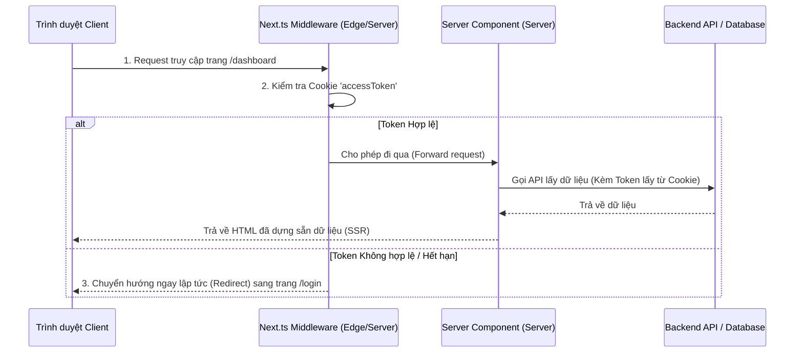

# Luồng Xác Thực (Authentication) & Phân Quyền (Authorization) trong Next.js (App Router)

Trong Next.js (đặc biệt là App Router), mô hình xác thực có sự khác biệt rất lớn so với React SPA thông thường. Next.js chạy cả ở Server (Server-Side Rendering - SSR, Server Components) và Client. Vì vậy, các thông tin xác thực bắt buộc phải được lưu trữ trong **Cookie** để máy chủ có thể đọc được ngay từ request đầu tiên, tránh hiện tượng nhấp nháy giao diện (Flickering UI) và bảo vệ ứng dụng ngay từ tầng máy chủ.

---

## 1. Khác Biệt Cốt Lõi: Next.js vs React SPA

| Tiêu chí | React SPA (Client-side) | Next.js App Router (SSR / Server-side) |
| :--- | :--- | :--- |
| **Nơi lưu trữ Token** | RAM (Access Token) + Cookie (Refresh Token). | **Cookie** (cả Access Token & Refresh Token hoặc Session ID). |
| **Lý do lưu trữ** | RAM để chống XSS trên SPA thuần. | Cookie để **Server** đọc được ngay trong request HTTP để dựng HTML (SSR) và chạy Middleware. |
| **Cách chặn Route** | Chặn ở Client bằng React Router (Route Guards). | Chặn ở Server bằng **Middleware** (`middleware.ts`) trước khi HTML được dựng. |
| **Tính bảo mật** | Javascript chạy trên Client dễ bị tấn công XSS hơn. | An toàn hơn nhờ sử dụng Cookie **HttpOnly, Secure, SameSite=Lax/Strict** và xử lý logic trên môi trường Server khép kín. |

---

## 2. Kiến Trúc Luồng Xác Thực Trong Next.js App Router

---

## 3. Các Bước Triển Khai Logic và Luồng Hoạt Động

### 3.1. Đăng Nhập và Thiết lập Session (Login & Session Setup)
1.  **Nhận thông tin đăng nhập**:
    *   Sử dụng **Server Actions** hoặc **Route Handlers (API Routes)** trên Next.js để tiếp nhận dữ liệu đăng nhập (email, password) gửi lên từ form của Client.
2.  **Xác thực và Thiết lập Cookie**:
    *   Gọi API Backend để đối chiếu thông tin tài khoản.
    *   Sau khi nhận thành công cặp token, Server Next.js sử dụng API quản lý Cookie của Next.js (như hàm `cookies()`) để ghi Token vào trình duyệt.
    *   Cần cấu hình Cookie cực kỳ nghiêm ngặt:
        *   `httpOnly: true`: Ngăn chặn Javascript client tiếp cận token (chống XSS).
        *   `secure: true`: Chỉ truyền cookie qua kênh HTTPS bảo mật.
        *   `sameSite: 'lax'`: Ngăn chặn các cuộc tấn công CSRF phổ biến.
        *   `maxAge` và `path`: Cấu hình thời hạn sống tương ứng của Access Token và Refresh Token.
3.  **Điều hướng**:
    *   Sau khi thiết lập cookie thành công trên Server, thực hiện chuyển hướng người dùng sang trang `/dashboard`.

### 3.2. Bảo Vệ Route Tầng Mạng Với `middleware.ts`
1.  **Vị trí và Môi trường chạy**:
    *   Tệp `middleware.ts` được đặt ở thư mục gốc của ứng dụng Next.js, đánh chặn mọi request trước khi chạm tới Server Components hay Pages.
    *   Do chạy trên môi trường **Edge Runtime** siêu nhẹ, ta nên sử dụng các thư viện gọn nhẹ (như `jose`) để giải mã và kiểm tra tính hợp lệ chữ ký của JWT Token thay vì các thư viện Node.js truyền thống.
2.  **Logic xác thực của Middleware**:
    *   Đọc Cookie `accessToken` trực tiếp từ request HTTP.
    *   Nếu không tồn tại token: Redirect người dùng về trang đăng nhập `/login` ngay lập tức trên Server, không trả về bất kỳ dòng HTML nhạy cảm nào của Dashboard.
    *   Nếu có token: Tiến hành giải mã và xác thực chữ ký JWT.
    *   **Phân quyền nâng cao**: Đọc vai trò (`role`) trong payload của token. Nếu người dùng cố truy cập trang quản trị `/admin` nhưng role không khớp, redirect sang trang cảnh báo `/unauthorized` (`403 Forbidden`).
    *   Nếu hợp lệ: Cho phép request tiếp tục đi tiếp.

### 3.3. Xác Thực Trong Server Components (`page.tsx`)
1.  **Đọc thông tin Session**:
    *   Server Components chạy hoàn toàn trên server. Để lấy token phục vụ việc fetch dữ liệu, Component sử dụng API đọc Cookie (`cookies()`).
2.  **Gọi API Backend có xác thực**:
    *   Lấy Access Token từ Cookie và đính kèm vào Header của phương thức `fetch()` gửi lên API Backend để lấy dữ liệu riêng tư của người dùng.
    *   Quá trình này diễn ra an toàn ở môi trường Server phía sau tường lửa, giảm thiểu rủi ro rò rỉ token và giấu kín địa chỉ API gốc của Backend.

### 3.4. Xác Thực Trong Client Components
1.  **Đọc Session**:
    *   Client Components chạy trên trình duyệt và không thể truy cập trực tiếp các hàm Server-only như `cookies()`.
    *   Thông tin User/Session cần được truyền từ Server Component cha xuống Client Component con thông qua Props hoặc bọc trong một Client Context Provider.
2.  **Đăng xuất (Logout)**:
    *   Khi người dùng click nút đăng xuất, Client Component gọi một Server Action hoặc Route Handler để xóa sạch các Cookie đã lưu trên trình duyệt.
    *   Sử dụng router của Next.js chạy lệnh `router.refresh()` để yêu cầu tất cả các Server Components hiện tại trên màn hình render lại giao diện mới tương thích với trạng thái chưa đăng nhập, sau đó dùng `router.push('/login')` để chuyển hướng.

---

## 4. Sử Dụng Thư Viện Chuyên Dụng: Auth.js (NextAuth.js)

Đối với các dự án thực tế muốn tích hợp nhanh nhiều nhà cung cấp đăng nhập (Social Login như Google, GitHub, Facebook, hoặc Credentials), ta nên cân nhắc sử dụng **Auth.js** (tên gọi mới của NextAuth.js):
*   Tự động quản lý toàn bộ vòng đời session (JWT hoặc Database Session).
*   Tích hợp sẵn Middleware bảo vệ route và cấu hình cookies an toàn theo chuẩn sản xuất.
*   Cung cấp sẵn các helper hooks (`useSession()`, `auth()`) hỗ trợ lấy thông tin user đồng thời ở cả Server Components và Client Components.
