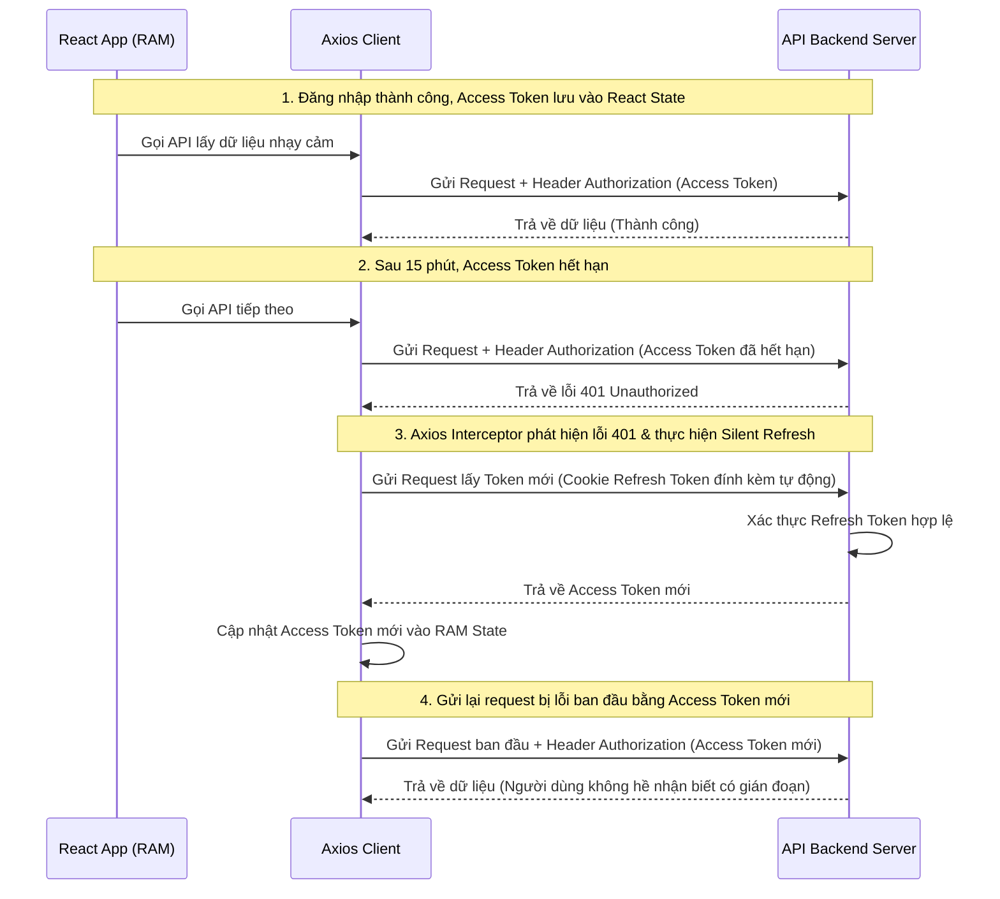

# Luồng Xác Thực (Authentication) & Phân Quyền (Authorization) trong React (SPA)

Trong ứng dụng React SPA (Single Page Application), việc xác thực hoàn toàn do Client-Side điều khiển kết hợp với API Backend. Bài viết này hướng dẫn chi tiết cách thiết kế một hệ thống Auth an toàn, tối ưu trải nghiệm người dùng bằng cách kết hợp **Access Token trong bộ nhớ RAM**, **Refresh Token trong Cookie HttpOnly**, và **Axios Interceptors** để tự động làm mới token (Silent Refresh) mà không cần triển khai mã nguồn phức tạp.

---

## 1. Kiến Trúc Luồng Auth An Toàn Nhất (Best Practice)

Để đảm bảo tính bảo mật trước các cuộc tấn công **XSS (Cross-Site Scripting)** và **CSRF (Cross-Site Request Forgery)**, kiến trúc chuẩn hiện nay được tổ chức như sau:

| Loại Token | Nơi lưu trữ trên Client | Thời hạn | Phạm vi bảo mật chống lại |
| :--- | :--- | :--- | :--- |
| **Access Token** (JWT) | **RAM** (React State / Redux) | Rất ngắn (5 - 15 phút) | Chống XSS (không thể truy cập bằng Javascript độc hại khi tải trang). |
| **Refresh Token** (JWT/Opaque) | **Cookie HttpOnly** (SameSite=Strict, Secure) | Dài hạn (7 - 30 ngày) | Chống XSS (Javascript không thể đọc được Cookie này) và chống CSRF (nhờ SameSite=Strict). |

### Sơ đồ luồng Silent Refresh Token:

---

## 2. Các Bước Triển Khai Logic và Luồng Hoạt Động

### 2.1. Quản lý Trạng Thái Xác Thực (Authentication State Management)
Ứng dụng React cần duy trì trạng thái đăng nhập tập trung (thông qua React Context hoặc thư viện quản lý state như Redux/Zustand):
1.  **State lưu trữ**:
    *   `user`: Chứa thông tin cơ bản như `userId`, `username`, và danh sách các quyền/vai trò (`roles`).
    *   `accessToken`: Lưu chuỗi token ngắn hạn trực tiếp trên biến trạng thái của React (trong RAM).
    *   `loading`: Biến boolean dùng để xác định xem ứng dụng có đang trong quá trình kiểm tra/khôi phục phiên đăng nhập cũ hay không.
2.  **Khôi phục phiên đăng nhập (Persist Session)**:
    *   Khi người dùng F5 hoặc mở tab mới, React State sẽ bị xóa sạch (`user = null`, `accessToken = null`).
    *   Ứng dụng cần chạy một hiệu ứng (`useEffect`) lúc khởi chạy để tự động gửi yêu cầu lên API làm mới (`/api/auth/refresh`). Do Refresh Token nằm sẵn trong Cookie HttpOnly, trình duyệt sẽ tự động gửi kèm cookie này.
    *   Nếu Refresh Token hợp lệ, Server trả về Access Token mới, ứng dụng cập nhật vào RAM State và chuyển trạng thái `loading = false`, giúp duy trì phiên đăng nhập không gián đoạn.

### 2.2. Cơ Chế Axios Interceptors & Silent Refresh (Làm mới ngầm)
Để tránh việc lập trình viên phải đính kèm Access Token thủ công cho từng API request, ta sử dụng cơ chế lắng nghe của Axios:
1.  **Request Interceptor (Đánh chặn chiều đi)**:
    *   Trước khi bất kỳ HTTP Request nào được gửi ra ngoài, interceptor sẽ can thiệp và tự động đính kèm Access Token từ RAM State vào Header `Authorization: Bearer <Access Token>`.
    *   Bật cờ `withCredentials: true` để đảm bảo trình duyệt gửi kèm Cookie của domain đó (chứa Refresh Token).
2.  **Response Interceptor (Đánh chặn chiều về)**:
    *   Lắng nghe phản hồi từ server. Khi Access Token hết hạn, server sẽ từ chối và trả về HTTP Status `401 Unauthorized`.
    *   Nhận diện mã lỗi `401`, interceptor sẽ tự động chặn lỗi và tạm dừng các request khác.
    *   Gửi một request độc lập gọi API `/refresh` để đổi lấy Access Token mới.
    *   Nếu thành công: Cập nhật Access Token mới vào RAM State, thay thế token trong header của request bị lỗi cũ và thực hiện gửi lại request đó. Người dùng sẽ không hề nhận biết được lỗi đã xảy ra.
    *   Nếu thất bại (do Refresh Token cũng đã hết hạn hoặc bị thu hồi): Xóa sạch state người dùng và chuyển hướng họ về trang đăng nhập.

### 2.3. Chặn Đường Dẫn & Phân Quyền Route (Route Guarding)
Để bảo vệ các trang quản trị hoặc trang cá nhân, ta cấu hình một thành phần bọc bảo vệ Route (thường sử dụng cùng React Router v6):
1.  **Cơ chế Protected Route (Bảo vệ xác thực)**:
    *   Đọc trạng thái `accessToken` từ Context. Nếu không tồn tại, chặn render trang hiện tại và chuyển hướng người dùng sang trang `/login`.
    *   Lưu trữ lại địa chỉ hiện tại (`location`) vào state của router để sau khi đăng nhập thành công có thể tự động chuyển hướng người dùng quay lại đúng trang họ đang làm dở.
2.  **Cơ chế Allowed Roles Route (Phân quyền truy cập)**:
    *   Khi người dùng đã đăng nhập thành công, component kiểm tra danh sách `roles` của người dùng đối chiếu với danh sách các vai trò được phép truy cập được cấu hình cho Route đó.
    *   Nếu danh sách vai trò hợp lệ, cho phép hiển thị trang con (thông qua component `<Outlet />`).
    *   Nếu không đủ quyền, chuyển hướng người dùng sang trang báo lỗi `/unauthorized` (`403 Forbidden`).
