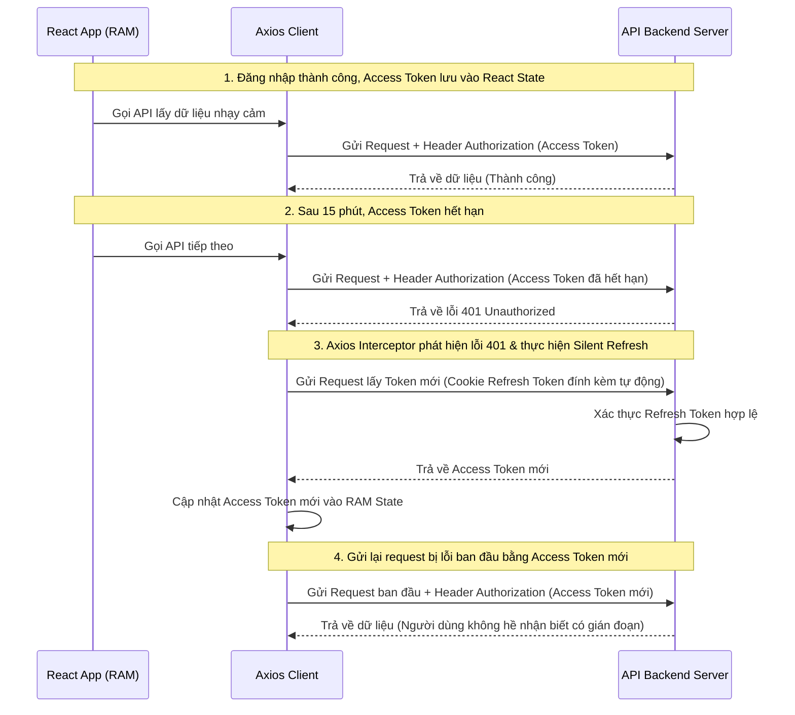

# Luồng Xác Thực (Authentication) & Phân Quyền (Authorization) trong React (SPA)

Trong ứng dụng React SPA (Single Page Application), việc xác thực hoàn toàn do Client-Side điều khiển kết hợp với API Backend. Bài viết này hướng dẫn chi tiết cách thiết kế một hệ thống Auth an toàn, tối ưu trải nghiệm người dùng bằng cách kết hợp **Access Token trong bộ nhớ RAM**, **Refresh Token trong Cookie HttpOnly**, và **Axios Interceptors** để tự động làm mới token (Silent Refresh).

---

## 1. Kiến Trúc Luồng Auth An Toàn Nhất

Để đảm bảo tính bảo mật trước các cuộc tấn công **XSS (Cross-Site Scripting)** và **CSRF (Cross-Site Request Forgery)**, kiến trúc chuẩn hiện nay được tổ chức như sau:

| Loại Token                     | Nơi lưu trữ trên Client                       | Thời hạn               | Phạm vi bảo mật chống lại                                                                 |
| :----------------------------- | :-------------------------------------------- | :--------------------- | :---------------------------------------------------------------------------------------- |
| **Access Token** (JWT)         | **RAM** (React State / Redux)                 | Rất ngắn (5 - 15 phút) | Chống XSS (không thể truy cập bằng Javascript độc hại khi tải trang).                     |
| **Refresh Token** (JWT/Opaque) | **Cookie HttpOnly** (SameSite=Strict, Secure) | Dài hạn (7 - 30 ngày)  | Chống XSS (Javascript không thể đọc được Cookie này) và chống CSRF (nhờ SameSite=Strict). |

### Sơ đồ luồng Silent Refresh Token:



---

## 2. Triển Khai Trong React

### 2.1. Khởi tạo AuthContext quản lý State

Chúng ta cần một State trung tâm để lưu thông tin User và Access Token trong bộ nhớ RAM.

```tsx
// context/AuthContext.tsx
import React, { createContext, useState, useEffect, ReactNode } from "react";

interface User {
  id: string;
  username: string;
  roles: string[];
}

interface AuthContextType {
  user: User | null;
  accessToken: string | null;
  setAuth: (user: User | null, token: string | null) => void;
  logout: () => Promise<void>;
  loading: boolean;
}

export const AuthContext = createContext<AuthContextType | undefined>(
  undefined,
);

export const AuthProvider = ({ children }: { children: ReactNode }) => {
  const [user, setUser] = useState<User | null>(null);
  const [accessToken, setAccessToken] = useState<string | null>(null);
  const [loading, setLoading] = useState(true);

  const setAuth = (user: User | null, token: string | null) => {
    setUser(user);
    setAccessToken(token);
  };

  const logout = async () => {
    try {
      // Gọi API Backend xóa cookie Refresh Token
      await fetch("/api/auth/logout", { method: "POST" });
    } finally {
      setUser(null);
      setAccessToken(null);
    }
  };

  // Hàm Silent Refresh khi khởi động ứng dụng (Refresh Token còn hạn trong Cookie)
  useEffect(() => {
    const persistAuth = async () => {
      try {
        const response = await fetch("/api/auth/refresh", { method: "POST" });
        if (response.ok) {
          const data = await response.json(); // { user, accessToken }
          setAuth(data.user, data.accessToken);
        }
      } catch (error) {
        console.error("Failed to restore session", error);
      } finally {
        setLoading(false);
      }
    };

    persistAuth();
  }, []);

  return (
    <AuthContext.Provider
      value={{ user, accessToken, setAuth, logout, loading }}
    >
      {children}
    </AuthContext.Provider>
  );
};
```

---

### 2.2. Viết Custom Hook `useAxiosPrivate`

Axios Interceptors giúp tự động gài Access Token và tự động refresh token khi gặp lỗi 401.

```typescript
// hooks/useAxiosPrivate.ts
import axios from "axios";
import { useEffect } from "react";
import useAuth from "./useAuth"; // Hook đơn giản để useContext(AuthContext)

const axiosPrivate = axios.create({
  baseURL: "https://api.yourdomain.com",
  headers: { "Content-Type": "application/json" },
  withCredentials: true, // Bắt buộc để đính kèm Cookie Refresh Token
});

export const useAxiosPrivate = () => {
  const { accessToken, setAuth } = useAuth();

  useEffect(() => {
    // 1. Request Interceptor: Gài Access Token vào Header
    const requestIntercept = axiosPrivate.interceptors.request.use(
      (config) => {
        if (!config.headers["Authorization"]) {
          config.headers["Authorization"] = `Bearer ${accessToken}`;
        }
        return config;
      },
      (error) => Promise.reject(error),
    );

    // 2. Response Interceptor: Xử lý lỗi 401 và Refresh Token
    const responseIntercept = axiosPrivate.interceptors.response.use(
      (response) => response,
      async (error) => {
        const prevRequest = error?.config;
        // Nếu lỗi 401 và request đó chưa từng được thử lại (sentinel flag _retry)
        if (error?.response?.status === 401 && !prevRequest?._retry) {
          prevRequest._retry = true;
          try {
            // Gọi API refresh token
            const refreshResponse = await axios.post(
              "https://api.yourdomain.com/api/auth/refresh",
              {},
              { withCredentials: true },
            );
            const newAccessToken = refreshResponse.data.accessToken;

            // Cập nhật lại vào Context State
            setAuth(refreshResponse.data.user, newAccessToken);

            // Cập nhật Header của request bị lỗi cũ và thực thi lại nó
            prevRequest.headers["Authorization"] = `Bearer ${newAccessToken}`;
            return axiosPrivate(prevRequest);
          } catch (refreshError) {
            // Nếu Refresh Token cũng hết hạn -> Yêu cầu đăng nhập lại
            setAuth(null, null);
            return Promise.reject(refreshError);
          }
        }
        return Promise.reject(error);
      },
    );

    // Cleanup interceptors khi unmount hook
    return () => {
      axiosPrivate.interceptors.request.eject(requestIntercept);
      axiosPrivate.interceptors.response.eject(responseIntercept);
    };
  }, [accessToken, setAuth]);

  return axiosPrivate;
};
```

---

## 3. Bảo Vệ Router (Route Guards) với React Router v6

Chúng ta cần ngăn chặn người dùng chưa đăng nhập hoặc không đủ quyền hạn truy cập vào các trang cụ thể.

```tsx
// components/ProtectedRoute.tsx
import { useLocation, Navigate, Outlet } from "react-router-dom";
import useAuth from "../hooks/useAuth";

interface ProtectedRouteProps {
  allowedRoles?: string[];
}

export const ProtectedRoute = ({ allowedRoles }: ProtectedRouteProps) => {
  const { user, accessToken, loading } = useAuth();
  const location = useLocation();

  if (loading) {
    return <div>Đang tải thông tin xác thực...</div>;
  }

  // 1. Kiểm tra nếu chưa đăng nhập (không có Access Token trong RAM)
  if (!accessToken) {
    // Chuyển hướng đến trang Login, đồng thời lưu lại trang họ đang cố truy cập (from)
    return <Navigate to="/login" state={{ from: location }} replace />;
  }

  // 2. Kiểm tra quyền hạn (Authorization) nếu có yêu cầu vai trò cụ thể
  if (
    allowedRoles &&
    !user?.roles.some((role) => allowedRoles.includes(role))
  ) {
    // Nếu có đăng nhập nhưng không đủ quyền -> Chuyển hướng sang trang Unauthorized
    return <Navigate to="/unauthorized" replace />;
  }

  // 3. Nếu hợp lệ hoàn toàn, hiển thị Route con tương ứng
  return <Outlet />;
};
```

### Cách cấu hình Router trong `App.tsx`:

```tsx
import { Routes, Route } from "react-router-dom";
import { ProtectedRoute } from "./components/ProtectedRoute";
import Dashboard from "./pages/Dashboard";
import AdminPanel from "./pages/AdminPanel";
import Login from "./pages/Login";
import Unauthorized from "./pages/Unauthorized";

function App() {
  return (
    <Routes>
      {/* Routes công khai */}
      <Route path="/login" element={<Login />} />
      <Route path="/unauthorized" element={<Unauthorized />} />

      {/* Routes yêu cầu đăng nhập cơ bản (Bất kỳ user nào) */}
      <Route element={<ProtectedRoute />}>
        <Route path="/dashboard" element={<Dashboard />} />
      </Route>

      {/* Routes yêu cầu quyền cụ thể (Role: Admin) */}
      <Route element={<ProtectedRoute allowedRoles={["Admin"]} />}>
        <Route path="/admin" element={<AdminPanel />} />
      </Route>
    </Routes>
  );
}
```

---

## 4. Tóm tắt Luồng Xử Lý

1. **Login**: Gửi thông tin đăng nhập -> Nhận Access Token lưu vào biến React State, Cookie Refresh Token tự động lưu trên Browser.
2. **Khi tắt tab/F5**: React State biến mất -> Ứng dụng chạy hiệu ứng `useEffect` gọi API `/refresh` -> Nhận Access Token mới lưu vào State -> User duy trì trạng thái đăng nhập.
3. **Khi Access Token hết hạn ngầm**: Axios Interceptor bắt được mã lỗi `401`, âm thầm lấy Access Token mới và gửi lại request cũ mà không làm gián đoạn UI.
4. **Bảo vệ Route**: `ProtectedRoute` dùng React Router Router v6 để chặn truy cập trái phép ở phía Client.
