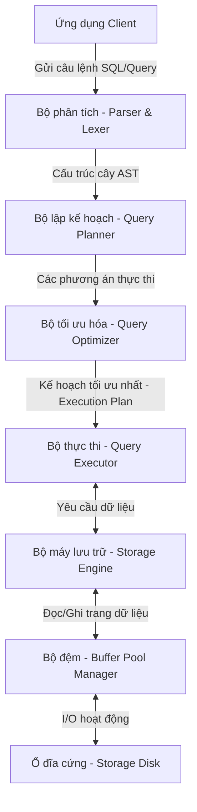
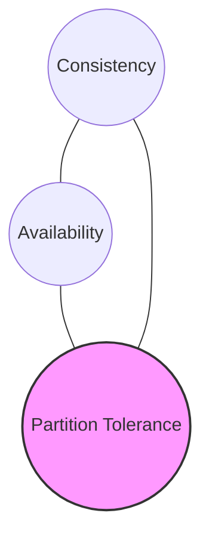
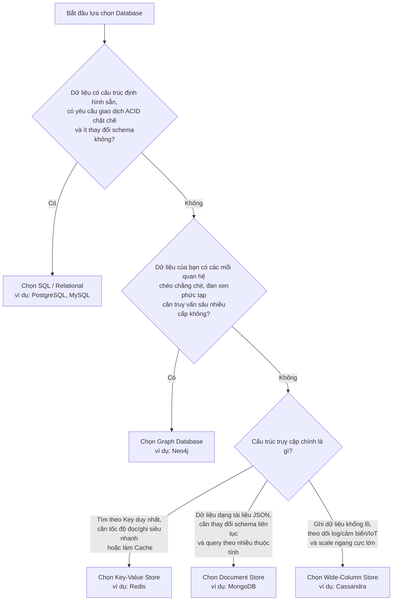

# Tổng Quan Về Hệ Quản Trị Cơ Sở Dữ Liệu (DBMS)

Tài liệu này cung cấp một cái nhìn tổng quan, chi tiết và có hệ thống nhất về các khái niệm cốt lõi, kiến trúc lưu trữ vật lý, các thuật ngữ hệ thống phân tán, và bộ khung tư duy để lựa chọn cơ sở dữ liệu (Database) phù hợp cho từng bài toán thực tế.

---

## 1. Kiến Trúc Tổng Quan Của Một DBMS

Một Hệ quản trị cơ sở dữ liệu (Database Management System - DBMS) không chỉ đơn thuần là nơi lưu trữ file trên đĩa cứng. Nó là một hệ thống phức tạp gồm nhiều thành phần phối hợp chặt chẽ:

- **Query Parser**: Nhận câu lệnh truy vấn từ client, phân tích cú pháp (Syntax) và ngữ nghĩa (Semantics), sau đó xây dựng thành cấu trúc cây cú pháp trừu tượng (Abstract Syntax Tree - AST).
- **Query Planner & Optimizer**: Dựa trên AST, tạo ra nhiều kế hoạch thực thi (Execution Plans). Bộ tối ưu hóa (Optimizer) sẽ sử dụng số liệu thống kê (Statistics) của bảng để ước lượng chi phí (Cost-based Optimizer) và chọn ra phương án tối ưu nhất (ví dụ: quét chỉ mục thay vì quét toàn bộ bảng).
- **Query Executor**: Nhận kế hoạch thực thi và tiến hành gọi các API tương ứng của Storage Engine để lấy dữ liệu.
- **Storage Engine**: Thành phần trực tiếp tương tác với hệ thống lưu trữ vật lý để đọc/ghi dữ liệu, quản lý index, quản lý khóa (locking) và đảm bảo tính nhất quán của dữ liệu.

---

## 2. Chi Tiết Về Lưu Trữ Vật Lý (Storage Internals)

Để hiểu tại sao cơ sở dữ liệu lại nhanh hơn việc đọc/ghi file thông thường, ta cần đi sâu vào cách chúng quản lý dữ liệu trên đĩa cứng (Disk) và bộ nhớ trong (RAM).

### 2.1. Quản lý Bộ đệm & Đĩa cứng (Buffer & Disk Management)
- **Pages (Trang) và Blocks**: Đĩa cứng đọc/ghi theo từng khối vật lý. DBMS tổ chức dữ liệu thành các đơn vị logic gọi là **Pages** (thường có kích thước 8KB trong PostgreSQL hoặc 16KB trong MySQL). Mọi hoạt động đọc ghi của Database đều được thực hiện trên đơn vị Page này.
- **Buffer Pool**: Là một vùng nhớ RAM được DBMS giữ lại để chứa các Page được đọc từ Disk lên. 
  - Khi cần đọc dữ liệu, DBMS tìm trong Buffer Pool trước (Buffer Hit). Nếu không có, nó mới đọc từ Disk (Buffer Miss) và nạp vào Buffer Pool.
  - Khi dữ liệu bị thay đổi, Page trong Buffer Pool trở thành **Dirty Page**. DBMS sẽ không ghi trực tiếp xuống Disk ngay lập tức vì hiệu năng ghi ngẫu nhiên (Random Write) rất chậm. Thay vào đó, nó sẽ ghi tuần tự vào file nhật ký (**Write-Ahead Log - WAL**) và đồng bộ dần các Dirty Page xuống Disk sau (quá trình Checkpointing).

### 2.2. Row-Oriented vs Column-Oriented Storage
Tùy thuộc vào mục đích sử dụng, dữ liệu có thể được sắp xếp theo dòng hoặc theo cột trên đĩa cứng:

| Đặc trưng | Lưu trữ theo Dòng (Row-Oriented / OLTP) | Lưu trữ theo Cột (Column-Oriented / OLAP) |
| :--- | :--- | :--- |
| **Cách lưu trên đĩa** | Các trường của cùng một bản ghi được lưu trữ liền kề nhau. | Tất cả giá trị của cùng một cột được lưu trữ liền kề nhau. |
| **Mô hình hoạt động** | **OLTP** (Online Transaction Processing - Giao dịch trực tuyến). | **OLAP** (Online Analytical Processing - Phân tích dữ liệu). |
| **Thao tác tối ưu** | Đọc/Ghi toàn bộ thông tin của một bản ghi cụ thể (ví dụ: thông tin user đăng nhập). | Tính toán trên diện rộng của một vài cột cụ thể (ví dụ: tính tổng doanh thu năm). |
| **Hiệu năng nén** | Nén kém hơn do các kiểu dữ liệu khác nhau nằm cạnh nhau. | Nén cực tốt (Run-length encoding, Dictionary encoding) vì cùng kiểu dữ liệu. |
| **Hệ thống tiêu biểu** | PostgreSQL, MySQL, Oracle, SQLite. | ClickHouse, Google BigQuery, Snowflake, Amazon Redshift. |

> [!TIP]
> Sử dụng **Row-Oriented** cho các ứng dụng web thông thường cần CRUD (Create, Read, Update, Delete) nhanh chóng trên từng thực thể. Sử dụng **Column-Oriented** cho hệ thống Data Warehouse, BI (Business Intelligence) phục vụ phân tích dữ liệu lớn.

### 2.3. Các loại Storage Engines phổ biến
Storage Engine quyết định cách dữ liệu được tổ chức vật lý và cách thức ghi xuống đĩa:

1. **B-Tree / B+ Tree Engines (Read-Optimized)**:
   - Dữ liệu được sắp xếp và lưu trữ dưới dạng cây tự cân bằng.
   - Thích hợp cho các thao tác tìm kiếm điểm (Point Query - ví dụ: tìm theo ID) và truy vấn phạm vi (Range Query - ví dụ: tìm tất cả đơn hàng từ ngày A đến ngày B) với độ phức tạp $O(\log N)$.
   - Ghi dữ liệu chậm hơn do phải cập nhật cây trên Disk để tránh phân mảnh.
2. **LSM-Tree Engines (Write-Optimized - Log-Structured Merge-Tree)**:
   - Dữ liệu ghi mới được đưa vào bộ nhớ RAM trước (**MemTable**) và ghi tuần tự vào file nhật ký ghi trước (Commit Log).
   - Khi MemTable đầy, nó được chuyển đổi thành các file bất biến (**SSTables - Sorted String Tables**) lưu trên Disk.
   - Định kỳ, một quá trình nền (**Compaction**) chạy để gộp và loại bỏ các dữ liệu trùng lặp/đã xóa trong các SSTables.
   - Ghi cực nhanh vì chỉ ghi tuần tự (Sequential Write), phù hợp cho việc ghi log, dữ liệu cảm biến IoT, dòng dữ liệu lớn (Big Data).

---

## 3. Các Thuật Ngữ Cốt Lõi Về Giao Dịch & Hệ Thống Phân Tán

### 3.1. ACID vs BASE
Hai triết lý thiết kế đối nghịch nhau nhằm giải quyết bài toán giao dịch và tính nhất quán:

* **ACID (Thường dùng cho SQL)**:
  - **Atomicity (Tính nguyên tử)**: Giao dịch thành công hoàn toàn hoặc thất bại hoàn toàn (All or Nothing).
  - **Consistency (Tính nhất quán)**: Dữ liệu phải luôn chuyển từ trạng thái hợp lệ này sang trạng thái hợp lệ khác sau giao dịch, tuân thủ tất cả ràng buộc hệ thống.
  - **Isolation (Tính cô lập)**: Các giao dịch chạy đồng thời không được ảnh hưởng đến nhau.
  - **Durability (Tính bền vững)**: Một khi giao dịch đã commit thành công, dữ liệu sẽ tồn tại vĩnh viễn kể cả khi mất điện hay crash hệ thống.

* **BASE (Thường dùng cho NoSQL)**:
  - **Basically Available (Khả dụng cơ bản)**: Hệ thống luôn phản hồi yêu cầu của client, dù một số node phân tán gặp sự cố (có thể trả về dữ liệu cũ hoặc lỗi nhẹ).
  - **Soft State (Trạng thái mềm)**: Trạng thái của dữ liệu có thể tự thay đổi theo thời gian mà không cần tác động từ client (do quá trình đồng bộ giữa các node).
  - **Eventual Consistency (Nhất quán cuối cùng)**: Hệ thống đảm bảo rằng dữ liệu cuối cùng sẽ giống nhau ở mọi node sau một khoảng thời gian đồng bộ nhất định.

---

### 3.2. CAP Theorem vs PACELC Theorem
Định lý cốt lõi khi thiết kế hệ thống cơ sở dữ liệu phân tán (Distributed Databases).

#### Định lý CAP (CAP Theorem):
Trong một hệ thống phân tán, khi xảy ra phân mảnh mạng (**Partition Tolerance**), hệ thống chỉ có thể chọn tối đa một trong hai yếu tố:
- **Consistency (Nhất quán)**: Mọi node đều đọc thấy cùng một dữ liệu mới nhất tại cùng một thời điểm.
- **Availability (Khả dụng)**: Mọi node hoạt động bình thường luôn phản hồi thành công (không trả về lỗi).

- **CP System**: Ưu tiên Nhất quán. Nếu kết nối mạng giữa các node bị đứt, node bị cô lập sẽ từ chối truy vấn để tránh trả về dữ liệu cũ.
- **AP System**: Ưu tiên Khả dụng. Các node bị cô lập vẫn trả về dữ liệu cũ của nó thay vì báo lỗi.
- **CA System**: Thực chất chỉ tồn tại trên lý thuyết khi mạng không bao giờ đứt (hệ thống single-node). Trong thực tế phân tán, mạng luôn có thể đứt, nên bắt buộc phải chọn CP hoặc AP.

#### Định lý PACELC (PACELC Theorem):
Mở rộng của định lý CAP, mô tả hành vi hệ thống cả khi **BÌNH THƯỜNG** (không có phân mảnh mạng):
> **P**artition xảy ra -> Chọn **A**vailability hay **C**onsistency?
> **E**lse (mạng bình thường) -> Chọn **L**atency (Độ trễ thấp) hay **C**onsistency (Nhất quán dữ liệu)?

- **MongoDB / HBase (PC/EC)**: Khi có lỗi mạng chọn Consistency; khi bình thường chọn Consistency (chờ đồng bộ ghi xong mới phản hồi).
- **Cassandra / DynamoDB (PA/EL)**: Khi có lỗi mạng chọn Availability; khi bình thường chọn Latency (phản hồi ngay khi node local ghi xong, đồng bộ sau).

---

### 3.3. Các Thuật Ngữ Mở Rộng Quy Mô (Scaling)
- **Replication (Sao bản)**: Sao chép dữ liệu sang nhiều server khác nhau nhằm tăng tính chịu lỗi (Fault tolerance) và tăng tốc độ đọc. Có các mô hình: Master-Slave (hoặc Primary-Replica), Multi-Master, Masterless.
- **Partitioning / Sharding (Phân mảnh)**:
  - **Partitioning**: Chia nhỏ một bảng lớn thành nhiều phần nhỏ nằm trên cùng một server vật lý.
  - **Sharding**: Chia nhỏ dữ liệu và đặt chúng ở các server vật lý hoàn toàn độc lập (mỗi server gọi là một Shard) để phân tán lực đọc/ghi và dung lượng lưu trữ.

---

## 4. Bộ Khung Lựa Chọn Cơ Sở Dữ Liệu (Selection Framework)

Để chọn lựa loại cơ sở dữ liệu phù hợp, ta có thể tham khảo bảng so sánh và sơ đồ quyết định dưới đây.

### 4.1. Bảng So Sánh Tổng Quan

| Tiêu chí | SQL (Relational) | NoSQL (Non-Relational) | Graph (Đồ thị) |
| :--- | :--- | :--- | :--- |
| **Cấu trúc dữ liệu** | Bảng (Tables) với dòng & cột cố định. | Key-Value, Document (JSON), Column Family. | Nodes (Thực thể), Edges (Mối quan hệ), Properties. |
| **Schema** | Nghiêm ngặt (Strict Schema), cần khai báo trước. | Linh hoạt (Dynamic/Schema-less), thay đổi dễ dàng. | Linh hoạt, tự do thêm nhãn và thuộc tính động. |
| **Truy vấn chéo** | Phép `JOIN` giữa các bảng. Tốn kém khi liên kết nhiều tầng. | Không hỗ trợ `JOIN` trực tiếp (thường nhúng dữ liệu vào nhau). | Duyệt qua các liên kết chỉ mục (Index-Free Adjacency) cực nhanh. |
| **Mở rộng (Scaling)** | Mở rộng theo chiều dọc (Scale-up) tốt hơn chiều ngang. | Mở rộng theo chiều ngang (Scale-out) cực tốt. | Mở rộng ngang phức tạp, chủ yếu tối ưu hóa trên một/vài cụm. |
| **Độ tin cậy** | Đảm bảo tính ACID tuyệt đối. | Thường tuân theo BASE, ưu tiên tốc độ và dung lượng. | Thường đảm bảo tính ACID cho các giao dịch đồ thị. |

---

### 4.2. Sơ đồ Quyết định Chọn Lựa (Decision Flowchart)

Hãy tự trả lời các câu hỏi sau để tìm ra giải pháp tối ưu:

> [!IMPORTANT]
> Trong thực tế phát triển phần mềm hiện đại, các hệ thống lớn thường áp dụng kiến trúc **Polyglot Persistence** - tức là sử dụng kết hợp nhiều loại cơ sở dữ liệu khác nhau cho các phân hệ dịch vụ khác nhau trong cùng một hệ thống (ví dụ: Postgres lưu thông tin tài khoản và giao dịch tài chính, MongoDB lưu danh mục sản phẩm biến động, Redis làm cache/session, và Neo4j chạy gợi ý bạn bè).
