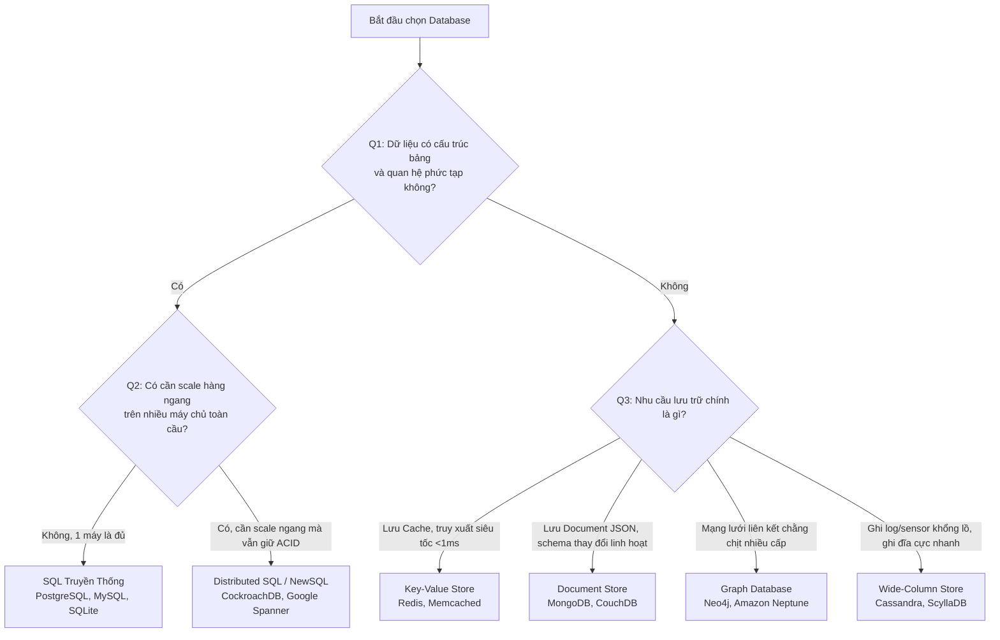

# NỀN TẢNG CƠ SỞ DỮ LIỆU (DATABASE FUNDAMENTALS)

Tài liệu này hệ thống hóa các kiến thức từ cơ bản đến nâng cao về Cơ sở dữ liệu (Database), giúp bạn hiểu rõ định nghĩa, cách sử dụng, phân loại và các tính chất cốt lõi của database.

---

## 1. CÁC KHÁI NIỆM CƠ BẢN (BASIC DEFINITIONS)

### 1.1. Database là gì và khi nào sử dụng? (What is a Database and when do we use it?)
- **Định nghĩa:** Database (Cơ sở dữ liệu) là một hệ thống được tổ chức để **lưu trữ, quản lý và truy xuất dữ liệu** một cách có cấu trúc, an toàn và hiệu quả.
- **Khi nào sử dụng:**
  - Cần lưu trữ dữ liệu lâu dài (Persistence), không bị mất khi tắt app hay server.
  - Cần chia sẻ dữ liệu cho nhiều người dùng hoặc nhiều dịch vụ cùng lúc.
  - Cần đảm bảo tính nhất quán (Consistency) và an toàn bảo mật.
  - Cần tìm kiếm, lọc và phân tích dữ liệu phức tạp trên quy mô lớn.

### 1.2. Phân biệt SQL và NoSQL (Difference between SQL and NoSQL)
- **SQL (Hệ CSDL Quan hệ):** Dữ liệu được lưu trữ dưới dạng các bảng (Tables) có cấu trúc hàng và cột chặt chẽ. Schema phải định nghĩa sẵn. Sử dụng ngôn ngữ SQL để truy vấn và ràng buộc dữ liệu rất mạnh mẽ.
- **NoSQL (Hệ CSDL Phi quan hệ):** Dữ liệu linh hoạt hơn, không bắt buộc dùng bảng. Có nhiều dạng lưu trữ như Document (JSON), Key-Value, Graph, hoặc Wide-column. Thích hợp cho dữ liệu không đồng nhất hoặc cần scale ngang nhanh.

### 1.3. Bảng (Tables), Bản ghi (Records/Rows), Cột (Columns), Khóa chính (Primary Key)
- **Table (Bảng):** Tập hợp dữ liệu của cùng một đối tượng (ví dụ: bảng `users`, bảng `products`).
- **Record/Row (Dòng/Bản ghi):** Một đối tượng cụ thể trong bảng (ví dụ: thông tin của người dùng Nguyễn Văn A).
- **Column (Cột):** Các thuộc tính của đối tượng (ví dụ: cột `id`, `username`, `email`). Mỗi cột có kiểu dữ liệu xác định.
- **Primary Key (Khóa chính):** Cột định danh duy nhất cho mỗi dòng dữ liệu. Giá trị của khóa chính không được trùng lặp và không được phép để trống (`NOT NULL`).

### 1.4. Thao tác CRUD (Create, Read, Update, Delete)
Là 4 thao tác cơ bản nhất của mọi ứng dụng khi làm việc với cơ sở dữ liệu:
- **C - Create (Tạo mới):** Thêm bản ghi mới (Ví dụ lệnh SQL: `INSERT INTO...`).
- **R - Read (Đọc):** Truy vấn dữ liệu có sẵn (Ví dụ lệnh SQL: `SELECT * FROM...`).
- **U - Update (Cập nhật):** Chỉnh sửa dữ liệu đang tồn tại (Ví dụ lệnh SQL: `UPDATE... SET...`).
- **D - Delete (Xóa):** Gỡ bỏ dữ liệu khỏi hệ thống (Ví dụ lệnh SQL: `DELETE FROM...`).

### 1.5. Các Database phổ biến (Common Databases)
- **SQLite:** Cơ sở dữ liệu quan hệ nhỏ gọn, lưu trong một file duy nhất trên đĩa, không cần cài đặt server phức tạp. Thường dùng trong mobile, app desktop, test nhanh.
- **MySQL:** Hệ CSDL quan hệ cực kỳ phổ biến, dễ dùng, tối ưu hóa tốc độ đọc. Phù hợp cho website thương mại điện tử, tin tức trung bình.
- **PostgreSQL:** Hệ CSDL quan hệ mã nguồn mở mạnh mẽ nhất, hỗ trợ kiểu dữ liệu phức tạp (JSON, GIS) và tính nhất quán rất cao. Phù hợp cho hệ thống lớn, fintech.
- **MongoDB:** Hệ CSDL NoSQL lưu dữ liệu dưới dạng tài liệu (Document/JSON) linh hoạt, dễ dàng mở rộng theo chiều ngang. Phù hợp cho chat app, log dữ liệu lớn, schema thay đổi liên tục.

---

## 2. TÍNH CHẤT HỆ QUẢN TRỊ CƠ SỞ DỮ LIỆU (DBMS PROPERTIES)

### 1.1. Tính chất ACID (ACID Properties)
ACID là tiêu chuẩn cốt lõi để đánh giá sự hiểu biết về độ tin cậy giao dịch. Dưới đây là cách giải nghĩa trực diện, phi hàn lâm:

*   **Atomicity (Tính nguyên tử - "Tất cả hoặc không có gì"):**
    *   *Cách hiểu đơn giản:* Giống như việc bạn chuyển tiền ngân hàng. Tiến trình gồm 2 bước: trừ tiền tài khoản bạn và cộng tiền tài khoản kia. Nếu bước 2 bị lỗi mất mạng, bước 1 phải được thu hồi (rollback). Không bao giờ có chuyện tài khoản bạn bị trừ tiền mà người kia không nhận được.
    *   *Ý nghĩa kỹ thuật:* Đảm bảo một giao dịch (transaction) gồm nhiều câu lệnh SQL phải được thực hiện thành công trọn vẹn 100%. Chỉ cần một câu lệnh bị lỗi, toàn bộ giao dịch sẽ thất bại và dữ liệu quay về trạng thái ban đầu.
*   **Consistency (Tính nhất quán - "Luôn tuân thủ luật chơi"):**
    *   *Cách hiểu đơn giản:* Giống như luật chơi bóng đá: bóng chạm tay trong vòng cấm là penalty. Nếu hệ thống quy định "Số dư tài khoản không được nhỏ hơn 0", thì bất kỳ giao dịch nào cố tình rút quá số dư đều sẽ bị hệ thống từ chối để bảo vệ luật.
    *   *Ý nghĩa kỹ thuật:* Đảm bảo dữ liệu trước và sau giao dịch luôn hợp lệ, tuân thủ mọi ràng buộc (constraints), quy tắc nghiệp vụ (business rules) và trigger đã được định nghĩa trong cơ sở dữ liệu.
*   **Isolation (Tính cô lập - "Việc ai nấy làm, không xen vào nhau"):**
    *   *Cách hiểu đơn giản:* Giống như hai người cùng mua chiếc vé máy bay cuối cùng trên hệ thống tại cùng một giây. Hệ thống phải xử lý tuần tự: người nào bấm mua trước sẽ giữ vé, người kia sẽ nhận thông báo hết vé, không được phép xảy ra chuyện một chiếc vé bán cho cả hai người.
    *   *Ý nghĩa kỹ thuật:* Đảm bảo các giao dịch chạy đồng thời (concurrently) không được can thiệp hoặc nhìn thấy trạng thái tạm thời của nhau. Kết quả của hệ thống khi chạy nhiều giao dịch song song phải giống như khi chạy chúng tuần tự.
*   **Durability (Tính bền vững - "Đã lưu là không bao giờ mất"):**
    *   *Cách hiểu đơn giản:* Khi bạn nộp bài thi thành công và hệ thống báo "Đã nhận bài", dù ngay sau đó server trường bị mất điện hay cháy chip, kết quả bài thi của bạn vẫn phải được lưu trữ an toàn trong ổ đĩa cứng không bị mất.
    *   *Ý nghĩa kỹ thuật:* Đảm bảo một khi giao dịch đã xác nhận thành công (committed), các thay đổi dữ liệu sẽ được ghi xuống đĩa cứng vật lý vĩnh viễn và không bị mất ngay cả khi hệ thống crash hoặc mất điện đột ngột.

---

### 1.2. Cơ chế Khóa (Locking & Lock Granularity)
Để đảm bảo tính cô lập (Isolation) khi nhiều người cùng đọc/ghi một dữ liệu, DBMS sử dụng cơ chế Khóa (Locking).

#### Shared Lock (S-Lock / Khóa đọc) vs Exclusive Lock (X-Lock / Khóa ghi)
*   **Shared Lock (Khóa chia sẻ - S-Lock):** Được áp dụng khi bạn muốn **đọc** dữ liệu. Nhiều người có thể cùng giữ S-Lock trên một bảng/dòng để đọc dữ liệu đồng thời mà không chặn nhau.
*   **Exclusive Lock (Khóa độc quyền - X-Lock):** Được áp dụng khi bạn muốn **ghi/sửa/xóa** dữ liệu. Chỉ duy nhất một người được giữ X-Lock trên dòng/bảng đó. X-Lock sẽ chặn đứng tất cả mọi người khác, không cho đọc (S-Lock) và cũng không cho ghi (X-Lock) cho đến khi người giữ X-Lock hoàn thành giao dịch.

#### Các cấp độ khóa (Lock Granularity)
Tùy vào tình huống, DBMS sẽ khóa ở các phạm vi khác nhau để cân bằng giữa độ chính xác và hiệu năng:
1.  **Row-level Lock (Khóa cấp dòng):** Chỉ khóa duy nhất dòng dữ liệu đang sửa đổi.
    *   *Đặc điểm:* Hiệu năng đồng thời cao nhất vì các dòng khác vẫn đọc/ghi bình thường. Nhưng tốn tài nguyên quản lý khóa của DBMS.
2.  **Page-level Lock (Khóa cấp trang):** Khóa một trang dữ liệu (thường chứa nhiều dòng liền kề).
3.  **Table-level Lock / Block Table (Khóa cấp bảng):** Khóa nguyên một bảng dữ liệu.
    *   *Đặc điểm:* Chặn toàn bộ mọi thao tác ghi/sửa trên bảng đó. Thường dùng khi cần thay đổi cấu trúc bảng (ALTER TABLE) hoặc backup dữ liệu. Nó giải phóng tài nguyên quản lý của DBMS nhưng làm nghẽn hệ thống nếu bảng có lượng truy cập lớn.

---

### 1.3. Đảm bảo toàn vẹn dữ liệu (Data Integrity)
Toàn vẹn dữ liệu là sự bảo đảm tính chính xác, nhất quán và đáng tin cậy của dữ liệu trong suốt vòng đời của nó. DBMS hỗ trợ 3 loại toàn vẹn dữ liệu cốt lõi:

| Loại toàn vẹn dữ liệu | Bản chất | Cơ chế đảm bảo | Ví dụ thực tế |
| :--- | :--- | :--- | :--- |
| **Entity Integrity** *(Toàn vẹn thực thể)* | Đảm bảo mỗi bản ghi trong bảng phải là duy nhất và có thể định danh được. | Sử dụng **Khóa chính (Primary Key)**. Khóa chính bắt buộc phải duy nhất và không được phép chứa giá trị `NULL`. | Bảng `users` có cột `user_id` làm khóa chính. Không thể có 2 user có cùng ID. |
| **Referential Integrity** *(Toàn vẹn tham chiếu)* | Đảm bảo mối liên kết dữ liệu giữa các bảng luôn chính xác và không bị đứt gãy. | Sử dụng **Khóa ngoại (Foreign Key)**. Dữ liệu cột khóa ngoại ở bảng con phải tồn tại ở bảng cha, hoặc là `NULL`. | Bảng `orders` có cột `user_id` trỏ sang bảng `users`. Không thể tạo order của một user không tồn tại. |
| **Domain Integrity** *(Toàn vẹn miền giá trị)* | Đảm bảo dữ liệu nhập vào một cột phải hợp lệ về mặt kiểu dữ liệu và logic phạm vi. | Sử dụng các ràng buộc kiểu dữ liệu, `NOT NULL`, `DEFAULT`, `CHECK`, hoặc kiểu ENUM. | Cột `age` phải là số nguyên và có ràng buộc `CHECK (age >= 18)`. |

---

## 3. ƯU ĐIỂM CỦA CƠ SỞ DỮ LIỆU SQL TRUYỀN THỐNG

Dù NoSQL rất phát triển, các hệ quản trị SQL truyền thống (như PostgreSQL, MySQL) vẫn là xương sống của phần lớn hệ thống nhờ hai ưu thế vượt trội:

1.  **Hệ sinh thái trưởng thành (Mature Ecosystem):**
    *   Trải qua hơn 50 năm phát triển và tối ưu hóa liên tục.
    *   Công cụ quản trị, đo đạc hiệu năng (monitoring), backup, bảo mật và cộng đồng hỗ trợ vô cùng khổng lồ.
    *   Hầu như mọi ngôn ngữ lập trình và framework đều hỗ trợ kết nối SQL hoàn hảo.
2.  **Ngôn ngữ chuẩn hóa toàn cầu (Standard Language - SQL):**
    *   SQL là ngôn ngữ khai báo chuẩn hóa theo chuẩn ANSI/ISO.
    *   Khi bạn đã học và làm chủ cú pháp SQL chuẩn, bạn có thể dễ dàng chuyển đổi sang làm việc với các hệ quản trị SQL khác (từ MySQL sang PostgreSQL, SQL Server, Oracle) mà không mất nhiều thời gian học lại từ đầu.

---

## 4. HỆ THỐNG CƠ SỞ DỮ LIỆU PHÂN TÁN (DISTRIBUTED DATABASE)

Khi dữ liệu vượt quá giới hạn của một máy chủ vật lý đơn lẻ, chúng ta chuyển dịch sang hệ thống cơ sở dữ liệu phân tán.

### 4.1. Phân biệt rõ: Cơ sở dữ liệu phân tán vs NoSQL
Rất nhiều người thường đánh đồng **"Cơ sở dữ liệu phân tán"** là **"NoSQL"**. Đây là một hiểu lầm tai hại. Hãy phân biệt rạch ròi hai khái niệm này thông qua hai chiều không gian hoàn toàn khác nhau:

*   **Mô hình dữ liệu logic (SQL vs NoSQL):** Cách dữ liệu được biểu diễn cho lập trình viên (Dùng bảng có quan hệ chặt chẽ hay cấu trúc JSON/Key-Value/Đồ thị linh hoạt).
*   **Hạ tầng vật lý (Single Instance vs Distributed):** Cách dữ liệu được lưu trữ vật lý (Chỉ nằm trên 1 máy chủ hay phân tán trên cụm nhiều server kết nối qua mạng).

Để trực quan hóa sự khác biệt, hãy xem bảng đối chiếu dưới đây:

| Khía cạnh mô hình | Single-Instance (Chạy trên 1 máy chủ đơn lẻ) | Distributed (Phân tán trên nhiều máy chủ) |
| :--- | :--- | :--- |
| **SQL (Relational Model)** | **PostgreSQL, MySQL truyền thống**<br>- Toàn bộ dữ liệu nằm trên một ổ cứng.<br>- Dễ dùng, đảm bảo ACID hoàn hảo.<br>- Bị giới hạn bởi phần cứng của 1 máy (Scale-up). | **Distributed SQL (NewSQL)** (Google Spanner, CockroachDB)<br>- Tự động phân mảnh, nhân bản trên nhiều máy chủ toàn cầu.<br>- **Vẫn bảo đảm ACID chặt chẽ tuyệt đối** bằng các giao thức đồng thuận (Raft/Paxos) và GPS. |
| **NoSQL (Non-Relational)** | **MongoDB, Redis chạy độc lập**<br>- Dữ liệu dạng JSON/Key-Value linh hoạt.<br>- Bị giới hạn bởi tài nguyên RAM/Disk của máy đơn lẻ đó. | **Distributed NoSQL** (Cassandra, DynamoDB, MongoDB Atlas)<br>- Mở rộng hàng ngang (Scale-out) cực mạnh ra hàng trăm máy chủ.<br>- Chấp nhận hy sinh tính nhất quán tức thời (Eventual Consistency) để ghi cực nhanh. |

### 4.2. Ưu điểm cốt lõi của hệ thống phân tán
*   **Mở rộng theo chiều ngang (Horizontal Scaling / Scale-out):** Dễ dàng cắm thêm các máy tính giá rẻ vào cụm để tăng khả năng lưu trữ và xử lý tải, không cần mua siêu máy chủ đắt đỏ.
*   **Tính khả dụng cao (High Availability):** Không có điểm lỗi duy nhất (No Single Point of Failure). Nếu một máy chủ bị sập, các máy khác vẫn hoạt động bình thường để phục vụ khách hàng.
*   **Dự phòng dữ liệu (Data Redundancy):** Dữ liệu được nhân bản tự động. Mất dữ liệu ở máy này vẫn còn bản sao ở máy khác.

---

## 5. QUY TRÌNH QUYẾT ĐỊNH LỰA CHỌN CƠ SỞ DỮ LIỆU

Để lựa chọn loại cơ sở dữ liệu phù hợp nhất cho dự án, kiến trúc sư hệ thống sử dụng quy trình lọc 3 câu hỏi (3-Step Decision Flow) vô cùng trực quan dưới đây:

### 5.1. Sơ đồ rẽ nhánh quyết định (Decision Tree)



### 5.2. Sơ đồ trực quan dạng chữ (ASCII Decision Flow)

```text
               [ BẮT ĐẦU CHỌN DATABASE ]
                          │
         (Q1: Dữ liệu có quan hệ phức tạp, JOIN nhiều?)
          ├── CÓ ──> (Q2: Cần scale hàng ngang toàn cầu?)
          │           ├── KHÔNG ──> [ SQL TRUYỀN THỐNG ] (PostgreSQL, MySQL)
          │           └── CÓ    ──> [ DISTRIBUTED SQL ]  (CockroachDB, Spanner)
          │
          └── KHÔNG ─> (Q3: Nhu cầu lưu trữ dữ liệu dạng gì?)
                      ├── Dạng Key-Value (Cache/Tốc độ)    ──> [ KEY-VALUE ] (Redis)
                      ├── Dạng JSON (Không cần Schema)     ──> [ DOCUMENT ]  (MongoDB)
                      ├── Mạng lưới quan hệ chằng chịt     ──> [ GRAPH ]     (Neo4j)
                      └── Ghi log/IoT khổng lồ, ghi nhanh  ──> [ WIDE-COLUMN ] (Cassandra)
```

### 5.3. Bảng chỉ dẫn quyết định từng bước (Decision Matrix)

| Bước thực hiện | Câu hỏi khảo sát | Lựa chọn hướng đi | Giải thích chi tiết và Ví dụ minh họa |
| :--- | :--- | :--- | :--- |
| **Bước 1: Xác định quan hệ dữ liệu** | Dữ liệu của bạn có cấu trúc dạng bảng, có các ràng buộc chặt chẽ và cần thực hiện nhiều phép JOIN phức tạp không? | **Có** $\rightarrow$ Chuyển sang **Bước 2** (hướng SQL).<br><br>**Không** $\rightarrow$ Chuyển sang **Bước 3** (hướng NoSQL). | *Ví dụ hệ thống E-commerce:* Thông tin Đơn hàng, Khách hàng, Thanh toán cần tính toàn vẹn và JOIN liên tục $\rightarrow$ **Chọn SQL**.<br><br>*Ví dụ Chat log:* Mỗi tin nhắn chỉ cần lưu độc lập, không JOIN phức tạp $\rightarrow$ **Chọn NoSQL**. |
| **Bước 2: Xác định quy mô scale** (Dành riêng cho nhánh SQL) | Hệ thống có yêu cầu mở rộng hàng ngang (Scale-out) trên nhiều server toàn cầu nhưng vẫn cần đảm bảo giao dịch ACID tuyệt đối không? | **Không** $\rightarrow$ Chọn **SQL Truyền thống** (PostgreSQL, MySQL).<br><br>**Có** $\rightarrow$ Chọn **Distributed SQL / NewSQL** (CockroachDB, Spanner). | Hầu hết các ứng dụng thông thường chỉ cần 1 máy chủ SQL lớn là đủ chịu tải. Chỉ các hệ thống quy mô toàn cầu như ngân hàng lớn, Uber, Booking mới cần Distributed SQL. |
| **Bước 3: Xác định cấu trúc đặc thù** (Dành riêng cho nhánh NoSQL) | Dữ liệu không quan hệ của bạn được truy xuất tốt nhất theo định dạng nào? | 1. **Key-Value** $\rightarrow$ Chọn **Redis** (Làm cache, đếm view).<br>2. **Document** $\rightarrow$ Chọn **MongoDB** (Lưu catalog sản phẩm đa dạng, log JSON).<br>3. **Graph** $\rightarrow$ Chọn **Neo4j** (Hệ thống gợi ý bạn bè, phát hiện gian lận tài chính).<br>4. **Wide-Column** $\rightarrow$ Chọn **Cassandra** (Lưu dữ liệu cảm biến IoT, log truy cập thời gian thực khổng lồ). | Tùy thuộc vào bản chất dữ liệu để chọn loại DB chuyên dụng. Sử dụng sai công cụ (ví dụ: dùng MongoDB để làm cache thay vì Redis, hoặc dùng MySQL để duyệt đồ thị mạng xã hội) sẽ làm giảm hiệu năng nghiêm trọng. |

---

## 6. CÔNG CỤ TƯƠNG TÁC DATABASE: ORM & ODM

Để tránh việc phải viết code SQL thô (Raw SQL) phức tạp và dễ bị lỗi bảo mật (SQL Injection) trong mã nguồn ứng dụng, lập trình viên sử dụng các thư viện trung gian:

*   **ORM (Object-Relational Mapping):**
    *   *Khái niệm:* Công cụ ánh xạ các bảng dữ liệu quan hệ (SQL) thành các đối tượng (Class/Object) trong ngôn ngữ lập trình.
    *   *Ví dụ:* **Prisma**, **TypeORM**, **Hibernate** (Java), **Entity Framework** (.NET), **Sequelize** (NodeJS).
    *   *Vai trò:* Giúp lập trình viên CRUD dữ liệu bằng cú pháp hướng đối tượng của chính ngôn ngữ đó mà không cần viết câu lệnh SELECT/INSERT thô.
*   **ODM (Object-Document Mapping):**
    *   *Khái niệm:* Tương tự như ORM nhưng dành riêng cho cơ sở dữ liệu dạng tài liệu (Document Store - NoSQL). Nó ánh xạ các JSON/BSON Document thành các đối tượng lập trình.
    *   *Ví dụ:* **Mongoose** (dành cho MongoDB).

### Bảng so sánh ORM vs ODM:

| Tiêu chí | ORM (Object-Relational Mapping) | ODM (Object-Document Mapping) |
| :--- | :--- | :--- |
| **Dành cho loại DB** | Relational Database (SQL - PostgreSQL, MySQL...) | Document Database (NoSQL - MongoDB...) |
| **Ánh xạ** | Bảng (Table) $\rightarrow$ Class. Dòng (Row) $\rightarrow$ Object. | Tập hợp (Collection) $\rightarrow$ Class. Tài liệu (Document) $\rightarrow$ Object. |
| **Hỗ trợ quan hệ** | Hỗ trợ cực tốt liên kết khóa ngoại, Join bảng. | Hỗ trợ liên kết lỏng lẻo (`populate` trong Mongoose) hoặc lồng tài liệu (Embedding). |
| **Đại diện tiêu biểu** | Prisma, TypeORM, Sequelize. | Mongoose. |

---

## 7. QUẢN LÝ GIAO DỊCH DỄ HIỂU (TRANSACTION TERMS)

Dưới đây là cách giải thích các thuật ngữ giao dịch một cách thực tế và trực quan nhất:

*   **Transaction (Giao dịch) là gì?**
    *   *Giải thích bình dân:* Là một nhóm các hành động được bó lại với nhau. Nếu cả nhóm cùng hoàn thành thì mới được công nhận, nếu một hành động thất bại thì cả nhóm coi như chưa làm gì cả.
*   **Commit là gì?**
    *   *Giải thích bình dân:* Là nút "Lưu lại vĩnh viễn". Khi bạn nhấn commit, mọi thay đổi bạn vừa thực hiện sẽ chính thức ghi vào ổ cứng, hiển thị cho mọi người thấy và không thể rút lại được nữa.
*   **Rollback là gì?**
    *   *Giải thích bình dân:* Là nút "Hủy lệnh/Quay lại lúc đầu". Nếu trong quá trình thực hiện giao dịch xảy ra lỗi, bạn bấm Rollback để xóa sạch các bước đã làm dở, trả lại nguyên vẹn trạng thái sạch sẽ trước khi bắt đầu giao dịch.
*   **Savepoint là gì?**
    *   *Giải thích bình dân:* Giống như các "Điểm lưu game" (checkpoint) khi chơi game. Nếu bạn đi qua một đoạn khó và lỡ bị chết, bạn có thể chọn quay lại điểm savepoint gần nhất để chơi tiếp, thay vì phải chơi lại từ màn đầu tiên. Trong DB, bạn có thể rollback về một Savepoint cụ thể thay vì rollback toàn bộ giao dịch.
