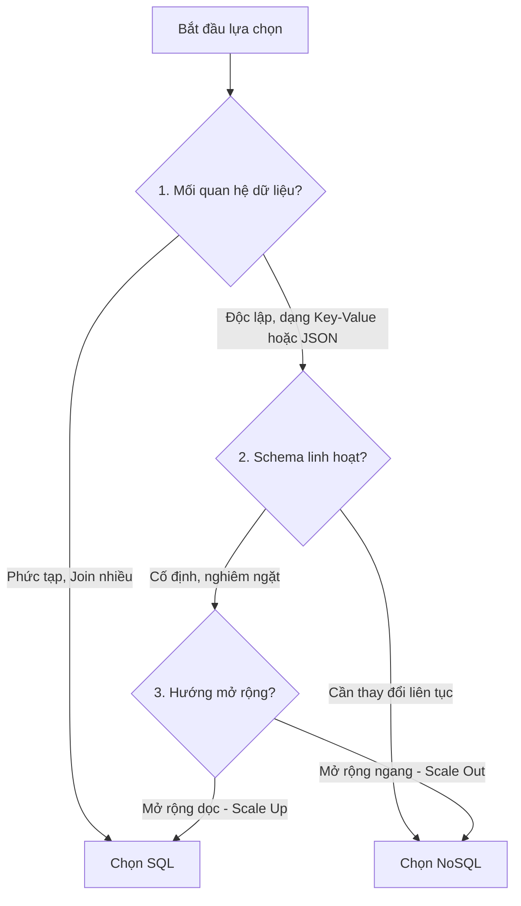

# NỀN TẢNG CƠ SỞ DỮ LIỆU (DATABASE FUNDAMENTALS)

Tài liệu này hệ thống hóa các kiến thức nền tảng về Cơ sở dữ liệu (Database), bao gồm tính chất ACID, cơ chế khóa (locking), toàn vẹn dữ liệu, các tiêu chí lựa chọn giải pháp lưu trữ, thuật ngữ giao dịch và công cụ tương tác ORM/ODM.

---

## 1. TÍNH CHẤT HỆ QUẢN TRỊ CƠ SỞ DỮ LIỆU (DBMS PROPERTIES)

### 1.1. Tính chất ACID (ACID Properties)
Khi đi phỏng vấn, ACID là câu hỏi kinh điển để đánh giá sự hiểu biết về độ tin cậy giao dịch. Dưới đây là cách giải nghĩa trực diện, phi hàn lâm:

*   **Atomicity (Tính nguyên tử - "Tất cả hoặc không có gì"):**
    *   *Cách hiểu đơn giản:* Giống như việc bạn chuyển tiền ngân hàng. Tiến trình gồm 2 bước: trừ tiền tài khoản bạn và cộng tiền tài khoản kia. Nếu bước 2 bị lỗi mất mạng, bước 1 phải được thu hồi (rollback). Không bao giờ có chuyện tài khoản bạn bị trừ tiền mà người kia không nhận được.
    *   *Câu trả lời phỏng vấn:* Đảm bảo một giao dịch (transaction) gồm nhiều câu lệnh SQL phải được thực hiện thành công trọn vẹn 100%. Chỉ cần một câu lệnh bị lỗi, toàn bộ giao dịch sẽ thất bại và dữ liệu quay về trạng thái ban đầu.
*   **Consistency (Tính nhất quán - "Luôn tuân thủ luật chơi"):**
    *   *Cách hiểu đơn giản:* Giống như luật chơi bóng đá: bóng chạm tay trong vòng cấm là penalty. Nếu hệ thống quy định "Số dư tài khoản không được nhỏ hơn 0", thì bất kỳ giao dịch nào cố tình rút quá số dư đều sẽ bị hệ thống từ chối để bảo vệ luật.
    *   *Câu trả lời phỏng vấn:* Đảm bảo dữ liệu trước và sau giao dịch luôn hợp lệ, tuân thủ mọi ràng buộc (constraints), quy tắc nghiệp vụ (business rules) và trigger đã được định nghĩa trong cơ sở dữ liệu.
*   **Isolation (Tính cô lập - "Việc ai nấy làm, không xen vào nhau"):**
    *   *Cách hiểu đơn giản:* Giống như hai người cùng mua chiếc vé máy bay cuối cùng trên hệ thống tại cùng một giây. Hệ thống phải xử lý tuần tự: người nào bấm mua trước sẽ giữ vé, người kia sẽ nhận thông báo hết vé, không được phép xảy ra chuyện một chiếc vé bán cho cả hai người.
    *   *Câu trả lời phỏng vấn:* Đảm bảo các giao dịch chạy đồng thời (concurrently) không được can thiệp hoặc nhìn thấy trạng thái tạm thời của nhau. Kết quả của hệ thống khi chạy nhiều giao dịch song song phải giống như khi chạy chúng tuần tự.
*   **Durability (Tính bền vững - "Đã lưu là không bao giờ mất"):**
    *   *Cách hiểu đơn giản:* Khi bạn nộp bài thi thành công và hệ thống báo "Đã nhận bài", dù ngay sau đó server trường bị mất điện hay cháy chip, kết quả bài thi của bạn vẫn phải được lưu trữ an toàn trong ổ đĩa cứng không bị mất.
    *   *Câu trả lời phỏng vấn:* Đảm bảo một khi giao dịch đã xác nhận thành công (committed), các thay đổi dữ liệu sẽ được ghi xuống đĩa cứng vật lý vĩnh viễn và không bị mất ngay cả khi hệ thống crash hoặc mất điện đột ngột.

---

### 1.2. Cơ chế Khóa (Locking & Lock Granularity)
Để đảm bảo tính cô lập (Isolation) khi nhiều người cùng đọc/ghi một dữ liệu, DBMS sử dụng cơ chế Khóa (Locking).

#### Shared Lock (S-Lock / Khóa đọc) vs Exclusive Lock (X-Lock / Khóa ghi)
*   **Shared Lock (Khóa chia sẻ - S-Lock):** Được áp dụng khi bạn muốn **đọc** dữ liệu. Nhiều người có thể cùng giữ S-Lock trên một bảng/dòng để đọc dữ liệu đồng thời mà không chặn nhau.
*   **Exclusive Lock (Khóa độc quyền - X-Lock):** Được áp dụng khi bạn muốn **ghi/sửa/xóa** dữ liệu. Chỉ duy nhất một người được giữ X-Lock trên dòng/bảng đó. X-Lock sẽ chặn đứng tất cả mọi người khác, không cho đọc (S-Lock) và cũng không cho ghi (X-Lock) cho đến khi người giữ X-Lock hoàn thành giao dịch.

#### Các cấp độ khóa (Lock Granularity)
Tùy vào tình huống, DBMS sẽ khóa ở các phạm vi khác nhau để cân bằng giữa độ chính xác và hiệu năng:
1.  **Row-level Lock (Khóa cấp dòng):** Chỉ khóa duy nhất dòng dữ liệu đang sửa đổi.
    *   *Đặc điểm:* Hiệu năng đồng thời cao nhất vì các dòng khác vẫn đọc/ghi bình thường. Nhưng tốn tài nguyên quản lý khóa của DBMS.
2.  **Page-level Lock (Khóa cấp trang):** Khóa một trang dữ liệu (thường chứa nhiều dòng liền kề).
3.  **Table-level Lock / Block Table (Khóa cấp bảng):** Khóa nguyên một bảng dữ liệu.
    *   *Đặc điểm:* Chặn toàn bộ mọi thao tác ghi/sửa trên bảng đó. Thường dùng khi cần thay đổi cấu trúc bảng (ALTER TABLE) hoặc backup dữ liệu. Nó giải phóng tài nguyên quản lý của DBMS nhưng làm nghẽn hệ thống nếu bảng có lượng truy cập lớn.

---

### 1.3. Đảm bảo toàn vẹn dữ liệu (Data Integrity)
Toàn vẹn dữ liệu là sự bảo đảm tính chính xác, nhất quán và đáng tin cậy của dữ liệu trong suốt vòng đời của nó. DBMS hỗ trợ 3 loại toàn vẹn dữ liệu cốt lõi:

| Loại toàn vẹn dữ liệu | Định nghĩa phỏng vấn | Cơ chế đảm bảo | Ví dụ thực tế |
| :--- | :--- | :--- | :--- |
| **Entity Integrity** *(Toàn vẹn thực thể)* | Đảm bảo mỗi bản ghi trong bảng phải là duy nhất và có thể định danh được. | Sử dụng **Khóa chính (Primary Key)**. Khóa chính bắt buộc phải duy nhất và không được phép chứa giá trị `NULL`. | Bảng `users` có cột `user_id` làm khóa chính. Không thể có 2 user có cùng ID. |
| **Referential Integrity** *(Toàn vẹn tham chiếu)* | Đảm bảo mối liên kết dữ liệu giữa các bảng luôn chính xác và không bị đứt gãy. | Sử dụng **Khóa ngoại (Foreign Key)**. Dữ liệu cột khóa ngoại ở bảng con phải tồn tại ở bảng cha, hoặc là `NULL`. | Bảng `orders` có cột `user_id` trỏ sang bảng `users`. Không thể tạo order của một user không tồn tại. |
| **Domain Integrity** *(Toàn vẹn miền giá trị)* | Đảm bảo dữ liệu nhập vào một cột phải hợp lệ về mặt kiểu dữ liệu và logic phạm vi. | Sử dụng các ràng buộc kiểu dữ liệu, `NOT NULL`, `DEFAULT`, `CHECK`, hoặc kiểu ENUM. | Cột `age` phải là số nguyên và có ràng buộc `CHECK (age >= 18)`. |

---

## 2. ƯU ĐIỂM CỦA CƠ SỞ DỮ LIỆU SQL TRUYỀN THỐNG

Dù NoSQL rất phát triển, các hệ quản trị SQL truyền thống (như PostgreSQL, MySQL) vẫn là xương sống của phần lớn hệ thống nhờ hai ưu thế vượt trội:

1.  **Hệ sinh thái trưởng thành (Mature Ecosystem):**
    *   Trải qua hơn 50 năm phát triển và tối ưu hóa liên tục.
    *   Công cụ quản trị, đo đạc hiệu năng (monitoring), backup, bảo mật và cộng đồng hỗ trợ vô cùng khổng lồ.
    *   Hầu như mọi ngôn ngữ lập trình và framework đều hỗ trợ kết nối SQL hoàn hảo.
2.  **Ngôn ngữ chuẩn hóa toàn cầu (Standard Language - SQL):**
    *   SQL là ngôn ngữ khai báo chuẩn hóa theo chuẩn ANSI/ISO.
    *   Khi bạn đã học và làm chủ cú pháp SQL chuẩn, bạn có thể dễ dàng chuyển đổi sang làm việc với các hệ quản trị SQL khác (từ MySQL sang PostgreSQL, SQL Server, Oracle) mà không mất nhiều thời gian học lại từ đầu.

---

## 3. ƯU ĐIỂM CỦA HỆ THỐNG PHÂN TÁN (DISTRIBUTED DATABASE)

Khi dữ liệu vượt quá giới hạn của một máy chủ vật lý đơn lẻ, chúng ta chuyển dịch sang hệ thống cơ sở dữ liệu phân tán với các ưu điểm:

1.  **Mở rộng theo chiều ngang (Horizontal Scaling / Scale-out):**
    *   Thay vì phải mua một siêu máy chủ cực kỳ đắt đỏ (Scale-up), ta có thể kết nối nhiều máy chủ cấu hình trung bình rẻ tiền lại với nhau để cùng chia sẻ tải trọng dữ liệu và truy vấn.
2.  **Hệ thống phân tán có độ khả dụng cao (High Availability & Partition Tolerance):**
    *   Hệ thống không bị sập hoàn toàn nếu một hoặc vài máy chủ gặp sự cố (no Single Point of Failure).
3.  **Dự phòng dữ liệu (Data Redundancy):**
    *   Dữ liệu được tự động sao chép (replicate) sang nhiều node khác nhau. Nếu máy chủ chứa dữ liệu gốc bị hỏng ổ cứng, hệ thống lập tức lấy dữ liệu từ node dự phòng để phục vụ client mà không gây gián đoạn dịch vụ.

---

## 4. TIÊU CHÍ CỐT LÕI KHI LỰA CHỌN SQL HAY NO-SQL

Đây là bộ câu hỏi thực chiến giúp bạn đưa ra quyết định kiến trúc khi thiết kế hệ thống mới:

### Chi tiết 5 câu hỏi quyết định:
1.  **Data relationship? (Mối quan hệ dữ liệu có phức tạp không?):**
    *   *Nên chọn SQL:* Khi dữ liệu có mối quan hệ chằng chịt, liên kết nhiều bảng thông qua khóa ngoại, yêu cầu truy vấn qua phép `JOIN` phức tạp.
    *   *Nên chọn NoSQL:* Khi dữ liệu tồn tại độc lập dưới dạng các thực thể riêng lẻ (ví dụ: thông tin log, giỏ hàng tạm thời).
2.  **Schema flexibility? (Cấu trúc dữ liệu có cần linh hoạt thay đổi không?):**
    *   *Nên chọn SQL:* Khi cấu trúc dữ liệu đã được định hình rõ ràng, cố định và đòi hỏi tính nghiêm ngặt tuyệt đối để tránh sai lệch dữ liệu.
    *   *Nên chọn NoSQL:* Khi cấu trúc dữ liệu thay đổi liên tục, không đồng nhất giữa các bản ghi (ví dụ: danh mục sản phẩm thương mại điện tử với hàng ngàn thuộc tính động khác nhau).
3.  **Vertical scaling or Horizontal scaling? (Mở rộng theo chiều dọc hay chiều ngang?):**
    *   *Nên chọn SQL:* Khi giới hạn dữ liệu nằm trong tầm kiểm soát của một máy chủ lớn (Scale-up bằng cách nâng cấp CPU, RAM, SSD).
    *   *Nên chọn NoSQL:* Khi dung lượng và tải trọng ghi cực kỳ khủng khiếp, bắt buộc phải chia nhỏ dữ liệu ra hàng trăm server (Scale-out).
4.  **Read or Write heavy? (Hệ thống thiên về đọc hay ghi nhiều?):**
    *   *Nên chọn SQL:* Thích hợp cho các hệ thống cân bằng giữa đọc và ghi với các transaction ACID (như ngân hàng, thương mại điện tử).
    *   *Nên chọn NoSQL:* Tối ưu tuyệt đối cho các hệ thống ghi cực nhiều và nhanh (như lưu trữ log hệ thống, theo dõi dữ liệu thiết bị IoT, clickstream người dùng).
5.  **Learning curve? (Độ dốc tiếp cận công nghệ?):**
    *   *Nên chọn SQL:* Học một lần dùng được cho hầu hết mọi hệ quản trị SQL. Cộng đồng hỗ trợ cực kỳ đông đảo và tài liệu phong phú.
    *   *Nên chọn NoSQL:* Mỗi database NoSQL (Redis, MongoDB, Cassandra) có cú pháp và cách tối ưu hoàn toàn khác nhau, đòi hỏi đội ngũ lập trình phải tốn thời gian học và làm chủ riêng biệt từng công nghệ.

---

## 5. CÔNG CỤ TƯƠNG TÁC DATABASE: ORM & ODM

Để tránh việc phải viết code SQL thô (Raw SQL) phức tạp và dễ bị lỗi bảo mật (SQL Injection) trong mã nguồn ứng dụng, lập trình viên sử dụng các thư viện trung gian:

*   **ORM (Object-Relational Mapping):**
    *   *Khái niệm:* Công cụ ánh xạ các bảng dữ liệu quan hệ (SQL) thành các đối tượng (Class/Object) trong ngôn ngữ lập trình.
    *   *Ví dụ:* **Prisma**, **TypeORM**, **Hibernate** (Java), **Entity Framework** (.NET), **Sequelize** (NodeJS).
    *   *Vai trò:* Giúp lập trình viên CRUD dữ liệu bằng cú pháp hướng đối tượng của chính ngôn ngữ đó mà không cần viết câu lệnh SELECT/INSERT thô.
*   **ODM (Object-Document Mapping):**
    *   *Khái niệm:* Tương tự như ORM nhưng dành riêng cho cơ sở dữ liệu dạng tài liệu (Document Store - NoSQL). Nó ánh xạ các JSON/BSON Document thành các đối tượng lập trình.
    *   *Ví dụ:* **Mongoose** (dành cho MongoDB).

### Bảng so sánh ORM vs ODM:

| Tiêu chí | ORM (Object-Relational Mapping) | ODM (Object-Document Mapping) |
| :--- | :--- | :--- |
| **Dành cho loại DB** | Relational Database (SQL - PostgreSQL, MySQL...) | Document Database (NoSQL - MongoDB...) |
| **Ánh xạ** | Bảng (Table) $\rightarrow$ Class. Dòng (Row) $\rightarrow$ Object. | Tập hợp (Collection) $\rightarrow$ Class. Tài liệu (Document) $\rightarrow$ Object. |
| **Hỗ trợ quan hệ** | Hỗ trợ cực tốt liên kết khóa ngoại, Join bảng. | Hỗ trợ liên kết lỏng lẻo (`populate` trong Mongoose) hoặc lồng tài liệu (Embedding). |
| **Đại diện tiêu biểu** | Prisma, TypeORM, Sequelize. | Mongoose. |

---

## 6. QUẢN LÝ GIAO DỊCH DỄ HIỂU (TRANSACTION TERMS)

Khi phỏng vấn, hãy giải thích các thuật ngữ giao dịch một cách thực tế và trực quan nhất:

*   **Transaction (Giao dịch) là gì?**
    *   *Giải thích bình dân:* Là một nhóm các hành động được bó lại với nhau. Nếu cả nhóm cùng hoàn thành thì mới được công nhận, nếu một hành động thất bại thì cả nhóm coi như chưa làm gì cả.
*   **Commit là gì?**
    *   *Giải thích bình dân:* Là nút "Lưu lại vĩnh viễn". Khi bạn nhấn commit, mọi thay đổi bạn vừa thực hiện sẽ chính thức ghi vào ổ cứng, hiển thị cho mọi người thấy và không thể rút lại được nữa.
*   **Rollback là gì?**
    *   *Giải thích bình dân:* Là nút "Hủy lệnh/Quay lại lúc đầu". Nếu trong quá trình thực hiện giao dịch xảy ra lỗi, bạn bấm Rollback để xóa sạch các bước đã làm dở, trả lại nguyên vẹn trạng thái sạch sẽ trước khi bắt đầu giao dịch.
*   **Savepoint là gì?**
    *   *Giải thích bình dân:* Giống như các "Điểm lưu game" (checkpoint) khi chơi game. Nếu bạn đi qua một đoạn khó và lỡ bị chết, bạn có thể chọn quay lại điểm savepoint gần nhất để chơi tiếp, thay vì phải chơi lại từ màn đầu tiên. Trong DB, bạn có thể rollback về một Savepoint cụ thể thay vì rollback toàn bộ giao dịch.
