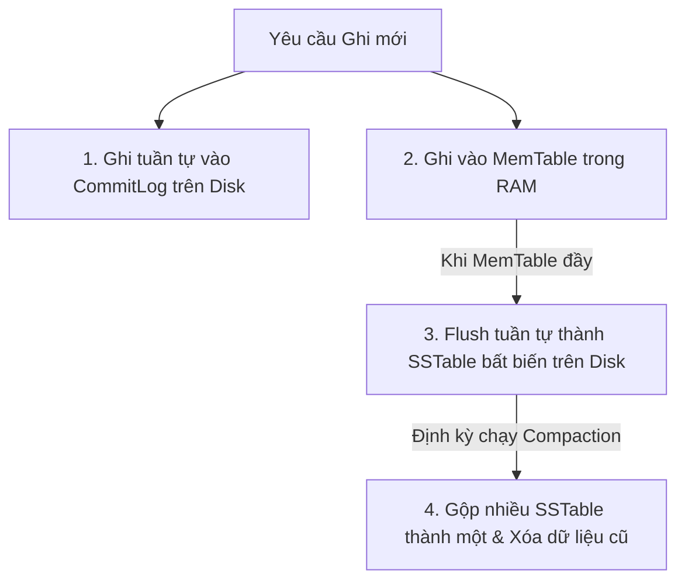
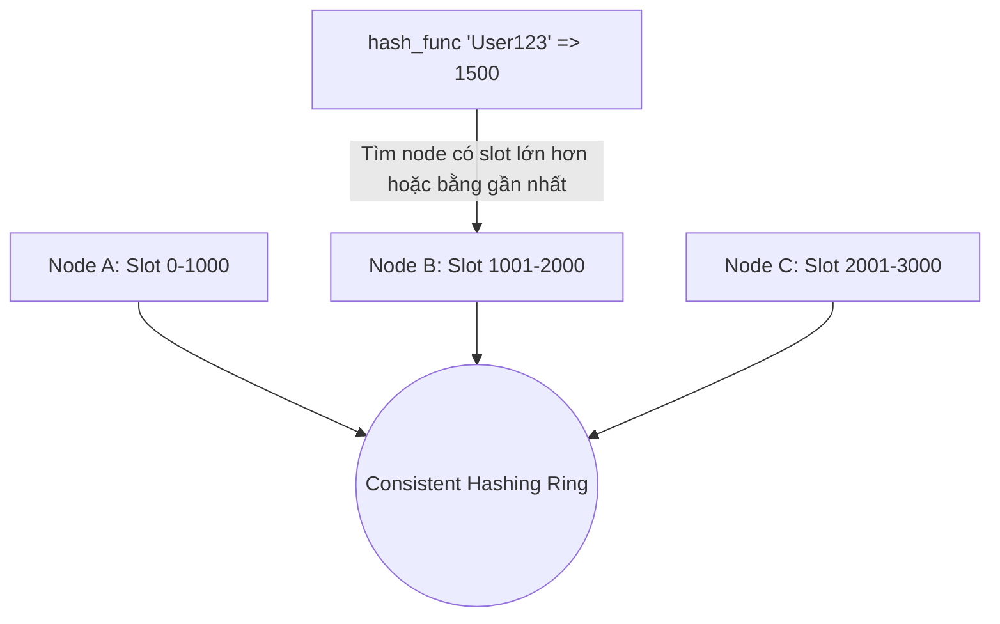

# Tìm Hiểu Sâu Về Cơ Cơ Dữ Liệu Phi Quan Hệ (NoSQL)

NoSQL (Not Only SQL) đại diện cho các hệ quản trị cơ sở dữ liệu không sử dụng mô hình quan hệ truyền thống. Chúng được thiết kế để giải quyết bài toán lưu trữ dữ liệu quy mô cực lớn (Big Data), tốc độ ghi cực cao, cấu trúc dữ liệu động và khả năng mở rộng hàng ngang (Horizontal Scaling) trên các cụm máy chủ (clusters) giá rẻ.

---

## 1. Khác Biệt Triết Lý: ACID vs BASE

Nếu RDBMS tối ưu cho sự chặt chẽ giao dịch qua mô hình ACID, thì NoSQL tối ưu cho hiệu năng và tính sẵn sàng cao qua mô hình **BASE**:

- **Basically Available (Khả dụng cơ bản)**: Hệ thống đảm bảo phản hồi ngay cả khi một số node bị sập nhờ cơ chế sao bản (replication) và thiết kế chịu lỗi tốt.
- **Soft State (Trạng thái mềm)**: Trạng thái dữ liệu có thể tự động thay đổi theo thời gian thông qua các tiến trình nội bộ đồng bộ bất đồng bộ mà không cần client tác động trực tiếp.
- **Eventual Consistency (Nhất quán cuối cùng)**: Hệ thống đảm bảo rằng nếu không có cập nhật mới nào được thực hiện, cuối cùng tất cả các node trong cụm phân tán sẽ đồng bộ và trả về giá trị giống hệt nhau.

---

## 2. Đi Sâu Các Nhóm Cơ Sở Dữ Liệu NoSQL

NoSQL thường được phân chia thành 4 nhóm chính, dưới đây là phân tích chi tiết cấu trúc lưu trữ và hoạt động của 3 nhóm phổ biến nhất (trừ nhóm Graph được viết ở file riêng):

### 2.1. Key-Value Store (Ví dụ: Redis, Memcached)

Mô hình đơn giản nhất nhưng có hiệu năng nhanh nhất. Dữ liệu được lưu dưới dạng một cặp khóa-giá trị (`Key-Value`).

- **Cơ chế lưu trữ RAM (In-Memory)**:
  - Redis lưu trữ toàn bộ dữ liệu trong bộ nhớ RAM, giúp tốc độ truy xuất đạt mức microsecond ($< 1$ ms) với hàng trăm ngàn request/s.
  - Sử dụng cấu trúc dữ liệu đơn luồng (Single-Threaded event loop) dựa trên Multiplexing để tránh overhead do tranh chấp tài nguyên (lock contention) và context switching giữa các luồng.
- **Cơ chế bền vững dữ liệu (Persistence)**:
  Để tránh mất dữ liệu khi mất điện/restart, Redis áp dụng 2 cơ chế:
  - **RDB (Redis Database Backup)**: Chụp ảnh dữ liệu (snapshot) tại một thời điểm nhất định và lưu xuống Disk định kỳ. Quá trình này dùng lệnh `fork` hệ điều hành để tạo tiến trình con ghi file, không ảnh hưởng đến luồng chính.
  - **AOF (Append-Only File)**: Ghi lại mọi câu lệnh ghi (write command) vào cuối một file log tuần tự. Khi khởi động lại, Redis sẽ chạy lại toàn bộ các câu lệnh này để khôi phục dữ liệu. AOF an toàn hơn RDB nhưng dung lượng file lớn hơn và thời gian khởi động lâu hơn.

---

### 2.2. Document Store (Ví dụ: MongoDB, CouchDB)

Mô hình lưu trữ dữ liệu dạng tài liệu tự mô tả, cấu trúc linh hoạt.

- **Định dạng dữ liệu BSON/JSON**:
  - MongoDB lưu trữ dữ liệu dưới dạng **BSON** (Binary JSON). BSON mở rộng JSON bằng cách hỗ trợ nhiều kiểu dữ liệu hơn (như Date, ObjectId, Binary Data) và tối ưu hóa việc phân tích cú pháp (parsing) của database engine.
- **Tập hợp (Collections) và Tài liệu (Documents)**:
  - Thay vì Bảng (Table), ta có Tập hợp (Collection). Thay vì Dòng (Row), ta có Tài liệu (Document).
  - Schema-less: Mỗi document trong cùng một collection có thể có cấu trúc hoàn toàn khác nhau (ví dụ: document 1 có 3 trường, document 2 có 10 trường).
- **Cơ chế Indexing trên Nested Document**:
  - MongoDB hỗ trợ tạo chỉ mục trên các trường lồng nhau (Embedded/Nested Fields) và cả trên các phần tử của mảng (Multikey Index).
  - Mặc định sử dụng công cụ lưu trữ **WiredTiger**, hỗ trợ cả B-Tree Index và cơ chế khóa cấp tài liệu (Document-level Locking) cho phép đọc ghi đồng thời cao.

---

### 2.3. Wide-Column Store / Column-Family (Ví dụ: Apache Cassandra, ScyllaDB, HBase)

Mô hình tối ưu hóa tuyệt đối cho việc **Ghi dữ liệu tốc độ cao** và lưu trữ phân tán quy mô Petabyte.

- **Kiến trúc lưu trữ LSM-Tree & SSTables**:
  - **CommitLog**: Mọi thao tác ghi trước hết được ghi tuần tự vào file nhật ký CommitLog trên đĩa cứng để phòng ngừa mất dữ liệu.
  - **MemTable**: Đồng thời, dữ liệu được ghi vào cấu trúc cây trong RAM gọi là MemTable (thường sắp xếp theo khóa). Thao tác này diễn ra tức thì.
  - **SSTable (Sorted String Table)**: Khi MemTable đầy, nó được ghi (Flush) xuống đĩa thành một file SSTable bất biến (immutable). Do dữ liệu đã được sắp xếp sẵn trong MemTable, việc ghi xuống đĩa là ghi tuần tự liên tục (Sequential Write) nên tốc độ ghi đạt mức tối đa của phần cứng.
  - **Compaction**: Vì SSTable là bất biến, việc cập nhật hoặc xóa dữ liệu thực chất là ghi đè một bản ghi mới với timestamp mới hơn hoặc ghi đè một nhãn xóa (**Tombstone**). Quá trình Compaction chạy ngầm định kỳ sẽ đọc nhiều file SSTable, gộp các khóa trùng nhau, giữ lại giá trị có timestamp mới nhất, loại bỏ dữ liệu đã đánh dấu xóa, tạo ra SSTable mới tối ưu hơn.

---

## 3. Lý Thuyết Hệ Thống Phân Tán Trong NoSQL

### 3.1. PACELC Theorem áp dụng thực tế
Như đã giới thiệu ở phần tổng quan, định lý PACELC phân loại hệ thống dựa trên sự đánh đổi giữa Tính sẵn sàng (Availability), Nhất quán (Consistency) và Độ trễ (Latency):

- **Cassandra (PA/EL)**: Khi mạng bị phân mảnh chọn Availability; khi bình thường chọn Latency (phản hồi client trước, đồng bộ ngầm sau).
- **MongoDB (PC/EC)**: Luôn ưu tiên Consistency trong mọi tình huống (kể cả khi mạng lỗi hay bình thường).

### 3.2. Consistent Hashing (Băm nhất quán)
Trong một database phân tán gồm nhiều node máy chủ, làm sao để biết một Key dữ liệu cụ thể nằm ở node nào mà không cần một server điều phối trung tâm (Single Point of Failure)? NoSQL sử dụng **Consistent Hashing**:

- Không gian khóa được biểu diễn dưới dạng một vòng tròn số (Hash Ring, ví dụ từ $0$ đến $2^{32}-1$).
- Mỗi Server Node trong cụm được băm và gán vào một vị trí cụ thể trên vòng tròn.
- Khi cần đọc/ghi một Key, ta tính giá trị hash của Key đó, rồi duyệt theo chiều kim đồng hồ trên vòng tròn để tìm Server Node đầu tiên gặp được. Server đó sẽ chịu trách nhiệm lưu trữ Key này.
- **Ưu điểm**: Khi thêm hoặc bớt một Server Node vào hệ thống, ta chỉ cần phân phối lại một lượng nhỏ dữ liệu nằm kề Node đó, thay vì phải tính toán lại vị trí và dịch chuyển toàn bộ dữ liệu như phép chia dư (`hash(key) % N`) truyền thống.
- **Virtual Nodes (Vnodes)**: Để tránh phân phối dữ liệu không đều giữa các node vật lý (Data Skew), mỗi node vật lý được ánh xạ thành nhiều node ảo (vnodes) rải đều trên vòng tròn hash.

### 3.3. Quorum Consistency (Nhất quán có thể tùy chỉnh)
Trong các hệ thống masterless như Cassandra, ta có thể điều chỉnh mức độ nhất quán cho từng truy vấn thông qua công thức Quorum:
Cho các thông số:
- $N$: Replication Factor (Số lượng node bản sao lưu trữ dữ liệu đó).
- $W$: Write Factor (Số lượng node bản sao phải xác nhận ghi thành công trước khi phản hồi Client).
- $R$: Read Factor (Số lượng node bản sao phải trả về dữ liệu để đối chiếu trước khi phản hồi Client).

> **Công thức đảm bảo tính Nhất quán mạnh (Strong Consistency)**:
> $$W + R > N$$

*Giải thích*: Nếu tổng số node ghi thành công và số node đọc ra lớn hơn số node bản sao, điều đó đảm bảo luôn tồn tại ít nhất 1 node giao thoa (overlap) chứa dữ liệu mới nhất.
- Nếu muốn **ghi cực nhanh**: Chọn $W = 1$, $R = N$.
- Nếu muốn **đọc cực nhanh**: Chọn $W = N$, $R = 1$.
- Cân bằng thông dụng: Chọn $W = \text{Quorum}$ ($\lfloor N/2 \rfloor + 1$) và $R = \text{Quorum}$.
