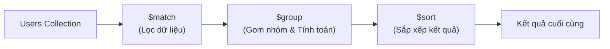

# NGÔN NGỮ TRUY VẤN NOSQL: MONGODB & REDIS

Tài liệu này tập trung chi tiết vào cú pháp truy vấn thực tế, cách thức thao tác dữ liệu và phân tích các thành phần cấu thành một câu lệnh truy vấn trong hai cơ sở dữ liệu NoSQL phổ biến nhất là MongoDB (Document Store) và Redis (Key-Value Store).

---

## 1. TRUY VẤN MONGODB (DOCUMENT STORE)

MongoDB sử dụng cấu trúc dữ liệu tài liệu dạng BSON (Binary JSON). Mọi thao tác truy vấn đều được thực thi dưới dạng các đối tượng JSON.

### 1.1. Các câu lệnh CRUD cơ bản
Dưới đây là các hàm cơ bản để tương tác với dữ liệu trong một tập hợp (Collection) tên là `users`:

*   **Tạo mới dữ liệu (Create):**
    ```javascript
    db.users.insertOne({
      name: "An",
      age: 28,
      skills: ["Java", "SQL"],
      status: "active"
    });
    ```
*   **Tìm kiếm dữ liệu (Read):**
    ```javascript
    // Tìm tất cả user có age = 28
    db.users.find({ age: 28 });
    ```
*   **Cập nhật dữ liệu (Update):**
    ```javascript
    // Cập nhật trạng thái thành "inactive" cho user tên là "An"
    db.users.updateOne(
      { name: "An" },          // Điều kiện định vị bản ghi cần sửa (Filter)
      { $set: { status: "inactive" } } // Thao tác sửa đổi (Update Operator)
    );
    ```
*   **Xóa dữ liệu (Delete):**
    ```javascript
    // Xóa tất cả user có trạng thái "inactive"
    db.users.deleteMany({ status: "inactive" });
    ```

---

### 1.2. Các toán tử truy vấn thông dụng (Query Operators)
Khi viết các câu lệnh tìm kiếm nâng cao, MongoDB sử dụng các toán tử có tiền tố `$` để chỉ định điều kiện logic:

*   **`$gt` (Greater Than - Lớn hơn) & `$lt` (Less Than - Nhỏ hơn):**
    ```javascript
    // Tìm các user có tuổi từ 18 đến 30 (18 < age < 30)
    db.users.find({ age: { $gt: 18, $lt: 30 } });
    ```
*   **`$in` (In range - Nằm trong tập hợp):**
    ```javascript
    // Tìm các user có status thuộc một trong các giá trị: "active", "pending"
    db.users.find({ status: { $in: ["active", "pending"] } });
    ```
*   **`$and` & `$or` (Kết hợp logic):**
    ```javascript
    // Tìm user có (age > 18) VÀ (status là "active" HOẶC skills chứa "Java")
    db.users.find({
      age: { $gt: 18 },
      $or: [
        { status: "active" },
        { skills: "Java" }
      ]
    });
    ```
*   **`$exists` (Kiểm tra sự tồn tại của trường dữ liệu):**
    ```javascript
    // Tìm các user có khai báo trường "email" trong document
    db.users.find({ email: { $exists: true } });
    ```

---

### 1.3. MongoDB Aggregation Pipeline (Đường ống tổng hợp dữ liệu)
Aggregation Pipeline là cơ chế xử lý và phân tích dữ liệu nâng cao trong MongoDB, tương đương với các phép `GROUP BY` và hàm tổng hợp trong SQL. Dữ liệu sẽ đi qua một chuỗi các giai đoạn (Stages), kết quả của stage trước sẽ làm đầu vào cho stage sau:



#### Ví dụ Aggregation thực tế:
Tính tuổi trung bình của các user theo từng trạng thái (status), lọc ra các nhóm có tuổi trung bình > 20, và sắp xếp theo tuổi trung bình giảm dần:

```javascript
db.users.aggregate([
  // Stage 1: Lọc ra các user có kỹ thuật "Java" (giống WHERE)
  { 
    $match: { skills: "Java" } 
  },
  
  // Stage 2: Gom nhóm theo trường "status" (giống GROUP BY) và tính tuổi trung bình
  { 
    $group: { 
      _id: "$status",                      // Gom nhóm theo cột này
      averageAge: { $avg: "$age" },        // Hàm tổng hợp tính trung bình
      totalUsers: { $sum: 1 }              // Hàm tổng hợp đếm số lượng
    } 
  },
  
  // Stage 3: Lọc kết quả sau gom nhóm (giống HAVING)
  {
    $match: { averageAge: { $gt: 20 } }
  },
  
  // Stage 4: Sắp xếp theo tuổi trung bình giảm dần (-1) (giống ORDER BY)
  { 
    $sort: { averageAge: -1 } 
  }
]);
```

---

## 2. TRUY VẤN REDIS (KEY-VALUE STORE)

Redis là một In-memory Key-Value store hiệu năng cao. Redis không sử dụng ngôn ngữ truy vấn dạng văn bản như SQL, mà client giao tiếp trực tiếp thông qua các câu lệnh command-line ứng với từng cấu trúc dữ liệu cụ thể.

### 2.1. String (Chuỗi văn bản / Số thô)
*   **`SET`**: Lưu trữ một cặp key-value.
    ```bash
    SET user:1:name "An"
    ```
*   **`GET`**: Lấy ra giá trị của key.
    ```bash
    GET user:1:name  # Trả về: "An"
    ```
*   **`INCR` / `DECR`**: Tăng / giảm giá trị số của key lên 1 đơn vị (thao tác nguyên tử - atomic, an toàn khi chạy đa luồng).
    ```bash
    SET user:1:views 100
    INCR user:1:views  # Trả về số: 101
    ```

---

### 2.2. Hash (Cấu trúc đối tượng / Bản đồ)
Dùng để lưu trữ các đối tượng có nhiều thuộc tính dưới dạng một key duy nhất.
*   **`HSET`**: Lưu các trường thuộc tính vào đối tượng.
    ```bash
    HSET user:1 age 28 status "active"
    ```
*   **`HGET`**: Lấy giá trị của một thuộc tính cụ thể.
    ```bash
    HGET user:1 age  # Trả về: "28"
    ```
*   **`HGETALL`**: Lấy toàn bộ thông tin thuộc tính của đối tượng.
    ```bash
    HGETALL user:1  # Trả về: age: "28", status: "active"
    ```

---

### 2.3. List (Danh sách liên kết - Đảm bảo thứ tự chèn)
Hoạt động như một hàng đợi hoặc ngăn xếp.
*   **`LPUSH`**: Đẩy phần tử vào đầu danh sách (bên trái).
    ```bash
    LPUSH notifications "Thông báo 1"
    LPUSH notifications "Thông báo 2"
    ```
*   **`LPOP`**: Lấy ra và xóa phần tử ở đầu danh sách.
    ```bash
    LPOP notifications  # Trả về: "Thông báo 2" (Vào sau ra trước nếu dùng LPUSH + LPOP)
    ```

---

### 2.4. Set (Tập hợp các phần tử duy nhất, không sắp xếp)
*   **`SADD`**: Thêm phần tử vào tập hợp. Nếu phần tử đã tồn tại, lệnh sẽ bị bỏ qua.
    ```bash
    SADD active_users "user1"
    SADD active_users "user2"
    SADD active_users "user1"  # Trả về 0 (bị bỏ qua vì trùng)
    ```
*   **`SISMEMBER`**: Kiểm tra một phần tử có nằm trong tập hợp không ($O(1)$ time).
    ```bash
    SISMEMBER active_users "user1"  # Trả về 1 (True)
    ```

---

### 2.5. Sorted Set (Tập hợp có sắp xếp theo điểm số - Score)
Từng phần tử đi kèm với một điểm số (score). Redis tự động sắp xếp các phần tử dựa trên điểm số này.
*   **`ZADD`**: Thêm phần tử kèm điểm số.
    ```bash
    ZADD leaderboard 100 "PlayerA"
    ZADD leaderboard 250 "PlayerB"
    ZADD leaderboard 180 "PlayerC"
    ```
*   **`ZRANGE`**: Lấy ra danh sách phần tử theo thứ tự điểm số từ thấp đến cao.
    ```bash
    ZRANGE leaderboard 0 -1 WITHSCORES
    # Trả về: PlayerA (100), PlayerC (180), PlayerB (250)
    ```
