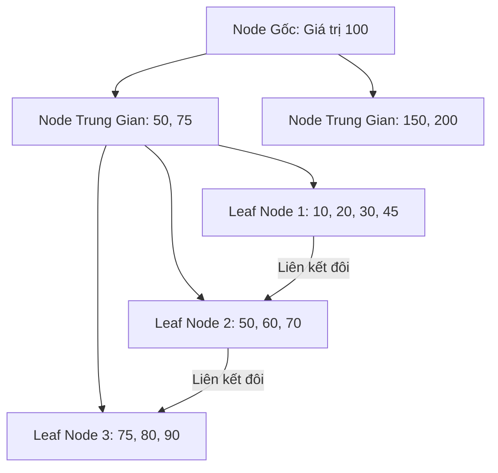

# Tìm Hiểu Sâu Về Cơ Sở Dữ Liệu Quan Hệ (RDBMS / SQL)

Cơ sở dữ liệu quan hệ (RDBMS - Relational Database Management System) dựa trên mô hình dữ liệu quan hệ được đề xuất bởi Edgar F. Codd vào năm 1970. Đây là nền tảng bền vững nhất trong thế giới lưu trữ dữ liệu với sự chặt chẽ về mặt toán học và độ tin cậy giao dịch cực cao.

---

## 1. Mô Hình Quan Hệ (Relational Model)

- **Các khái niệm cốt lõi**:
  - **Relation (Bảng / Table)**: Một tập hợp các dòng (tuples) có cùng cấu trúc cột.
  - **Tuple (Dòng / Row / Record)**: Đại diện cho một thực thể hoặc một mối quan hệ cụ thể.
  - **Attribute (Cột / Column / Field)**: Các thuộc tính mô tả thực thể, mỗi thuộc tính có một kiểu dữ liệu (data type) và miền giá trị (domain).
- **Ràng buộc toàn vẹn (Integrity Constraints)**:
  - **Entity Integrity**: Mỗi bảng phải có một khóa chính (**Primary Key**), khóa chính không được null và phải là duy nhất.
  - **Referential Integrity**: Đảm bảo mối liên kết hợp lệ giữa các bảng thông qua khóa ngoại (**Foreign Key**). Dữ liệu ở cột khóa ngoại phải tồn tại ở bảng cha được tham chiếu, hoặc là null.
  - **Domain Integrity**: Giá trị nhập vào cột phải tuân thủ đúng kiểu dữ liệu và các ràng buộc như `CHECK`, `NOT NULL`, `DEFAULT`.

---

## 2. Quản Lý Giao Dịch (Transactions) & ACID

Giao dịch (Transaction) là một nhóm các thao tác SQL được thực thi như một đơn vị công việc duy nhất.

### 2.1. ACID Properties
- **Atomicity (Tính nguyên tử)**: Đảm bảo giao dịch thực hiện trọn vẹn. Nếu một câu lệnh thất bại, toàn bộ giao dịch bị hủy bỏ (Rollback) và dữ liệu quay lại trạng thái trước khi giao dịch bắt đầu.
- **Consistency (Tính nhất quán)**: Đảm bảo dữ liệu không vi phạm bất kỳ ràng buộc nghiệp vụ hoặc ràng buộc cơ sở dữ liệu nào (ví dụ: số dư tài khoản không được nhỏ hơn 0).
- **Isolation (Tính cô lập)**: Các giao dịch chạy đồng thời phải tạo ra kết quả giống như khi chúng được chạy tuần tự (concurrency control).
- **Durability (Tính bền vững)**: Khi giao dịch đã được xác nhận (Commit), các thay đổi sẽ được ghi xuống đĩa cứng một cách an toàn và không bị mất ngay cả khi hệ thống crash.

### 2.2. Transaction Isolation Levels (Các mức độ cô lập)
Mức độ cô lập càng cao thì tính toàn vẹn dữ liệu càng tốt, nhưng hiệu năng hệ thống càng giảm do phải tăng cường cơ chế khóa (locking).

#### Các hiện tượng đọc dữ liệu lỗi (Read Phenomena):
- **Dirty Read (Đọc rác)**: Giao dịch A đọc dữ liệu đã bị sửa đổi bởi giao dịch B nhưng giao dịch B *chưa commit*. Nếu B rollback, dữ liệu A đọc được là không hợp lệ.
- **Non-Repeatable Read (Đọc không lặp lại)**: Giao dịch A đọc một dòng dữ liệu. Giao dịch B sửa đổi dòng đó và *commit*. Giao dịch A đọc lại dòng đó và thấy giá trị đã thay đổi.
- **Phantom Read (Đọc bóng ma)**: Giao dịch A thực hiện truy vấn danh sách dòng thỏa mãn điều kiện. Giao dịch B chèn thêm dòng mới thỏa mãn điều kiện đó và *commit*. Giao dịch A thực hiện lại truy vấn và thấy xuất hiện dòng mới ("bóng ma").

#### Bảng Mức Độ Cô Lập Chuẩn SQL-92:

| Isolation Level | Dirty Read | Non-Repeatable Read | Phantom Read | Cơ chế kỹ thuật thông dụng |
| :--- | :---: | :---: | :---: | :--- |
| **Read Uncommitted** | Cho phép | Cho phép | Cho phép | Không khóa đọc, cho phép đọc trực tiếp Dirty Page trong bộ nhớ. |
| **Read Committed** | Ngăn chặn | Cho phép | Cho phép | Chỉ cho phép đọc dữ liệu đã commit. (Default của PostgreSQL, SQL Server). |
| **Repeatable Read** | Ngăn chặn | Ngăn chặn | Cho phép | Giữ khóa đọc đến hết transaction hoặc dùng Snapshot Isolation. (Default của MySQL InnoDB). |
| **Serializable** | Ngăn chặn | Ngăn chặn | Ngăn chặn | Khóa toàn bộ phạm vi dữ liệu truy vấn (Range Lock) hoặc kiểm tra xung đột nghiêm ngặt. |

---

### 2.3. Điều Khiển Đồng Thời (Concurrency Control)

Để giải quyết vấn đề nhiều transaction truy cập cùng một tài nguyên, DBMS áp dụng hai hướng tiếp cận chính:

1. **Pessimistic Concurrency Control (Khóa bi quan)**:
   - Giả định xung đột luôn xảy ra. Hệ thống sẽ khóa (lock) dữ liệu ngay khi đọc hoặc chuẩn bị ghi.
   - **Shared Lock (S-Lock / Khóa đọc)**: Nhiều transaction có thể cùng giữ S-lock để đọc dữ liệu đồng thời, nhưng không ai được ghi.
   - **Exclusive Lock (X-Lock / Khóa ghi)**: Chỉ một transaction duy nhất giữ X-lock để ghi/sửa dữ liệu. Không ai khác được đọc hay ghi vào vùng dữ liệu đó.
   - Dễ dẫn đến hiện tượng **Deadlock** (khi hai transaction chờ khóa của nhau chéo nhau).
2. **Optimistic Concurrency Control (Khóa lạc quan)**:
   - Giả định xung đột ít khi xảy ra.
   - Các transaction đọc ghi bình thường trên một bản sao tạm thời. Trước khi commit, hệ thống kiểm tra xem dữ liệu gốc có bị transaction khác sửa đổi chưa (thường dùng trường `version` hoặc `timestamp`). Nếu có, transaction hiện tại sẽ rollback và thực hiện lại từ đầu.
3. **MVCC (Multi-Version Concurrency Control - Kiểm soát đồng thời đa phiên bản)**:
   - Kỹ thuật hiện đại được dùng trong PostgreSQL, MySQL (InnoDB), Oracle.
   - Thay vì khóa khi đọc/ghi, mỗi lần cập nhật dữ liệu, DBMS sẽ tạo ra một phiên bản (version) mới của dòng đó.
   - **Đặc điểm cốt lõi**: "Đọc không chặn Ghi, Ghi không chặn Đọc". Khi Transaction ghi đang cập nhật dòng dữ liệu, Transaction đọc vẫn đọc được phiên bản cũ đã committed của dòng đó mà không cần chờ đợi.

---

## 3. Cơ Chế Chỉ Mục B+ Tree (B+ Tree Indexing)

Chỉ mục (Index) là cấu trúc dữ liệu phụ giúp DBMS tìm kiếm dòng nhanh chóng mà không cần quét toàn bộ bảng (Table Scan). Hầu hết RDBMS sử dụng **B+ Tree** làm cấu trúc index mặc định.

### 3.1. Cấu trúc B+ Tree
B+ Tree là một cây tìm kiếm tự cân bằng nhiều nhánh.

- **Node gốc & trung gian (Root & Internal Nodes)**: Chỉ chứa các khóa định hướng (keys) và con trỏ trỏ đến các node con dưới nó, không chứa dữ liệu thực tế của dòng.
- **Node lá (Leaf Nodes)**:
  - Chứa khóa tìm kiếm cùng với con trỏ trỏ đến dòng dữ liệu thực tế (hoặc chứa trực tiếp dữ liệu dòng).
  - **Tất cả các node lá được liên kết với nhau bằng một danh sách liên kết đôi (Doubly Linked List)**. Điều này cho phép duyệt lấy dữ liệu dạng khoảng (Range Query) cực nhanh bằng cách tìm đến node lá đầu tiên rồi duyệt tuần tự sang các node kế bên mà không cần duyệt ngược lên cây.

### 3.2. Clustered Index vs Non-Clustered (Secondary) Index
- **Clustered Index (Chỉ mục cụm)**:
  - Quyết định thứ tự vật lý sắp xếp của dữ liệu trên đĩa cứng.
  - Node lá của Clustered Index chứa **trực tiếp dữ liệu đầy đủ của dòng**.
  - Mỗi bảng chỉ có duy nhất 1 Clustered Index (thường tự động tạo trên Khóa chính - Primary Key).
- **Non-Clustered / Secondary Index (Chỉ mục phụ)**:
  - Thứ tự vật lý của bảng không thay đổi theo chỉ mục này.
  - Node lá của Secondary Index chứa khóa tìm kiếm và một **tham chiếu** (trong MySQL là giá trị khóa chính, trong Postgres là RID - Row ID) trỏ tới dòng dữ liệu thực tế ở Clustered Index.
  - Khi truy vấn qua Secondary Index, DBMS phải thực hiện hai bước: tìm trên Secondary Index để lấy Khóa chính/RID, sau đó dùng Khóa chính/RID đó để tra cứu dữ liệu dòng đầy đủ trên Clustered Index (quá trình này gọi là **Key Lookup** hoặc **Bookmark Lookup**).

---

## 4. Tối Ưu Hóa Truy Vấn & Thực Thi (Query Optimization)

### 4.1. Execution Plan & EXPLAIN
Khi viết một câu query phức tạp, ta có thể dùng lệnh `EXPLAIN` hoặc `EXPLAIN ANALYZE` đứng trước câu query để xem kế hoạch thực thi của database:
- **Seq Scan (Sequential Scan / Table Scan)**: Quét tuần tự toàn bộ bảng. Rất chậm đối với bảng lớn.
- **Index Scan**: Quét trên cây index để tìm chính xác khóa cần thiết. Rất nhanh.
- **Index Only Scan**: Toàn bộ dữ liệu yêu cầu trong câu `SELECT` đều nằm sẵn trong Index, DBMS không cần thực hiện bước Key Lookup để lấy dữ liệu gốc. Đây là trạng thái tối ưu nhất.

### 4.2. Các Thuật Toán Join
Khi kết nối các bảng dữ liệu, bộ thực thi sử dụng các giải thuật khác nhau tùy theo lượng dữ liệu:
- **Nested Loop Join**:
  - Duyệt qua từng dòng của bảng A (bảng ngoài), với mỗi dòng đó chạy quét bảng B (bảng trong) để tìm dòng khớp.
  - Hiệu quả khi bảng ngoài nhỏ và bảng trong có index trên trường Join.
- **Hash Join**:
  - DBMS đọc toàn bộ bảng nhỏ hơn vào bộ nhớ RAM, dựng một Hash Table trên trường Join. Sau đó quét bảng lớn hơn, tính hash giá trị trường Join và tìm kiếm nhanh trong Hash Table vừa dựng.
  - Phù hợp với các bảng lớn và không có index sẵn trên cột join.
- **Sort-Merge Join**:
  - Sắp xếp (Sort) cả hai bảng theo trường Join, sau đó quét song song (Merge) cả hai bảng để tìm các cặp khớp.
  - Rất hiệu quả khi dữ liệu của hai bảng đã được sắp xếp sẵn (ví dụ nhờ chỉ mục).

---

## 5. Chuẩn Hóa Cơ Sở Dữ Liệu (Normalization)

Chuẩn hóa là quá trình phân tích cấu trúc dữ liệu để giảm thiểu dư thừa dữ liệu (redundancy) và tránh các bất thường khi cập nhật (Anomaly: Insert, Update, Delete Anomaly).

### 5.1. Các dạng chuẩn (Normal Forms)
1. **Dạng chuẩn 1 (1NF - First Normal Form)**:
   - Các giá trị trong mỗi cột phải là đơn trị (atomic values) - không được chứa mảng hoặc danh sách giá trị trong một ô.
2. **Dạng chuẩn 2 (2NF - Second Normal Form)**:
   - Đã đạt 1NF.
   - Mọi cột không phải khóa phải phụ thuộc hoàn toàn vào khóa chính (không được phụ thuộc vào một phần của khóa chính nếu khóa chính là khóa tổ hợp).
3. **Dạng chuẩn 3 (3NF - Third Normal Form)**:
   - Đã đạt 2NF.
   - Không tồn tại phụ thuộc bắc cầu giữa các cột không phải khóa (tức là cột A phụ thuộc khóa chính, cột B phụ thuộc cột A => cột B không được nằm chung bảng đó mà cần tách bảng).
4. **Dạng chuẩn Boyce-Codd (BCNF)**:
   - Dạng chuẩn 3 nâng cao. Mọi thuộc tính quyết định (determinant) đều phải là khóa siêu khóa (superkey).

### 5.2. Khi nào nên phản chuẩn hóa (Denormalization)?
Mặc dù chuẩn hóa giúp tiết kiệm dung lượng đĩa cứng và tránh lỗi dữ liệu, nhưng nó đòi hỏi phải thực hiện nhiều phép `JOIN` phức tạp khi truy vấn, làm chậm hiệu năng đọc.
Trong các hệ thống cần đọc nhanh, người ta chấp nhận **phản chuẩn hóa** (gộp các bảng lại, chấp nhận dư thừa dữ liệu) để tăng tốc độ truy xuất đọc, đánh đổi bằng việc cập nhật dữ liệu sẽ phức tạp hơn.
