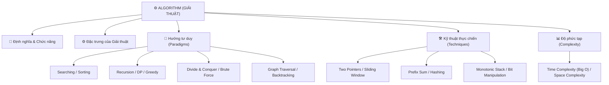

# GIẢI THUẬT (ALGORITHM)

Tài liệu này phân tích chi tiết về Giải thuật (Algorithm), bao gồm định nghĩa, chức năng, đặc trưng, các hướng tư duy thiết kế (Paradigms), kỹ thuật tối ưu hóa thực chiến (Techniques) và phân tích độ phức tạp toán học Big O bám sát sơ đồ tư duy (mindmap) cá nhân.

---

## 🗺️ 1. SƠ ĐỒ TƯ DUY GIẢI THUẬT



---

## 📖 2. ĐỊNH NGHĨA, CHỨC NĂNG & ĐẶC TRƯNG

### 2.1. Định nghĩa Giải thuật
**Giải thuật (Algorithm)** là một tập hợp các bước hướng dẫn cụ thể, rõ ràng, có tính hữu hạn và tuân theo một trình tự logic chặt chẽ nhằm giải quyết một vấn đề cụ thể hoặc thực hiện một nhiệm vụ nào đó. Giải thuật nhận vào các giá trị đầu vào (Input) và xử lý để trả về kết quả mong muốn ở đầu ra (Output).

### 2.2. Chức năng (Function)
*   **Tự động hóa giải quyết vấn đề:** Cho phép máy tính thực hiện tự động các quy trình tính toán phức tạp.
*   **Tối ưu hóa hiệu suất:** Tìm ra con đường ngắn nhất, nhanh nhất để xử lý thông tin, giảm tải cho CPU.
*   **Xử lý dữ liệu lớn:** Giúp hệ thống đứng vững trước sự bùng nổ dữ liệu bằng cách sử dụng các phương pháp thông minh thay vì duyệt thô.

### 2.3. Đặc trưng của Giải thuật
Một giải thuật chuẩn mực bắt buộc phải đáp ứng 5 tính chất sau:
1.  **Tính hữu hạn (Finiteness):** Giải thuật phải luôn dừng lại sau một số bước thực hiện hữu hạn, không được chạy vô hạn.
2.  **Tính xác định (Definiteness):** Mỗi bước trong giải thuật phải cực kỳ rõ ràng, không mơ hồ, chỉ có một cách hiểu duy nhất.
3.  **Tính đầu vào (Input):** Có 0 hoặc nhiều dữ liệu đầu vào được cung cấp trước khi giải thuật chạy.
4.  **Tính đầu ra (Output):** Có ít nhất 1 kết quả đầu ra được trả về sau khi kết thúc.
5.  **Tính khả thi/Hiệu quả (Feasibility):** Các bước trong giải thuật phải thực tế, có thể thực thi được bằng các tài nguyên máy tính hiện có trong thời gian hợp lý.

---

## 🧠 3. CÁC HƯỚNG TƯ DUY THIẾT KẾ GIẢI THUẬT (PARADIGMS)

Các lối tư duy lớn dùng để thiết kế lời giải cho bài toán:

### 3.1. Tìm kiếm (Searching)
*   **Linear Search (Tìm kiếm tuyến tính):** Duyệt qua từng phần tử từ đầu đến cuối danh sách. Độ phức tạp **$O(n)$**. Dùng trên dữ liệu chưa được sắp xếp.
*   **Binary Search (Tìm kiếm nhị phân):** Hoạt động trên mảng **đã sắp xếp**. Chia đôi khoảng tìm kiếm sau mỗi bước bằng cách so sánh phần tử ở giữa (`mid`) với giá trị cần tìm. Độ phức tạp **$O(\log n)$**.

### 3.2. Sắp xếp (Sorting)
*   **Nhóm đơn giản ($O(n^2)$):** Bubble Sort (Nổi bọt), Selection Sort (Chọn), Insertion Sort (Chèn). Dễ cài đặt nhưng hiệu suất kém khi dữ liệu lớn.
*   **Nhóm tối ưu ($O(n \log n)$):** Merge Sort (Sắp xếp gộp - sử dụng chia để trị), Quick Sort (Sắp xếp nhanh), Heap Sort (Sắp xếp vun đống). Là các chuẩn sắp xếp thực tế trong các thư viện ngôn ngữ lập trình.

### 3.3. Đệ quy (Recursion)
*   **Cơ chế:** Kỹ thuật trong đó một hàm tự gọi lại chính nó với các tham số nhỏ hơn, nhằm đưa bài toán lớn về bài toán con đơn giản hơn.
*   **Đặc điểm:** Phải luôn có **Điểm dừng (Base Case)** để ngăn chặn đệ quy vô hạn gây tràn bộ nhớ stack (Stack Overflow).

### 3.4. Quy hoạch động (Dynamic Programming - DP)
*   **Cơ chế:** Chia bài toán lớn thành các bài toán con trùng lặp (overlapping subproblems). Giải quyết các bài toán con một lần duy nhất rồi lưu kết quả vào một bảng (mảng hoặc bảng băm) để tái sử dụng mà không cần tính lại.
*   **Kỹ thuật chính:** 
    *   *Top-down (Đệ quy có nhớ - Memoization)*.
    *   *Bottom-up (Khởi tạo từ đáy - Tabulation)*.

### 3.5. Tham lam (Greedy)
*   **Cơ chế:** Tại mỗi bước đi, luôn đưa ra lựa chọn tối ưu nhất tại thời điểm đó (tối ưu cục bộ) với hy vọng nó sẽ dẫn đến kết quả tối ưu cuối cùng (tối ưu toàn cục).
*   **Ưu điểm:** Cực kỳ nhanh và đơn giản.
*   **Nhược điểm:** Không phải bài toán nào lựa chọn tham lam cũng mang lại kết quả đúng toàn cục.

### 3.6. Chia để trị (Divide and Conquer)
*   **Cơ chế:** Chia bài toán gốc thành các bài toán con độc lập, dùng đệ quy để giải quyết các bài toán con đó, sau đó gộp (combine) kết quả của chúng lại để được lời giải của bài toán gốc.
*   **Ví dụ:** Merge Sort, Quick Sort, Nhân ma trận Strassen.

### 3.7. Vét cạn (Brute Force)
*   **Cơ chế:** Thử nghiệm tất cả các khả năng có thể xảy ra trong không gian kết quả cho đến khi tìm thấy đáp án đúng.
*   **Đặc điểm:** Dễ cài đặt, luôn ra kết quả đúng nhưng độ phức tạp thời gian cực kỳ cao ($O(n^2), O(2^n)$). Thường dùng làm mốc so sánh để tối ưu hóa.

### 3.8. Duyệt đồ thị (Graph Traversal)
*   **BFS (Breadth-First Search - Tìm kiếm theo chiều rộng):** Duyệt loang theo từng tầng từ gần đến xa bằng cách sử dụng cấu trúc **Queue**. Tối ưu cho việc tìm đường đi ngắn nhất không có trọng số.
*   **DFS (Depth-First Search - Tìm kiếm theo chiều sâu):** Đâm sâu hết mức có thể trên một nhánh bằng cách sử dụng **Đệ quy/Stack**, sau đó quay lại duyệt nhánh khác. Tối ưu cho việc kiểm tra tính liên thông, tìm chu trình.

### 3.9. Quay lui (Backtracking)
*   **Cơ chế:** Một dạng đệ quy có thử sai. Giải quyết bài toán bằng cách thử từng bước. Nếu một lựa chọn dẫn đến ngõ cụt (không thỏa mãn điều kiện), giải thuật sẽ "quay lui" (backtrack) lại bước trước đó để thử phương án khác.
*   **Ví dụ:** Bài toán 8 quân hậu, giải ô chữ Sudoku, tìm đường đi trong mê cung.

---

## 🛠️ 4. KỸ THUẬT TỐI ƯU HÓA THỰC CHIẾN (TECHNIQUES)

Các mẫu kỹ thuật (design patterns) phổ biến dùng để giảm độ phức tạp thời gian khi viết code:

### 4.1. Hai con trỏ (Two Pointers)
*   Sử dụng hai biến chỉ số (pointers) di chuyển đồng thời trên mảng để tìm kiếm hoặc xử lý cặp phần tử.
*   *Ứng dụng:* Tìm cặp số có tổng bằng Target trên mảng đã sort (Two Sum II), đảo ngược chuỗi, loại bỏ phần tử trùng lặp. Giúp giảm độ phức tạp từ $O(n^2)$ về **$O(n)$**.

### 4.2. Cửa sổ trượt (Sliding Window)
*   Duy trì một "cửa sổ" (khung con gồm các phần tử liên tiếp) trượt qua mảng dữ liệu. Khi trượt sang phải, ta chỉ cần cộng phần tử mới gia nhập và trừ phần tử bị đẩy ra khỏi cửa sổ.
*   *Ứng dụng:* Tìm mảng con liên tiếp dài nhất có tổng bé hơn S, tìm chuỗi con không lặp ký tự. Giúp tránh việc tính lại trùng lặp, đưa độ phức tạp về **$O(n)$**.

### 4.3. Mảng cộng dồn (Prefix Sum)
*   Tạo một mảng phụ lưu trữ tổng lũy kế của mảng gốc: `prefix[i] = arr[0] + arr[1] + ... + arr[i]`.
*   *Ứng dụng:* Tính tổng một đoạn con từ chỉ số $L$ đến $R$ trong thời gian hằng số **$O(1)$** bằng công thức: `sum(L, R) = prefix[R] - prefix[L - 1]`.

### 4.4. Kỹ thuật Băm (Hashing)
*   Sử dụng bảng băm (HashSet/HashMap) để lưu trữ các phần tử đã duyệt qua.
*   *Ứng dụng:* Kiểm tra sự tồn tại của phần tử trong thời gian **$O(1)$**, giải quyết bài toán Two Sum cơ bản trong một vòng lặp duy nhất.

### 4.5. Ngăn xếp đơn điệu (Monotonic Stack)
*   Sử dụng một Stack luôn duy trì các phần tử theo thứ tự tăng dần hoặc giảm dần.
*   *Ứng dụng:* Tìm phần tử lớn hơn tiếp theo (Next Greater Element) trong mảng. Giúp giải quyết bài toán trong thời gian **$O(n)$** thay vì duyệt $O(n^2)$.

### 4.6. Thao tác Bit (Bit Manipulation)
*   Sử dụng trực tiếp các phép toán logic nhị phân (`AND`, `OR`, `XOR`, `NOT`, dịch bit `<<`, `>>`) trên các bit của số nguyên.
*   *Ứng dụng:* Kiểm tra số chẵn lẻ, tìm số đơn độc xuất hiện 1 lần trong mảng số xuất hiện 2 lần (dùng phép XOR), tối ưu hóa bộ nhớ cực đại.

---

## 📊 5. PHÂN TÍCH ĐỘ PHỨC TẠP (COMPLEXITY)

Big O là thước đo toán học mô tả tốc độ tăng trưởng thời gian hoặc không gian của thuật toán khi dữ liệu đầu vào ($n$) lớn lên vô hạn.

### 5.1. Độ phức tạp thời gian (Time Complexity)
Các mức độ hiệu năng Big O phổ biến từ tốt nhất đến tệ nhất:

```
Tốt nhất ◄────────────────────────────────────────► Tệ nhất
  O(1)  <  O(log n)  <  O(n)  <  O(n log n)  <  O(n²)  <  O(2ⁿ)
```

1.  **$O(1)$ - Constant Time (Hằng số):** Tốc độ nhanh nhất. Thời gian chạy không đổi bất kể dữ liệu đầu vào lớn thế nào (ví dụ: truy cập mảng theo index `arr[i]`).
2.  **$O(\log n)$ - Logarithmic Time (Logarit):** Cực kỳ tối ưu. Xuất hiện khi bài toán chia đôi dữ liệu sau mỗi bước xử lý (ví dụ: Tìm kiếm nhị phân).
3.  **$O(n)$ - Linear Time (Tuyến tính):** Tốc độ tăng trưởng đều. Thời gian chạy tỷ lệ thuận với dữ liệu (ví dụ: duyệt qua mảng 1 vòng lặp).
4.  **$O(n \log n)$ - Linearithmic Time:** Thường là giới hạn hiệu năng của các thuật toán sắp xếp tốt nhất (ví dụ: Merge Sort, Quick Sort).
5.  **$O(n^2)$ - Quadratic Time (Bình phương):** Hiệu năng kém. Thời gian tăng theo cấp số nhân của $n$. Thường gặp khi sử dụng 2 vòng lặp lồng nhau duyệt qua mảng (ví dụ: Bubble Sort).
6.  **$O(2^n)$ - Exponential Time (Hàm mũ):** Ác mộng của hệ thống. Dữ liệu chỉ cần tăng nhẹ (khoảng $n > 40$) là máy tính sẽ bị treo cứng (ví dụ: Đệ quy Fibonacci thô không nhớ, bài toán tháp Hà Nội).

### 5.2. Độ phức tạp không gian (Space Complexity)
*   Đo lường lượng bộ nhớ RAM mà thuật toán cần tiêu hao thêm trong quá trình tính toán (không tính bộ nhớ lưu dữ liệu đầu vào gốc).
*   Ví dụ: Thuật toán đệ quy sâu $n$ tầng sẽ tốn $O(n)$ space complexity trên Call Stack; Merge Sort tốn $O(n)$ bộ nhớ phụ để lưu mảng gộp tạm thời.
