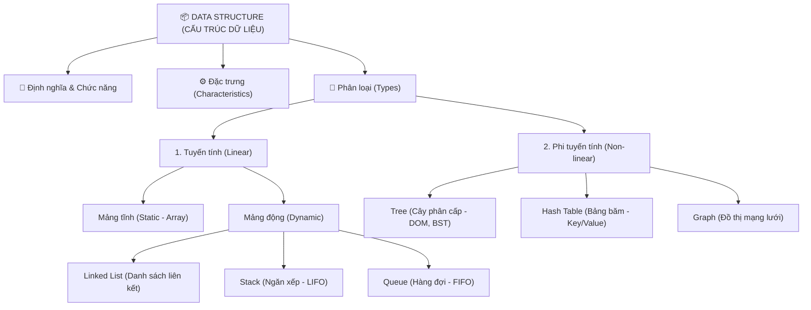

# CẤU TRÚC DỮ LIỆU (DATA STRUCTURE)

Tài liệu này phân tích chi tiết về Cấu trúc dữ liệu (Data Structure), bao gồm định nghĩa, chức năng, đặc trưng, phân loại tuyến tính/phi tuyến tính, và đi sâu vào từng cấu trúc dữ liệu cụ thể bám sát sơ đồ tư duy (mindmap) cá nhân.

---

## 🗺️ 1. SƠ ĐỒ TƯ DUY CẤU TRÚC DỮ LIỆU



---

## 📖 2. ĐỊNH NGHĨA, CHỨC NĂNG & ĐẶC TRƯNG

### 2.1. Định nghĩa Cấu trúc dữ liệu
**Cấu trúc dữ liệu (Data Structure)** là cách thức tổ chức, quản lý và lưu trữ dữ liệu trong bộ nhớ máy tính một cách có hệ thống sao cho chúng ta có thể truy xuất, thao tác và sử dụng dữ liệu đó một cách hiệu quả nhất.

### 2.2. Chức năng (Function)
*   **Lưu trữ dữ liệu:** Cung cấp vùng nhớ có cấu trúc rõ ràng để lưu trữ các thông tin thô.
*   **Quản lý mối quan hệ:** Thể hiện mối quan hệ logic giữa các phần tử dữ liệu (Ví dụ: cha-con ở cấu trúc Cây, kề cạnh ở cấu trúc Đồ thị).
*   **Tối ưu hóa tài nguyên:** Giúp hệ điều hành cấp phát và thu hồi bộ nhớ (RAM) một cách hợp lý.
*   **Hỗ trợ giải thuật:** Là nền tảng phần cứng/khung xương để các thuật toán (sắp xếp, tìm kiếm, tính toán) chạy trên đó một cách tối ưu.

### 2.3. Đặc trưng (Characteristic)
*   **Độ phức tạp thời gian (Time Complexity):** Thời gian thực hiện các tác vụ cơ bản (truy cập, tìm kiếm, chèn, xóa) được đo bằng ký hiệu Big O.
*   **Độ phức tạp không gian (Space Complexity):** Lượng bộ nhớ bổ sung mà cấu trúc dữ liệu yêu cầu để tự duy trì hoạt động.
*   **Tính tuần tự (Ordering):** Các phần tử dữ liệu được sắp xếp theo một thứ tự xác định (như Mảng) hay tự do/phi tuần tự (như Đồ thị).

---

## 📶 3. CẤU TRÚC DỮ LIỆU TUYẾN TÍNH (LINEAR DATA STRUCTURES)

### Định nghĩa
**Cấu trúc dữ liệu tuyến tính** là loại cấu trúc mà các phần tử dữ liệu được sắp xếp theo một thứ tự tuần tự hoặc tuyến tính. Trong đó, mỗi phần tử được liên kết mật thiết với phần tử kế tiếp (Next) và phần tử trước đó (Previous) của nó.

### Phân loại

#### A. Tuyến tính Tĩnh (Static Linear)
*   **Cơ chế:** Cấp phát một vùng nhớ liên tục có kích thước cố định (fixed size) ngay tại thời điểm biên dịch (Compile-time).
*   **Đặc điểm:** Không thể thay đổi kích thước của vùng chứa trong suốt quá trình chương trình chạy.
*   **Ví dụ tiêu biểu:** Mảng tĩnh (**Array**).
    *   *Ưu điểm:* Truy cập phần tử bất kỳ cực nhanh với độ phức tạp $O(1)$ nhờ công thức tính địa chỉ trực tiếp.
    *   *Nhược điểm:* Dễ gây lãng phí bộ nhớ (nếu khai báo quá lớn mà không dùng hết) hoặc tràn bộ nhớ (nếu dữ liệu thực tế vượt quá kích thước khai báo).

#### B. Tuyến tính Động (Dynamic Linear)
*   **Định nghĩa:** Là cấu trúc dữ liệu có kích thước không cố định, có thể tự động co giãn, mở rộng hoặc thu hẹp dung lượng một cách linh hoạt trong thời gian chạy chương trình (Runtime).
*   **Ưu điểm:** Tối ưu hóa việc sử dụng bộ nhớ RAM, linh hoạt tối đa khi thêm hoặc bớt dữ liệu mà không cần biết trước số lượng phần tử.
*   **Ví dụ tiêu biểu:** Danh sách liên kết (Linked list), Ngăn xếp (Stack), Hàng đợi (Queue).

---

### 🔗 3.1. Danh sách liên kết (Linked List)

#### Định nghĩa
Danh sách liên kết là một cấu trúc dữ liệu tuyến tính động, trong đó các phần tử (được gọi là các **Node**) không được lưu trữ ở các vị trí bộ nhớ liền kề nhau trong RAM. Thay vào đó, mỗi Node được cấu tạo bởi hai phần:
1.  **Dữ liệu (Data):** Giá trị thực tế cần lưu trữ.
2.  **Liên kết (Pointer/Link):** Địa chỉ bộ nhớ trỏ đến Node tiếp theo trong danh sách.

```
Singly Linked List:
[ Head ] ──> [ Data | Next ] ──> [ Data | Next ] ──> [ Data | Null ]
```

#### Đặc trưng chính (Characteristics)
*   **Cấp phát bộ nhớ động (Dynamic memory allocation):** Các Node được tạo ra ở các vùng nhớ trống rải rác trên RAM (vùng Heap) tại Runtime.
*   **Kích thước không cố định:** Danh sách có thể lớn lên vô hạn (miễn là còn RAM trống) bằng cách nối thêm các Node mới.
*   **Truy cập tuần tự (Sequential access):** Không hỗ trợ truy cập ngẫu nhiên. Để tìm phần tử thứ $k$, ta bắt buộc phải đi tuần tự từ Node đầu tiên (`Head`) qua các con trỏ liên kết.

#### Các loại Linked List phổ biến
1.  **Danh sách liên kết đơn (Singly Linked List):** Mỗi Node chỉ chứa 1 con trỏ trỏ đến Node kế tiếp (`Next`). Chỉ duyệt được theo 1 chiều từ đầu đến cuối.
2.  **Danh sách liên kết đôi (Doubly Linked List):** Mỗi Node chứa 2 con trỏ, một trỏ đến Node kế tiếp (`Next`) và một trỏ ngược về Node phía trước (`Prev`). Cho phép duyệt linh hoạt theo cả 2 chiều.
3.  **Danh sách liên kết vòng (Circular Linked List):** Node cuối cùng thay vì trỏ đến `Null` sẽ trỏ ngược về Node đầu tiên (`Head`), tạo thành một vòng khép kín.

#### Ưu & Nhược điểm

*   **Ưu điểm (Pros):**
    *   Kích thước động linh hoạt, dễ dàng mở rộng hoặc thu hẹp tại Runtime.
    *   Thao tác thêm (Insert) và xóa (Delete) phần tử diễn ra cực kỳ nhanh chóng với độ phức tạp **$O(1)$** (khi ta đã đứng sẵn tại vị trí con trỏ cần sửa đổi, chỉ cần thay đổi hướng trỏ của liên kết mà không cần dịch chuyển dữ liệu vật lý).
*   **Nhược điểm (Cons):**
    *   **Tốn thêm bộ nhớ:** Mỗi Node bắt buộc phải tốn thêm dung lượng để lưu trữ các con trỏ liên kết (đặc biệt là Doubly Linked List tốn bộ nhớ gấp đôi cho con trỏ).
    *   **Truy cập chậm:** Thời gian truy cập phần tử ngẫu nhiên chậm với độ phức tạp **$O(n)$** do phải duyệt tuần tự từ đầu danh sách.

#### Khi nào sử dụng?
*   Khi không biết trước chính xác số lượng dữ liệu cần lưu trữ.
*   Khi ứng dụng yêu cầu các thao tác thêm và xóa phần tử diễn ra liên tục, chiếm tỷ trọng lớn hơn thao tác tìm kiếm.
*   **Ví dụ thực tế:**
    *   **Danh sách phát nhạc (Music Playlist):** Bài hát tiếp theo và bài hát trước đó được liên kết với nhau. Bạn dễ dàng chèn một bài hát mới vào giữa danh sách.
    *   **Nút Back/Forward của trình duyệt:** Sử dụng danh sách liên kết đôi để lưu lịch sử duyệt web, cho phép bạn tiến hoặc lùi qua các trang.
    *   **Hạ tầng cho Stack & Queue:** Thường dùng Linked List làm nền tảng bên dưới để cài đặt Stack và Queue động nhằm tránh giới hạn kích thước của mảng.

---

### 🥞 3.2. Ngăn xếp (Stack)

#### Cơ chế hoạt động
Ngăn xếp là một cấu trúc dữ liệu tuyến tính động hoạt động theo nguyên lý **LIFO (Last In First Out - Vào sau, Ra trước)**. Phần tử cuối cùng được đưa vào ngăn xếp sẽ là phần tử đầu tiên được lấy ra khỏi ngăn xếp.

```
      |   Data C   |  <- Đỉnh ngăn xếp (Top) - Lấy ra đầu tiên
      |   Data B   |
      |   Data A   |  <- Đáy ngăn xếp
      +------------+
```

#### Các thao tác chính
*   **`Push`:** Thêm một phần tử vào đỉnh ngăn xếp ($O(1)$).
*   **`Pop`:** Loại bỏ phần tử ở đỉnh ngăn xếp và trả về giá trị của nó ($O(1)$).
*   **`Peek` / `Top`:** Xem giá trị của phần tử ở đỉnh ngăn xếp mà không loại bỏ nó ($O(1)$).

#### Ứng dụng thực tế
*   **Chức năng Undo (Ctrl + Z):** Các hành động soạn thảo của bạn liên tục được `push` vào Stack. Khi bạn nhấn Ctrl+Z, hành động gần nhất trên đỉnh Stack sẽ được `pop` ra để hủy bỏ.
*   **Nút Back trình duyệt:** Lưu các URL trang web. Nhấn Back sẽ pop URL hiện tại ra để hiển thị URL ngay bên dưới.
*   **Call Stack trong ngôn ngữ lập trình:** Quản lý việc gọi hàm lồng nhau. Khi hàm A gọi hàm B, hàm B được push lên đỉnh Call Stack để thực thi trước. Khi chạy xong, nó bị pop ra để hàm A tiếp tục thực thi.

---

### 🎟️ 3.3. Hàng đợi (Queue)

#### Cơ chế hoạt động
Hàng đợi là một cấu trúc dữ liệu tuyến tính động hoạt động theo nguyên lý **FIFO (First In First Out - Vào trước, Ra trước)**. Phần tử đầu tiên được đưa vào hàng đợi sẽ là phần tử đầu tiên được lấy ra.

```
Vào (Enqueue) -> [ Data C | Data B | Data A ] -> Ra (Dequeue)
```

#### Các thao tác chính
*   **`Enqueue`:** Thêm phần tử vào cuối hàng đợi (`Rear`) ($O(1)$).
*   **`Dequeue`:** Loại bỏ phần tử ở đầu hàng đợi (`Front`) ($O(1)$).
*   **`Peek` / `Front`:** Xem phần tử ở đầu hàng đợi mà không loại bỏ nó ($O(1)$).

#### Ứng dụng thực tế
*   **Hàng đợi in ấn (Printer Spooler):** Nhiều máy tính cùng gửi lệnh in đến một máy in chung, máy in sẽ đưa các yêu cầu vào hàng đợi và in tài liệu nào gửi đến trước.
*   **Hệ thống xử lý đơn hàng (Săn sale Shopee):** Tránh quá tải máy chủ bằng cách đưa hàng nghìn lượt ấn mua của người dùng vào hàng đợi tin nhắn (Message Queue) để xử lý tuần tự theo thời gian gửi.
*   **Thuật toán tìm kiếm theo chiều rộng (BFS):** Sử dụng Queue để lưu trữ các đỉnh hàng xóm cần duyệt tiếp theo.

---

## 🏗️ 4. CẤU TRÚC DỮ LIỆU PHI TUYẾN TÍNH (NON-LINEAR DATA STRUCTURES)

### Định nghĩa
**Cấu trúc dữ liệu phi tuyến tính** là cấu trúc dữ liệu mà các phần tử không được sắp xếp theo một trình tự tuần tự. Mối quan hệ giữa các phần tử mang tính chất phân cấp (Hierarchical) hoặc mạng lưới chằng chịt (Network).

### Các loại phi tuyến tính phổ biến

#### 🌳 1. Tree (Cây)
*   **Cơ chế:** Cấu trúc dữ liệu phân cấp bao gồm các nút (Nodes) được kết nối với nhau bằng các cạnh (Edges). Có một nút đặc biệt ở trên cùng gọi là **Nút gốc (Root)**. Mỗi nút có thể kết nối với các nút con (Children) bên dưới nó.
*   **Đặc điểm:** Không có chu trình (no cycles). Cây tìm kiếm nhị phân (Binary Search Tree) cho phép thực hiện tìm kiếm, chèn, xóa cực nhanh với độ phức tạp trung bình là **$O(\log n)$**.
*   **Ví dụ thực tế:**
    *   **Cấu trúc thư mục máy tính:** Thư mục gốc `C:` chứa các thư mục con, mỗi thư mục con lại chứa tệp và thư mục con bên dưới.
    *   **Cấu trúc DOM trong phát triển Web:** Thẻ `<html>` là gốc chứa thẻ `<head>` và `<body>`, bên trong `<body>` chứa tiếp các thẻ `<div>`, `<p>`...

#### 🔑 2. Hash Table (Bảng băm)
*   **Cơ chế:** Lưu trữ dữ liệu dưới dạng các cặp khóa và giá trị (**Key-Value**). Nó sử dụng một hàm băm (**Hash Function**) để biến đổi Khóa đầu vào thành một chỉ số (Index) số học, sau đó lưu trữ Giá trị trực tiếp vào ô nhớ tương ứng với chỉ số đó.
*   **Đặc điểm:** Tốc độ truy xuất dữ liệu cực kỳ nhanh chóng. Độ phức tạp trung bình cho các tác vụ Tìm kiếm, Chèn và Xóa là **$O(1)$** (thời gian hằng số).
*   **Ví dụ thực tế:**
    *   **Từ điển điện tử:** Gõ từ khóa tiếng Anh (Key), hàm băm định vị ngay nghĩa tiếng Việt (Value) mà không cần duyệt qua cả cuốn từ điển.
    *   **Danh bạ điện thoại:** Tìm tên "Mẹ" ra số điện thoại ngay lập tức.

#### 🕸️ 3. Graph (Đồ thị)
*   **Cơ chế:** Một mạng lưới các đỉnh (Vertices / Nodes) kết nối với nhau bởi các cạnh (Edges). Đồ thị có thể có hướng (chỉ đi được 1 chiều) hoặc vô hướng (đi được 2 chiều) và có thể có trọng số (chi phí đi qua mỗi cạnh).
*   **Đặc điểm:** Mô tả các mối quan hệ mạng lưới phức tạp nhất trong thế giới thực.
*   **Ví dụ thực tế:**
    *   **Mạng xã hội (Facebook/LinkedIn):** Mỗi người dùng là một Đỉnh, mối quan hệ bạn bè là một Cạnh kết nối họ.
    *   **Bản đồ giao thông (Google Maps):** Mỗi ngã tư/thành phố là một Đỉnh, con đường nối giữa chúng là Cạnh với trọng số là độ dài quãng đường hoặc thời gian di chuyển.
