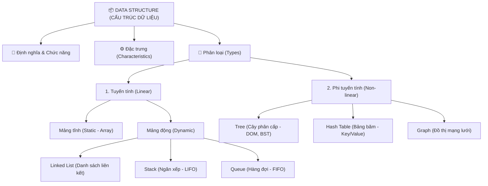

# CẤU TRÚC DỮ LIỆU (DATA STRUCTURE)

Tài liệu này phân tích chi tiết về Cấu trúc dữ liệu (Data Structure), bao gồm định nghĩa, chức năng, đặc trưng, phân loại tuyến tính/phi tuyến tính, và đi sâu vào từng cấu trúc dữ liệu cụ thể bám sát sơ đồ tư duy (mindmap) cá nhân.

---

## 🗺️ 1. SƠ ĐỒ TƯ DUY CẤU TRÚC DỮ LIỆU

---

## 📖 2. ĐỊNH NGHĨA, CHỨC NĂNG & ĐẶC TRƯNG

### 2.1. Định nghĩa Cấu trúc dữ liệu
**Cấu trúc dữ liệu (Data Structure)** là cách thức tổ chức, quản lý và lưu trữ dữ liệu trong bộ nhớ máy tính một cách có hệ thống sao cho chúng ta có thể truy xuất, thao tác và sử dụng dữ liệu đó một cách hiệu quả nhất.

### 2.2. Chức năng (Function)
*   **Lưu trữ dữ liệu:** Cung cấp vùng nhớ có cấu trúc rõ ràng để lưu trữ các thông tin thô.
*   **Quản lý mối quan hệ:** Thể hiện mối quan hệ logic giữa các phần tử dữ liệu (Ví dụ: cha-con ở cấu trúc Cây, kề cạnh ở cấu trúc Đồ thị).
*   **Tối ưu hóa tài nguyên:** Giúp hệ điều hành cấp phát và thu hồi bộ nhớ (RAM) một cách hợp lý.
*   **Hỗ trợ giải thuật:** Là nền tảng phần cứng/khung xương để các thuật toán (sắp xếp, tìm kiếm, tính toán) chạy trên đó một cách tối ưu.

### 2.3. Đặc trưng (Characteristic)
*   **Độ phức tạp thời gian (Time Complexity):** Thời gian thực hiện các tác vụ cơ bản (truy cập, tìm kiếm, chèn, xóa) được đo bằng ký hiệu Big O.
*   **Độ phức tạp không gian (Space Complexity):** Lượng bộ nhớ bổ sung mà cấu trúc dữ liệu yêu cầu để tự duy trì hoạt động.
*   **Tính tuần tự (Ordering):** Các phần tử dữ liệu được sắp xếp theo một thứ tự xác định (như Mảng) hay tự do/phi tuần tự (như Đồ thị).

---

## 📶 3. PHÂN TÍCH CHI TIẾT CÁC CẤU TRÚC DỮ LIỆU TUYẾN TÍNH (LINEAR DATA STRUCTURES)

Cấu trúc dữ liệu tuyến tính là loại cấu trúc mà các phần tử được sắp xếp theo một thứ tự tuần tự logic. Mỗi phần tử được liên kết với phần tử trước và sau nó.

### 3.1. Mảng (Array - Tĩnh và Động)
*   **Định nghĩa tổng quan:** Tập hợp các phần tử có cùng kiểu dữ liệu, nằm ở các ô nhớ liên tiếp nhau trong bộ nhớ RAM.

| Loại mảng | Định nghĩa | Cách nhận biết khi đọc đề bài / Yêu cầu | Flow truy xuất dữ liệu |
| :--- | :--- | :--- | :--- |
| **Mảng tĩnh (Static Array)** | Bộ nhớ được cấp phát cố định ngay khi biên dịch (Compile-time), không thể thay đổi kích thước khi đang chạy. | Đề bài cho trước số phần tử tối đa (Ví dụ: $N \le 10^5$) và không có nhu cầu thêm, bớt làm thay đổi kích thước mảng. | Tính toán địa chỉ trực tiếp qua index trong $O(1)$: `Address = BaseAddress + index * SizeOfElement`. Nhảy trực tiếp đến ô nhớ RAM. |
| **Mảng động (Dynamic Array / ArrayList)** | Bộ nhớ tự động co giãn linh hoạt trong thời gian chạy (Runtime) khi phần tử vượt quá sức chứa. | Thêm phần tử liên tục mà không biết trước số lượng, hoặc cần xóa/chèn ở cuối một cách linh hoạt. | Dữ liệu vẫn nằm liên tục. Khi mảng đầy, hệ thống tự tạo mảng mới lớn gấp đôi, copy phần tử cũ sang và giải phóng mảng cũ. Truy xuất vẫn là $O(1)$ qua index. |

---

### 3.2. Danh sách liên kết (Linked List)
*   **Định nghĩa tổng quan:** Tập hợp các phần tử (Node) nằm rải rác trên RAM, liên kết với nhau bằng địa chỉ con trỏ (Link). Mỗi Node gồm giá trị dữ liệu và địa chỉ của Node tiếp theo.

| Loại Linked List | Định nghĩa | Cách nhận biết khi đọc đề bài / Yêu cầu | Flow truy xuất dữ liệu |
| :--- | :--- | :--- | :--- |
| **Đơn (Singly Linked List)** | Mỗi Node chỉ có 1 con trỏ trỏ đến Node tiếp theo (`Next`). Node cuối cùng trỏ đến `null`. | Chỉ cần duyệt dữ liệu theo một chiều duy nhất từ đầu đến cuối và cần tiết kiệm bộ nhớ tối đa cho con trỏ. | Đi từ `Head`, dùng `Next` để nhảy sang Node kế tiếp. Không thể đi lùi. Thời gian truy cập ngẫu nhiên là $O(n)$. |
| **Đôi (Doubly Linked List)** | Mỗi Node có 2 con trỏ: 1 trỏ đến Node tiếp theo (`Next`), 1 trỏ về Node phía trước (`Prev`). | Cần duyệt dữ liệu qua lại linh hoạt cả hai chiều, hoặc thường xuyên xóa/chèn tại vị trí bất kỳ đã biết trước con trỏ. | Từ một Node hiện tại có thể tiến lên bằng `Next` hoặc lùi lại bằng `Prev`. Thuận tiện nhưng tốn gấp đôi bộ nhớ cho con trỏ. |
| **Vòng (Circular Linked List)** | Node cuối cùng thay vì trỏ đến `null` thì trỏ ngược lại Node đầu tiên (`Head`). | Dữ liệu có tính tuần hoàn, lặp lại liên tục (Ví dụ: Lập lịch tiến trình CPU chạy vòng tròn, chia lượt chơi game của các game thủ). | Duyệt liên tục không điểm dừng. Khi đi đến Node cuối cùng, con trỏ đưa bạn quay lại `Head`, tạo thành vòng khép kín. |

---

### 3.3. Ngăn xếp (Stack)
*   **Định nghĩa tổng quan:** Cấu trúc dữ liệu hoạt động theo nguyên lý **LIFO (Last In First Out - Vào sau, Ra trước)**.

| Loại Stack | Định nghĩa | Cách nhận biết khi đọc đề bài / Yêu cầu | Flow truy xuất dữ liệu |
| :--- | :--- | :--- | :--- |
| **Stack bằng Mảng (Array-based)** | Sử dụng mảng tĩnh/mảng động để lưu phần tử, có biến `top` làm con trỏ đỉnh. | Biết trước số lượng phần tử tối đa để tối ưu hiệu năng bộ nhớ, tránh tạo rác và overhead con trỏ. | Truy cập cực nhanh qua index mảng (`arr[top]`). Bị giới hạn kích thước nếu dùng mảng tĩnh. |
| **Stack bằng Linked List (List-based)** | Sử dụng danh sách liên kết để cài đặt Stack. Thêm/xóa thực hiện tại đầu danh sách (`Head`). | Số lượng phần tử thay đổi liên tục, không giới hạn dung lượng trước. | Thêm (Push) là chèn Node vào `Head` ($O(1)$), xóa (Pop) là xóa Node tại `Head` ($O(1)$). |

*   **Cách nhận biết khi đọc đề:** Đề bài có tính chất "đảo ngược" (Undo/Redo), kiểm tra tính hợp lệ của các cặp đóng-mở ngoặc lồng nhau, hoặc bài toán tìm phần tử lớn hơn tiếp theo (Next Greater Element).

---

### 3.4. Hàng đợi (Queue)
*   **Định nghĩa tổng quan:** Cấu trúc dữ liệu hoạt động theo nguyên lý **FIFO (First In First Out - Vào trước, Ra trước)**.

| Loại Queue | Định nghĩa | Cách nhận biết khi đọc đề bài / Yêu cầu | Flow truy xuất dữ liệu |
| :--- | :--- | :--- | :--- |
| **Hàng đợi thường (Linear Queue)** | Thêm phần tử ở cuối (Rear) và lấy ra ở đầu (Front). | Xử lý tuần tự các yêu cầu gửi đến theo thứ tự thời gian (như in ấn, xử lý tin nhắn gửi tới). | Khi lấy ra (Dequeue), đầu `Front` dịch sang phải. Các ô nhớ bên trái bị bỏ trống lãng phí. |
| **Hàng đợi vòng (Circular Queue)** | Kết nối vị trí cuối mảng quay lại vị trí đầu mảng bằng toán tử chia lấy dư `%`. | Cài đặt Queue bằng mảng nhưng muốn tái sử dụng các ô nhớ trống đã lấy ra trước đó. | Khi con trỏ `Rear` chạm cuối mảng, nó sẽ nhảy về vị trí đầu mảng (index 0) nếu vị trí đó trống. |
| **Hàng đợi hai đầu (Deque)** | Cho phép thêm và xóa phần tử ở cả 2 đầu (Front và Rear). | Bài toán cần trượt cửa sổ tối ưu (Sliding Window Maximum) hoặc cần thêm/xóa linh hoạt ở cả 2 phía. | Truy xuất dữ liệu: Thêm/Xóa ở cả đầu Front và cuối Rear đều đạt độ phức tạp $O(1)$. |
| **Hàng đợi ưu tiên (Priority Queue)** | Mỗi phần tử đi kèm một độ ưu tiên. Phần tử có độ ưu tiên cao nhất sẽ được lấy ra trước. | Cần lấy ra phần tử lớn nhất/nhỏ nhất liên tục tại mỗi bước (như thuật toán Dijkstra, Prim, lập lịch khẩn cấp). | Thường cài đặt bằng **Heap**. Khi lấy phần tử ra ($O(\log n)$), cây tự sắp xếp lại để đưa đỉnh ưu tiên nhất lên đầu. |

---

## 🏗️ 4. PHÂN TÍCH CHI TIẾT CÁC CẤU TRÚC DỮ LIỆU PHI TUYẾN TÍNH (NON-LINEAR DATA STRUCTURES)

Cấu trúc dữ liệu phi tuyến tính quản lý dữ liệu theo cấu trúc phân cấp hoặc mạng lưới, không đi theo hàng lối tuần tự.

### 4.1. Cấu trúc Cây (Tree)
*   **Định nghĩa tổng quan:** Cấu trúc phân cấp gồm các nút (Node) kết nối với nhau bằng các cạnh (Edge), không có chu trình. Nút trên cùng gọi là Root.

| Loại Cây (Tree) | Định nghĩa | Cách nhận biết khi đọc đề bài / Yêu cầu | Flow truy xuất dữ liệu |
| :--- | :--- | :--- | :--- |
| **Cây nhị phân thường (Binary Tree)** | Mỗi nút có tối đa 2 nút con (con trái và con phải). | Biểu diễn các mối quan hệ phân nhánh nhị phân đơn giản. | Đi từ Root, rẽ nhánh sang con trái hoặc con phải. |
| **Cây tìm kiếm nhị phân (BST)** | Nhánh con bên trái luôn nhỏ hơn nút cha, nhánh con bên phải luôn lớn hơn nút cha. | Cần tìm kiếm, chèn, xóa phần tử động liên tục và muốn giữ dữ liệu luôn có thứ tự. | So sánh khóa tìm kiếm với nút hiện tại: Nhỏ hơn $\rightarrow$ rẽ trái; Lớn hơn $\rightarrow$ rẽ phải. Tìm kiếm trong $O(\log n)$ nếu cây cân bằng. |
| **Cây cân bằng tự động (AVL / Đỏ-Đen)** | Tự động xoay cây để đảm bảo độ cao chênh lệch không quá 1 (AVL) hoặc tuân thủ quy tắc màu sắc (Đỏ-Đen). | Dữ liệu đầu vào cực kỳ lớn và ngẫu nhiên (tránh BST bị thoái hóa thành một đường thẳng có độ phức tạp $O(n)$). | Nhờ cơ chế tự cân bằng, các thao tác tìm kiếm, chèn, xóa luôn được đảm bảo ở mức $O(\log n)$ trong mọi trường hợp. |
| **Cây tiền tố (Trie)** | Mỗi nút đại diện cho một ký tự, các chuỗi chia sẻ chung tiền tố sẽ nằm chung nhánh. | Bài toán xử lý chuỗi ký tự: Gợi ý tìm kiếm (Auto-complete), kiểm tra chính tả, kiểm tra từ điển từ khóa. | Đi từ Root theo từng ký tự của từ cần tìm. Thời gian tìm kiếm cực nhanh $O(L)$ với $L$ là độ dài của từ, không phụ thuộc số từ trong từ điển. |
| **Segment Tree / Fenwick Tree** | Cây quản lý thông tin các đoạn/khoảng của một mảng số. | Đề bài yêu cầu cập nhật giá trị phần tử và truy vấn tổng/min/max trên một đoạn $[L, R]$ liên tục với tần suất cực lớn. | Cập nhật và truy vấn trong thời gian $O(\log n)$ thay vì duyệt tuần tự $O(n)$ trên mảng. |

#### 🔄 Deep Dive: Các cách duyệt cây (Tree Traversal)
Để đi qua toàn bộ các nút của cây, ta có hai hướng tiếp cận chính:

1.  **Duyệt theo chiều sâu (Depth-First Search - DFS):** Đi sâu xuống các nhánh trước khi sang nhánh khác. Có 3 kiểu duyệt dựa trên thứ tự thăm nút cha (N - Node), con trái (L - Left), con phải (R - Right):
    *   **Pre-order (Duyệt trước - NLR):** Thăm nút cha trước $\rightarrow$ sang con trái $\rightarrow$ sang con phải.
        *   *Ứng dụng:* Sao chép cấu trúc cây, tạo biểu thức tiền tố.
    *   **In-order (Duyệt giữa - LNR):** Duyệt hết nhánh trái $\rightarrow$ Thăm nút cha $\rightarrow$ duyệt nhánh phải.
        *   *Ứng dụng:* Duyệt cây BST sẽ cho ra danh sách các phần tử được sắp xếp tăng dần.
    *   **Post-order (Duyệt sau - LRN):** Duyệt hết con trái $\rightarrow$ duyệt con phải $\rightarrow$ Thăm nút cha sau cùng.
        *   *Ứng dụng:* Giải phóng/Xóa cây (phải xóa con trước khi xóa cha), tính tổng kích thước các thư mục con trước khi cộng vào cha.
2.  **Duyệt theo chiều rộng (Breadth-First Search - BFS / Level-order):** Duyệt cây theo từng tầng từ trên xuống dưới, từ trái sang phải.
    *   *Ứng dụng:* Tìm phần tử gần gốc nhất, duyệt cây theo mức độ. Thường dùng Queue để hỗ trợ lập lịch duyệt.

---

### 4.2. Bảng băm (Hash Table)
*   **Định nghĩa tổng quan:** Lưu trữ dữ liệu dưới dạng cặp `Key-Value` bằng cách dùng hàm băm (Hash Function) để tính toán địa chỉ lưu trữ của Key trong mảng, cho phép tìm kiếm trong $O(1)$.

#### 💥 Phân tích chuyên sâu về Xung đột mã băm (Hash Collision)
*   **Xung đột mã băm là gì?**
    Vì không gian khóa đầu vào (tất cả các chuỗi, đối tượng có thể làm Key) là vô hạn, trong khi kích thước mảng lưu trữ của bảng băm là hữu hạn. 
    Theo **Nguyên lý chuồng bồ câu (Pigeonhole Principle)**: Nếu có 10 cái chuồng bồ câu mà có 11 con bồ câu bay vào, chắc chắn sẽ có ít nhất một chuồng chứa từ 2 con bồ câu trở lên.
    Xung đột mã băm xảy ra khi hai Key khác nhau khi chạy qua hàm băm lại cho ra cùng một chỉ số Index (`hash(Key1) == hash(Key2)`).

*   **Các phương pháp xử lý xung đột băm (Collision Resolution Techniques):**
    Khi xảy ra xung đột, chúng ta có các phương pháp xử lý chi tiết được so sánh qua bảng dưới đây:

| Phương pháp xử lý | Cơ chế hoạt động | Ưu điểm (Pros) | Nhược điểm (Cons) | Hiệu năng khi xung đột cao |
| :--- | :--- | :--- | :--- | :--- |
| **Separate Chaining (Chaining bằng Linked List)** | Mỗi ô nhớ của bảng băm là đầu của một danh sách liên kết. Khi có Key mới bị trùng index, ta chỉ việc chèn thêm Node mới vào danh sách liên kết tại ô nhớ đó. | * Đơn giản, dễ cài đặt. * Bảng băm không bao giờ bị "đầy" thật sự. * Ít bị ảnh hưởng bởi hàm băm kém chất lượng. | * Tốn thêm bộ nhớ để lưu trữ con trỏ liên kết của các Node. * Truy xuất danh sách liên kết làm giảm hiệu năng lưu đệm cache CPU. | Nếu nhiều phần tử rơi vào cùng 1 ô, tìm kiếm từ $O(1)$ bị thoái hóa thành duyệt Linked List $O(n)$. *(Trong Java 8+, danh sách liên kết này tự động chuyển thành Cây đỏ-đen khi độ dài $\ge 8$ để giữ hiệu năng $O(\log n)$).* |
| **Open Addressing: Linear Probing (Dò tuyến tính)** | Dò tìm tuần tự sang ô nhớ trống tiếp theo ngay bên cạnh: `Index = (hash(Key) + i) % Size`. | * Tiết kiệm bộ nhớ (không dùng con trỏ). * Hiệu năng cache CPU cực tốt do dữ liệu nằm liên tục trên mảng. | Xảy ra hiện tượng **Primary Clustering**: Các ô nhớ bị lấp đầy liên tiếp tạo thành các cụm lớn, làm số lần dò tìm tăng vọt. | Khi bảng băm gần đầy, hiệu năng tìm kiếm giảm mạnh vì phải duyệt qua hàng loạt ô liên tiếp để tìm chỗ trống hoặc tìm phần tử. |
| **Open Addressing: Quadratic Probing (Dò bậc hai)** | Dò tìm ô trống bằng cách tăng khoảng cách nhảy theo bình phương: `Index = (hash(Key) + i^2) % Size`. | Giảm thiểu hiện tượng tụ tập cụm lớn (Primary Clustering) của Linear Probing. | Xảy ra hiện tượng **Secondary Clustering**: Các phần tử có cùng mã băm ban đầu vẫn sẽ đi theo cùng một lộ trình dò tìm bậc hai. | Tốt hơn dò tuyến tính nhưng vẫn bị chậm lại đáng kể khi tải trọng (Load Factor) của bảng băm tăng cao. |
| **Open Addressing: Double Hashing (Băm kép)** | Sử dụng một hàm băm thứ hai $hash_2(Key)$ để tính toán bước nhảy: `Index = (hash(Key) + i * hash_2(Key)) % Size`. | * Khắc phục hoàn toàn hiện tượng tụ tập nhóm. * Phân phối các phần tử rất đều trên bảng băm. | * Tốn chi phí CPU để tính toán 2 hàm băm khác nhau. * Yêu cầu hàm băm thứ hai không bao giờ trả về giá trị 0. | Đạt hiệu năng tốt nhất và đồng đều nhất trong các phương pháp Open Addressing khi có xung đột. |

---

### 4.3. Đồ thị (Graph)
*   **Định nghĩa tổng quan:** Một mạng lưới các đỉnh (Vertices / Nodes) kết nối với nhau bởi các cạnh (Edges).

| Loại Đồ thị | Định nghĩa | Cách nhận biết khi đọc đề bài / Yêu cầu | Flow truy xuất dữ liệu |
| :--- | :--- | :--- | :--- |
| **Có hướng vs Vô hướng (Directed vs Undirected)** | * Có hướng: Cạnh chỉ đi một chiều từ A sang B. * Vô hướng: Đường đi tự do hai chiều giữa hai đỉnh. | * Có hướng: Mạng lưới follow (Twitter/Insta), các bước thực hiện phụ thuộc công việc. * Vô hướng: Kết bạn (Facebook), kết nối cáp mạng vật lý. | Khi duyệt đồ thị, vô hướng cho phép đi cả hai chiều của cạnh, có hướng bắt buộc đi đúng chiều mũi tên chỉ định. |
| **Có trọng số vs Vô trọng số (Weighted vs Unweighted)** | * Có trọng số: Mỗi cạnh mang một chi phí/độ dài/thời gian đi qua. * Vô trọng số: Các cạnh bình đẳng, chi phí đi qua bằng 1. | * Có trọng số: Bản đồ giao thông (tìm đường ngắn nhất có khoảng cách thực tế), tính chi phí vận chuyển. * Vô trọng số: Tìm số bước ít nhất (Friend-of-friend) để đến đích. | Khi tìm đường đi ngắn nhất: Có trọng số dùng Dijkstra/Bellman-Ford. Vô trọng số chỉ cần dùng BFS là tối ưu. |
| **Chu trình vs Không chu trình (Cyclic vs Acyclic)** | * Chu trình: Có đường đi đi qua các đỉnh và quay lại chính nó. * Không chu trình: Không tồn tại đường đi khép kín. | Đồ thị không chu trình có hướng (**DAG**) xuất hiện trong bài toán phụ thuộc gói thư viện (Maven/npm), lập lịch học môn tiên quyết. | Duyệt đồ thị để phát hiện chu trình (DFS tô màu đỉnh). DAG cho phép thực hiện thuật toán Sắp xếp Topo (Topological Sort). |
