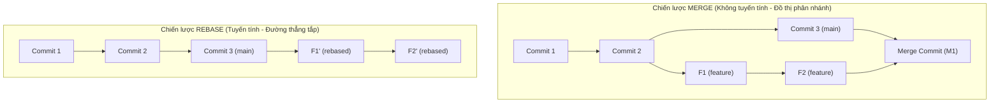

# LẬP TRÌNH GIT NÂNG CAO: TỐI ƯU QUY TRÌNH & HỒI PHỤC LỊCH SỬ

Tài liệu này gộp toàn bộ các kiến thức nâng cao, thực hành tốt nhất (Best Practices) và các kịch bản giải quyết sự cố thực chiến trong Git—đặc biệt tập trung vào các ngách nhỏ nhất khi giải quyết lỗi lịch sử và "push lộn/commit lộn" trên hệ thống.

---

## 🏗️ 1. CHIẾN LƯỢC PHÂN NHÁNH & HỢP NHẤT TRONG DỰ ÁN LỚN

Khi làm việc trong dự án lớn với hàng trăm lập trình viên, lịch sử Git rất dễ biến thành một "mạng nhện" đan xen chằng chịt nếu mọi người merge nhánh vô tội vạ. Chúng ta cần các chiến lược rõ ràng:

### 1.1 Merge vs. Rebase: Triết lý của lịch sử
Khi kết hợp các thay đổi từ nhánh phụ (ví dụ: `feature`) vào nhánh chính (ví dụ: `main`), Git cung cấp hai triết lý khác nhau:



*   **Git Merge:**
    *   *Cơ chế:* Tạo ra một **Merge Commit** mới kết hợp lịch sử của cả hai nhánh.
    *   *Ưu điểm:* Lưu giữ sự thật lịch sử một cách tuyệt đối (biết chính xác nhánh nào rẽ ra khi nào và gộp vào lúc nào). Không thay đổi các commit cũ.
    *   *Nhược điểm:* Lịch sử rối mắt (mạng nhện) nếu dự án lớn và nhiều người merge liên tục.
*   **Git Rebase:**
    *   *Cơ chế:* "Di chuyển" toàn bộ các commit của nhánh phụ đặt lên đầu commit mới nhất của nhánh chính. Viết lại lịch sử bằng cách tạo ra các mã băm commit mới.
    *   *Ưu điểm:* Lịch sử **tuyến tính (linear)**, thẳng tắp, dễ theo dõi luồng phát triển.
    *   *Nhược điểm:* Phải giải quyết xung đột trên từng commit một trong quá trình rebase. 
    *   🚨 **Quy tắc vàng:** Không bao giờ rebase các commit đã được push lên một kho chứa công khai (Remote) vì sẽ ghi đè lịch sử của người khác.

### 1.2 Quy trình Rebase cục bộ trước khi Merge (Local Rebase Workflow)
Để đảm bảo lịch sử tuyến tính trước khi tạo Pull Request, lập trình viên thực hiện quy trình sau dưới máy local:
1.  Chuyển sang nhánh feature đang phát triển: `git checkout feature-payment`
2.  Tải code mới nhất trên server về: `git fetch origin`
3.  Rebase nhánh feature dựa trên nhánh main mới nhất trên remote: `git rebase origin/main`
4.  Nếu xảy ra xung đột (conflict):
    *   Git sẽ dừng lại ở commit bị lỗi. Hãy mở trình soạn thảo để sửa lỗi xung đột.
    *   Sau khi sửa xong, gõ `git add <file_sửa>`
    *   Tiếp tục rebase: `git rebase --continue` (lặp lại cho đến khi rebase hoàn tất).
5.  Đẩy code lên nhánh feature trên remote: `git push origin feature-payment --force-with-lease`

> [!TIP]
> **Tại sao nên dùng `--force-with-lease` thay vì `--force`?**
> Lệnh `git push -f` sẽ ghi đè thô bạo lên remote bất chấp mọi thứ. Trong khi đó, `--force-with-lease` là phiên bản an toàn hơn: nó chỉ cho phép ghi đè nếu không có ai khác push commit mới lên nhánh feature đó trên remote kể từ lần `git fetch` gần nhất của bạn. Điều này tránh việc bạn vô tình ghi đè mất commit mới của đồng nghiệp cùng làm trên nhánh feature đó.

### 1.3 Squash and Merge (Gộp và Merge trên Pull Request)
Thay vì merge một feature chứa 20 commit lặt vặt (ví dụ: `"wip"`, `"fix typo css"`, `"thử lại"`), chúng ta dùng **Squash and Merge** trên GitHub/GitLab.
*   **Cách hoạt động:** Gộp toàn bộ 20 commit của nhánh feature thành **1 commit duy nhất** sạch sẽ trên nhánh `main`.
*   **Lợi ích:** Nhánh chính hoàn toàn sạch bóng các commit rác, dễ dàng định vị và hoàn tác (`git revert`) một tính năng bị lỗi nếu cần.

### 1.4 Bảo vệ nhánh chính (Branch Protection Rules)
Ngăn chặn mọi rủi ro bằng cách thiết lập luật trên GitHub/GitLab:
*   Cấm push trực tiếp vào nhánh `main` hoặc `develop`.
*   Buộc phải thông qua Pull Request và có tối thiểu `1` hoặc `2` thành viên phê duyệt (Code Review).
*   Buộc toàn bộ các bài kiểm thử tự động (CI/CD pipeline) phải chạy thành công (Pass) trước khi merge.

---

## 📶 2. CÁC CÔNG CỤ TRUY VẾT LỖI ĐỈNH CAO (TROUBLESHOOTING)

Khi dự án lớn có hàng vạn commit, việc tìm kiếm thủ công là bất khả thi. Hãy tận dụng sức mạnh của các lệnh dưới đây:

### 2.1 Định vị tác giả dòng code lỗi với `git blame`
Xem ai đã viết từng dòng code trong một file, tại commit nào và vào thời gian nào:
```bash
# Xem thông tin từ dòng 10 đến dòng 20 trong file auth.ts
git blame -L 10,20 src/services/auth.ts
```

### 2.2 Lọc lịch sử nâng cao với `git log`
*   **Tìm commit theo tin nhắn:** `git log --grep="stripe"` (tìm các commit có tin nhắn chứa từ "stripe").
*   **Tìm commit theo nội dung code thay đổi:** `git log -S "API_KEY"` (tìm các commit có nội dung chèn hoặc xóa chuỗi `"API_KEY"` - cực kỳ hữu ích để tìm thời điểm rò rỉ mật khẩu).
*   **Tìm commit theo tác giả:** `git log --author="Nghia"`

### 2.3 Tìm commit gây lỗi bằng thuật toán Tìm kiếm Nhị phân (`git bisect`)
Nếu code hiện tại bị lỗi (bad) nhưng bạn biết tuần trước chạy bình thường (good):
```bash
git bisect start
git bisect bad                 # Khai báo commit hiện tại đang bị lỗi
git bisect good <commit_hash>  # Khai báo commit cũ hoạt động tốt trong quá khứ
```
Git sẽ tự động checkout ra commit ở giữa. Bạn chạy thử app/chạy test:
*   Nếu tốt: gõ `git bisect good`
*   Nếu lỗi: gõ `git bisect bad`
Git sẽ tiếp tục chia đôi cho đến khi chỉ ra chính xác commit đầu tiên làm hỏng code. Để thoát chế độ này, gõ `git bisect reset`.

### 2.4 Cứu cánh dữ liệu đã mất với `git reflog`
`reflog` là nhật ký ghi lại mọi chuyển động của con trỏ `HEAD` trên máy cục bộ của bạn (kể cả các commit đã bị xóa do rebase lỗi hoặc reset nhầm).
```bash
git reflog
```
Tìm dòng trạng thái trước khi bị mất dữ liệu (ví dụ mã băm commit là `d3c2b1a`), sau đó lùi về:
```bash
git reset --hard d3c2b1a
```

---

## 📦 3. CƠ CHẾ LƯU TRỮ TẠM THỜI (GIT STASH)

Stash hoạt động như một ngăn tủ khóa tạm thời dưới local, giúp bạn cất giữ các file đang viết dở để chuyển sang làm việc khác mà không cần commit rác.

*   **Cất giấu file đang sửa (gồm cả file chưa staged):**
    ```bash
    git stash -u   # Tham số -u (include-untracked) để cất cả file mới tạo chưa add
    # Hoặc lưu kèm ghi chú:
    git stash save "Đang sửa dở giao diện đăng nhập"
    ```
*   **Xem danh sách tủ đồ:** `git stash list` (được đánh số thứ tự như `stash@{0}`, `stash@{1}`).
*   **Lấy ra làm tiếp và xóa khỏi tủ:** `git stash pop` (mặc định lấy cái mới nhất `stash@{0}`).
*   **Lấy ra làm tiếp nhưng giữ bản sao trong tủ:** `git stash apply stash@{0}`
*   **Xóa một stash cụ thể:** `git stash drop stash@{0}`
*   **Dọn sạch toàn bộ tủ đồ:** `git stash clear`

---

## 🗂️ 4. BÊN DƯỚI LỚP VỎ (BẢN CHẤT THƯ MỤC .GIT)

Git thực chất là một **Content-Addressable Filesystem** (Hệ thống tệp truy cập theo nội dung). Toàn bộ dữ liệu nằm trong thư mục ẩn `.git/`.

### 4.1 Cơ sở dữ liệu đối tượng (.git/objects)
Mọi tệp tin, cấu trúc thư mục và commit đều được mã hóa và lưu trữ thành các đối tượng có tên là mã băm SHA-1 dài 40 ký tự:
*   **Blobs (Binary Large Objects):** Chỉ lưu trữ *nội dung thô* của tệp tin (không chứa tên tệp hay siêu dữ liệu).
*   **Trees:** Đại diện cho các thư mục. Nó chứa danh sách các tệp tin (blobs) và thư mục con (trees) cùng với tên tệp tương ứng của chúng.
*   **Commits:** Chứa con trỏ trỏ tới Tree gốc của phiên bản đó, thông tin tác giả, ngày tháng và mã băm của commit cha (parent).

### 4.2 Các tham chiếu (.git/refs)
*   **Heads (.git/refs/heads/):** Chứa các file văn bản nhỏ mang tên các nhánh (như `main`, `feature-x`). Mỗi file chỉ chứa đúng 40 ký tự đại diện cho mã băm của commit mới nhất trên nhánh đó. Nhánh trong Git thực chất chỉ là một con trỏ có tên trỏ đến commit.
*   **Tags (.git/refs/tags/):** Tương tự như nhánh nhưng là các con trỏ tĩnh, không bao giờ di chuyển theo commit mới. Thường dùng để đánh dấu phiên bản phát hành (ví dụ: `v1.0.0`).
*   **HEAD (.git/HEAD):** Một file chứa tham chiếu đến nhánh hiện tại bạn đang checkout (ví dụ: `ref: refs/heads/main`).

---

## 🚨 5. CẨM NANG KHÔI PHỤC LỊCH SỬ KHI PUSH LỘN / COMMIT LỘN

Dưới đây là phân tích chi tiết và cách giải quyết cho các tình huống sự cố lịch sử nguy hiểm trong thực tế, kèm phân tích sự thay đổi của đồ thị lịch sử (commit graph):

### TÌNH HUỐNG 1: Commit lộn dưới local và đã lỡ push lên Remote cá nhân (Nhánh riêng chỉ một mình làm việc)
*   **Vấn đề:** Bạn commit nhầm file cấu hình hoặc gõ sai tin nhắn commit và đã push lên nhánh cá nhân trên GitHub.
*   **Cách giải quyết:**
    1.  *Nếu chỉ muốn sửa tin nhắn commit gần nhất:*
        ```bash
        git commit --amend -m "Tin nhắn commit mới chính xác"
        ```
    2.  *Nếu muốn hủy commit gần nhất nhưng giữ lại code đang viết để sửa:*
        ```bash
        git reset --soft HEAD~1
        ```
    3.  *Nếu muốn xóa sạch hoàn toàn commit đó và xóa cả code:*
        ```bash
        git reset --hard HEAD~1
        ```
    4.  *Cập nhật lại lịch sử lên Remote:* Vì bạn đã viết lại lịch sử dưới máy local, lệnh push thông thường sẽ bị từ chối. Hãy đẩy ép buộc một cách an toàn:
        ```bash
        git push origin <tên_nhánh> --force-with-lease
        ```
*   **Sự thay đổi đồ thị lịch sử:**
    ```
    Trước reset:  A ──> B ──> C (Sai - HEAD/Remote)
    
    Sau reset:    A ──> B (HEAD/Remote đã lùi về B)
                       └──> C (Commit sai bị "mồ côi" - Orphaned, sẽ bị GC tự động xóa sau 30 ngày)
    ```

---

### TÌNH HUỐNG 2: Commit lộn và đã push lên Remote chung của dự án (Nhánh làm việc chung như main, develop)
*   **Vấn đề:** Bạn commit lỗi và push lên nhánh `main` chung. Cả team đang kéo code từ nhánh này.
*   **🚨 CẢNH BÁO:** Tuyệt đối **cấm** sử dụng lệnh `--force` hoặc `--force-with-lease` trên nhánh chung. Việc ghi đè lịch sử sẽ làm đứt gãy đồ thị lịch sử của tất cả các máy khách khác trong team, gây ra lỗi xung đột nghiêm trọng khi họ chạy `git pull`.
*   **Cách giải quyết:** Sử dụng lệnh `git revert` để tạo một commit phủ định:
    ```bash
    # Revert lại commit bị lỗi bằng cách tạo commit mới đảo ngược hoàn toàn thay đổi của nó
    git revert <commit_hash_bị_lỗi>
    # Sau đó push lên remote bình thường mà không cần force
    git push origin main
    ```
*   **Sự thay đổi đồ thị lịch sử:** Lịch sử được bảo toàn hoàn chỉnh, đồ thị tiếp tục tiến lên tuyến tính mà không bị phá vỡ cấu trúc cũ:
    ```
    A ──> B (Commit lỗi) ──> C (Commit Revert phủ định B - HEAD/Remote)
    ```

---

### TÌNH HUỐNG 3: Push lộn nhánh (Đẩy nhầm code nhánh local này đè lên nhánh remote khác)
*   **Vấn đề:** Bạn đang ở nhánh cục bộ `feature-A` nhưng vô tình gõ lệnh `git push origin feature-A:main`, đẩy thẳng code chưa hoàn thiện đè lên nhánh `main` trên remote.
*   **Cách giải quyết:** Khôi phục nhánh `main` trên remote về trạng thái an toàn trước đó:
    1.  Tìm mã băm commit an toàn cuối cùng của nhánh `main` trước khi bị push lộn. Bạn có thể tìm bằng `git reflog` hoặc xem lịch sử commit của nhánh `main` trên giao diện web GitHub. Giả sử mã băm an toàn là `a1b2c3d`.
    2.  Chuyển về nhánh `main` cục bộ:
        ```bash
        git checkout main
        ```
    3.  Lùi nhánh `main` cục bộ về đúng commit an toàn đó:
        ```bash
        git reset --hard a1b2c3d
        ```
    4.  Đẩy ép buộc nhánh `main` đã khôi phục lên remote để ghi đè lại lỗi push lộn:
        ```bash
        git push origin main --force-with-lease
        ```

---

### TÌNH HUỐNG 4: Push lộn thông tin bảo mật nhạy cảm (Lỡ commit và push file .env, API key, password...)
*   **Sai lầm thường gặp:** Sửa lại file, commit mới `"xóa API key"` và push tiếp.
*   **Tại sao sai:** API key cũ vẫn tồn tại trong lịch sử của commit trước đó. Bất kỳ ai cũng có thể lục lại lịch sử Git để lấy cắp.
*   **Cách giải quyết triệt để:** Sử dụng công cụ hiện đại `git-filter-repo` để quét sạch tệp tin nhạy cảm khỏi toàn bộ lịch sử Git của tất cả các commit:
    1.  Cài đặt `git-filter-repo` (công cụ được khuyến nghị thay thế cho lệnh `git filter-branch` cũ vốn rất chậm và dễ gây lỗi).
    2.  Chạy lệnh xóa tệp tin nhạy cảm khỏi toàn bộ lịch sử:
        ```bash
        git filter-repo --path src/config/.env --invert-paths
        ```
    3.  *Nếu muốn quét và thay thế một chuỗi văn bản nhạy cảm (ví dụ mật khẩu):* Tạo file `passwords.txt` chứa chuỗi cần xóa, sau đó chạy:
        ```bash
        git filter-repo --replace-text passwords.txt
        ```
    4.  Vì `git-filter-repo` sẽ tự động xóa các remote cấu hình để bảo vệ bạn khỏi push nhầm trong quá trình làm sạch, bạn cần add lại remote:
        ```bash
        git remote add origin <url_kho_chứa>
        ```
    5.  Đẩy lịch sử mới đã được làm sạch lên remote:
        ```bash
        git push origin --force --all
        ```
    *🚨 Khuyên dùng:* Lập tức vô hiệu hóa (revoke/rotate) khóa API cũ trên hệ thống thực tế vì các robot tự động trên internet có thể đã quét qua và thu thập thông tin chỉ trong vài giây sau khi bạn push lộn.

---

### TÌNH HUỐNG 5: Merge lộn nhánh (Gộp nhầm một nhánh feature lỗi vào main và đã push lên remote)
*   **Vấn đề:** Bạn chạy lệnh merge nhánh `feature-lỗi` vào `main` và đã lỡ push lên remote chung.
*   **Cách giải quyết:** 
    1.  Một commit merge có 2 cha (parent 1: nhánh main, parent 2: nhánh feature). Do đó, bạn không thể revert thông thường mà phải chỉ định rõ cha nào muốn giữ lại thông qua tham số `-m` (mainline, thường là `1` đại diện cho nhánh chính):
        ```bash
        git revert -m 1 <mã_băm_commit_merge>
        ```
    2.  *🚨 Ngách cực nhỏ cần lưu ý (Cạm bẫy Re-merge):*
        *   Sau khi chạy revert commit merge trên, code lỗi đã bị rút khỏi `main`. Lập trình viên sửa xong lỗi trên nhánh `feature-lỗi` đó và muốn gộp lại vào `main`.
        *   Khi gộp lại, Git sẽ báo *"Already up-to-date"* hoặc bỏ qua tất cả các commit cũ của nhánh feature đó vì lịch sử của `main` đã ghi nhận sự tồn tại của các commit này rồi (Git không tự động biết bạn đã từng revert nó).
        *   **Cách xử lý đúng:** Trước khi merge lại nhánh feature đã sửa lỗi, bạn phải vào nhánh `main` và **revert lại chính cái commit revert merge lúc trước**:
            ```bash
            git checkout main
            # Revert lại commit revert trước đó để khôi phục các tham chiếu lịch sử của feature trên main
            git revert <mã_băm_của_commit_revert_merge_trước_đó>
            # Sau đó tiến hành merge nhánh feature đã sửa lỗi vào main như bình thường
            git merge feature-đã-sửa-lỗi
            ```

---

### TÌNH HUỐNG 6: Đang chạy Rebase giữa chừng thì gặp xung đột (conflict) dữ dội và muốn quay xe
*   **Vấn đề:** Bạn chạy `git rebase main` và gặp xung đột nghiêm trọng trên hàng chục commit khác nhau, các file bị lỗi hỗn loạn và bạn không tự tin để sửa tiếp.
*   **Cách giải quyết:** Hủy bỏ toàn bộ quá trình rebase để đưa thư mục làm việc quay lại trạng thái sạch sẽ hoàn toàn trước khi chạy lệnh rebase:
    ```bash
    git rebase --abort
    ```
