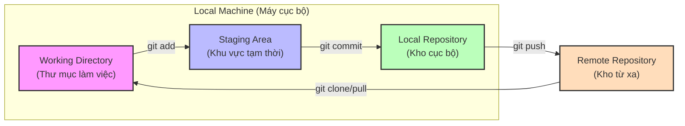
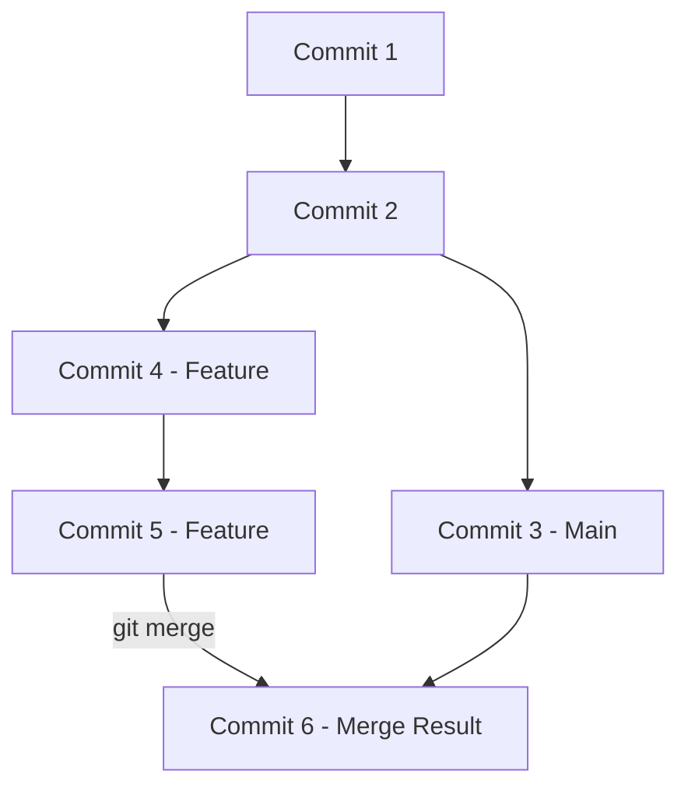

# Kiến thức cơ bản về Git: Quản lý phiên bản & Logic phân tán

Git là một **Hệ thống Quản lý Phiên bản Phân tán (DVCS)** được thiết kế để xử lý mọi dự án từ nhỏ đến rất lớn với tốc độ và hiệu quả cao. Khác với các hệ thống cũ, Git coi dữ liệu của mình giống như một chuỗi các "ảnh chụp nhanh" (snapshots) của một hệ thống tệp nhỏ.

---

## 1. Sự tiến hóa của các Hệ thống Quản lý Phiên bản (VCS)

Để hiểu Git, chúng ta cần hiểu lý do ("Tại sao") đằng sau kiến trúc của nó.

| Loại | Cơ chế | Ưu điểm | Nhược điểm | Ví dụ |
| :--- | :--- | :--- | :--- | :--- |
| **Local VCS** | Lưu trữ các thay đổi (bản vá) trên đĩa cục bộ. | Đơn giản, nhanh chóng. | Không thể cộng tác; dễ mất dữ liệu nếu hỏng đĩa. | RCS |
| **Centralized VCS (CVCS)** | Một máy chủ duy nhất chứa tất cả các tệp; client "check out" từ trung tâm. | Nhóm dễ quan sát; quản lý quyền dễ dàng. | Máy chủ hỏng sẽ dừng mọi công việc; mất dữ liệu nếu máy chủ lỗi. | SVN, Perforce |
| **Distributed VCS (DVCS)** | Client sao chép đầy đủ toàn bộ kho lưu trữ, bao gồm cả lịch sử. | Làm việc offline; an toàn (mỗi bản sao là một bản backup); tốc độ cao. | Tải về ban đầu lớn; lộ trình học tập dốc hơn. | **Git**, Mercurial |

---

## 2. Logic cốt lõi: Snapshots vs. Deltas

> [!IMPORTANT]
> **Điểm mù: Cách Git "Nhìn" Dữ liệu**
> Hầu hết các VCS khác (như SVN) lưu trữ thông tin dưới dạng danh sách các thay đổi dựa trên tệp (**Deltas**). Ngược lại, Git lưu trữ dữ liệu dưới dạng một chuỗi các **Snapshots** (Ảnh chụp nhanh).

- **Logic của SVN**: "Tệp A thay đổi ở dòng 5, Tệp B được thêm vào." (Lưu trữ lũy tiến).
- **Logic của Git**: "Tại thời điểm này, toàn bộ dự án trông chính xác như *thế này*." 
- Nếu một tệp không thay đổi, Git không lưu lại tệp đó lần nữa—nó chỉ liên kết đến phiên bản giống hệt trước đó đã được lưu.

---

## 3. So sánh: Git vs. SVN (Phân tán vs. Tập trung)

Hiểu lý do tại sao Git chiến thắng trong cuộc chiến VCS là điều tối quan trọng.

| Đặc điểm | Git (Phân tán) | SVN (Tập trung) |
| :--- | :--- | :--- |
| **Lưu trữ lịch sử** | Cục bộ (mỗi client có đầy đủ lịch sử). | Từ xa (chỉ máy chủ mới có lịch sử). |
| **Thao tác Commit** | Cục bộ (nhanh, làm việc offline). | Từ xa (yêu cầu internet, chậm). |
| **Nhánh (Branching)** | Nhẹ (chỉ là một con trỏ), khuyến khích sử dụng thường xuyên. | Nặng (tạo ra một bản sao thư mục đầy đủ). |
| **Tính toàn vẹn** | Dựa trên nội dung (hàm băm SHA-1 ngăn chặn tham nhũng). | Số thứ tự phiên bản (ít an toàn hơn). |
| **Quy trình làm việc** | Feature-branch, Pull Requests. | Trunk-based, tiến triển tuyến tính. |

---

## 4. Kiến trúc 4 Khu vực Lưu trữ (Trái tim của Git)

Git quản lý mã nguồn thông qua bốn vị trí chính, mỗi nơi đóng một vai trò cụ thể trong quy trình phát triển. Việc hiểu rõ sự di chuyển của dữ liệu giữa các khu vực này là chìa khóa để làm chủ Git.

### 4.1 Thư mục làm việc (Working Directory)
Các tệp thực tế bạn đang chỉnh sửa trên máy tính của mình. Đây là nơi bạn thực hiện công việc.

### 4.2 Khu vực trung gian (Staging Area / The Index)
> [!TIP]
> **Điểm mù: Tại sao cần Staging?**
> Nó đóng vai trò như một "vùng đệm" hoặc "kho chứa tạm". Nó cho phép bạn tạo ra một commit chính xác. Bạn có thể thay đổi 10 tệp nhưng chỉ `add` 2 tệp vào commit tiếp theo. Điều này giúp lịch sử sạch sẽ và có tính nguyên tử (atomic).

### 4.3 Kho lưu trữ cục bộ (Local Repository)
Nơi Git lưu trữ vĩnh viễn các thay đổi đã cam kết dưới dạng các "ảnh chụp nhanh". Khi bạn thực hiện lệnh `git commit`, các thay đổi từ khu vực tạm thời được lưu lại vào lịch sử dự án trên máy của bạn.

### 4.4 Kho lưu trữ từ xa (Remote Repository)
Phiên bản của kho lưu trữ được lưu trên máy chủ (như GitHub, GitLab, hoặc Bitbucket). Đây là nơi nhóm chia sẻ mã nguồn và hợp tác. Lệnh `git push` sẽ đẩy các commit cục bộ lên đây.

---

## 5. Quy trình làm việc cơ bản (The Fundamental Workflow)

Dựa trên các vị trí lưu trữ trên, quy trình làm việc chuẩn với Git bao gồm các bước sau:

| Bước | Lệnh | Mô tả | Kết nối |
| :--- | :--- | :--- | :--- |
| **1. Clone** | `git clone` | Tạo bản sao của kho lưu trữ từ xa về máy cục bộ. | Remote -> Local |
| **2. Edit** | (Manual) | Chỉnh sửa, thêm hoặc xóa tệp trong thư mục làm việc. | Working Dir |
| **3. Stage** | `git add` | Thu gom các thay đổi muốn commit vào vùng đệm. | Working -> Staging |
| **4. Commit** | `git commit` | Lưu trữ vĩnh viễn các thay đổi vào lịch sử cục bộ. | Staging -> Local |
| **5. Push** | `git push` | Chia sẻ các thay đổi cục bộ lên máy chủ cho nhóm. | Local -> Remote |
| **6. Pull** | `git pull` | Kéo code mới nhất từ Remote về không gian làm việc. | Remote -> Working |

> [!TIP]
> **Sự khác biệt giữa Pull và Fetch**: 
> - `git fetch`: Chỉ lấy thông tin mới từ Remote về nhưng chưa gộp vào code của bạn.
> - `git pull`: Là sự kết hợp của `git fetch` + `git merge`.

---

## 6. Các thuật ngữ & Khái niệm chính

### Commit: Đơn vị nguyên tử
Một commit là một ảnh chụp nhanh của dự án tại một thời điểm cụ thể. Mỗi commit có:
- **Mã băm SHA-1**: Một ID duy nhất dài 40 ký tự (ví dụ: `5b2a3f...`).
- **Tác giả/Ngày tháng**: Ai làm và khi nào.
- **Parent**: Một con trỏ dẫn đến (các) commit trước đó, tạo thành một chuỗi.

### Nhánh (Branching): Tách biệt & Hợp nhất
Nhánh cho phép bạn tách ra từ mã nguồn chính để phát triển tính năng mới hoặc sửa lỗi mà không ảnh hưởng đến sự ổn định của dự án.

- **Tạo nhánh (`git branch`)**: Tạo một "con trỏ" mới trỏ đến commit hiện tại.
- **Chuyển nhánh (`git checkout` / `git switch`)**: Di chuyển HEAD đến nhánh khác để làm việc.
- **Gộp nhánh (`git merge`)**: Hợp nhất các thay đổi từ nhánh phụ (ví dụ: `feature-x`) vào nhánh chính (`main`).

---

## 7. Quy trình lệnh chi tiết

### Khởi tạo & Thiết lập
- `git init`: Tạo một kho lưu trữ cục bộ mới.
- `git clone <url>`: Sao chép một kho lưu trữ từ xa hiện có về máy của bạn.
- `git config --global user.name "Tên của bạn"`: Xác định danh tính của bạn.

### Vòng lặp hàng ngày
1. **Chỉnh sửa**: Sửa các tệp trong Thư mục làm việc.
2. `git status`: Kiểm tra những gì đã thay đổi.
3. `git add <file>`: Chuyển các thay đổi vào **Khu vực trung gian**.
4. `git commit -m "tin nhắn"`: Lưu ảnh chụp nhanh vào **Kho cục bộ**.
5. `git push origin <branch>`: Tải các commit cục bộ lên **Kho từ xa**.

---

## 7. Khai thác các "Điểm mù": Cơ chế nâng cao

### Merge vs. Rebase: Triết lý của lịch sử
Khi kết hợp hai nhánh, bạn có hai lựa chọn:
- **Merge**: Tạo ra một "Merge Commit" mới. Nó bảo tồn sự thật theo trình tự thời gian (chính xác những gì đã xảy ra và khi nào).
- **Rebase**: "Di chuyển" các thay đổi của bạn lên đầu nhánh mục tiêu. Nó tạo ra một **lịch sử tuyến tính, sạch sẽ** nhưng sẽ ghi đè các mã băm commit.
    - *Quy tắc vàng*: Không bao giờ rebase các commit đã được push lên một kho lưu trữ công khai.

### Trạng thái Detached HEAD
Điều này xảy ra khi bạn checkout một mã băm commit cụ thể thay vì một nhánh.
- **Rủi ro**: Bất kỳ commit nào được thực hiện ở đây đều không thuộc về nhánh nào và có thể bị mất trong quá trình dọn dẹp (garbage collection).
- **Cách khắc phục**: Tạo một nhánh mới ngay lập tức: `git checkout -b ten-nhanh-moi`.

### Sức mạnh của `.gitignore`
Luôn bỏ qua các biến môi trường (`.env`), các thư viện phụ thuộc (`node_modules`), và các tệp rác của hệ điều hành (`.DS_Store`). 
> [!CAUTION]
> Nếu một tệp đã được theo dõi (tracked) trước khi được thêm vào `.gitignore`, Git sẽ tiếp tục theo dõi nó. Bạn phải dùng `git rm --cached <file>` để ngừng theo dõi tệp đó.

### Thao tác Hoàn tác (Undo)
- `git revert <commit>`: Tạo ra một commit **mới** có nội dung ngược lại với commit mục tiêu. An toàn cho lịch sử dùng chung.
- `git reset --hard <commit>`: Cưỡng ép di chuyển con trỏ nhánh quay lại. **Nguy hiểm**: Xóa sạch các thay đổi cục bộ. Chỉ sử dụng trên các nhánh cục bộ chưa push.

---

## 8. Đi sâu vào bản chất: Bên dưới lớp vỏ (Thư mục .git)

Hầu hết các lập trình viên coi Git như một chiếc "hộp đen". Hiểu về thư mục `.git` sẽ xóa bỏ sự bí ẩn đó.

### 8.1 Cơ sở dữ liệu đối tượng (Object Database)
Git về cơ bản là một **Content-Addressable Filesystem** (Hệ thống tệp có thể truy cập theo nội dung). Nó lưu trữ các đối tượng trong `.git/objects/`.
- **Blobs**: Lưu trữ *nội dung* của một tệp (không có tên tệp hoặc siêu dữ liệu).
- **Trees**: Lưu trữ *cấu trúc* (tên tệp và liên kết đến các Blobs hoặc các Trees khác). Đây là cách Git xử lý các thư mục.
- **Commits**: Lưu trữ liên kết đến một Tree gốc, tác giả và mã băm commit cha.

### 8.2 Refs (Tham chiếu)
Nằm trong `.git/refs/`.
- **Heads**: Các tệp chứa mã băm của commit mới nhất cho mỗi nhánh.
- **Tags**: Các tệp chứa mã băm của một commit cụ thể, không thay đổi.

> [!NOTE]
> Khi bạn chuyển nhánh, Git chỉ đơn giản là cập nhật tệp `HEAD` để trỏ đến một tệp khác trong `refs/heads/`, sau đó cập nhật Thư mục làm việc của bạn để khớp với ảnh chụp nhanh trong commit đó.

---

## 9. Các cạm bẫy Git phổ biến (The "Gotchas")

| Tình huống | Cạm bẫy | Giải pháp |
| :--- | :--- | :--- |
| **Dữ liệu nhạy cảm** | Xóa một bí mật (password) trong commit mới. | Bí mật vẫn còn trong lịch sử! Sử dụng `git filter-repo` hoặc BFG Repo-Cleaner để xóa sạch lịch sử. |
| **Tệp lớn** | Commit một file database nặng 1GB. | Hiệu suất của Git sẽ giảm mạnh. Sử dụng **Git LFS** (Large File Storage) cho các tài sản nhị phân. |
| **Phân biệt chữ hoa/thường** | Đổi `file.txt` thành `File.txt` trên Windows/Mac. | Git có thể không "thấy" sự thay đổi. Sử dụng `git mv file.txt File.txt`. |
| **Thay đổi chưa Staged** | Quên không `git add` một tệp mới. | `git commit -a` chỉ thêm các tệp *đã sửa đổi*, không thêm các tệp *chưa theo dõi*. Luôn dùng `git status` trước. |

---

## 10. Quy tắc thực hành tốt nhất (Best Practices)

1.  **Commit nhỏ, Commit thường xuyên**: Mỗi commit nên đại diện cho một thay đổi logic duy nhất.
2.  **Viết tin nhắn commit ở dạng mệnh lệnh**: Sử dụng "Fix bug" thay vì "Fixed bug" hay "Fixes bug."
3.  **Dọn dẹp trước khi Merge**: Sử dụng `git rebase -i` (interactive rebase) để gộp các commit "đang dở dang" thành một commit sạch sẽ trước khi merge vào nhánh chính.
4.  **Bảo vệ nhánh chính**: Sử dụng Pull Requests và các quy tắc bảo vệ nhánh để đảm bảo việc xem xét mã (code review).
5.  **Làm chủ dòng lệnh (CLI)**: Mặc dù GUI rất hữu ích để quan sát, nhưng CLI cung cấp toàn bộ sức mạnh và độ chính xác của Git.

---

**Tóm tắt**: Git không chỉ là một công cụ để lưu mã nguồn; nó là một hệ thống quản lý nội dung tinh vi, coi trọng tính toàn vẹn của dữ liệu và sự cộng tác linh hoạt thông qua kiến trúc dựa trên ảnh chụp nhanh (snapshot) độc đáo của mình.
