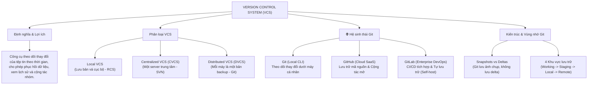
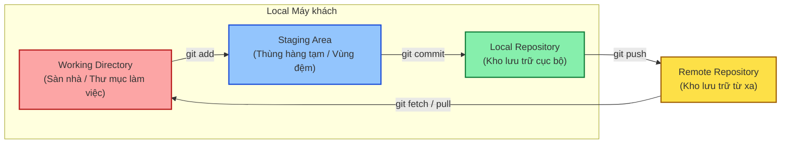

# NỀN TẢNG HỆ THỐNG QUẢN LÝ PHIÊN BẢN (VERSION CONTROL SYSTEM - VCS)

Tài liệu này hệ thống hóa các kiến thức nền tảng về Hệ thống quản lý phiên bản (VCS), so sánh chi tiết giữa Git, GitHub, GitLab, đồng thời phân tích kiến trúc vùng nhớ và quy trình làm việc cơ bản của Git.

---

## 1. SƠ ĐỒ TƯ DUY KIẾN THỨC NỀN TẢNG (VCS MINDMAP)

---

## 2. ĐỊNH NGHĨA & PHÂN LOẠI HỆ THỐNG QUẢN LÝ PHIÊN BẢN

### Định nghĩa VCS
**Hệ thống Quản lý Phiên bản (Version Control System - VCS)** là một công cụ phần mềm thiết yếu được thiết kế để theo dõi và ghi lại tất cả các thay đổi đối với tệp tin theo thời gian. Nó cho phép các nhà phát triển:
*   Dễ dàng quay trở lại các trạng thái hoạt động tốt trong quá khứ.
*   Khôi phục các tệp tin bị xóa hoặc bị hỏng.
*   So sánh sự khác biệt giữa các phiên bản để tìm ra nguyên nhân gây lỗi.
*   Cộng tác phát triển đồng thời trên cùng một mã nguồn mà không sợ ghi đè hoặc làm hỏng sản phẩm của nhau.

### Phân loại các hệ thống VCS

#### 1. Local VCS (Hệ thống quản lý phiên bản cục bộ)
*   **Cơ chế hoạt động:** Lưu trữ các cơ sở dữ liệu chứa tất cả các thay đổi (bản vá/patches) của tệp tin trực tiếp trên ổ đĩa của máy tính cục bộ.
*   **Ưu điểm:** Đơn giản, nhanh chóng, không cần kết nối mạng.
*   **Nhược điểm:** Cực kỳ rủi ro (nếu ổ cứng bị hỏng hoặc dữ liệu bị lỗi, toàn bộ lịch sử dự án sẽ biến mất). Không hỗ trợ cộng tác nhóm thực sự.
*   **Ví dụ tiêu biểu:** RCS (Revision Control System).

#### 2. Centralized VCS - CVCS (Hệ thống tập trung)
*   **Cơ chế hoạt động:** Sử dụng duy nhất một máy chủ trung tâm (Central Server) để lưu giữ toàn bộ các phiên bản và lịch sử của tệp tin. Các máy khách (clients) muốn chỉnh sửa sẽ thực hiện kết nối mạng và lấy phiên bản mới nhất ra (check out).
*   **Ưu điểm:** Quản lý quyền truy cập tập trung dễ dàng; giúp trưởng nhóm dễ dàng giám sát xem ai đang làm gì trên dự án.
*   **Nhược điểm:** Máy chủ trung tâm là điểm yếu duy nhất (Single Point of Failure). Nếu máy chủ bị sập hoặc gặp sự cố phần cứng trong vài giờ, không ai có thể làm việc, gửi mã nguồn hoặc lấy mã nguồn mới về. Nếu cơ sở dữ liệu trên máy chủ bị lỗi hỏng mà không có bản backup, toàn bộ lịch sử dự án sẽ mất sạch.
*   **Ví dụ tiêu biểu:** SVN (Subversion), Perforce.

#### 3. Distributed VCS - DVCS (Hệ thống phân tán)
*   **Cơ chế hoạt động:** Các máy khách không chỉ tải về phiên bản mới nhất của các tệp tin từ máy chủ mà họ **sao chép (clone) toàn bộ kho chứa (repository) bao gồm cả lịch sử đầy đủ của dự án** về máy cục bộ.
*   **Ưu điểm:** 
    *   **Làm việc ngoại tuyến (Offline):** Hầu hết các thao tác (commit, xem lịch sử, phân nhánh) diễn ra dưới máy local mà không cần internet.
    *   **An toàn tuyệt đối:** Mỗi máy khách cục bộ đóng vai trò là một bản sao lưu (backup) đầy đủ cho máy chủ trung tâm. Nếu server trung tâm bị hỏng hoàn toàn, bất kỳ máy khách nào cũng có thể đẩy bản sao lịch sử của mình lên để khôi phục lại server.
    *   **Tốc độ cực nhanh:** Các lệnh xem log hay commit chạy gần như ngay lập tức do không cần tương tác qua mạng.
*   **Ví dụ tiêu biểu:** **Git**, Mercurial.

---

## 3. LỊCH SỬ RA ĐỜI & LÝ DO XUẤT HIỆN CỦA GIT (THE ORIGIN OF GIT)

*   **Người sáng lập:** Được sáng lập bởi **Linus Torvalds** (cha đẻ của hệ điều hành Linux) vào năm **2005**.
*   **Bối cảnh ra đời:** 
    Trong quá trình phát triển nhân hệ điều hành Linux (Linux Kernel), cộng đồng đã sử dụng một công cụ quản lý mã nguồn độc quyền tên là **BitKeeper** được cấp phép miễn phí. Vào năm 2005, mối quan hệ giữa cộng đồng Linux và BitKeeper đổ vỡ, BitKeeper rút lại quyền sử dụng miễn phí này. Không hài lòng với các hệ thống VCS hiện có thời bấy giờ (như SVN hay CVS), Linus Torvalds đã tự thiết kế và viết ra Git chỉ trong vài tuần với triết lý: Tốc độ cao, phân tán 100%, an toàn dữ liệu và hỗ trợ hàng triệu file/commit đồng thời.
*   **Các vấn đề thực tế mà Git khắc phục (so với các VCS cũ như SVN):**
    1.  **Tránh điểm lỗi duy nhất (Single Point of Failure):** Trong các hệ thống tập trung (CVCS) như SVN, nếu máy chủ trung tâm bị sập hoặc mất điện, toàn bộ lập trình viên phải dừng làm việc (không thể commit hay xem lịch sử). Git giải quyết bằng cơ chế phân tán: Mỗi lập trình viên có một bản sao lưu (clone) đầy đủ lịch sử dự án dưới máy local, có thể làm việc ngoại tuyến 100% và khôi phục lại server bất cứ lúc nào.
    2.  **Tối ưu hóa cơ chế tạo nhánh (Branching) cực nhanh:** Trong SVN, tạo một nhánh mới đòi hỏi server phải copy toàn bộ thư mục dự án sang một thư mục mới (cực kỳ tốn dung lượng và thời gian). Git quản lý nhánh bằng các **Con trỏ (Pointers)** dung lượng 41 bytes trỏ thẳng đến mã băm của Commit. Việc tạo nhánh hay gộp nhánh (merge) trong Git diễn ra gần như lập tức trong thời gian hằng số $O(1)$.
    3.  **Bảo vệ tính toàn vẹn dữ liệu (Data Integrity):** Các VCS cũ không có cơ chế phát hiện file bị lỗi vật lý hay bị thay đổi nội dung ngầm trong quá trình truyền tải qua mạng. Git giải quyết bằng cách chạy thuật toán băm mật mã **SHA-1** cho tất cả các đối tượng (file, commit, cây thư mục). Bất kỳ thay đổi nhỏ nào đối với file đều làm thay đổi mã hash SHA-1 tương ứng, giúp phát hiện lỗi hoặc sự can thiệp dữ liệu lập tức.

---

## 4. PHÂN BIỆT: GIT - GITHUB - GITLAB

Nhiều lập trình viên mới bắt đầu thường nhầm lẫn giữa ba khái niệm này. Thực tế chúng nằm ở các lớp công nghệ và môi trường hoạt động hoàn toàn khác nhau:

| Môi trường | Máy tính cá nhân (Cục bộ) | Đám mây / Máy chủ doanh nghiệp (Từ xa) |
| :--- | :--- | :--- |
| **Công nghệ** | **Git (Local CLI)** | **GitHub** (Cloud SaaS / Public) **GitLab** (DevOps / Enterprise / Self-hosted) |
| **Vai trò** | Theo dõi và ghi lại các thay đổi cục bộ dưới máy cá nhân. | Lưu trữ, chia sẻ mã nguồn và cộng tác phát triển nhóm. |

### 1. Git (Hạt nhân công cụ)
*   **Định nghĩa:** Là phần mềm quản lý phiên bản phân tán cốt lõi (Core engine).
*   **Môi trường hoạt động:** Chạy cục bộ trên máy tính cá nhân của lập trình viên thông qua giao diện dòng lệnh (CLI) hoặc GUI Client.
*   **Khi nào sử dụng (When):** Luôn luôn sử dụng ở mọi dự án, bất kể bạn đang làm việc một mình hay làm việc nhóm, online hay offline. Git là nền tảng bắt buộc phải có để theo dõi lịch sử trước khi đưa code lên mây.

### 2. GitHub (Mạng xã hội mã nguồn mở)
*   **Định nghĩa:** Là một dịch vụ lưu trữ mã nguồn Git chạy trên nền tảng đám mây của Microsoft.
*   **Môi trường hoạt động:** Trên Internet (Cloud).
*   **Khi nào sử dụng (When):** Thích hợp nhất cho việc chia sẻ các dự án nguồn mở (Open-source), kết nối cộng đồng lập trình viên, xây dựng thương hiệu cá nhân, quản lý Pull Request trực quan, và tích hợp CI/CD ở mức độ cơ bản qua GitHub Actions.

### 3. GitLab (Nền tảng DevOps toàn diện cho doanh nghiệp)
*   **Định nghĩa:** Là dịch vụ lưu trữ mã nguồn Git tích hợp một nền tảng DevOps toàn diện từ lập kế hoạch, viết code, kiểm thử đến triển khai (CI/CD) và bảo mật.
*   **Môi trường hoạt động:** Trên đám mây (Cloud) hoặc trên máy chủ riêng của công ty (**Self-hosted / On-premise**).
*   **Khi nào sử dụng (When):** Khi làm việc trong môi trường doanh nghiệp yêu cầu bảo mật cao, cần tự quản lý máy chủ chứa code riêng (Self-hosted), hoặc dự án cần tích hợp hệ thống kiểm thử tự động và vận hành (DevOps CI/CD) sâu sắc và khép kín.

### Bảng so sánh trực quan

| Tiêu chí | Git | GitHub | GitLab |
| :--- | :--- | :--- | :--- |
| **Bản chất** | Công cụ phần mềm (Engine) | Nền tảng lưu trữ & Cộng tác đám mây | Nền tảng lưu trữ, DevOps & CI/CD doanh nghiệp |
| **Môi trường** | Máy tính cục bộ (Local) | Cloud (Internet) | Cloud & Server riêng của doanh nghiệp |
| **Cộng tác** | Qua mạng ngang hàng (P2P) | Cực mạnh trong cộng đồng mở (PR) | Tối ưu cho quy trình làm việc nhóm nội bộ |
| **Khả năng tự chạy (Self-hosted)** | Không áp dụng | Không hỗ trợ bản tự lưu trữ tự do | Hỗ trợ tuyệt đối mạnh mẽ |
| **Hệ thống CI/CD** | Không tích hợp sẵn | Có (GitHub Actions) | Tích hợp sâu sắc và mạnh mẽ bậc nhất |

---

## 5. KIẾN TRÚC & CÁC VÙNG NHỚ TRONG GIT (CORE ARCHITECTURE)

### Logic cốt lõi: Snapshots vs Deltas
Hầu hết các hệ thống VCS cũ (như SVN) tiếp cận dữ liệu dưới dạng **Deltas** (lưu trữ danh sách các thay đổi nhỏ lũy tiến của từng tệp tin).

Ngược lại, Git lưu trữ dữ liệu dưới dạng **Snapshots (Ảnh chụp nhanh)** của toàn bộ hệ thống tệp tin. Tại mỗi commit, Git "chụp" lại toàn bộ hình ảnh của dự án lúc đó.
*   Nếu tệp tin có thay đổi, Git sẽ nén và lưu trữ phiên bản mới của tệp.
*   Nếu tệp tin **không có thay đổi**, Git không nhân bản tệp đó lần nữa để tránh tốn dung lượng—nó chỉ đơn giản tạo ra một liên kết (link) trỏ đến tệp phiên bản cũ đã lưu ở commit trước.

### 4 Khu vực lưu trữ của Git
Git quản lý luồng dữ liệu thông qua 4 khu vực logic quan trọng:

1.  **Working Directory (Thư mục làm việc):** 
    *   Các tệp tin thực tế mà bạn đang nhìn thấy, thêm, sửa, xóa bằng trình soạn thảo mã nguồn (VS Code, Vim) trên máy tính của mình. 
    *   *Trạng thái tệp:* Có thể là **Untracked** (chưa theo dõi) hoặc **Modified** (đã chỉnh sửa nhưng chưa đưa vào vùng đệm).
2.  **Staging Area / Index (Vùng đệm tạm thời):**
    *   Đóng vai trò như một vùng chuẩn bị hàng. Nơi bạn thu gom các thay đổi cụ thể để chuẩn bị tạo một commit có tính nguyên tử (atomic).
    *   *Trạng thái tệp:* **Staged** (đã sẵn sàng để đóng gói).
3.  **Local Repository (Kho lưu trữ cục bộ):**
    *   Thư mục ẩn `.git` trên máy tính của bạn. Nơi Git lưu trữ vĩnh viễn dữ liệu lịch sử các phiên bản dưới dạng cơ sở dữ liệu đối tượng mã hóa.
    *   *Trạng thái tệp:* **Committed** (đã lưu vào lịch sử cục bộ).
4.  **Remote Repository (Kho lưu trữ từ xa):**
    *   Kho chứa lưu trên các máy chủ internet đám mây hoặc máy chủ công ty (GitHub/GitLab). Giúp các thành viên trong nhóm chia sẻ và đồng bộ hóa code.

---

## 6. QUY TRÌNH LÀM VIỆC CƠ BẢN HÀNG NGÀY (DAILY WORKFLOW)

Vòng đời làm việc cơ bản hàng ngày của lập trình viên với Git thường xoay quanh các lệnh sau:

### Bảng các lệnh cơ bản

| Lệnh | Vai trò | Hướng di chuyển của dữ liệu |
| :--- | :--- | :--- |
| **`git init`** | Khởi tạo một kho chứa Git trống tại thư mục hiện tại. | Khởi tạo thư mục ẩn `.git` |
| **`git clone <url>`** | Nhân bản (sao chép) toàn bộ kho chứa từ xa về máy cục bộ. | Remote Repo $\rightarrow$ Local Repo |
| **`git status`** | Kiểm tra trạng thái của các tệp tin trong các khu vực lưu trữ. | Kiểm tra Working & Staging |
| **`git add <file>`** | Đưa tệp tin từ thư mục làm việc vào vùng đệm tạm thời. | Working Dir $\rightarrow$ Staging Area |
| **`git commit -m "msg"`**| Đóng gói và lưu trữ vĩnh viễn các file ở vùng đệm vào lịch sử local. | Staging Area $\rightarrow$ Local Repo |
| **`git fetch`** | Tải các commit mới từ remote về nhưng chưa trộn vào code đang viết. | Remote Repo $\rightarrow$ Local Repo |
| **`git merge <branch>`** | Gộp các commit của một nhánh khác vào nhánh hiện tại. | Trộn lịch sử các nhánh |
| **`git pull`** | Kéo và gộp trực tiếp code mới nhất từ remote vào thư mục làm việc. | Remote $\rightarrow$ Working Dir (Fetch + Merge) |
| **`git push`** | Đẩy các commit cục bộ lên máy chủ từ xa. | Local Repo $\rightarrow$ Remote Repo |

### Phân biệt rõ ràng: Pull vs Fetch
*   **`git fetch`:** Chỉ tải lịch sử, thông tin về các nhánh và commit mới trên Remote về Local Repository của bạn. Nó không hề chạm vào hay thay đổi bất kỳ dòng code nào trong thư mục làm việc của bạn. Rất an toàn để kiểm tra xem trên mạng có gì mới.
*   **`git pull`:** Thực hiện đồng thời cả hai lệnh: `git fetch` (tải lịch sử) và tự động chạy `git merge` để trộn các thay đổi đó trực tiếp vào code bạn đang viết. Có thể xảy ra xung đột (conflict) ngay lập tức nếu code local và code remote khác nhau trên cùng một dòng.
