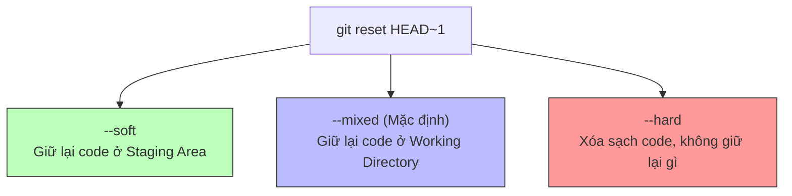
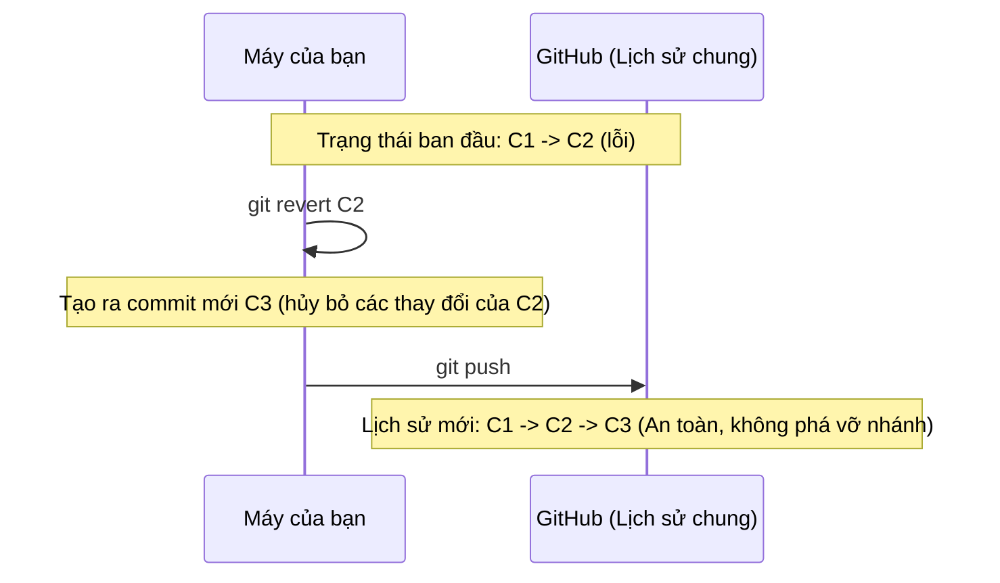

# Cẩm Nang Xử Lý Sự Cố & Tình Huống Git Thực Tế

Trong quá trình làm việc với Git, chúng ta thường xuyên gặp phải những tình huống muốn hoàn tác (undo), sửa đổi lịch sử commit hoặc gộp các commit để lịch sử dự án gọn gàng hơn. Tài liệu này cung cấp các giải pháp chi tiết cho các tình huống từ cơ bản đến nâng cao, phân tích ưu/nhược điểm và hướng dẫn cách lựa chọn phương án tối ưu nhất.

---

## Bảng Tra Cứu Nhanh Các Tình Huống

| Vị trí hiện tại của file/commit | Tình huống | Câu lệnh xử lý chính | Mức độ an toàn |
| :--- | :--- | :--- | :--- |
| **Working Directory** (Chưa add) | Muốn hủy bỏ toàn bộ thay đổi trong file | `git restore <file>` | ⚠️ Nguy hiểm (Mất code) |
| **Staging Area** (Đã `git add`) | Muốn rút file ra khỏi Staging Area | `git restore --staged <file>` | ✅ Rất an toàn |
| **Local Repo** (Đã `git commit`) | Chỉ muốn sửa tin nhắn commit gần nhất | `git commit --amend -m "tin nhắn mới"` | ✅ An toàn |
| **Local Repo** (Đã `git commit`) | Muốn sửa đổi lịch sử commit cục bộ | `git reset --soft` / `--mixed` / `--hard` | ⚠️ Tùy thuộc vào tham số |
| **Remote Repo** (Đã `git push`) | Muốn hoàn tác một commit một cách an toàn | `git revert <commit_id>` | ✅ Rất an toàn (Teamwork) |
| **Remote Repo** (Đã `git push`) | Muốn xóa sạch commit trên cả Remote | `git reset` + `git push --force-with-lease` | 🚨 Nguy hiểm (Phá hủy lịch sử) |
| **Nhiều Commits** | Muốn gộp nhiều commit lặt vặt lại | `git rebase -i HEAD~N` (Squash/Fixup) | ⚠️ Cần cẩn thận khi sửa lịch sử |

---

## 1. Đã `git add` (Staging Area), làm sao để rút file ra?

### Thực tế cuộc sống
Bạn vô tình chạy `git add .` và nhặt nhầm cả các file rác (như file log, file cấu hình cá nhân hoặc các file chưa code xong) vào "thùng carton" (Staging Area). Bạn muốn đưa các file này trở lại "sàn nhà" (Working Directory) để chỉnh sửa tiếp mà không muốn chúng xuất hiện trong commit tiếp theo.

### Các cách xử lý

#### Cách 1: Sử dụng `git restore` (Khuyên dùng cho Git 2.23+)
```bash
git restore --staged <tên_file>
# Hoặc rút toàn bộ thư mục hiện tại ra:
git restore --staged .
```
- **Cơ chế**: Lệnh này chỉ tác động lên **Staging Area**, đưa trạng thái của file tại Staging Area về giống với commit gần nhất (`HEAD`).
- **Trạng thái code**: Phần code bạn đã viết trong file vẫn giữ nguyên vẹn trong Working Directory.

#### Cách 2: Sử dụng `git reset` (Cách truyền thống / Git cũ)
```bash
git reset HEAD <tên_file>
```
- **Cơ chế**: Hoàn toàn giống với `git restore --staged`. Lệnh này bỏ theo dõi (unstage) file khỏi commit tiếp theo.
- **Sự khác biệt**:
  - `git reset` là một lệnh đa năng và hơi "quá tải" (overloaded) vì nó vừa dùng để reset commit, vừa dùng để unstage file.
  - Từ phiên bản Git 2.23, cộng đồng Git đã tách chức năng unstage ra thành `git restore --staged` để cú pháp tường minh và trực quan hơn đối với lập trình viên.

---

## 2. Đã `git commit` (Local Repo), làm sao để hủy hoặc sửa?

### Thực tế cuộc sống
Bạn đã nhấn nút "đóng thùng hàng" (commit) và dán băng keo. Nhưng ngay sau đó bạn phát hiện ra:
- Viết sai chính tả trong tin nhắn commit (commit message).
- Quên chưa lưu/add một file quan trọng vào commit đó.
- Commit nhầm file hoặc muốn làm lại hoàn toàn từ đầu.

### Các cách xử lý

#### Tình huống A: Chỉ muốn sửa tin nhắn commit hoặc thêm file vào commit gần nhất
```bash
# Bước 1: Lưu file bị quên (nếu có)
git add <file_bị_quên>

# Bước 2: Gộp file đó và sửa tin nhắn commit
git commit --amend -m "Tin nhắn mới chuẩn xác hơn"

# Hoặc nếu không muốn đổi tin nhắn, chỉ muốn nhét thêm file:
git commit --amend --no-edit
```
> [!NOTE]
> **Bản chất**: Lệnh `--amend` không thực sự sửa commit cũ, mà nó sẽ **thay thế hoàn toàn** commit cũ bằng một commit mới có mã băm (SHA-1 hash) mới.

---

#### Tình huống B: Muốn hủy bỏ hoàn toàn commit vừa tạo (Sử dụng `git reset`)
Bạn có 3 chế độ reset chính. Việc lựa chọn chế độ nào phụ thuộc vào việc bạn muốn làm gì với phần code đã viết trong commit đó:



##### So sánh chi tiết các chế độ Reset:

| Chế độ Reset | Lịch sử Commit | Trạng thái Staging Area | Trạng thái Working Directory | Khi nào nên dùng? |
| :--- | :--- | :--- | :--- | :--- |
| **`--soft`** | Bị xóa (HEAD lùi lại 1) | **Giữ nguyên** (Các file đã add vẫn nằm ở Staging) | **Giữ nguyên** (Code không mất) | Bạn muốn gộp commit vừa rồi với các thay đổi tiếp theo, hoặc chỉ muốn sửa đổi nhẹ trước khi commit lại. |
| **`--mixed`** *(Mặc định)* | Bị xóa (HEAD lùi lại 1) | **Bị dọn sạch** (Trở về trạng thái chưa `git add`) | **Giữ nguyên** (Code không mất, nằm ở dạng file chưa staged) | Bạn muốn tổ chức lại việc `git add` cho các file, chia nhỏ commit lớn vừa tạo thành các commit nhỏ hơn. |
| **`--hard`** | Bị xóa (HEAD lùi lại 1) | **Bị dọn sạch** | **Bị dọn sạch** (Mọi thay đổi trong commit và file chưa commit đều biến mất) | 🚨 **Cực kỳ nguy hiểm!** Chỉ dùng khi bạn chắc chắn muốn vứt bỏ hoàn toàn code vừa viết và quay về trạng thái sạch sẽ của commit trước đó. |

**Cú pháp thực thi:**
```bash
# Reset về trước đó 1 commit
git reset --soft HEAD~1
git reset --mixed HEAD~1
git reset --hard HEAD~1

# Reset về một mã commit cụ thể trong quá khứ
git reset --soft <commit_hash>
```

---

## 3. Đã `git push` lên Remote (GitHub), làm sao để xóa hoặc quay lại?

### Thực tế cuộc sống
Thùng hàng đã được gửi ra bưu điện (GitHub). Bây giờ bạn phát hiện code trên nhánh chung bị lỗi nặng và cần rút lại commit đó để dự án của cả team không bị gián đoạn.

### Các cách xử lý

#### Cách 1: Sử dụng `git revert` (Cực kỳ an toàn - Khuyên dùng cho Teamwork)
```bash
git revert <commit_hash>
```
- **Cơ chế**: Lệnh này không xóa commit bị lỗi khỏi lịch sử. Thay vào đó, nó tạo ra một **commit mới** có nội dung hoàn toàn ngược lại (nghịch đảo) với commit lỗi nhằm triệt tiêu các thay đổi của commit đó.
- **Tại sao an toàn?**:
  - Không viết lại lịch sử commit (không thay đổi các mã băm cũ).
  - Khi push lên GitHub, các thành viên khác chỉ cần `git pull` bình thường mà không bị xung đột lịch sử (non-fast-forward conflict).



---

#### Cách 2: Sử dụng `git reset` + `git push --force` (Nguy hiểm - Chỉ dùng khi làm việc một mình)
Nếu bạn lỡ push mã bảo mật (API key, password) lên repo công khai và bắt buộc phải xóa sạch commit đó khỏi lịch sử để tránh bị lộ.

```bash
# Bước 1: Reset cục bộ về commit an toàn trước đó
git reset --hard <commit_an_toàn_hash>

# Bước 2: Ép buộc GitHub cập nhật theo máy của bạn
git push origin <tên_nhánh> --force
```

> [!CAUTION]
> **Rủi ro cực lớn**: Nếu các thành viên khác đã `pull` commit lỗi đó về máy của họ, việc bạn dùng `--force` sẽ làm lịch sử ở máy họ bị lệch với GitHub. Khi họ push code mới lên, hệ thống sẽ gặp lỗi nghiêm trọng và rất dễ dẫn đến mất mát code của người khác.

##### Giải pháp thông minh hơn: `--force-with-lease`
Thay vì sử dụng `--force`, hãy luôn ưu tiên sử dụng:
```bash
git push origin <tên_nhánh> --force-with-lease
```
- **Cơ chế bảo vệ**: Lệnh này chỉ thực hiện ép buộc push nếu **không có ai khác** push thêm code lên nhánh đó kể từ lần cuối bạn `fetch`. Nếu có người khác đã push code mới lên, Git sẽ từ chối đè lịch sử, giúp bảo vệ code của đồng đội không bị bạn vô tình xóa mất.

---

## 4. Gộp các commit lại với nhau (Squash Commits)

### Thực tế cuộc sống
Trong quá trình làm tính năng, bạn thường commit rất nhiều lần với những tin nhắn vô nghĩa như "sửa lỗi typo", "thử lại lần 2", "fix bug". Trước khi gộp nhánh tính năng vào nhánh chính (`main`), bạn muốn làm sạch lịch sử bằng cách gom tất cả các commit nhỏ đó thành một commit duy nhất có ý nghĩa (ví dụ: "Feature: Tích hợp thanh toán Stripe").

### Các cách xử lý

#### Cách 1: Sử dụng Interactive Rebase (Gom các commit cục bộ trước khi push)
Giả sử bạn có 4 commit chưa push và muốn gộp chúng lại:
```bash
git rebase -i HEAD~4
```
Git sẽ mở ra một giao diện soạn thảo văn bản (thường là Vim hoặc VS Code) hiển thị danh sách 4 commit gần nhất từ cũ đến mới:

```text
pick a1b2c3d Thêm giao diện nút thanh toán
pick e5f6g7h Sửa màu nút sang màu xanh
pick i9j0k1l Fix lỗi click đúp
pick m3n4o5p Hoàn thiện giao diện thanh toán
```

Để gộp commit số 2, 3, 4 vào commit số 1, hãy đổi chữ `pick` thành `squash` (hoặc viết tắt là `s`) trước các commit đó:

```text
pick a1b2c3d Thêm giao diện nút thanh toán
squash e5f6g7h Sửa màu nút sang màu xanh
squash i9j0k1l Fix lỗi click đúp
squash m3n4o5p Hoàn thiện giao diện thanh toán
```

- **Lưu và đóng trình soạn thảo**: Git sẽ gộp nội dung thay đổi của cả 4 commit lại và mở tiếp một cửa sổ để bạn đặt tên cho commit gộp duy nhất này.
- **Sự khác biệt giữa `squash` và `fixup`**:
  - `squash` (hoặc `s`): Gộp code và **giữ lại tin nhắn** của các commit phụ để bạn biên soạn lại.
  - `fixup` (hoặc `f`): Gộp code nhưng **vứt bỏ hoàn toàn tin nhắn** của các commit phụ, chỉ giữ lại tin nhắn của commit đầu tiên (commit `pick`). Rất tiện khi các commit sau chỉ là sửa lỗi vặt.

---

#### Cách 2: Sử dụng `git merge --squash` (Gom toàn bộ nhánh khi merge)
Nếu bạn không muốn rebase từng commit thủ công trên nhánh tính năng, bạn có thể thực hiện gộp toàn bộ lịch sử nhánh đó khi merge vào nhánh chính:

```bash
# Đang đứng ở nhánh main
git checkout main

# Merge nhánh feature và gom tất cả commit của nó thành 1 thay đổi chưa commit trên main
git merge --squash feature-branch

# Tạo commit gộp duy nhất
git commit -m "Feature: Hoàn thành tính năng thanh toán Stripe"
```
- **Ưu điểm**: Cực kỳ nhanh chóng, không cần tương tác phức tạp. Nhánh phụ vẫn giữ nguyên lịch sử chi tiết ban đầu (nếu cần tra cứu lại), trong khi nhánh chính có một lịch sử commit cực kỳ tuyến tính và sạch sẽ.
- **Nhược điểm**: Lịch sử chi tiết của nhánh tính năng bị ẩn đi hoàn toàn trên nhánh chính, khiến việc `git blame` tìm người gây lỗi sau này khó khăn hơn do mọi thay đổi hiển thị dưới tên người thực hiện merge squash.

---

## 5. Các tình huống oái oăm khác thường gặp

### Tình huống 5: Lỡ commit thẳng vào nhánh `main` thay vì nhánh tính năng
Bạn đang hí hửng viết code và commit, chợt nhận ra mình đang đứng ở nhánh `main` (nhánh cấm commit trực tiếp).

#### Cách giải quyết (Chỉ áp dụng khi CHƯA push):
```bash
# Bước 1: Tạo một nhánh tính năng mới từ commit hiện tại (nhánh này sẽ giữ lấy commit của bạn)
git branch feature-tuy-chinh

# Bước 2: Quay ngược nhánh main cục bộ về commit trước đó 1 bước
git reset --hard HEAD~1

# Bước 3: Chuyển sang nhánh tính năng mới tạo để tiếp tục làm việc
git checkout feature-tuy-chinh
```

---

### Tình huống 6: Đang code dở dang thì phải chuyển sang nhánh khác sửa lỗi gấp
Bạn đang viết dở một tính năng (code chưa hoàn thiện nên không muốn commit tạo rác lịch sử), đột nhiên sếp yêu cầu chuyển sang nhánh `hotfix` để sửa một lỗi nghiêm trọng trên Production.

#### Cách giải quyết: Sử dụng `git stash` (Cất đồ vào tủ)
```bash
# Bước 1: Lưu tạm toàn bộ thay đổi chưa commit vào một vùng nhớ tạm (stash)
git stash

# Bước 2: Bây giờ thư mục làm việc đã sạch sẽ. Bạn thoải mái chuyển nhánh sửa lỗi
git checkout hotfix
# (Tiến hành sửa lỗi, commit, push...)

# Bước 3: Quay trở lại nhánh cũ
git checkout feature-branch

# Bước 4: Lấy lại phần code đang viết dở ra để làm tiếp
git stash pop
```
> [!TIP]
> Lệnh `git stash pop` sẽ lấy phần code ra và xóa nó khỏi tủ đồ tạm. Nếu muốn lấy ra nhưng vẫn giữ bản sao trong tủ đồ, hãy dùng `git stash apply`.

---

### Tình huống 7: Lỡ tay chạy `git reset --hard` làm mất sạch code chưa push
Bạn lỡ tay chạy `git reset --hard HEAD~5` và thấy toàn bộ các commit cục bộ cùng code viết trong vài ngày qua biến mất. Bạn hoảng loạn vì nghĩ đã mất sạch.

#### Cách cứu cánh: Sử dụng `git reflog` (Nhật ký hành trình của Git)
Git lưu lại nhật ký của mọi hành động di chuyển con trỏ `HEAD` (chuyển nhánh, reset, commit...) trong một file đặc biệt gọi là reflog.

```bash
# Bước 1: Xem nhật ký di chuyển của HEAD
git reflog
```
Bạn sẽ nhìn thấy một danh sách như thế này:
```text
107ce20 (HEAD -> main) HEAD@{0}: reset: moving to HEAD~5
3bc4a4e HEAD@{1}: commit: feat(practice): add validPalindrome.java
613828a HEAD@{2}: commit: feat(practice): rename variables in twoSum.java
```
Mã băm `3bc4a4e` chính là commit trước khi bạn thực hiện cú reset định mệnh đó.

```bash
# Bước 2: Di chuyển HEAD quay trở lại commit đó để lấy lại toàn bộ code
git reset --hard 3bc4a4e
```
Code của bạn đã quay trở lại như chưa hề có cuộc chia ly!
