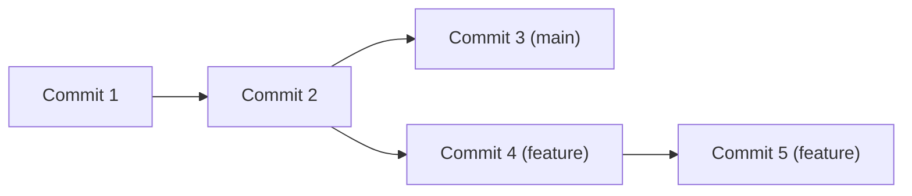
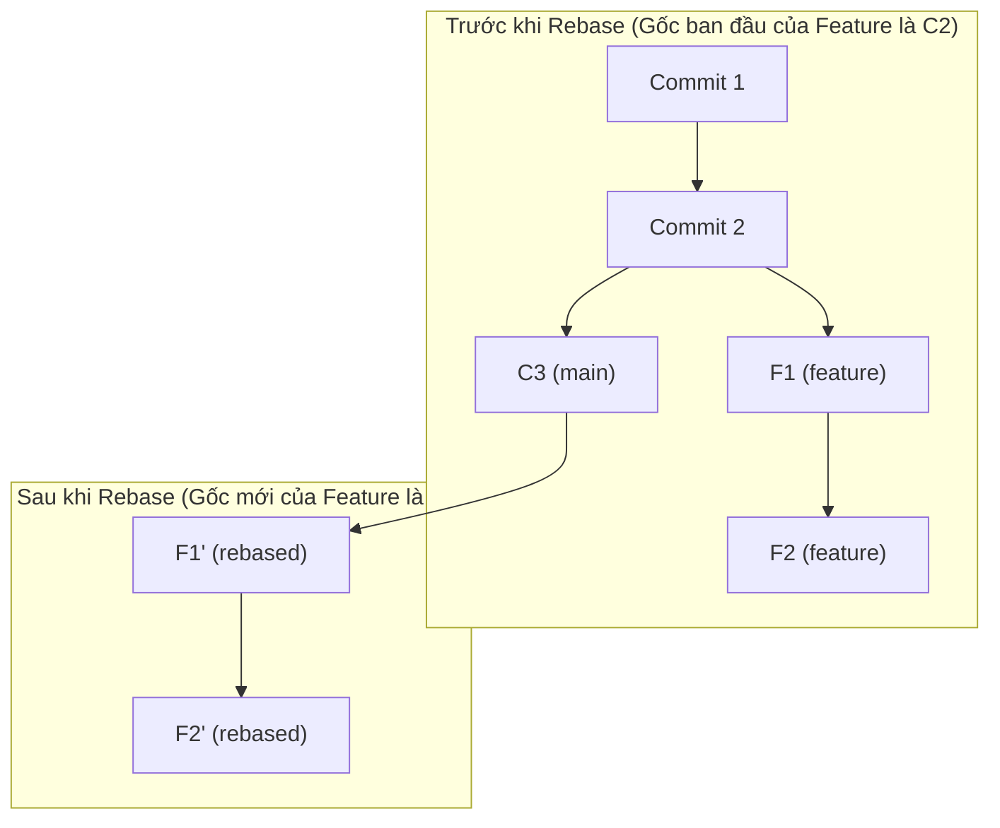
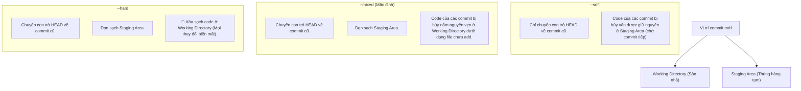

# Cẩm Nang Giải Quyết Sự Cố & Quản Lý Nhánh Git (1.1 - 1.10)

Tài liệu này tổng hợp chi tiết các kiến thức cốt lõi và hướng dẫn thực hành xử lý 10 tình huống thực tế thường gặp khi sử dụng Git để quản lý mã nguồn và làm việc nhóm.

---

## 1.1 Thế nào là Repository, Branch?

### 1. Repository (Kho chứa / Repo)
Repository là nơi lưu trữ toàn bộ dữ liệu dự án của bạn, bao gồm các tệp tin, thư mục và quan trọng nhất là **lịch sử thay đổi** (mọi commit, branch, tag).
- **Local Repository**: Kho chứa nằm cục bộ trên ổ cứng máy tính cá nhân của bạn (trong thư mục ẩn `.git`).
- **Remote Repository**: Kho chứa được đặt trên một máy chủ từ xa dùng chung cho cả nhóm (như GitHub, GitLab, Bitbucket).

### 2. Branch (Nhánh)
Branch thực chất chỉ là một **con trỏ di động** trỏ đến một commit cụ thể trong lịch sử. Nó cho phép bạn tách khỏi nhánh phát triển chính (ví dụ: `main`/`master`) để viết tính năng mới hoặc sửa lỗi mà không sợ làm hỏng code hiện tại.


- Khi bạn commit trên nhánh `feature`, con trỏ nhánh `feature` sẽ tự động tịnh tiến lên commit mới, trong khi con trỏ nhánh `main` vẫn đứng yên ở commit cũ.

---

## 1.2 Làm thế nào để xóa một branch ở local, làm thế nào để xóa một branch remote?

### 1. Xóa một branch ở Local
Để xóa nhánh trên máy cục bộ của bạn, trước hết bạn phải chuyển sang một nhánh khác nhánh muốn xóa (ví dụ chuyển sang `main`):
```bash
git checkout main # hoặc git switch main
```

Sau đó sử dụng lệnh:
- **Xóa an toàn (`-d` / `--delete`)**:
  ```bash
  git branch -d <tên_nhánh>
  ```
  *Lưu ý*: Lệnh này chỉ thành công khi nhánh đó đã được merge vào nhánh chính (`main`/`master`). Nếu nhánh chứa các commit chưa merge, Git sẽ từ chối để tránh mất code.
- **Ép buộc xóa (`-D` / `-d --force`)**:
  ```bash
  git branch -D <tên_nhánh>
  ```
  *Lưu ý*: Lệnh này sẽ xóa nhánh ngay lập tức bất kể nó đã được merge hay chưa. Chỉ dùng khi chắc chắn muốn vứt bỏ các thay đổi trên nhánh đó.

### 2. Xóa một branch trên Remote
Để xóa nhánh trên server chung (ví dụ GitHub), sử dụng lệnh:
```bash
git push origin --delete <tên_nhánh>
# Hoặc cú pháp cũ viết tắt (dấu hai chấm trước tên nhánh):
git push origin :<tên_nhánh>
```
Lệnh này báo cho server xóa con trỏ nhánh đó đi. Code trên remote của nhánh đó sẽ biến mất khỏi server chung.

---

## 1.3 Xóa local branch và remote branch lưu ở local (Remote-Tracking Branch)

### Vấn đề thực tế
Khi một ai đó xóa nhánh `feature-A` trực tiếp trên GitHub, hoặc bạn đã chạy lệnh xóa nhánh remote ở mục 1.2, thì trong danh sách các nhánh remote trên máy bạn (gọi là **remote-tracking branches**, thường có dạng `origin/feature-A`) vẫn còn tồn tại. Khi chạy `git branch -a`, bạn vẫn thấy tên nhánh đó, gây rối mắt.

### Cách giải quyết (Pruning)
Bạn cần dọn dẹp các tham chiếu remote-tracking đã lỗi thời (stale references) bằng lệnh:
```bash
# Đồng bộ và xóa toàn bộ các remote-tracking branch không còn tồn tại trên server
git fetch --prune

# Hoặc chỉ dọn dẹp riêng một remote cụ thể:
git remote prune origin
```
> [!TIP]
> Bạn có thể cấu hình để Git tự động dọn dẹp mỗi khi bạn chạy lệnh `git fetch` hoặc `git pull` bằng lệnh cấu hình global:
> `git config --global fetch.prune true`

---

## 1.4 Xóa remote branch

*(Nội dung chi tiết đã được trình bày và thống nhất tại mục **1.2.2** ở trên. Cú pháp chính là: `git push origin --delete <tên_nhánh>`)*.

---

## 1.5 Làm thế nào để push một branch ở local lên remote dưới một cái tên khác?

### Thực tế cuộc sống
Bạn đang làm việc ở nhánh cục bộ tên là `dev-nghia`, nhưng theo quy định của dự án, nhánh trên GitHub phải có tên là `feature-payment`. Bạn muốn đẩy code từ `dev-nghia` lên remote nhưng đổi tên nhánh nhận thành `feature-payment`.

### Cách thực hiện
Sử dụng cú pháp dấu hai chấm (`local_branch:remote_branch`):
```bash
git push origin dev-nghia:feature-payment
```
- **Ý nghĩa**: Đẩy commit từ nhánh `dev-nghia` dưới máy lên nhánh `feature-payment` trên remote `origin`. Nếu nhánh `feature-payment` chưa tồn tại trên remote, Git sẽ tự động tạo mới nhánh đó.

---

## 1.6 Thế nào là Git Rebase? Phân biệt Rebase với Merge?

### 1. Khái niệm Rebase
Rebase là hành động "đặt lại gốc" cho nhánh. Nó lấy toàn bộ các commit mới trên nhánh hiện tại, lưu tạm lại, sau đó di chuyển gốc của nhánh hiện tại sang commit mới nhất của nhánh đích (ví dụ `main`), rồi lần lượt áp dụng (re-apply) các commit tạm thời kia lên gốc mới đó.



### 2. So sánh chi tiết: Rebase vs Merge

| Đặc điểm | Git Merge | Git Rebase |
| :--- | :--- | :--- |
| **Cơ chế hoạt động** | Tạo ra một **Merge Commit** mới gộp chung thay đổi của 2 nhánh. | Di chuyển gốc nhánh con lên đầu nhánh cha, viết lại lịch sử commit. |
| **Lịch sử Commit** | Giữ nguyên lịch sử thực tế theo trình tự thời gian (nhìn như mạng nhện). | Tạo ra một lịch sử **tuyến tính, thẳng tắp**, cực kỳ sạch sẽ. |
| **Giải quyết xung đột (Conflict)** | Giải quyết tất cả xung đột **chỉ 1 lần duy nhất** trong Merge Commit. | Phải giải quyết xung đột **từng commit một** trong quá trình rebase. |
| **Mã băm Commit (SHA-1)** | Giữ nguyên mã băm của các commit cũ. | Thay đổi hoàn toàn mã băm của các commit được rebase. |
| **Quy tắc vàng (Golden Rule)** | Sử dụng thoải mái mọi nơi, kể cả các nhánh công khai. | 🚨 **Không bao giờ dùng** rebase trên các nhánh đã push lên Remote và có người khác đang dùng chung. |

---

## 1.7 Thế nào là Git Stash?

### Khái niệm
Git Stash đóng vai trò như một **tủ đồ tạm thời**. Nó cho phép bạn cất giấu toàn bộ các thay đổi chưa commit (cả file đã staged và chưa staged) vào một ngăn xếp (stack), đưa thư mục làm việc của bạn trở lại trạng thái sạch sẽ (`HEAD`). 

### Quy trình lệnh quản lý Stash

1. **Cất code đang viết dở**:
   ```bash
   git stash
   # Hoặc lưu kèm ghi chú để dễ nhớ:
   git stash save "Đang làm dở tính năng payment"
   ```
2. **Xem danh sách tủ đồ**:
   ```bash
   git stash list
   # Kết quả dạng: stash@{0}: On feature: Đang làm dở...
   ```
3. **Lấy code ra để làm tiếp**:
   - **Cách 1: Lấy ra và xóa khỏi tủ (`pop`)**:
     ```bash
     git stash pop
     # Mặc định lấy phần tử trên cùng stash@{0}.
     ```
   - **Cách 2: Lấy ra nhưng vẫn giữ bản sao trong tủ (`apply`)**:
     ```bash
     git stash apply stash@{0}
     ```
4. **Xóa tủ đồ**:
   - Xóa một stash cụ thể: `git stash drop stash@{0}`
   - Dọn sạch toàn bộ stash: `git stash clear`

---

## 1.8 Làm thế nào xóa bỏ trạng thái của một vài commit gần đây?

Khi bạn muốn hủy bỏ/xóa đi trạng thái của một số commit vừa tạo, bạn cần phân biệt rõ hai trường hợp:

### Trường hợp A: Commit CHƯA push lên mạng (Local Commit)
Sử dụng lệnh `git reset` trỏ về commit an toàn cũ.
```bash
# Xóa bỏ trạng thái của 3 commit gần nhất nhưng GIỮ LẠI CODE trong máy
git reset --mixed HEAD~3

# Xóa bỏ trạng thái của 3 commit gần nhất và XÓA SẠCH CODE
git reset --hard HEAD~3
```

### Trường hợp B: Commit ĐÃ push lên mạng (Remote Commit)
- **Cách 1: An toàn (Teamwork)**: Dùng `git revert`. Nó sẽ tạo các commit mới có nội dung ngược lại để phủ định các commit lỗi, giữ nguyên lịch sử chung.
  ```bash
  # Revert commit lỗi gần nhất
  git revert HEAD
  ```
- **Cách 2: Ghi đè (Chỉ dùng khi làm một mình)**: Dùng `git reset` ở local để lùi lịch sử, sau đó push ép buộc lên remote.
  ```bash
  git reset --hard HEAD~3
  git push origin <tên_nhánh> --force-with-lease
  ```

---

## 1.9 Làm thế nào để gộp một vài commit thành 1 commit duy nhất?

Có hai phương pháp phổ biến để gom (squash) nhiều commit lặt vặt lại với nhau:

### Cách 1: Sử dụng Interactive Rebase (Gộp trước khi push)
Để gộp 4 commit gần nhất cục bộ:
```bash
git rebase -i HEAD~4
```
Git hiển thị danh sách từ cũ đến mới. Giữ commit đầu tiên là `pick`, chuyển các commit sau thành `squash` (hoặc `s`):
```text
pick a1b2c3d Thêm giao diện nút thanh toán
squash e5f6g7h Sửa màu nút sang màu xanh
squash i9j0k1l Fix lỗi click đúp
squash m3n4o5p Hoàn thiện giao diện thanh toán
```
Lưu file, Git sẽ tự động gom code lại và cho phép bạn đặt một tin nhắn commit duy nhất cho cả cụm thay đổi đó.

### Cách 2: Sử dụng `git merge --squash` (Gộp khi merge nhánh)
Khi bạn muốn gộp toàn bộ lịch sử commit của nhánh `feature` thành 1 commit duy nhất trên nhánh `main` lúc merge:
```bash
git checkout main
git merge --squash feature
git commit -m "Feature: Hoàn thiện chức năng thanh toán"
```
Nhánh `main` chỉ nhận 1 commit mới duy nhất, giúp lịch sử trên `main` cực kỳ gọn gàng.

---

## 1.10 Phân biệt Git Reset, Git Reset --hard, Git Reset --soft

Lệnh `git reset` dịch chuyển con trỏ nhánh hiện tại và HEAD về một commit khác trong lịch sử. Độ ảnh hưởng của nó lên dự án được quyết định bởi 3 tham số:



### Bảng so sánh tác động trực quan:

| Tham số Reset | Dịch chuyển HEAD & Branch? | Giữ lại code ở Staging Area? | Giữ lại code ở Working Directory? | Mức độ nguy hiểm |
| :--- | :--- | :--- | :--- | :--- |
| **`--soft`** | ✅ Có | ✅ Có (Code nằm sẵn ở Staging, chỉ cần chạy lại `git commit`) | ✅ Có | 🟢 Rất an toàn |
| **`--mixed`** | ✅ Có | ❌ Không (Các file bị unstage về trạng thái ban đầu) | ✅ Có (Code nằm ở sàn nhà, cần chạy lại `git add`) | 🟢 An toàn |
| **`--hard`** | ✅ Có | ❌ Không | ❌ Không (Code bị xóa sạch không dấu vết) | 🔴 Cực kỳ nguy hiểm |
