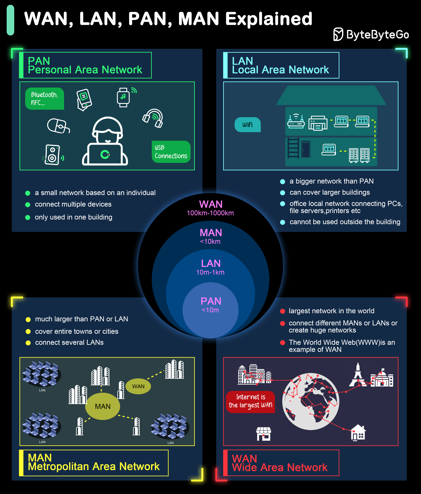

# INTERNET FUNDAMENTALS - THE BIG PICTURE

## 📝 Nội dung chi tiết (Phần 1)

### 1. Bản chất & Sự ra đời

- **Định nghĩa:** Internet là mạng lưới chung toàn cầu, nơi các thiết bị giao tiếp với nhau bằng các quy tắc chung gọi là **Protocol (Giao thức)**.
- **Lịch sử:** Xuất phát từ dự án **ARPANET** (DARPA - Mỹ) những năm 1960.
- **Tầm nhìn:** Xây dựng một hệ thống có tính "nguyên tử" và độc lập, tránh sự sụp đổ dây chuyền (domino) nếu một bộ phận bị phá hủy.

### 2. Tầm quan trọng đối với Lập trình viên

- Hầu hết các sản phẩm công nghệ hiện nay đều vận hành trên nền tảng Internet.
- Việc hiểu rõ cấu trúc mạng giúp lập trình viên:
  - **Tối ưu hóa:** Cải thiện tốc độ tải và hiệu năng.
  - **Debug:** Dễ dàng tìm ra lỗi nằm ở tầng nào (Client, Network, hay Server).
  - **Bản chất:** Nắm rõ cách dữ liệu di chuyển để thiết kế hệ thống tốt hơn.

### 3. Phân loại Mạng theo quy mô địa lý

| Loại mạng | Tên đầy đủ                | Phạm vi           | Đặc điểm                                                            |
| :-------- | :------------------------ | :---------------- | :------------------------------------------------------------------ |
| **PAN**   | Personal Area Network     | Vài mét           | Kết nối thiết bị cá nhân (Bluetooth).                               |
| **LAN**   | Local Area Network        | Nhà, văn phòng    | Tốc độ cao, độ trễ thấp. (Gồm cả WLAN/Wi-Fi).                       |
| **MAN**   | Metropolitan Area Network | Thành phố         | Kết nối nhiều mạng LAN lại với nhau.                                |
| **WAN**   | Wide Area Network         | Quốc gia, Lục địa | Độ trễ cao do khoảng cách. **Internet chính là mạng WAN lớn nhất.** |

