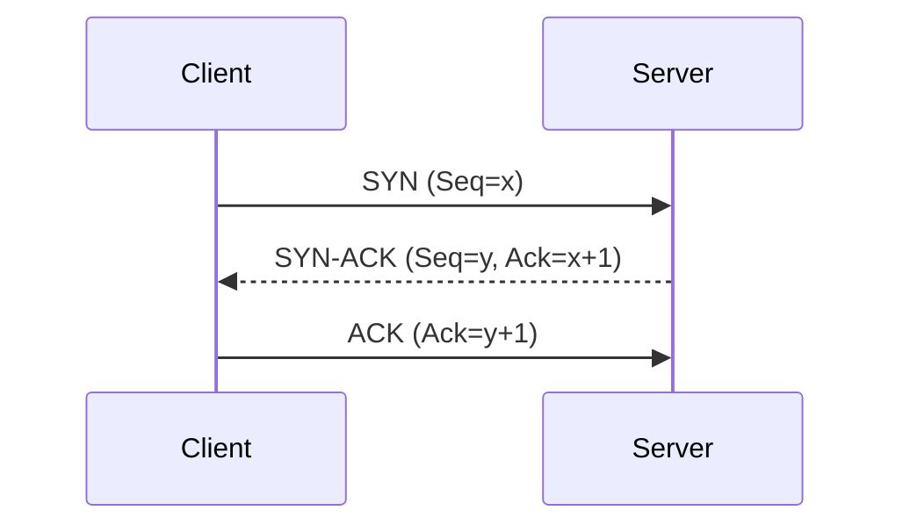
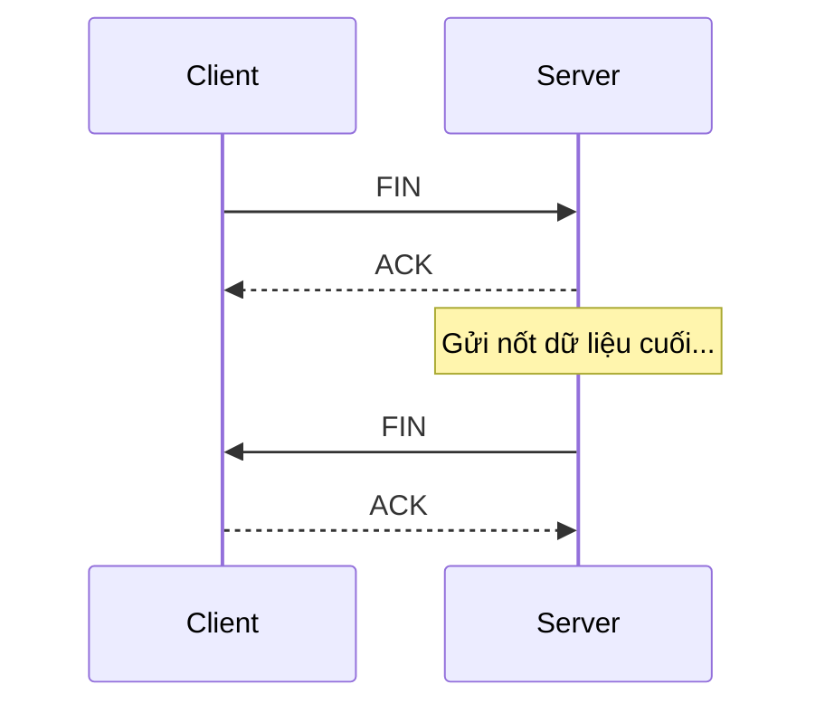

# INTERNET FUNDAMENTALS - THE BIG PICTURE

## PHẦN 1: BỐI CẢNH & TẦM NHÌN (THE BIG PICTURE)

### 1. Bản chất & Sự ra đời
- **Định nghĩa:** Internet là mạng lưới chung toàn cầu, nơi các thiết bị giao tiếp với nhau bằng các quy tắc chung gọi là **Protocol (Giao thức)**.
- **Lịch sử:** Xuất phát từ dự án **ARPANET** (DARPA - Mỹ) những năm 1960.
- **Tầm nhìn:** Xây dựng một hệ thống có tính "nguyên tử" và độc lập, tránh sự sụp đổ dây chuyền (domino) nếu một bộ phận bị phá hủy.

### 2. Tầm quan trọng đối với Lập trình viên
- Hầu hết các sản phẩm công nghệ hiện nay đều vận hành trên nền tảng Internet.
- Việc hiểu rõ cấu trúc mạng giúp lập trình viên:
  - **Tối ưu hóa:** Cải thiện tốc độ tải và hiệu năng.
  - **Debug:** Dễ dàng tìm ra lỗi nằm ở tầng nào (Client, Network, hay Server).
  - **Bản chất:** Nắm rõ cách dữ liệu di chuyển để thiết kế hệ thống tốt hơn.

### 3. Phân loại Mạng theo quy mô địa lý
| Loại mạng | Tên đầy đủ                | Phạm vi           | Đặc điểm                                                            |
| :-------- | :------------------------ | :---------------- | :------------------------------------------------------------------ |
| **PAN**   | Personal Area Network     | Vài mét           | Kết nối thiết bị cá nhân (Bluetooth).                               |
| **LAN**   | Local Area Network        | Nhà, văn phòng    | Tốc độ cao, độ trễ thấp. (Gồm cả WLAN/Wi-Fi).                       |
| **MAN**   | Metropolitan Area Network | Thành phố         | Kết nối nhiều mạng LAN lại với nhau.                                |
| **WAN**   | Wide Area Network         | Quốc gia, Lục địa | Độ trễ cao do khoảng cách. **Internet chính là mạng WAN lớn nhất.** |

---

## PHẦN 2: CÁC MÔ HÌNH MẠNG (NETWORKING MODELS)

### Dòng thời gian & Sự tiến hóa
| Thời gian | Mô hình | Trạng thái hiện tại |
| :--- | :--- | :--- |
| **1970s** | **DoD / TCP/IP** | **Tiêu chuẩn thực tế toàn cầu** |
| **1974** | **SNA (IBM)** | Chỉ còn dùng trong hệ thống Mainframe cũ |
| **1980s** | **IPX/SPX, AppleTalk, NetBIOS** | Đã bị khai tử hoặc thay thế bởi TCP/IP |
| **1984** | **OSI Model** | **Chuẩn tham chiếu lý thuyết (Reference)** |

---

## PHẦN 3: CẤU TRÚC CHI TIẾT CÁC TẦNG (DETAILED LAYER EXPLORATION)

Đây là nơi chúng ta sẽ đi sâu vào từng tầng của mô hình TCP/IP để hiểu cách dữ liệu thực sự vận hành.

### 1. Tầng Ứng dụng (Application Layer) - Cửa ngõ giao tiếp
Đây là tầng cao nhất, nơi người dùng và ứng dụng tương tác trực tiếp.

#### Các giao thức cốt lõi (Protocols)
| Giao thức | Tên đầy đủ | Vai trò |
| :--- | :--- | :--- |
| **HTTP/HTTPS** | HyperText Transfer Protocol | Xương sống của Web, truyền tải dữ liệu (Văn bản, Ảnh, API). |
| **DNS** | Domain Name System | "Danh bạ" Internet, dịch tên miền sang địa chỉ IP. |
| **WebSocket** | WebSocket Protocol | Giao tiếp 2 chiều thời gian thực (Chat, Game). |
| **FTP/SMTP** | File/Mail Protocol | Truyền file và gửi nhận Email. |
| **SSH** | Secure Shell | Điều khiển máy chủ từ xa một cách bảo mật. |

<b>Xem chi tiết: HTTP/HTTPS - "Mạch máu" của thế giới Web</b>

(Nội dung chi tiết về Request/Response, Auth, Stateless...)

<b>Xem chi tiết: DNS - Điểm bắt đầu của mọi hành trình</b>

(Nội dung chi tiết về Hierarchy, Recursive Query, Record types...)

<b>Xem chi tiết: WebSocket - Phá vỡ giới hạn của HTTP</b>

(Nội dung chi tiết về Full-duplex, Handshake...)

<b>Xem chi tiết: FTP, SMTP & Mô hình Bưu cục</b>

(Nội dung chi tiết về Dual-channel, Store and Forward...)

<b>Xem chi tiết: SSH - "Chìa khóa vạn năng" cho máy chủ</b>

(Nội dung chi tiết về Public/Private Key, Tunneling...)

---

### 2. Tầng Giao vận (Transport Layer) - Người vận chuyển tận tâm

Nếu Tầng Ứng dụng quyết định "Gửi cái gì", thì Tầng Giao vận sẽ quyết định **"Gửi như thế nào"**.

#### Các nhân vật chính: TCP và UDP

| Tiêu chí | TCP (Transmission Control Protocol) | UDP (User Datagram Protocol) |
| :--- | :--- | :--- |
| **Bản chất** | **Connection-oriented** (Hướng kết nối). Phải thiết lập kết nối trước khi truyền. | **Connectionless** (Không hướng kết nối). Bắn dữ liệu đi ngay lập tức. |
| **Độ tin cậy** | **Rất cao**. Đảm bảo dữ liệu đến đích không sai sót, không mất mát. | **Thấp**. Không đảm bảo gói tin có đến đích hay không. |
| **Thứ tự dữ liệu** | **Bảo toàn thứ tự**. Máy nhận sẽ ráp đúng thứ tự các mảnh dữ liệu. | **Không bảo toàn**. Gói nào đến trước thì nhận trước, có thể bị lộn xộn. |
| **Kiểm soát luồng** | **Có**. Tự động điều chỉnh tốc độ gửi để máy nhận không bị "nghẹt". | **Không**. Gửi tối đa băng thông có thể, không quan tâm máy nhận. |
| **Tốc độ & Overhead** | **Chậm hơn**. Do tốn tài nguyên cho bắt tay và kiểm tra lỗi (Header 20 bytes). | **Rất nhanh**. Cấu trúc cực nhẹ, không có thủ tục rườm rà (Header 8 bytes). |
| **Đơn vị dữ liệu** | **Segment** | **Datagram** |
| **Ứng dụng** | Web (HTTP), Email (SMTP), File (FTP), SSH. | Livestream, VoIP, Game Online, DNS. |
| **Cơ chế chính** | Bắt tay 3 bước, ACK, Truyền lại gói lỗi (Retransmission). | Bắn dữ liệu liên tục, chấp nhận Packet Loss. |

<b>Xem chi tiết: Phân biệt Message - Segment - Datagram (Sự tiến hóa của dữ liệu)</b>

Hãy tưởng tượng bạn muốn gửi một **Bộ bàn ghế gỗ (Message)** khổng lồ:
1.  **Message (Tầng Ứng dụng):** Nguyên bộ bàn ghế. Không thể nhét vừa xe máy (Hạ tầng mạng).
2.  **Segment (TCP):** Tháo rời bộ bàn ghế, đánh số (1, 2, 3...) và cho vào thùng. Nếu mất thùng "chân bàn", bưu điện sẽ biết và yêu cầu gửi lại đúng cái đó. Đảm bảo lắp lại được nguyên vẹn bộ bàn ghế ở đích.
3.  **Datagram (UDP):** Tháo rời nhưng không đánh số, xe nào chạy trước thì đi trước. Mất mảnh nào thì bỏ mảnh đó, máy nhận tự xử lý với những gì nhận được.

<b>Xem chi tiết: Tại sao phải Bắt tay 3 bước & Chia tay 4 bước?</b>

Đây là cơ chế đảm bảo tính tin cậy tuyệt đối của TCP.

**1. Bắt tay 3 bước (3-way Handshake):**
Mục đích: Đồng bộ hóa số thứ tự (Sequence Number) và xác nhận sự sẵn sàng của cả hai bên.
- **Bước 1 (SYN):** Client gửi: "Tôi muốn kết nối, số thứ tự bắt đầu của tôi là `x`".
- **Bước 2 (SYN-ACK):** Server đáp: "Tôi nhận được yêu cầu rồi (`x+1`), tôi cũng sẵn sàng, số của tôi là `y`".
- **Bước 3 (ACK):** Client chốt: "Ok tôi nhận số của anh rồi (`y+1`), bắt đầu truyền tin!".

**2. Chia tay 4 bước (4-way Teardown):**
Mục đích: Đóng kết nối sạch sẽ ở cả hai chiều, không làm mất dữ liệu còn đang bay trên đường.
- **Bước 1 (FIN):** Client: "Tôi gửi xong rồi, đóng chiều của tôi nhé".
- **Bước 2 (ACK):** Server: "Ok tôi biết rồi, chờ tôi gửi nốt dữ liệu còn lại".
- **Bước 3 (FIN):** Server: "Tôi cũng xong rồi, đóng luôn chiều của tôi nhé".
- **Bước 4 (ACK):** Client: "Ok, tạm biệt anh".

<b>Xem chi tiết: IP, Port & Socket - Từ DNS đến thiết lập kết nối</b>

Đây là luồng "liên tầng" quan trọng nhất để hiểu cách máy tính tìm thấy nhau:

**1. Luồng lấy địa chỉ (IP Retrieval):**
- **Ai lấy?** **Trình duyệt (Browser)** chủ động gọi DNS ngay khi bạn nhấn Enter.
- **Lấy khi nào?** Ngay lập tức, trước khi bắt đầu bắt tay TCP. Không có IP thì không biết gửi SYN đi đâu.
- **Ai dùng?** Hệ điều hành và Tầng Giao vận sẽ dùng IP này để ghi lên "vỏ hộp" Segment.

**2. Phép ẩn dụ: Tòa nhà và Căn hộ:**
- **IP Address:** Địa chỉ của tòa chung cư (Server). Giúp gói tin tìm được đến đúng tòa nhà giữa hàng tỷ tòa nhà khác.
- **Port:** Số căn hộ (Dịch vụ). Trong tòa nhà đó có căn hộ làm Web (Port 80/443), căn hộ làm Database (Port 3306), SSH (Port 22).
- **Socket (IP : Port):** Là sự kết hợp hoàn chỉnh để tạo ra một "đường ống" nối từ máy khách đến đúng dịch vụ cụ thể trên máy chủ.

*Ví dụ:* `172.217.161.206 : 443` -> Tìm đến Server Google và gõ đúng cửa dịch vụ Web HTTPS.

<b>Xem chi tiết: UDP & WebRTC - Giải pháp cho sự tức thời</b>

- **Tại sao UDP nhanh?** Bỏ qua mọi thủ tục bắt tay và kiểm tra ACK. Dữ liệu được bắn đi liên tục với độ trễ (Latency) thấp nhất.
- **Ứng dụng:** Livestream, Game online. Chấp nhận mất vài khung hình để đổi lấy sự liên tục.
- **WebRTC:** Công nghệ cốt lõi dùng UDP để truyền Video/Audio trực tiếp trên trình duyệt mà không cần Plugin.

---
