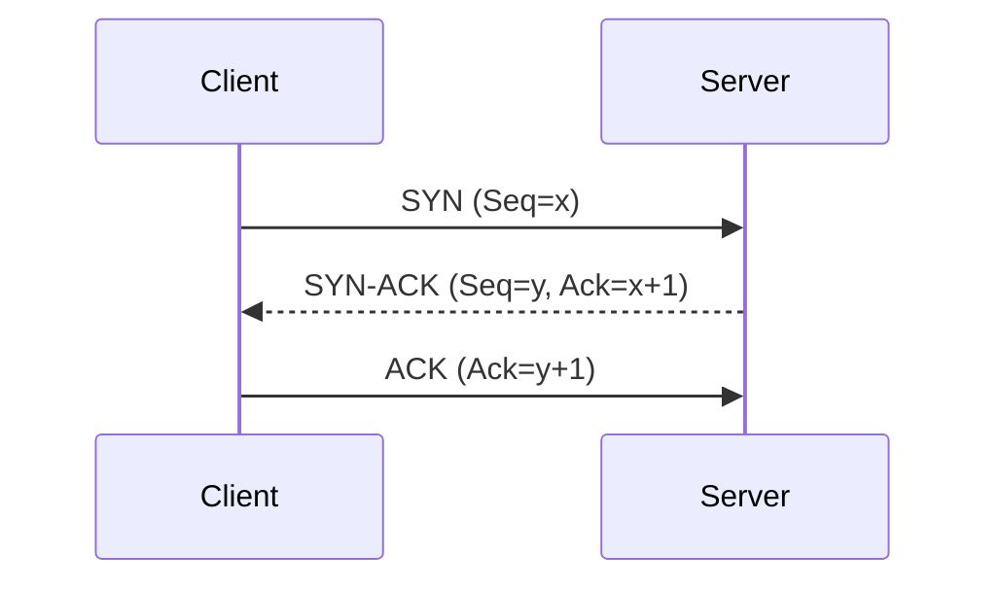
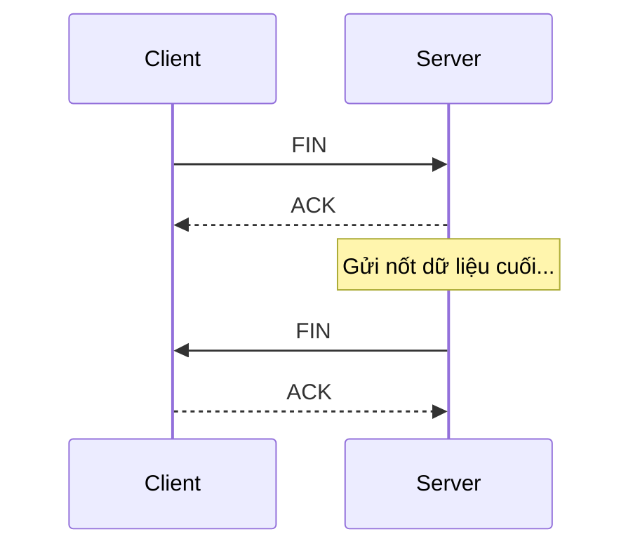

# INTERNET FUNDAMENTALS - THE BIG PICTURE

## PHẦN 1: BỐI CẢNH & TẦM NHÌN (THE BIG PICTURE)

### 1. Bản chất & Sự ra đời

- **Định nghĩa:** Internet là mạng lưới chung toàn cầu, nơi các thiết bị giao tiếp với nhau bằng các quy tắc chung gọi là **Protocol (Giao thức)**.
- **Lịch sử:** Xuất phát từ dự án **ARPANET** (DARPA - Mỹ) những năm 1960.
- **Tầm nhìn:** Xây dựng một hệ thống có tính "nguyên tử" và độc lập, tránh sự sụp đổ dây chuyền (domino) nếu một bộ phận bị phá hủy.

### 2. Tầm quan trọng đối với Lập trình viên

- Hầu hết các sản phẩm công nghệ hiện nay đều vận hành trên nền tảng Internet.
- Việc hiểu rõ cấu trúc mạng giúp lập trình viên:
  - **Tối ưu hóa:** Cải thiện tốc độ tải và hiệu năng.
  - **Debug:** Dễ dàng tìm ra lỗi nằm ở tầng nào (Client, Network, hay Server).
  - **Bản chất:** Nắm rõ cách dữ liệu di chuyển để thiết kế hệ thống tốt hơn.

### 3. Phân loại Mạng theo quy mô địa lý

| Loại mạng | Tên đầy đủ                | Phạm vi           | Đặc điểm                                                            |
| :-------- | :------------------------ | :---------------- | :------------------------------------------------------------------ |
| **PAN**   | Personal Area Network     | Vài mét           | Kết nối thiết bị cá nhân (Bluetooth).                               |
| **LAN**   | Local Area Network        | Nhà, văn phòng    | Tốc độ cao, độ trễ thấp. (Gồm cả WLAN/Wi-Fi).                       |
| **MAN**   | Metropolitan Area Network | Thành phố         | Kết nối nhiều mạng LAN lại với nhau.                                |
| **WAN**   | Wide Area Network         | Quốc gia, Lục địa | Độ trễ cao do khoảng cách. **Internet chính là mạng WAN lớn nhất.** |

---

## PHẦN 2: CÁC MÔ HÌNH MẠNG (NETWORKING MODELS)

### Dòng thời gian & Sự tiến hóa

| Thời gian | Mô hình                         | Trạng thái hiện tại                        |
| :-------- | :------------------------------ | :----------------------------------------- |
| **1970s** | **DoD / TCP/IP**                | **Tiêu chuẩn thực tế toàn cầu**            |
| **1974**  | **SNA (IBM)**                   | Chỉ còn dùng trong hệ thống Mainframe cũ   |
| **1980s** | **IPX/SPX, AppleTalk, NetBIOS** | Đã bị khai tử hoặc thay thế bởi TCP/IP     |
| **1984**  | **OSI Model**                   | **Chuẩn tham chiếu lý thuyết (Reference)** |

---

## PHẦN 3: CẤU TRÚC CHI TIẾT CÁC TẦNG (DETAILED LAYER EXPLORATION)

Đây là nơi chúng ta sẽ đi sâu vào từng tầng của mô hình TCP/IP để hiểu cách dữ liệu thực sự vận hành.

### 1. Tầng Ứng dụng (Application Layer) - Cửa ngõ giao tiếp

Đây là tầng cao nhất, nơi người dùng và ứng dụng tương tác trực tiếp.

#### Tại sao lập trình viên phải hiểu Tầng Ứng dụng?

- **Làm chủ API:** Hiểu cách dữ liệu được đóng gói và gửi đi giúp bạn thiết kế API chuẩn RESTful hoặc GraphQL.
- **Xử lý lỗi thực chiến:** Biết cách xử lý lỗi CORS, hiểu ý nghĩa các mã trạng thái (404, 500) để debug nhanh hơn.
- **Tối ưu hóa:** Biết cách dùng Header (như Cache-Control) để tăng tốc độ tải trang lên nhiều lần.

#### Các giao thức cốt lõi (Protocols)

| Giao thức      | Tên đầy đủ                  | Vai trò                                                     |
| :------------- | :-------------------------- | :---------------------------------------------------------- |
| **HTTP/HTTPS** | HyperText Transfer Protocol | Xương sống của Web, truyền tải dữ liệu (Văn bản, Ảnh, API). |
| **DNS**        | Domain Name System          | "Danh bạ" Internet, dịch tên miền sang địa chỉ IP.          |
| **WebSocket**  | WebSocket Protocol          | Giao tiếp 2 chiều thời gian thực (Chat, Game).              |
| **FTP/SMTP**   | File/Mail Protocol          | Truyền file và gửi nhận Email.                              |
| **SSH**        | Secure Shell                | Điều khiển máy chủ từ xa một cách bảo mật.                  |

<b>Xem chi tiết: HTTP/HTTPS - "Mạch máu" của thế giới Web</b>

**1. Mô hình Request - Response:**
Mọi giao tiếp trên Web đều bắt đầu bằng một yêu cầu (Request) từ Client và kết thúc bằng một phản hồi (Response) từ Server.

-   **HTTP Request:**
    -   **Method:** GET (Lấy dữ liệu), POST (Gửi dữ liệu mới), PUT (Cập nhật), DELETE (Xóa).
    -   **Headers:** Chứa metadata như `User-Agent` (thông tin trình duyệt), `Content-Type` (loại dữ liệu), `Authorization` (token xác thực).
    -   **Body:** Nội dung dữ liệu gửi đi (thường dùng trong POST/PUT, định dạng JSON hoặc Form data).
-   **HTTP Response:**
    -   **Status Codes:** 
        -   `2xx (Success)`: Thành công (Ví dụ: `200 OK`).
        -   `3xx (Redirection)`: Chuyển hướng (Ví dụ: `301 Moved Permanently`).
        -   `4xx (Client Error)`: Lỗi do phía người dùng (Ví dụ: `404 Not Found`, `401 Unauthorized`).
        -   `5xx (Server Error)`: Lỗi do phía máy chủ (Ví dụ: `500 Internal Server Error`).

**2. Tính chất Stateless (Không lưu trạng thái):**
HTTP là giao thức stateless - mỗi Request là độc lập, Server không "nhớ" bạn là ai từ Request trước đó.
-   **Giải pháp:** Để làm các ứng dụng như Giỏ hàng hay Đăng nhập, chúng ta sử dụng **Cookie**, **Session** hoặc **JWT (JSON Web Token)** để duy trì trạng thái.

**3. HTTPS - Bảo mật là ưu tiên hàng đầu:**
HTTPS = HTTP + **SSL/TLS** (Mã hóa).
-   **Mã hóa:** Dữ liệu được mã hóa trước khi gửi đi, tránh bị kẻ xấu "nghe lén" (Sniffing) mật khẩu hay thông tin cá nhân.
-   **Chứng chỉ (Certificate):** Server phải có chứng chỉ từ các tổ chức uy tín (CA) để chứng minh mình là trang web thật, không phải giả mạo.

<b>Xem chi tiết: DNS - Điểm bắt đầu của mọi hành trình</b>

DNS (Domain Name System) hoạt động như một cuốn danh bạ khổng lồ, giúp biến tên miền dễ nhớ như `google.com` thành địa chỉ IP mà máy tính hiểu được như `172.217.161.206`.

**1. Cấu trúc phân cấp (Hierarchy):**
-   **Root Servers (.)**: Điểm gốc của toàn bộ hệ thống DNS thế giới.
-   **TLD Servers (.com, .net, .vn)**: Quản lý các phần mở rộng của tên miền.
-   **Authoritative Nameservers**: Nơi lưu giữ "sự thật" về địa chỉ IP của một tên miền cụ thể (ví dụ: Server DNS của Cloudflare hoặc Bluehost).

**2. Quy trình truy vấn (Recursive Query):**
Khi bạn gõ tên miền, máy tính sẽ hỏi **DNS Resolver** (thường do nhà mạng ISP cung cấp). Resolver sẽ thực hiện "cuộc hành trình" hỏi từ Root -> TLD -> Authoritative cho đến khi nhận được địa chỉ IP cuối cùng để trả về cho trình duyệt.

**3. Các loại bản ghi (Record Types) phổ biến:**
-   **A Record:** Trỏ tên miền sang địa chỉ **IPv4**.
-   **AAAA Record:** Trỏ tên miền sang địa chỉ **IPv6**.
-   **CNAME:** Trỏ một tên miền này sang một tên miền khác (ví dụ: `www.example.com` trỏ về `example.com`).
-   **MX Record (Mail Exchange):** Xác định máy chủ nào chịu trách nhiệm nhận Email cho tên miền đó.
-   **TXT Record:** Chứa thông tin văn bản, thường dùng để xác minh quyền sở hữu tên miền (cho Google Search Console, v.v.).

**4. TTL (Time To Live) & Propagation:**
-   **TTL:** Thời gian bản ghi DNS được lưu trong bộ nhớ đệm (Cache).
-   **Propagation (Lan tỏa):** Khi bạn đổi IP của tên miền, cần một khoảng thời gian (vài phút đến 24h) để các Server DNS trên toàn cầu cập nhật thông tin mới.

<b>Xem chi tiết: WebSocket - Phá vỡ giới hạn của HTTP</b>

Khác với HTTP (Client hỏi - Server trả lời rồi ngắt kết nối), WebSocket giữ cho "đường ống" luôn mở.

-   **Full-duplex (Song công):** Cả Client và Server có thể chủ động gửi dữ liệu cho nhau bất cứ lúc nào mà không cần phải chờ yêu cầu từ phía kia.
-   **Handshake (Bắt tay):** WebSocket bắt đầu bằng một HTTP Request đặc biệt có header `Upgrade: websocket`. Nếu Server đồng ý, kết nối sẽ chuyển sang giao thức WebSocket.
-   **Ưu điểm:** Giảm thiểu độ trễ và dung lượng header (không cần gửi lại header HTTP cồng kềnh cho mỗi tin nhắn).
-   **Ứng dụng:** Ứng dụng chat thời gian thực, bảng giá chứng khoán cập nhật liên tục, Game online multiplayer.

<b>Xem chi tiết: FTP, SMTP & Mô hình Bưu cục</b>

Đây là những giao thức lâu đời nhưng vẫn cực kỳ quan trọng trong hạ tầng Internet:

-   **FTP (File Transfer Protocol):** Chuyên dụng để truyền tải file giữa máy tính và máy chủ. 
    -   Nó sử dụng 2 kênh: **Kênh điều khiển** (Port 21 - gửi lệnh) và **Kênh dữ liệu** (Port 20 - truyền nội dung file).
-   **SMTP (Simple Mail Transfer Protocol):** Giao thức tiêu chuẩn để **gửi** Email. Khi bạn nhấn nút "Gửi", SMTP sẽ đưa thư từ máy bạn đến Mail Server, và từ Mail Server này sang Mail Server khác.
-   **POP3 & IMAP:** Trong khi SMTP dùng để gửi, thì 2 giao thức này dùng để **nhận/tải** thư về.
    -   **POP3:** Tải thư về máy và thường xóa thư trên Server (tiết kiệm bộ nhớ server).
    -   **IMAP:** Đồng bộ hóa thư giữa Server và tất cả các thiết bị (hiện đại và phổ biến hơn).

<b>Xem chi tiết: SSH - "Chìa khóa vạn năng" cho máy chủ</b>

SSH (Secure Shell) là công cụ không thể thiếu của mọi lập trình viên Backend hay DevOps để quản trị máy chủ từ xa qua dòng lệnh.

-   **Bảo mật tuyệt đối:** Mọi dữ liệu (bao gồm cả mật khẩu) đều được mã hóa mạnh mẽ, chống lại các cuộc tấn công trung gian (Man-in-the-middle).
-   **Cơ chế xác thực Public/Private Key:** 
    -   Thay vì dùng mật khẩu, bạn tạo một cặp khóa.
    -   **Khóa Public:** Đặt lên máy chủ.
    -   **Khóa Private:** Giữ bí mật trên máy tính cá nhân.
    -   Khi kết nối, Server sẽ dùng khóa Public để "đố" và chỉ có khóa Private tương ứng mới "giải" được.
-   **Tunneling (Đường hầm):** SSH còn cho phép bạn tạo một đường hầm bảo mật để truy cập vào các dịch vụ nội bộ bên trong máy chủ (như Database) mà không cần mở port công khai.

---

### 2. Tầng Giao vận (Transport Layer) - Người vận chuyển tận tâm

Nếu Tầng Ứng dụng quyết định "Gửi cái gì", thì Tầng Giao vận sẽ quyết định **"Gửi như thế nào"**.

#### Tại sao lập trình viên phải hiểu Tầng Giao vận?

- **Quản lý kết nối:** Giải thích được tại sao ứng dụng bị "Timeout" hoặc lỗi "Connection Refused".
- **Lựa chọn giải pháp:** Biết khi nào dùng TCP để đảm bảo an toàn dữ liệu và khi nào dùng UDP để tối ưu tốc độ (Livestream/Game).
- **Phân luồng dịch vụ:** Hiểu cách dùng Port để chạy nhiều dịch vụ (Web, DB, SSH) trên cùng một máy chủ mà không bị xung đột.

#### Các nhân vật chính: TCP và UDP

| Tiêu chí              | TCP (Transmission Control Protocol)                                               | UDP (User Datagram Protocol)                                                |
| :-------------------- | :-------------------------------------------------------------------------------- | :-------------------------------------------------------------------------- |
| **Bản chất**          | **Connection-oriented** (Hướng kết nối). Phải thiết lập kết nối trước khi truyền. | **Connectionless** (Không hướng kết nối). Bắn dữ liệu đi ngay lập tức.      |
| **Độ tin cậy**        | **Rất cao**. Đảm bảo dữ liệu đến đích không sai sót, không mất mát.               | **Thấp**. Không đảm bảo gói tin có đến đích hay không.                      |
| **Thứ tự dữ liệu**    | **Bảo toàn thứ tự**. Máy nhận sẽ ráp đúng thứ tự các mảnh dữ liệu.                | **Không bảo toàn**. Gói nào đến trước thì nhận trước, có thể bị lộn xộn.    |
| **Kiểm soát luồng**   | **Có**. Tự động điều chỉnh tốc độ gửi để máy nhận không bị "nghẹt".               | **Không**. Gửi tối đa băng thông có thể, không quan tâm máy nhận.           |
| **Tốc độ & Overhead** | **Chậm hơn**. Do tốn tài nguyên cho bắt tay và kiểm tra lỗi (Header 20 bytes).    | **Rất nhanh**. Cấu trúc cực nhẹ, không có thủ tục rườm rà (Header 8 bytes). |
| **Đơn vị dữ liệu**    | **Segment**                                                                       | **Datagram**                                                                |
| **Ứng dụng**          | Web (HTTP), Email (SMTP), File (FTP), SSH.                                        | Livestream, VoIP, Game Online, DNS.                                         |
| **Cơ chế chính**      | Bắt tay 3 bước, ACK, Truyền lại gói lỗi (Retransmission).                         | Bắn dữ liệu liên tục, chấp nhận Packet Loss.                                |

<b>Xem chi tiết: Phân biệt Message - Segment - Datagram (Sự tiến hóa của dữ liệu)</b>

Hãy tưởng tượng bạn muốn gửi một **Bộ bàn ghế gỗ (Message)** khổng lồ:

1.  **Message (Tầng Ứng dụng):** Nguyên bộ bàn ghế. Không thể nhét vừa xe máy (Hạ tầng mạng).
2.  **Segment (TCP):** Tháo rời bộ bàn ghế, đánh số (1, 2, 3...) và cho vào thùng. Nếu mất thùng "chân bàn", bưu điện sẽ biết và yêu cầu gửi lại đúng cái đó. Đảm bảo lắp lại được nguyên vẹn bộ bàn ghế ở đích.
3.  **Datagram (UDP):** Tháo rời nhưng không đánh số, xe nào chạy trước thì đi trước. Mất mảnh nào thì bỏ mảnh đó, máy nhận tự xử lý với những gì nhận được.

<b>Xem chi tiết: Tại sao phải Bắt tay 3 bước & Chia tay 4 bước?</b>

Đây là cơ chế đảm bảo tính tin cậy tuyệt đối của TCP.

**1. Bắt tay 3 bước (3-way Handshake):**
Mục đích: Đồng bộ hóa số thứ tự (Sequence Number) và xác nhận sự sẵn sàng của cả hai bên.

- **Bước 1 (SYN):** Client gửi: "Tôi muốn kết nối, số thứ tự bắt đầu của tôi là `x`".
- **Bước 2 (SYN-ACK):** Server đáp: "Tôi nhận được yêu cầu rồi (`x+1`), tôi cũng sẵn sàng, số của tôi là `y`".
- **Bước 3 (ACK):** Client chốt: "Ok tôi nhận số của anh rồi (`y+1`), bắt đầu truyền tin!".

**2. Chia tay 4 bước (4-way Teardown):**
Mục đích: Đóng kết nối sạch sẽ ở cả hai chiều, không làm mất dữ liệu còn đang bay trên đường.

- **Bước 1 (FIN):** Client: "Tôi gửi xong rồi, đóng chiều của tôi nhé".
- **Bước 2 (ACK):** Server: "Ok tôi biết rồi, chờ tôi gửi nốt dữ liệu còn lại".
- **Bước 3 (FIN):** Server: "Tôi cũng xong rồi, đóng luôn chiều của tôi nhé".
- **Bước 4 (ACK):** Client: "Ok, tạm biệt anh".

<b>Xem chi tiết: IP, Port & Socket - Từ DNS đến thiết lập kết nối</b>

Đây là luồng "liên tầng" quan trọng nhất để hiểu cách máy tính tìm thấy nhau:

**1. Luồng lấy địa chỉ (IP Retrieval):**

- **Ai lấy?** **Trình duyệt (Browser)** chủ động gọi DNS ngay khi bạn nhấn Enter.
- **Lấy khi nào?** Ngay lập tức, trước khi bắt đầu bắt tay TCP. Không có IP thì không biết gửi SYN đi đâu.
- **Ai dùng?** Hệ điều hành và Tầng Giao vận sẽ dùng IP này để ghi lên "vỏ hộp" Segment.

**2. Phép ẩn dụ: Tòa nhà và Căn hộ:**

- **IP Address:** Địa chỉ của tòa chung cư (Server). Giúp gói tin tìm được đến đúng tòa nhà giữa hàng tỷ tòa nhà khác.
- **Port:** Số căn hộ (Dịch vụ). Trong tòa nhà đó có căn hộ làm Web (Port 80/443), căn hộ làm Database (Port 3306), SSH (Port 22).
- **Socket (IP : Port):** Là sự kết hợp hoàn chỉnh để tạo ra một "đường ống" nối từ máy khách đến đúng dịch vụ cụ thể trên máy chủ.

_Ví dụ:_ `172.217.161.206 : 443` -> Tìm đến Server Google và gõ đúng cửa dịch vụ Web HTTPS.

<b>Xem chi tiết: UDP & WebRTC - Giải pháp cho sự tức thời</b>

- **Tại sao UDP nhanh?** Bỏ qua mọi thủ tục bắt tay và kiểm tra ACK. Dữ liệu được bắn đi liên tục với độ trễ (Latency) thấp nhất.
- **Ứng dụng:** Livestream, Game online. Chấp nhận mất vài khung hình để đổi lấy sự liên tục.
- **WebRTC:** Công nghệ cốt lõi dùng UDP để truyền Video/Audio trực tiếp trên trình duyệt mà không cần Plugin.

---

### 3. Tầng Mạng (Internet Layer) - Hệ thống định vị toàn cầu

Nếu Tầng Giao vận lo việc "đóng thùng" hàng, thì Tầng Mạng chính là **"Hệ thống bưu điện và xe vận tải"**. Nhiệm vụ chính của nó là gán địa chỉ và tìm đường đi (Routing) để gói tin đến đúng đích giữa hàng tỷ thiết bị trên thế giới.

#### Tại sao lập trình viên phải hiểu Tầng Mạng?

- **Hiểu về hạ tầng:** Tại sao bạn có thể truy cập Server ở Mỹ nhưng lại không thể truy cập máy tính của đồng nghiệp ngồi ngay bên cạnh?
- **Quản lý địa chỉ:** Phân biệt IP tĩnh, IP động và tại sao thế giới phải chuyển sang IPv6.
- **Troubleshooting:** Biết cách dùng lệnh `ping` hoặc `traceroute` để xem gói tin đang bị "kẹt" ở trạm nào.

---

#### Đơn vị dữ liệu: Packet (Gói tin)

Tại đây, các **Segment** (từ tầng trên) được bọc thêm một lớp vỏ bảo vệ chứa địa chỉ IP nguồn và IP đích. Lúc này, chúng được gọi là **Packet**.

| Tiêu chí     | IPv4                                 | IPv6                                         |
| :----------- | :----------------------------------- | :------------------------------------------- |
| **Độ dài**   | 32-bit (Ví dụ: `192.168.1.1`)        | 128-bit (Ví dụ: `2001:0db8:85a3...`)         |
| **Số lượng** | Khoảng 4.3 tỷ địa chỉ (Đã cạn kiệt). | Gần như vô hạn (Sẵn sàng cho kỷ nguyên IoT). |
| **Bảo mật**  | Phụ thuộc vào các lớp trên.          | Tích hợp sẵn IPsec (Mã hóa tầng mạng).       |

<b>Xem chi tiết: IP Public vs IP Private - Hộ khẩu và Số phòng</b>

Đây là khái niệm then chốt để hiểu tại sao không phải cứ có mạng là người ta có thể kết nối vào máy bạn:

1.  **IP Private (Nội bộ):** Là địa chỉ trong mạng LAN của bạn (như Wi-Fi nhà). Router cấp cho điện thoại bạn một số như `192.168.1.5`. Địa chỉ này là "duy nhất trong nhà" nhưng có thể lặp lại ở nhà hàng xóm.
2.  **IP Public (Công cộng):** Là địa chỉ mà nhà mạng (ISP) cấp cho Router của bạn. Đây là địa chỉ duy nhất trên toàn thế giới.
3.  **NAT (Network Address Translation):** Khi bạn gửi một Request, Router sẽ thay thế IP Private của bạn bằng IP Public của nó để đi ra Internet. Khi có phản hồi, nó sẽ nhớ và chuyển lại cho đúng máy của bạn. - _Ứng dụng:_ Đây là lý do bạn có thể lướt web, nhưng người ngoài không thể "nhìn thấy" máy tính cá nhân của bạn nếu bạn không cấu hình mở cổng.

<b>Xem chi tiết: Routing & IXP - Hành trình xuyên lục địa của gói tin</b>

Dữ liệu không bay thẳng. Nó nhảy qua hàng chục trạm trung chuyển (Hops):

**1. Router - Người chỉ đường:**
Mỗi Router trên mạng đều giữ một "Bản đồ" (Routing Table). Khi nhận được Packet, nó nhìn vào IP đích và quyết định: "Gói này nên đi qua hướng cáp quang biển hay đi đường bộ?".

**2. Trạm IXP (Internet Exchange Point):**
Hãy tưởng tượng đây là các "Vòng xuyến giao thông" cực lớn. Đây là nơi các nhà mạng (Viettel, VNPT, Google, Facebook) cắm chung dây cáp với nhau để trao đổi dữ liệu trực tiếp, giúp giảm độ trễ và tránh việc dữ liệu trong nước phải chạy vòng ra quốc tế rồi mới quay về.

**3. Journey of a Packet:**

- **The Wireless Jump:** Điện thoại -> Sóng Wi-Fi -> Router.
- **The Physical Pipe:** Router -> Cáp quang nhà mạng -> Trạm IXP.
- **The Big Sea:** Chui vào cáp quang dưới đáy biển để sang lục địa khác.
- **The Destination:** Đến Data Center của Server đích.

<b>Xem chi tiết: ICMP & Trình chẩn đoán mạng (Ping/Traceroute)</b>

Không phải giao thức nào cũng để truyền dữ liệu người dùng. **ICMP** là giao thức dùng để "báo cáo tình trạng sức khỏe" của mạng.

- **Ping:** Gửi một gói tin nhỏ và chờ phản hồi. Dùng để kiểm tra xem Server có đang "sống" hay không và độ trễ (Latency) là bao nhiêu.
- **Traceroute:** Liệt kê danh sách tất cả các Router mà gói tin đã đi qua. Nếu mạng bị chậm, bạn sẽ thấy chính xác trạm nào đang bị tắc nghẽn.

---

### 4. Tầng Truy cập mạng (Network Access Layer) - Hạ tầng vật lý

Đây là tầng cuối cùng trong mô hình TCP/IP (gộp tầng Data Link và Physical của OSI). Nếu Tầng Mạng lo việc tìm đường trên bản đồ, thì Tầng Truy cập mạng chính là **"Mặt đường, lốp xe và xăng dầu"** giúp dữ liệu thực sự di chuyển.

#### Tại sao lập trình viên phải hiểu Tầng Truy cập mạng?
- **Hiểu về giới hạn:** Tại sao Wi-Fi lại chậm hơn cắm cáp LAN? Tại sao độ trễ (ping) lại cao khi dùng 4G?
- **Định danh thiết bị:** Hiểu về địa chỉ MAC để biết cách các hệ thống bảo mật mạng lọc thiết bị (MAC Filtering).
- **Phần cứng thực tế:** Nắm được vai trò của Card mạng (NIC) và Switch trong việc truyền tải dữ liệu nội bộ.

---

#### Đơn vị dữ liệu: Frame (Khung tin) & Bits (Số nhị phân)
Tại đây, các **Packet** được bọc thêm lớp vỏ cuối cùng chứa địa chỉ MAC để trở thành **Frame**. Sau đó, Frame bị "nghiền nát" thành các dãy bit **0 và 1** để truyền qua dây dẫn.

| Thành phần | Đặc điểm |
| :--- | :--- |
| **Địa chỉ MAC** | Địa chỉ vật lý duy nhất được ghi vào phần cứng (Card mạng) khi sản xuất. |
| **Switch** | Thiết bị thông minh giúp điều phối các Frame đến đúng địa chỉ MAC trong mạng LAN. |
| **Môi trường truyền** | Cáp đồng (điện), Cáp quang (ánh sáng), Sóng vô tuyến (Wi-Fi/4G). |

<b>Xem chi tiết: Địa chỉ MAC vs Địa chỉ IP - Số nhà và Tên chủ hộ</b>

Để gói tin đến đúng máy bạn, cần có 2 loại địa chỉ:
1.  **IP Address (Địa chỉ Logic):** Có thể thay đổi khi bạn sang quán cafe khác. Nó giống như "Địa chỉ tạm trú".
2.  **MAC Address (Địa chỉ Vật lý):** Không bao giờ thay đổi (trừ khi bạn thay card mạng). Nó giống như "Số chứng minh thư" của thiết bị.
    - *Cơ chế:* Trong mạng nội bộ, Router/Switch không dùng IP để tìm máy bạn, chúng dùng bảng **ARP (Address Resolution Protocol)** để tra xem IP này đang tương ứng với cái MAC nào để đẩy Frame vào đúng cổng.

<b>Xem chi tiết: Từ Frame đến Bits - Khi dữ liệu biến thành Ánh sáng và Điện</b>

Đây là bước cuối cùng trước khi dữ liệu rời khỏi máy tính của bạn:

**1. Đóng gói Frame:**
Tầng này gắn thêm "đầu" và "đuôi" vào Packet để thiết bị phần cứng biết khi nào một gói tin bắt đầu và kết thúc.

**2. Chuyển đổi tín hiệu:**
- **Cáp đồng (RJ45):** Các bit 0 và 1 được chuyển thành các mức điện áp cao/thấp.
- **Cáp quang:** Chuyển thành các xung ánh sáng chớp tắt cực nhanh bên trong sợi thủy tinh. Đây là cách truyền nhanh nhất và ít nhiễu nhất.
- **Wi-Fi/Sóng vô tuyến:** Chuyển thành các dao động sóng điện từ lan tỏa trong không gian.

**3. Tại sao cắm dây luôn nhanh hơn Wi-Fi?**
Sóng Wi-Fi dễ bị nhiễu bởi tường, thiết bị điện tử và bị suy giảm theo khoảng cách. Cáp quang/Cáp đồng truyền trong môi trường kín nên tốc độ ổn định và độ trễ cực thấp.

---

### 🏁 TỔNG KẾT: HÀNH TRÌNH ĐÓNG GÓI (ENCAPSULATION)
Hãy nhìn lại toàn bộ quá trình khi bạn nhấn "Gửi" một tin nhắn:

1.  **Tầng Ứng dụng:** Tạo ra **Message** (Nội dung chat).
2.  **Tầng Giao vận:** Băm Message thành các **Segment** (Gắn thêm Port).
3.  **Tầng Mạng:** Bọc Segment thành các **Packet** (Gắn thêm IP).
4.  **Tầng Truy cập mạng:** Bọc Packet thành các **Frame** (Gắn thêm MAC) -> Chuyển thành **Bits** để truyền đi.

*(Dữ liệu đi lùi từ Tầng 4 xuống Tầng 1 ở máy gửi, và đi ngược từ Tầng 1 lên Tầng 4 ở máy nhận để "mở quà").*

<b>💡 Giải mã: Tại sao tên gọi dữ liệu lại thay đổi qua từng tầng?</b>

Việc đổi tên từ **Message -> Segment -> Packet -> Frame** không phải để làm khó người học, mà nó phản ánh **sự thay đổi về cấu trúc và nhiệm vụ** của dữ liệu. Trong kỹ thuật, mỗi đơn vị này được gọi chung là một **PDU (Protocol Data Unit)**.

Hãy tưởng tượng bạn gửi một **Con gấu bông (Dữ liệu gốc)** cho bạn thân:

1.  **Message (Tầng Ứng dụng):** Chính là con gấu bông. Ở tầng này, chúng ta chỉ quan tâm đến nội dung: "Nó màu gì? Nó là quà tặng ai?".
2.  **Segment (Tầng Giao vận):** Bạn cho gấu bông vào một chiếc hộp. Bên ngoài hộp, bạn dán mác: "Mảnh số 1/3", "Gửi tới phòng 403 (Port)". Chiếc hộp này bảo vệ con gấu và đảm bảo nó không bị thất lạc.
3.  **Packet (Tầng Mạng):** Bạn bọc chiếc hộp bằng một lớp giấy gói quà màu nâu của bưu điện. Bên ngoài bạn ghi: "Gửi tới số nhà 123 đường ABC (IP)". Lúc này, bưu điện không cần biết bên trong là gấu bông hay mảnh số mấy, họ chỉ cần nhìn địa chỉ nhà để chuyển đi.
4.  **Frame (Tầng Truy cập mạng):** Nhân viên bưu điện cho gói quà vào một cái thùng container lớn của xe tải. Thùng này có mã số xe (MAC) để đi qua các trạm kiểm soát vật lý.

**Tại sao phải làm vậy? (Triết lý Abstraction):**
- **Để "Chia để trị":** Router ở giữa đường chỉ cần đọc cái lớp giấy nâu (Packet - IP) để biết đường đi, nó không cần tốn công mở hết các lớp bên trong để xem bạn gửi gấu bông hay gửi gì. Điều này giúp tốc độ xử lý mạng nhanh hơn hàng triệu lần.
- **Để linh hoạt:** Nếu sau này bạn không gửi bằng xe tải (Frame Ethernet) mà gửi bằng máy bay (Frame Wi-Fi), con gấu bông bên trong (Message) vẫn giữ nguyên không đổi. Chỉ cần thay cái "lớp bọc ngoài cùng" là xong.

