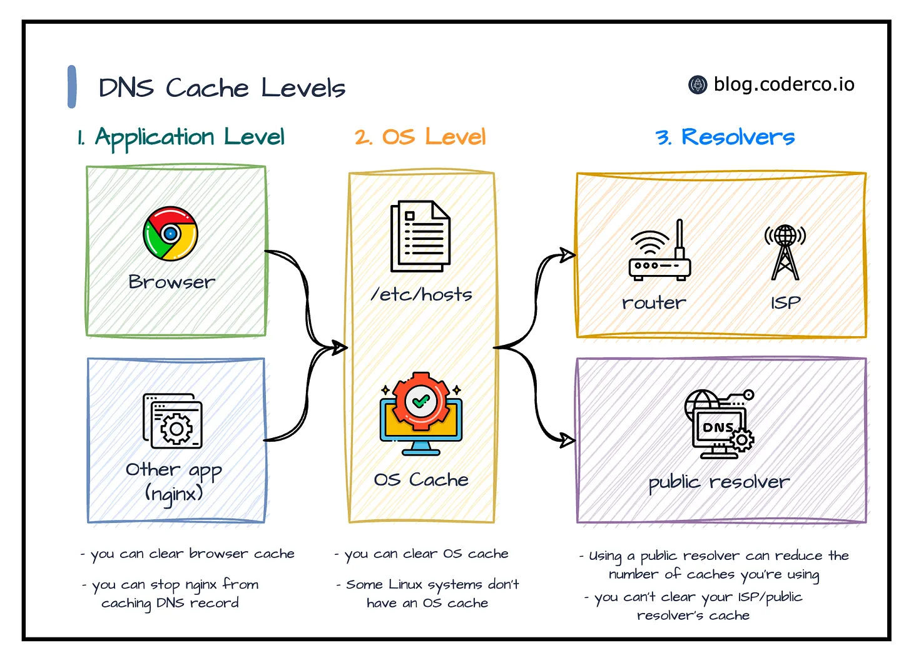
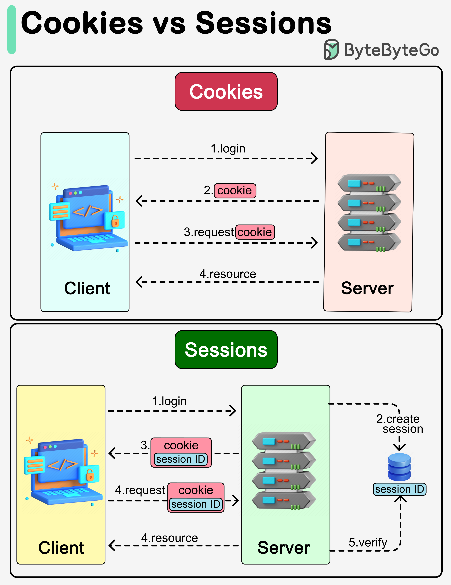
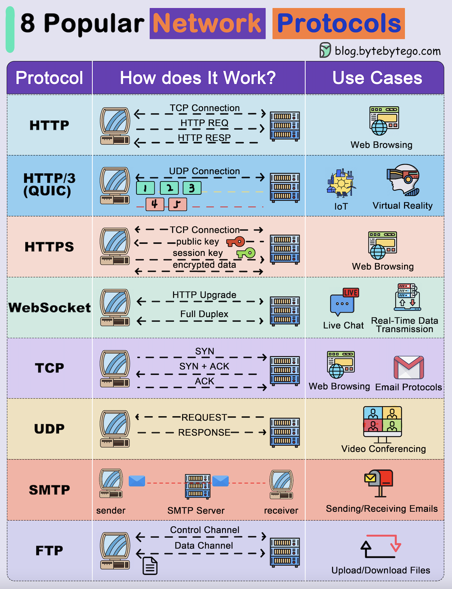
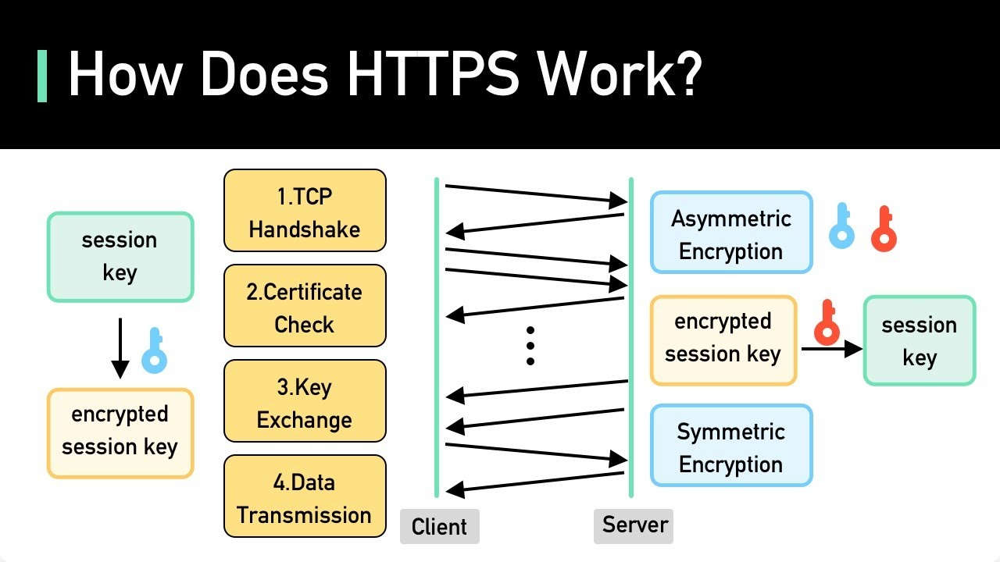
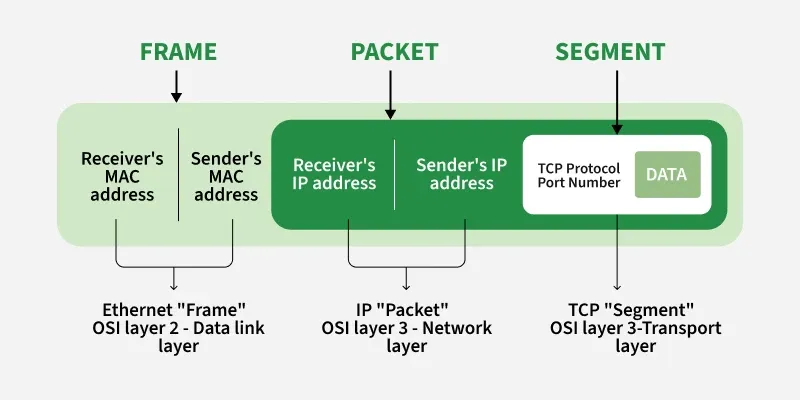
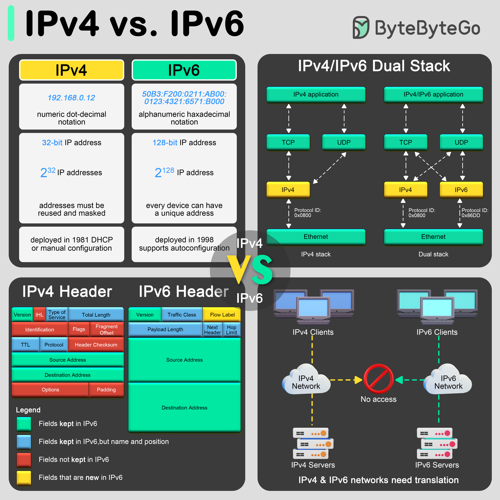
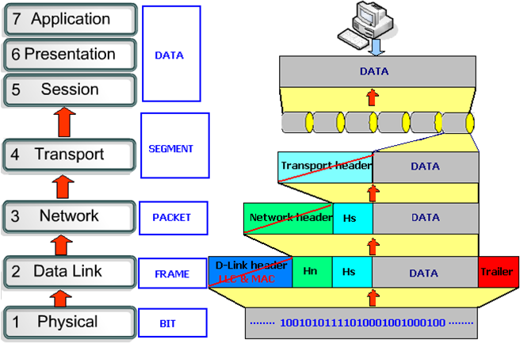

# BỨC TRANH TOÀN CẢNH VỀ INTERNET & MẠNG MÁY TÍNH

## PHẦN 1: BỐI CẢNH & TẦM NHÌN (THE BIG PICTURE)

### 1. Internet là gì & Lịch sử ra đời

- **Định nghĩa cơ bản:** Internet là một mạng lưới chung toàn cầu kết nối hàng tỷ máy tính và các thiết bị với nhau. Các thiết bị giao tiếp và trao đổi dữ liệu dựa trên một quy tắc chung gọi là Protocol (Giao thức).
- **Lịch sử & Nỗi đau (Pain-point):** Tiền thân là mạng ARPANET (những năm 1960 bởi DARPA - Mỹ).
  - **Giải quyết bài toán:** Cho phép các máy tính ở xa nhau trực tiếp truyền tải dữ liệu và chia sẻ tài nguyên.
  - **Tầm nhìn:** Tránh rủi ro tập trung (Single Point of Failure). Trong chiến tranh, nhận thức tính nguyên tử và độc lập giúp hệ thống không bị hiệu ứng domino đánh sập nếu một bộ phận hư hỏng.

### 2. Vì sao Lập trình viên phải hiểu về Internet?

Thế giới vận hành 90% trên Internet. Lập trình viên tạo ra sản phẩm mang lại giá trị cho cộng đồng, và các sản phẩm đó bắt buộc phải hoạt động trên không gian mạng. Việc hiểu rõ cấu trúc vận hành giúp lập trình viên nắm bắt bản chất, dễ dàng thao tác, tối ưu và xử lý lỗi hiệu quả hơn.

### 3. Phân loại Mạng (Dựa trên quy mô địa lý)

**🔗 Mối liên kết:** Trước khi kết nối ra toàn cầu (Internet), thiết bị của chúng ta phải đi qua các quy mô mạng nội bộ.

- **PAN (Personal Area Network):** Rất nhỏ (vài mét). Kết nối thiết bị cá nhân (ví dụ: Bluetooth tai nghe).
- **LAN (Local Area Network):** Nhỏ (căn nhà, phòng máy, công ty). Tốc độ nhanh, độ trễ thấp, bảo mật cao. (Ví dụ: `http://localhost` là mạng khép kín trong máy tính của bạn).
  - _WLAN (Wireless LAN):_ Bản chất là LAN nhưng dùng sóng vô tuyến (Wi-Fi) thay cho cáp vật lý.
- **MAN (Metropolitan Area Network):** Trung bình (trong một thành phố). Kết nối nhiều mạng LAN lại với nhau.
- **WAN (Wide Area Network):** Rất lớn (xuyên quốc gia, lục địa). Đặc điểm là độ trễ cao do khoảng cách vật lý xa. **Internet chính là mạng WAN lớn nhất toàn cầu.**

## 

## PHẦN 2: CHUẨN BỊ HÀNH TRANG TRƯỚC KHI LÊN ĐƯỜNG

Khi người dùng thực hiện một thao tác trên giao diện, quá trình chuẩn bị dữ liệu bắt đầu ngay trên trình duyệt (Tầng Ứng dụng).

### 1. Định danh tài nguyên (URI - URL - URN)

Để máy tính biết phải đi đâu lấy dữ liệu, nó cần một địa chỉ định danh chính xác.

- **URI (Uniform Resource Identifier):** Danh từ chung lớn nhất để nhận diện tài nguyên, bao trùm cả URL và URN.
- **URL (Uniform Resource Locator):** Nhận diện qua **Vị trí** và **Giao thức** (Ví dụ: `https://api.myweb.com/users`). Đây là thứ bạn dùng trong `fetch()`.
- **URN (Uniform Resource Name):** Nhận diện bằng **Tên duy nhất**, không quan tâm tài nguyên nằm ở đâu (Ví dụ: số ISBN sách, hoặc mã UUID của sản phẩm `urn:uuid:123e4567...`).

### 2. Dịch tên miền thành IP (DNS & Cache)

**🔗 Mối liên kết:** Máy móc hạ tầng không hiểu chữ `myweb.com`, chúng chỉ hiểu các con số (Địa chỉ IP).

- **DNS (Domain Name System):** "Cuốn danh bạ" của Internet, chuyển tên miền thành địa chỉ IP.
  - _Cấu trúc phân cấp:_ Root Server (`.`) -> TLD (`.com`) -> Second-Level (`myweb`) -> Sub-domain (`api.myweb.com`).
- **Cache (Bộ nhớ đệm):** Nơi lưu trữ tạm thời IP để giảm độ trễ (latency) không phải đi hỏi lại danh bạ nhiều lần.
- **Luồng DNS Look-up:** Trình duyệt (Browser Cache) -> Hệ điều hành (OS Cache) -> ISP Resolver (Trạm nhà mạng) -> Chuỗi Root/TLD/Authoritative Server. Cuối cùng trả về IP cho trình duyệt.

### 3. Nhớ danh tính người dùng (Cookie & Session)

**🔗 Mối liên kết:** Giao thức HTTP bản chất là Stateless (không lưu trạng thái, hay "mất trí nhớ"). Nếu không có công cụ hỗ trợ, vừa đăng nhập xong tải trang mới sẽ bị bắt đăng nhập lại.

- **Session:** Phiên làm việc lưu trên **Server** (chứa thông tin nhạy cảm, quyền hạn).
- **Cookie:** Mẩu dữ liệu nhỏ do Server tạo, gửi về lưu trên **Trình duyệt (Client)**. Mỗi lần Client gửi Request mới, Cookie (chứa ID của Session) được đính kèm vào Header để Server nhận diện ra "người quen".

---

## PHẦN 3: ĐỊNH DẠNG, ĐÓNG GÓI & CÀI Ổ KHÓA BẢO MẬT

Trình duyệt đã có IP đích. Giờ là lúc tạo thông điệp và chọn cách gửi.

### 1. Giao thức Tầng Ứng dụng (Protocol)

- **HTTP / HTTPS:** Xương sống của Web. Mô hình **Request - Response** (Khách hỏi - Chủ trả lời). Dùng lấy file tĩnh hoặc API JSON. HTTPS là bản có bọc mã hóa.
- **WebSocket (WS/WSS):** Đường ống kết nối 2 chiều (Full-duplex), mở liên tục. Sinh ra để giải quyết bài toán thời gian thực (Real-time) như chat, chứng khoán (thay vì dùng HTTP `setInterval` hao tài nguyên).
- **Giao thức khác:** FTP (truyền file lớn), SMTP/IMAP/POP3 (Email), SSH (Điều khiển Terminal máy chủ từ xa an toàn).

### 2. HTTP Methods & Status Codes (Phương thức và Mã trạng thái)

Để Server và Client hiểu chính xác yêu cầu của nhau, HTTP định nghĩa các hành động và kết quả trả về chuẩn mực:

- **Các phương thức HTTP (HTTP Methods):**
  - `GET`: Xin lấy dữ liệu (VD: Lấy danh sách user).
  - `POST`: Gửi dữ liệu mới lên (VD: Tạo tài khoản, Đăng nhập).
  - `PUT`: Cập nhật toàn bộ một tài nguyên đã có.
  - `PATCH`: Cập nhật một phần nhỏ của tài nguyên.
  - `DELETE`: Xóa tài nguyên.
- **Các nhóm mã trạng thái (Status Codes):**
  _ `2xx` (Thành công): VD `200 OK` (Lấy thành công), `201 Created` (Tạo mới thành công).
  _ `3xx` (Chuyển hướng - Redirect): VD `301 Moved Permanently`.
  _ `4xx` (Lỗi do Client): VD `400 Bad Request` (Gửi sai định dạng), `401 Unauthorized` (Chưa đăng nhập), `404 Not Found` (Sai URL).
  _ `5xx` (Lỗi do Server): VD `500 Internal Server Error` (Server bị sập hoặc lỗi code Back-end).
  > _Nguồn tham khảo:_ [MDN Web Docs - HTTP response status codes](https://developer.mozilla.org/en-US/docs/Web/HTTP/Status)

### 3. Cài "Ổ khóa" Mã hóa (TLS Handshake & HTTPS)

Nếu gửi Payload dạng văn bản rõ (cleartext), tin tặc sẽ đọc được mật khẩu.

- Ngay khi đường ống mở, **TLS Handshake** diễn ra:
  - Client gửi danh sách thuật toán.
  - Server chọn thuật toán và gửi Chứng chỉ số (SSL Certificate) chứng minh thân phận.
  - Hai bên dùng toán học tạo ra một **Chìa khóa mã hóa (Encryption Key)** chung. Từ đây, dữ liệu HTTP Request chui vào mạng hoàn toàn được bảo mật.

## 

## PHẦN 4: CHIA NHỎ VÀ VẬN CHUYỂN BẰNG "BẢO HIỂM" (TẦNG TRANSPORT)

**🔗 Mối liên kết:** Dữ liệu Request/Response khổng lồ (ví dụ 5MB) không thể chui tọt qua đường dây cáp do giới hạn MTU (Maximum Transmission Unit ~1.5KB). Chúng phải được băm nhỏ.

### 1. Băm nhỏ dữ liệu thành Packets

- **Packets (Gói tin):** Các mảnh vỡ của dữ liệu gốc để truyền qua đường ống vật lý.
- **Cấu trúc 1 Packet:**
  - _Header:_ Ghi IP người gửi, IP nhận, và số thứ tự để ghép lại.
  - _Payload:_ Phần ruột chứa đoạn mã HTML/JSON thực tế (đã bị mã hóa lộn xộn bởi HTTPS).
    

### 2. Cỗ máy kiểm soát (TCP vs UDP)

- **TCP (Transmission Control Protocol) - "Kẻ cẩn trọng":**
  - _Đặc điểm:_ An toàn, không lỗi, sai 1 dấu phẩy cũng bắt gửi lại.
  - _Cơ chế:_ Đánh số thứ tự (Sequence), Xác nhận (ACK), Truyền lại (Retransmission).
  - _Mở kết nối (3-way Handshake):_ Client hỏi (SYN) -> Server đáp (SYN-ACK) -> Client chốt (ACK).
  - _Đóng kết nối (4-way Teardown):_ Client ngắt (FIN) -> Server xác nhận (ACK) -> Server ngắt (FIN) -> Client tạm biệt (ACK).
- **UDP (User Datagram Protocol) - "Kẻ tốc độ":**
  - _Đặc điểm:_ Bắn dữ liệu liên tục, bỏ qua thủ tục, rớt gói thì bỏ qua luôn. Phục vụ Livestream, Call Video (chấp nhận mờ hình chứ không chấp nhận giật/lag).

### 3. WebRTC (Web Real-Time Communication)

Là công nghệ cốt lõi đứng sau các ứng dụng gọi Video/Audio (như Google Meet) chạy trực tiếp trên trình duyệt Front-end mà không cần cài thêm plugin.

- **Bản chất:** Thay vì gửi video lên Server rồi Server mới đẩy xuống người kia, WebRTC cho phép tạo kết nối ngang hàng (**Peer-to-Peer**).
- **Ứng dụng giao thức:** WebRTC sử dụng triệt để nền tảng **UDP** để truyền tải khung hình video với độ trễ thấp nhất có thể.
  > _Nguồn tham khảo:_ [WebRTC.org - Architecture](https://webrtc.org/)

---

## PHẦN 5: TÌM ĐƯỜNG & HẠ TẦNG VẬT LÝ (TẦNG NETWORK & PHYSICAL)

Các gói tin giờ cần "Địa chỉ" và "Đường ống" để chạy.

### 1. Địa chỉ IP (Hộ khẩu trên mạng)

- **IP Public vs Private:** Router cấp _IP Private_ (cục bộ) cho các thiết bị trong nhà (như `192.168.x.x`). ISP cấp _IP Public_ duy nhất cho Router để giao tiếp ngoài Internet.
- **IPv4 vs IPv6:** IPv4 (32-bit) đã cạn kiệt do bùng nổ IoT/Smartphone. IPv6 (128-bit) sinh ra để thay thế. Cả hai đang chạy song song vì quá trình chuyển giao hạ tầng toàn cầu cần thời gian.

### 2. Hành trình thực tế của gói tin

1.  **The Wireless Jump (Nhảy không dây):** Điện thoại biến gói tin thành sóng vô tuyến (Wi-Fi hoặc 4G).
2.  **Đường ống vật lý:** Sóng đập vào ăng-ten, chuyển thành xung điện (Cáp đồng RJ45) hoặc tín hiệu ánh sáng (Cáp quang). Cáp quang truyền ánh sáng trong sợi thủy tinh, ít nhiễu và nhanh nhất.
3.  **Routing qua WAN:** Tín hiệu chui vào mạng cáp ISP (Viettel, VNPT).
4.  **Trạm IXP (Internet Exchange Point):** Vòng xuyến giao thông. Nhằm giữ "dữ liệu nội địa" không chạy ra tuyến cáp quốc tế, giúp giảm độ trễ tối đa và tăng tốc độ phản hồi. ISP và Server lớn cắm chung cáp tại đây.
5.  **Data Center & Server:** Gói tin đến đích, qua Load Balancer (Bộ cân bằng tải) chia đều việc cho các Server. Server mở gói, check Token, chọc vào Database lấy dữ liệu JSON, và đi ngược hành trình trả Response về Client.

---

## PHẦN 6: LỚP ÁO GIÁP BẢO VỆ MẠNG VÀ TRÌNH DUYỆT

Khi Request rời khỏi LAN ra WAN, nó đối mặt với nguy cơ tấn công hoặc bị chặn:

- **Firewall (Tường lửa):** Đứng ở ranh giới mạng (Tầng hạ tầng), soi xét Header của Packets. Block các IP lạ hoặc gói tin nghi ngờ (Nguyên nhân gây ra các lỗi từ chối kết nối).
- **VPN (Virtual Private Network):** Đường hầm mã hóa luồn bên trong Internet. Giả lập IP Private cho máy tính ở xa (quán cafe) giống như đang cắm cáp trực tiếp tại trụ sở công ty, bảo vệ dữ liệu khỏi mạng Wi-Fi công cộng.

### Vách ngăn của Trình duyệt: CORS (Cross-Origin Resource Sharing)

_Khác với Firewall bảo vệ Server, CORS là cơ chế sinh ra để bảo vệ người dùng trên Trình duyệt._

- **Bản chất:** Trình duyệt mặc định có chính sách Same-Origin (Chỉ cho phép website gọi API từ chính tên miền của nó). Khi app React ở `localhost:3000` gọi API sang `api.myweb.com`, đây là gọi chéo nguồn (Cross-Origin).
- **Cơ chế hoạt động:** Trình duyệt sẽ ngầm gửi một "Gói tin thăm dò" gọi là **Preflight Request** (dùng phương thức `OPTIONS`) lên Server để hỏi: _"Trang web này có được phép lấy dữ liệu của anh không?"_. Nếu Server không cấu hình Header `Access-Control-Allow-Origin` hợp lệ, Trình duyệt sẽ bóp nghẹt cái Request đó và báo lỗi CORS màu đỏ rực trên Console, mặc dù tầng mạng bên dưới vẫn thông suốt!
  > _Nguồn tham khảo:_ [MDN Web Docs - CORS](https://developer.mozilla.org/en-US/docs/Web/HTTP/CORS)

---

## PHẦN 7: TỔNG HỢP THEO MÔ HÌNH CHUẨN

Sự ánh xạ giữa khung lý thuyết và thực tế vận hành:

- **OSI (7 Tầng) - Mô hình Lý thuyết (Reference):**
  1.  _Application:_ Tầng dev thao tác (HTTP/JSON).
  2.  _Presentation:_ Thông dịch và mã hóa (TLS/SSL).
  3.  _Session:_ Giữ kết nối.
  4.  _Transport:_ Băm nhỏ, gắn Port, TCP/UDP.
  5.  _Network:_ Định tuyến, gắn IP.
  6.  _Data Link:_ Gắn MAC address (định danh thiết bị cứng).
  7.  _Physical:_ Cáp đồng, sóng Wi-Fi, cáp quang.
- **TCP/IP (4 Tầng) - Mô hình Thực tế (Implementation):**
  - Gộp L5, L6, L7 thành **Application**.
  - L4 giữ nguyên là **Transport**.
  - L3 đổi tên thành **Internet**.
  - Gộp L1, L2 thành **Network Access**.
    _(Dữ liệu đi lùi từ Tầng cao xuống Tầng 1 ở máy gửi, và đi ngược từ Tầng 1 lên Tầng cao ở máy nhận)._

## 

## 🏁 SUMMARY: TỔNG KẾT LUỒNG TRUYỀN TẢI THỰC TẾ

Khi bạn click một nút bấm trên UI (ví dụ Lưu Hồ Sơ), chuỗi phản ứng dây chuyền sau sẽ xảy ra:

1.  Mã nguồn kích hoạt `fetch()` với phương thức **PUT**, đính kèm Payload JSON và **URL** đích.
2.  Trình duyệt dò **Cache** hoặc gọi **DNS** để lấy **IP Public** của Server.
3.  Trình duyệt tự động đính kèm **Cookie/Session** để chứng minh danh tính người dùng và kiểm tra **CORS** (nếu gọi chéo tên miền).
4.  Tầng Presentation dùng **TLS Handshake** tạo chìa khóa mã hóa cái Request đó (biến nó thành **HTTPS**).
5.  Hệ điều hành dùng **TCP 3-way Handshake** mở đường ống, rồi băm Request đó thành hàng trăm **Packets**, gán thứ tự.
6.  Packets rớt xuống phần cứng, bị biến thành **Sóng Wi-Fi** bay đến Router, rồi chui vào **Cáp quang**.
7.  Dữ liệu chạy qua trạm **IXP** nội địa, đến trung tâm dữ liệu, qua **Load Balancer** và vào đúng Port của Server.
8.  Server bóc vỏ Packets, xác nhận **TCP ACK**, giải mã TLS, đọc HTTP Request, đối chiếu Cookie.
9.  Back-end gọi Database lưu dữ liệu, đóng gói kết quả báo `200 OK` (hoặc `500` nếu lỗi) và gửi ngược về theo đường cũ.
10. Trình duyệt nhận đủ Packets ráp lại thành dữ liệu hoàn chỉnh. React tiến hành **Render** hiển thị thông báo "Lưu thành công".
11. Quá trình kết thúc bằng thao tác **TCP 4-way Teardown** để giải phóng tài nguyên mạng.
