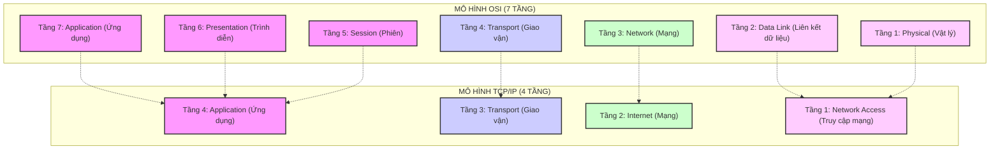

# MÔ HÌNH OSI (7 TẦNG) VS MÔ HÌNH TCP/IP (4 TẦNG): SỰ KHÁC BIỆT & ĐỐI CHIẾU CHI TIẾT

Trong thế giới mạng máy tính, việc truyền tải dữ liệu giữa các thiết bị được quản lý bởi các quy tắc chuẩn hóa gọi là **giao thức (protocols)**. Để tổ chức và hiểu cách các giao thức này hoạt động phối hợp với nhau, chúng ta sử dụng các **mô hình mạng phân tầng (layered networking models)**.

Hai mô hình nổi tiếng và quan trọng nhất là **Mô hình OSI (7 tầng)** và **Mô hình TCP/IP (4 tầng)**. Dưới đây là tài liệu chi tiết phân tích cấu trúc, chức năng và sự khác biệt giữa hai mô hình này.

---

## 1. TỔNG QUAN VỀ HAI MÔ HÌNH

*   **Mô hình OSI (Open Systems Interconnection):** Được phát triển bởi Tổ chức Tiêu chuẩn hóa Quốc tế (ISO) vào năm 1984. Đây là mô hình mang tính **học thuật, lý thuyết chuẩn tham chiếu** giúp mọi người hiểu và thiết kế hệ thống mạng một cách có hệ thống.
*   **Mô hình TCP/IP (Transmission Control Protocol / Internet Protocol):** Được phát triển bởi Bộ Quốc phòng Mỹ (DoD) vào những năm 1970. Đây là mô hình mang tính **thực tiễn cao**, được thiết kế trước và là nền tảng của mạng Internet toàn cầu ngày nay.

---

## 2. CHI TIẾT 7 TẦNG CỦA MÔ HÌNH OSI

Mô hình OSI phân tách quá trình truyền dữ liệu thành 7 tầng riêng biệt. Mỗi tầng phục vụ tầng phía trên nó và được phục vụ bởi tầng phía dưới.

| Tầng (Layer) | Tên tiếng Anh | Đơn vị dữ liệu (PDU) | Chức năng chính | Giao thức / Thiết bị tiêu biểu |
| :--- | :--- | :--- | :--- | :--- |
| **7. Ứng dụng** | Application | Data | Điểm giao tiếp trực tiếp giữa người dùng/ứng dụng và mạng. | HTTP, HTTPS, FTP, SMTP, DNS, SSH, gRPC |
| **6. Trình diễn** | Presentation | Data | Định dạng, mã hóa/giải mã, nén dữ liệu để tầng ứng dụng hiểu được. | SSL/TLS, ASCII, JPEG, GIF, MP4, JSON, XML |
| **5. Phiên** | Session | Data | Thiết lập, duy trì, đồng bộ và chấm dứt các phiên hội thoại giữa các ứng dụng. | NetBIOS, RPC, Sockets, PPTP |
| **4. Giao vận** | Transport | Segment / Datagram | Đảm bảo truyền tải dữ liệu tin cậy (hoặc nhanh) từ máy nguồn đến máy đích (End-to-End). | TCP, UDP |
| **3. Mạng** | Network | Packet | Định tuyến (Routing) và xác định địa chỉ logic (IP) để gói tin đi qua các mạng khác nhau. | IPv4, IPv6, ICMP, OSPF, BGP / **Router** |
| **2. Liên kết dữ liệu**| Data Link | Frame | Truyền dữ liệu giữa hai node kề nhau trong cùng một mạng LAN, kiểm soát lỗi vật lý, gán địa chỉ MAC. | Ethernet, Wi-Fi (802.11), PPP, ARP / **Switch, Bridge** |
| **1. Vật lý** | Physical | Bit | Chuyển đổi dữ liệu thành các tín hiệu điện, quang hoặc sóng vô tuyến để truyền qua dây cáp/không khí. | Cáp đồng UTP, Sợi cáp quang, Hub, Repeater |

---

## 3. CHI TIẾT 4 TẦNG CỦA MÔ HÌNH TCP/IP

Mô hình TCP/IP được thiết kế thực tế để giải quyết các vấn đề truyền thông thực tế. Nó gộp một số tầng của OSI để tạo ra kiến trúc gọn nhẹ hơn.

### Tầng 4: Application (Ứng dụng)
*   **Tương đương OSI:** Gộp cả 3 tầng cao nhất của OSI: **Application, Presentation và Session**.
*   **Chức năng:** Xử lý các giao thức cấp cao, giao tiếp trực tiếp với người dùng và định dạng dữ liệu. Do không tách riêng tầng Presentation và Session, các ứng dụng TCP/IP tự quản lý các tác vụ như mã hóa dữ liệu (ví dụ: HTTPS tự xử lý TLS) hay quản lý phiên kết nối (ví dụ: HTTP Cookie, Session ID).
*   **Giao thức chính:** HTTP, HTTPS, DNS, SMTP, FTP, SSH.

### Tầng 3: Transport (Giao vận)
*   **Tương đương OSI:** Tương đương hoàn toàn với tầng **Transport** của OSI.
*   **Chức năng:** Đảm nhận việc truyền dữ liệu giữa các tiến trình (Process-to-Process) thông qua địa chỉ cổng (**Port**). Quản lý kết nối luồng truyền dẫn.
*   **Giao thức chính:** 
    *   **TCP (Transmission Control Protocol):** Hướng kết nối, đảm bảo dữ liệu đến đích nguyên vẹn, đúng thứ tự (tin cậy cao).
    *   **UDP (User Datagram Protocol):** Không hướng kết nối, gửi dữ liệu nhanh chóng mà không cần kiểm tra phản hồi (tốc độ cao).

### Tầng 2: Internet (Mạng)
*   **Tương đương OSI:** Tương đương với tầng **Network** của OSI.
*   **Chức năng:** Định vị các thiết bị qua địa chỉ logic (**IP Address**) và tìm đường đi tối ưu nhất (**Routing**) để chuyển dữ liệu từ mạng này sang mạng khác.
*   **Giao thức chính:** IP (IPv4/IPv6), ICMP (dùng cho lệnh ping/traceroute), ARP (dịch IP sang địa chỉ MAC vật lý).

### Tầng 1: Network Access (Truy cập mạng / Liên kết)
*   **Tương đương OSI:** Gộp cả tầng **Data Link** và tầng **Physical** của OSI.
*   **Chức năng:** Chịu trách nhiệm đưa dữ liệu ra môi trường truyền dẫn vật lý (cáp quang, cáp đồng, Wi-Fi). Quản lý địa chỉ vật lý (**MAC**) và chuyển đổi cấu trúc khung dữ liệu (Frame) thành dòng bit tín hiệu nhị phân.
*   **Công nghệ phổ biến:** Ethernet (cáp LAN), Wi-Fi, DSL, các Driver điều khiển thiết bị phần cứng (Card mạng NIC).

---

## 4. SỰ KHÁC BIỆT CỐT LÕI GIỮA OSI VÀ TCP/IP

| Tiêu chí so sánh | Mô hình OSI (7 tầng) | Mô hình TCP/IP (4 tầng) |
| :--- | :--- | :--- |
| **Tính chất** | Là mô hình **Tham chiếu lý thuyết** (Academic/Reference model). | Là mô hình **Thực tiễn** (Practical/Implementation model). |
| **Lịch sử ra đời** | Ra đời **sau** khi các giao thức được phát minh. Được thiết kế để làm chuẩn hóa chung. | Ra đời **trước** (được thiết kế chung với các giao thức TCP và IP). |
| **Cấu trúc tầng** | Có **7 tầng** riêng biệt, phân chia chi tiết và rạch ròi. | Có **4 tầng** tối giản hơn (hoặc 5 tầng tùy quan điểm hiện đại). |
| **Tầng Ứng dụng** | Tách biệt thành 3 tầng: Application, Presentation, Session. | Gộp chung thành 1 tầng duy nhất: Application. |
| **Tầng Vật lý/Dữ liệu** | Tách biệt thành Physical và Data Link. | Gộp chung thành Network Access (Link Layer). |
| **Tính độc lập** | Ranh giới giữa các tầng rất rõ ràng. Độc lập với các giao thức cụ thể. | Ranh giới ít rõ ràng hơn. Mô hình phụ thuộc nhiều vào bộ giao thức TCP/IP gốc. |
| **Hỗ trợ kết nối ở tầng Mạng**| Hỗ trợ cả **Hướng kết nối** (Connection-oriented) và **Không hướng kết nối** (Connectionless). | Chỉ hỗ trợ **Không hướng kết nối** (IP). |
| **Hỗ trợ kết nối ở tầng Giao vận**| Chỉ hỗ trợ **Hướng kết nối**. | Hỗ trợ cả hai: **Hướng kết nối** (TCP) và **Không hướng kết nối** (UDP). |
| **Trạng thái thực tế** | Chỉ dùng để học tập, giảng dạy và nghiên cứu thiết kế hệ thống. | Là tiêu chuẩn thực tế vận hành toàn bộ mạng Internet ngày nay. |

---

## 5. TẠI SAO MÔ HÌNH TCP/IP CHIẾN THẮNG TRONG THỰC TẾ?

Mặc dù mô hình OSI rất chặt chẽ và hoàn hảo về mặt lý thuyết, nhưng TCP/IP đã trở thành chuẩn thực tế vì những lý do sau:

1.  **Tính thực tế và kịp thời:** Bộ giao thức TCP/IP được hoàn thiện và tích hợp miễn phí vào hệ điều hành UNIX từ rất sớm. Khi mô hình OSI ra đời (1984), TCP/IP đã được sử dụng rộng rãi khắp thế giới.
2.  **Thiết kế đơn giản và hiệu quả:** Việc phân rạch ròi tầng Session và Presentation của OSI là quá phức tạp và dư thừa. Hầu hết các ứng dụng thực tế đều muốn tự quản lý định dạng dữ liệu (mã hóa, nén) thay vì giao phó cho một tầng mạng trung gian của hệ điều hành.
3.  **Khả năng mở rộng tốt:** Triết lý thiết kế của TCP/IP tập trung vào việc **"giữ cho lõi mạng đơn giản, đưa sự phức tạp ra vùng biên"** (End-to-End Principle). Tầng Internet chỉ làm một việc duy nhất là chuyển gói tin đi một cách nhanh nhất (Best-effort), không đảm bảo độ tin cậy. Việc bảo đảm độ tin cậy được đẩy lên tầng trên (TCP ở tầng Giao vận). Điều này giúp Internet có khả năng mở rộng (scale) lên quy mô toàn cầu cực kỳ dễ dàng.

---

## 6. GHI CHÚ VỀ MÔ HÌNH TCP/IP 5 TẦNG (MODERN TCP/IP)

Trong giảng dạy hiện đại (như trong giáo trình của thầy James Kurose), các tác giả thường giới thiệu **Mô hình TCP/IP 5 tầng** để dễ đối chiếu với OSI:
1.  **Application (Ứng dụng)**
2.  **Transport (Giao vận)**
3.  **Network (Mạng) - tương đương tầng Internet**
4.  **Data Link (Liên kết dữ liệu)**
5.  **Physical (Vật lý)**

Mô hình 5 tầng này giữ nguyên tầng ứng dụng gộp của TCP/IP, nhưng tách tầng Network Access ở dưới cùng thành Physical và Data Link của OSI vì việc dạy học trên lớp về Switch (Data Link) và Cáp truyền dẫn (Physical) vẫn rất cần ranh giới rạch ròi. Tuy nhiên, về mặt kỹ thuật gốc, mô hình RFC chuẩn của TCP/IP (RFC 1122) vẫn là **4 tầng**.
