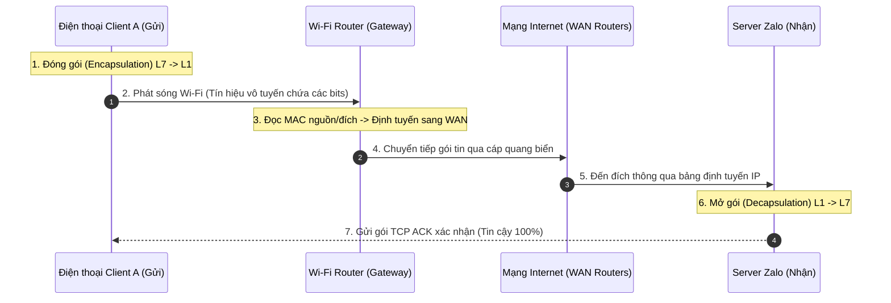
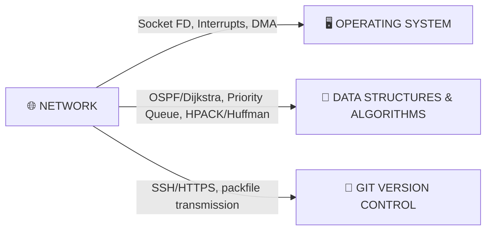

# MẠNG MÁY TÍNH NÂNG CAO (NETWORK ADVANCED)

Tài liệu này đi sâu vào các khía cạnh nâng cao của mạng máy tính, bao gồm luồng truyền tải dữ liệu thực tế (Zalo, YouTube), phân tích các ngách kỹ thuật sâu của hệ thống và liên kết liên môn với Hệ điều hành (OS), Cấu trúc dữ liệu & Giải thuật (DSA) và Git.

---

## 🔄 1. LUỒNG TRUYỀN DỮ LIỆU THỰC TẾ (CUSTOM TRANSMISSION FLOWS)

Để hiểu cách các tầng và thiết bị hoạt động đồng bộ với nhau, hãy cùng phân tích hai luồng truyền tải dữ liệu thực tế dưới đây:

### 💬 1.1. Luồng 1: Gửi tin nhắn Zalo ("Học internet nè mọi người")
*   **Đặc trưng:** Định dạng văn bản ngắn, yêu cầu độ tin cậy tuyệt đối 100% (không được phép mất chữ hay sai lệch ký tự).



#### Quy trình chi tiết tại các Tầng:

1.  **Quá trình Đóng gói (Encapsulation) tại Client A:**
    *   **Tầng 7, 6, 5 (Application, Presentation, Session):** Zalo tiếp nhận chuỗi ký tự `"Học internet nè mọi người"`. Nó dịch văn bản sang chuẩn **UTF-8** để giữ nguyên dấu Tiếng Việt, mã hóa bảo mật toàn bộ dữ liệu bằng **TLS/SSL (HTTPS)** để tránh bị nghe lén, và gắn Token xác thực tài khoản.
    *   **Tầng 4 (Transport):** Encapsulate dữ liệu vào một **TCP Segment**. Hệ thống tự động gán: *Source Port (ví dụ: 54321)* và *Destination Port (443 - cổng HTTPS tiêu chuẩn)*. Đồng thời thiết lập số thứ tự gói tin (`Sequence Number`) để đảm bảo bên nhận có thể ghép lại đúng thứ tự.
    *   **Tầng 3 (Network):** Encapsulate TCP Segment vào một **IP Packet**. Gán: *Source IP (IP nội bộ của điện thoại)* và *Destination IP (IP của Server Zalo)*.
    *   **Tầng 2 (Data Link):** Encapsulate IP Packet vào một **Ethernet/Wi-Fi Frame**. Gán: *Source MAC (MAC card mạng điện thoại)* và *Destination MAC (MAC của Wi-Fi Router)*.
    *   **Tầng 1 (Physical):** Card Wi-Fi của điện thoại điều chế dữ liệu nhị phân thành sóng điện từ và phát ra không trung.

2.  **Chuyển tiếp tại Wi-Fi Router (Gateway):**
    *   Wi-Fi Router thu nhận sóng vô tuyến, chuyển về dạng nhị phân, mở Frame Layer 2 để kiểm tra địa chỉ MAC. Thấy địa chỉ MAC đích trùng với mình, nó bóc bỏ vỏ Layer 2 để đọc IP Packet bên trong.
    *   Nó đọc IP đích (Zalo Server), tra cứu bảng định tuyến, rồi đóng vỏ Layer 2 mới (thay MAC nguồn bằng MAC cổng WAN của nó, MAC đích bằng MAC của Router nhà mạng ISP kế tiếp) và truyền qua cáp đồng/cáp quang ra ngoài Internet.

3.  **Truyền tải xuyên mạng diện rộng (WAN Internet):**
    *   Gói tin đi qua hàng loạt router trung gian trên toàn cầu thông qua cáp quang biển. Mỗi router chỉ bóc vỏ Layer 2, đọc địa chỉ IP ở Layer 3 để định tuyến tiếp, rồi lại đóng vỏ Layer 2 mới. Địa chỉ IP nguồn và đích luôn được giữ nguyên trong suốt quá trình.

4.  **Quá trình Mở gói (Decapsulation) tại Server Zalo:**
    *   Server Zalo nhận tín hiệu nhị phân từ cáp quang $\rightarrow$ bóc vỏ Layer 2 (MAC) $\rightarrow$ bóc vỏ Layer 3 (IP) $\rightarrow$ đưa TCP Segment lên Layer 4.
    *   **Cơ chế tin cậy (TCP ACK):** Server kiểm tra tính toàn vẹn của dữ liệu bằng Checksum. Nếu dữ liệu hoàn hảo, Server gửi ngược lại một gói tin **TCP ACK** về cho Client A để xác nhận đã nhận thành công. Nếu Client A không nhận được ACK này trong khoảng thời gian quy định, nó sẽ tự động gửi lại (Retransmit) gói tin đó.
    *   Ứng dụng Zalo trên Server đọc dữ liệu từ Socket Buffer, giải mã TLS, đọc chuỗi UTF-8 và lưu vào Database, sau đó đẩy thông báo tới người nhận.

---

### 🎥 1.2. Luồng 2: Xem video trên YouTube (YouTube Video Streaming)
*   **Đặc trưng:** Dung lượng dữ liệu cực lớn, yêu cầu truyền tải thời gian thực liên tục, chấp nhận mất mát nhỏ nhưng không được để xảy ra hiện tượng đứng màn hình (buffering).

```
[Server YouTube - CDN tại VN] === (Video Chunks qua UDP/QUIC) ===> [Router ISP] ===> [Laptop của bạn]
                                                                                      (Video Buffer: 30s)
                                                                                      (Tự động hạ độ phân giải)
```

#### Quy trình chi tiết tại các Tầng:

1.  **Giao thức truyền tải QUIC (chạy trên UDP):**
    *   Thay vì dùng TCP tốn thời gian bắt tay 3 bước (3-way handshake) và bị nghẽn cổ chai khi mất gói (Head-of-Line Blocking), YouTube hiện đại sử dụng **QUIC** (chạy trên nền **UDP** ở Layer 4). QUIC cho phép thiết lập kết nối ngay lập tức (0-RTT) và truyền nhiều luồng dữ liệu song song độc lập. Nếu mất 1 gói tin của khung hình này, các khung hình khác vẫn được tải bình thường mà không bị dừng toàn bộ luồng.

2.  **Chia nhỏ video (Video Chunking) & DASH:**
    *   YouTube chia một video thành hàng trăm "lát cắt" nhỏ gọi là **Chunks** (mỗi chunk dài khoảng 2 - 5 giây) và mã hóa ở nhiều độ phân giải khác nhau (360p, 480p, 720p, 1080p, 4K).
    *   Trình phát video trên máy bạn sử dụng công nghệ **DASH** (Dynamic Adaptive Streaming over HTTP) để đo tốc độ mạng thời gian thực. Nếu mạng khỏe, nó yêu cầu tải các chunk tiếp theo ở độ phân giải 1080p. Nếu mạng đột ngột yếu đi, nó chủ động hạ yêu cầu chunk tiếp theo xuống 480p để tránh việc video bị dừng quay tròn (buffering wheel).

3.  **Tối ưu hóa bằng CDN (Content Delivery Network):**
    *   Khi bạn truy cập YouTube tại Việt Nam, yêu cầu tải video không chạy sang tận máy chủ gốc của Google ở Mỹ. Nó sẽ được định tuyến thông minh đến máy chủ **GGC (Google Global Cache)** - một dạng CDN đặt ngay bên trong hạ tầng của các nhà mạng Việt Nam (Viettel, VNPT, FPT). RTT giảm từ 200ms xuống <10ms, giúp tải video ngay lập tức.

4.  **Cơ chế đệm dữ liệu (Buffering):**
    *   Trình phát luôn cố gắng tải trước một lượng dữ liệu video (ví dụ: tải trước 30 giây tiếp theo). Đây là "vùng đệm an toàn" giúp bạn xem video mượt mà ngay cả khi mạng bị chập chờn trong vài giây.

---

## 🧠 2. KHAI THÁC CÁC NGÁCH SÂU HỆ THỐNG (NICHE & CORNER CASES)

Dưới đây là các ngách kiến thức kỹ thuật sâu sắc kết nối phần cứng và nhân hệ điều hành (Kernel OS) ít người biết đến:

### ⚙️ 2.1. Socket Descriptor vs TCP Connection
Khi ứng dụng của bạn tạo một kết nối mạng, hệ điều hành (OS) quản lý nó như thế nào?

```
[Ứng dụng] ---> Socket File Descriptor (ví dụ: fd: 4)
                      |
                      v
             [OS Kernel Space]
      +-------------------------------+
      |  - Send Buffer / Recv Buffer  |
      |  - TCP State (ESTABLISHED)    |
      +-------------------------------+
```

*   **Bản chất:** OS coi Socket là một dạng tệp tin đặc biệt và cấp cho nó một số nguyên gọi là **File Descriptor (FD)**. 
*   **Vùng nhớ đệm (Socket Buffers):** Khi kết nối được thiết lập, OS Kernel sẽ cấp phát hai vùng đệm RAM cho riêng Socket đó: `Send Buffer` (chứa dữ liệu chờ gửi đi) và `Receive Buffer` (chứa dữ liệu nhận từ mạng về chờ ứng dụng đọc).
*   **SYN Backlog Queue & SYN Flood:** Khi có kết nối TCP mới gửi gói tin SYN đến, OS sẽ đưa kết nối đó vào hàng đợi **SYN Backlog** (chờ bắt tay 3 bước hoàn tất). Kẻ tấn công lợi dụng điều này để gửi hàng triệu gói SYN giả mạo nhưng không bao giờ phản hồi ACK cuối cùng, khiến hàng đợi SYN Backlog bị tràn và làm sập khả năng nhận kết nối của server. Hệ điều hành hiện đại chống lại điều này bằng kỹ thuật **SYN Cookies** (mã hóa thông tin kết nối vào số Sequence Number để không cần lưu trạng thái trong hàng đợi).

---

### 📥 2.2. NIC Hardware Interrupts & Direct Memory Access (DMA)
Làm thế nào dữ liệu đi từ sợi cáp mạng vật lý vào được RAM máy tính mà không làm CPU quá tải?

```
[Cáp mạng] -> [Cổng vật lý NIC] -> [NIC Ring Buffer] 
                                         |
                                         | (DMA - tự chép vào RAM)
                                         v
   [CPU] <-- (IRQ - Ngắt phần cứng) -- [RAM]
```

*   **Direct Memory Access (DMA):** Khi các gói tin mạng truyền tới cổng vật lý của card mạng (NIC), NIC sẽ tự động ghi dữ liệu này trực tiếp vào bộ nhớ RAM của hệ thống (vùng nhớ được cấu hình trước gọi là Rx Ring Buffer) bằng công nghệ **DMA**, hoàn toàn không cần CPU tham gia chép dữ liệu.
*   **Hardware Interrupt (IRQ):** Sau khi chép xong dữ liệu vào RAM, card mạng phát ra một tín hiệu ngắt phần cứng (**Interrupt Request - IRQ**) qua bus hệ thống gửi tới CPU.
*   **Xử lý ngắt (SoftIRQ):** CPU nhận tín hiệu ngắt, tạm dừng công việc hiện tại để chuyển sang chạy chương trình xử lý ngắt mạng của OS Kernel (softirq). Nó lấy dữ liệu từ RAM ra, bóc tách các tầng IP/TCP và đẩy lên cho ứng dụng. Cơ chế này giúp CPU giải phóng hoàn toàn khỏi công việc sao chép dữ liệu tầm thường.

---

### 🔄 2.3. Event Polling: epoll/kqueue vs select/poll
Làm thế nào một Web Server (Nginx, Node.js) có thể xử lý hàng triệu kết nối mạng đồng thời mà không bị treo máy?

*   **Thời kỳ cũ (select/poll):** Khi muốn kiểm tra xem có Socket nào có dữ liệu mới hay không, OS phải duyệt tuần tự qua toàn bộ danh sách các Socket đang mở. Độ phức tạp là **$O(N)$** với $N$ là số lượng kết nối. Khi $N$ đạt hàng chục nghìn, CPU chỉ ăn và đi lặp kiểm tra Socket, gây nghẽn nghiêm trọng.
*   **Thời kỳ hiện đại (epoll trên Linux, kqueue trên macOS/BSD):** Sử dụng cơ chế hướng sự kiện (Event-driven). OS Kernel đăng ký các Socket vào một cấu trúc dữ liệu cây đỏ-đen. Khi card mạng báo có dữ liệu cho một Socket cụ thể, Kernel tự động gọi hàm callback để đưa Socket đó vào một danh sách riêng. Web Server chỉ cần đọc danh sách này với độ phức tạp **$O(1)$**, giúp đạt hiệu năng tải cực lớn.

---

### 🏎️ 2.4. TCP Congestion Control: BBR vs Cubic
Làm thế nào để truyền tải dữ liệu nhanh nhất mà không làm nghẽn đường truyền?

*   **Cubic (Dựa trên mất gói - Loss-based):** Là thuật toán truyền thống. Nó liên tục tăng tốc độ gửi dữ liệu cho đến khi xảy ra hiện tượng mất gói tin (Drop packet), nó coi đó là dấu hiệu nghẽn mạng và lập tức tự cắt giảm 50% tốc độ gửi. Điều này dẫn đến sự dao động tốc độ hình răng cưa và gây tích tụ hàng đợi tại router (Bufferbloat).
*   **BBR (Bottleneck Bandwidth and RTT - Dựa trên mô hình vật lý):** Do Google phát triển. BBR không đợi đến khi mất gói mới giảm tốc độ. Nó liên tục đo đạc **Băng thông thắt nút thực tế (Bottleneck Bandwidth)** và **Thời gian phản hồi ngắn nhất (min RTT)** của đường truyền để điều phối tốc độ gửi dữ liệu tiệm cận mức tối đa của đường ống vật lý. Kết quả là tốc độ truyền tải cực kỳ ổn định và mượt mà, đặc biệt hiệu quả trên mạng không dây chập chờn.

---

### 📦 2.5. MTU (Maximum Transmission Unit) & Path MTU Discovery (PMTUD)
*   **MTU là gì?** Kích thước tối đa của một gói tin IP có thể đi qua một đường truyền vật lý (tiêu chuẩn của Ethernet là 1500 bytes).
*   **IP Fragmentation (Phân mảnh):** Nếu một gói tin có kích thước 1500 bytes đi qua một router trung gian mà cổng ra của router đó chỉ hỗ trợ MTU 1400 bytes, router bắt buộc phải xẻ gói tin làm đôi (phân mảnh) rồi gửi đi. Việc này làm hao tổn CPU của router và nếu mất 1 mảnh thì toàn bộ gói tin bị hủy.
*   **PMTUD:** Để tránh phân mảnh, thiết bị gửi thiết lập cờ **DF (Don't Fragment)** trong IP Header. Khi gặp router có MTU nhỏ hơn, router sẽ loại bỏ gói tin và gửi lại tin nhắn báo lỗi **ICMP Type 3 Code 4 (Fragmentation Needed)** kèm theo thông số MTU của nó. Bên gửi nhận được sẽ tự động giảm kích thước gói tin gửi đi cho phù hợp với toàn bộ lộ trình đường truyền.

---

## 🔗 3. LIÊN KẾT LIÊN MÔN (CROSS-FOLDER CONNECTIONS)

Kiến thức Mạng máy tính không đứng cô lập mà có sợi dây liên kết mật thiết với các kiến thức môn học khác:



### 🖥️ 3.1. Liên kết với Hệ điều hành (OS)
*   **Cấp phát bộ nhớ Socket:** Khi bạn chạy hàm `socket()` trong Java hay C, OS Kernel thực thi hệ thống quản lý bộ nhớ để cấp phát vùng đệm trong RAM cho Socket.
*   **Ngắt CPU:** Card mạng NIC tương tác trực tiếp với bộ điều khiển ngắt (APIC) của bo mạch chủ để gửi tín hiệu ngắt phần cứng tới CPU, kích hoạt trình điều khiển thiết bị (Device Driver) xử lý.
*   **DMA và Zero-copy:** Để tối ưu hóa hiệu năng truyền file qua mạng (ví dụ khi chạy Kafka hoặc Nginx), OS hỗ trợ kỹ thuật **Zero-copy (hàm `sendfile`)** giúp chép trực tiếp dữ liệu từ ổ cứng (Page Cache) vào RAM của Socket thông qua DMA mà không cần chép trung gian qua vùng nhớ của ứng dụng (User Space), giảm tải CPU tối đa.

### 🧠 3.2. Liên kết với Cấu trúc dữ liệu & Giải thuật (DSA)
*   **Giải thuật định tuyến đường đi:** Các giao thức định tuyến mạng như OSPF chạy thuật toán **Dijkstra** trên đồ thị mạng lưới các Router để tìm đường đi ngắn nhất. Giao thức RIP chạy thuật toán **Bellman-Ford**.
*   **Hàng đợi ưu tiên (Priority Queue):** Được sử dụng trong cơ chế quản lý chất lượng dịch vụ (QoS) trên router. Khi router bị quá tải gói tin, các gói tin quan trọng (cuộc gọi thoại, stream video) được xếp vào Priority Queue để đẩy đi trước, các gói tin tải file (FTP, torrent) bị xếp vào hàng đợi thường để xử lý sau.
*   **Mã hóa Huffman (Huffman Coding):** Giao thức HTTP/2 sử dụng thuật toán nén đầu bảng (Header Compression) tên là **HPACK**, bên dưới sử dụng bảng mã hóa Huffman tĩnh để nén tên và giá trị của các header truyền đi nhằm tiết kiệm băng thông tối đa.
*   **Hashing (Hàm băm):** Được sử dụng liên tục trong giao thức TLS để băm kiểm tra tính toàn vẹn dữ liệu (HMAC với SHA-256) và thiết lập khóa phiên làm việc.

### 🔧 3.3. Liên kết với Git
Khi bạn thực hiện lệnh `git push`, dữ liệu được vận chuyển qua mạng như thế nào?
*   **Qua SSH (Cổng 22):** Git gọi chương trình SSH để kết nối tới server (ví dụ GitHub). Hai bên thực hiện trao đổi khóa (Diffie-Hellman) để mã hóa đường truyền. Sau đó, Git chạy giải thuật nén tạo ra một tệp tin nén duy nhất gọi là **Packfile** và stream tệp tin nhị phân này qua cổng kết nối SSH TCP chạy trực tiếp đến đích.
*   **Qua HTTPS (Cổng 443):** Git sử dụng thư viện mạng (như libcurl) để thực hiện một loạt yêu cầu HTTP POST gửi Packfile lên server. Đường truyền được bảo vệ bằng TLS Handshake thiết lập ở Layer 5-7 của mô hình mạng.
