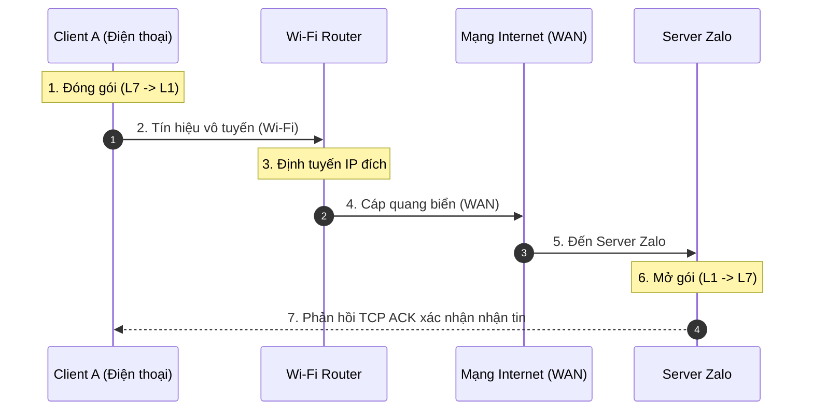

# MẠNG MÁY TÍNH NÂNG CAO (NETWORK ADVANCED)

Tài liệu này tổng hợp các kiến thức mạng máy tính nâng cao. Mỗi phần chỉ tập trung vào câu trả lời trực diện, từ khóa chuyên môn cốt lõi, luồng truyền tải dữ liệu và liên kết liên môn.

---

## 1. LUỒNG TRUYỀN DỮ LIỆU THỰC TẾ (CUSTOM TRANSMISSION FLOWS)

### 1.1. Luồng 1: Gửi tin nhắn Zalo ("Học internet nè mọi người")
*   **Đặc trưng:** Văn bản ngắn, yêu cầu độ tin cậy tuyệt đối 100% (không được mất chữ). Sử dụng giao thức **TCP**.

#### Quy trình tóm gọn các bước:
1.  **Đóng gói tại Client (Encapsulation):**
    *   *Tầng 7, 6, 5 (Application):* Bản tin `"Học internet nè mọi người"` được dịch sang mã **UTF-8**, mã hóa bảo mật bằng **TLS/SSL**, và gắn Token xác thực.
    *   *Tầng 4 (Transport):* Đóng gói thành **TCP Segment**, gắn Port nguồn (ví dụ: 54321) và Port đích (443 - HTTPS). Gán `Sequence Number` để xếp thứ tự.
    *   *Tầng 3 (Network):* Đóng gói thành **IP Packet**, gắn IP nguồn (máy gửi) và IP đích (Server Zalo).
    *   *Tầng 2 (Data Link):* Đóng gói thành **Wi-Fi Frame**, gắn MAC nguồn (card mạng) và MAC đích (Wi-Fi Router).
    *   *Tầng 1 (Physical):* Card Wi-Fi điều chế dữ liệu nhị phân thành sóng điện từ phát đi.
2.  **Định tuyến tại Router & WAN:** 
    *   Wi-Fi Router nhận sóng vô tuyến, bóc vỏ Layer 2 (MAC), đọc Layer 3 (IP) để tra cứu bảng định tuyến. Nó đóng vỏ Layer 2 mới rồi chuyển tiếp qua mạng WAN của ISP.
    *   Gói tin đi qua chuỗi router trung gian trên mạng Internet bằng cách liên tục bóc/đóng vỏ Layer 2, giữ nguyên IP nguồn/đích ở Layer 3.
3.  **Mở gói tại Server Zalo (Decapsulation):**
    *   Server Zalo nhận tín hiệu nhị phân, bóc vỏ Layer 2 $\rightarrow$ Layer 3 $\rightarrow$ Layer 4. 
    *   Kiểm tra checksum dữ liệu, nếu toàn vẹn sẽ đưa vào Socket Buffer và gửi gói **TCP ACK** ngược lại về Client A. Nếu Client A không nhận được ACK trong thời gian chờ (RTO), nó sẽ tự động gửi lại gói tin.
    *   Ứng dụng Zalo đọc từ Socket Buffer, giải mã TLS và lưu vào Cơ sở dữ liệu.

---

### 1.2. Luồng 2: Xem video trên YouTube (YouTube Video Streaming)
*   **Đặc trưng:** Dung lượng dữ liệu lớn, truyền tải thời gian thực liên tục, chấp nhận mất mát nhỏ nhưng không được phép xảy ra hiện tượng đứng màn hình (buffering). Sử dụng giao thức **QUIC (chạy trên UDP)**.

#### Quy trình tóm gọn các bước:
1.  **Giao thức UDP/QUIC ở Layer 4:** YouTube sử dụng **QUIC** (chạy trên nền UDP) thay vì TCP. QUIC cho phép kết nối ngay lập tức (0-RTT), truyền nhiều luồng dữ liệu song song độc lập. Nếu mất 1 gói tin, các luồng khác vẫn tải bình thường, loại bỏ lỗi Head-of-Line Blocking của TCP.
2.  **Chia nhỏ video (Video Chunking) & DASH:** Video được chia thành các đoạn nhỏ gọi là **Chunks** (dài 2-5 giây) với nhiều độ phân giải khác nhau (360p, 720p, 1080p). Trình phát sử dụng cơ chế **DASH** tự động đo tốc độ mạng để yêu cầu độ phân giải chunk tiếp theo phù hợp (mạng yếu hạ độ phân giải, mạng khỏe tăng độ phân giải để tránh quay vòng tròn).
3.  **Mạng phân phối nội dung (CDN):** Yêu cầu tải video được định tuyến đến máy chủ **Google Global Cache (GGC)** đặt ngay tại nhà mạng nội địa Việt Nam (Viettel, VNPT, FPT) thay vì máy chủ ở Mỹ. RTT giảm xuống <10ms, giúp video chạy tức thì.
4.  **Vùng đệm (Buffering):** Trình phát luôn chủ động tải trước một lượng video (ví dụ: 30 giây tiếp theo) để dự phòng mạng chập chập chờn.

---

## 2. KHAI THÁC CÁC NGÁCH SÂU HỆ THỐNG (NICHE & CORNER CASES)

### 2.1. Socket Descriptor vs TCP Connection
*   **Câu hỏi thực tế:** Hệ điều hành quản lý kết nối TCP như thế nào?
*   **Trả lời:** OS Kernel coi mỗi Socket là một file đặc biệt và cấp cho nó một số nguyên gọi là **Socket File Descriptor (FD)**. Khi kết nối được thiết lập, OS cấp phát hai vùng đệm RAM cho riêng Socket đó: `Send Buffer` (để gửi) và `Receive Buffer` (để nhận).
*   **Từ khóa cần nhớ:** 
    *   **SYN Backlog Queue:** Hàng đợi lưu các kết nối chưa hoàn tất bắt tay 3 bước.
    *   **SYN Flood Attack:** Kẻ tấn công gửi hàng loạt gói SYN nhưng không phản hồi ACK cuối để làm tràn hàng đợi SYN Backlog. OS chống lại bằng cờ **SYN Cookies**.

### 2.2. NIC Hardware Interrupts & Direct Memory Access (DMA)
*   **Câu hỏi thực tế:** Làm thế nào dữ liệu từ cáp mạng đi vào RAM mà không làm CPU quá tải?
*   **Trả lời:** Card mạng (NIC) sử dụng công nghệ **DMA (Direct Memory Access)** để ghi dữ liệu trực tiếp từ cổng vật lý vào RAM của hệ thống (Rx Ring Buffer) mà không cần CPU tham gia. Khi chép xong, NIC phát tín hiệu ngắt phần cứng (**IRQ**) gửi tới CPU. CPU tạm dừng tác vụ hiện tại để gọi SoftIRQ xử lý gói tin mạng từ RAM lên ứng dụng.

### 2.3. Event Polling: epoll/kqueue vs select/poll
*   **Câu hỏi thực tế:** Tại sao Web Server (Nginx, Node.js) chịu tải được hàng triệu kết nối đồng thời?
*   **Trả lời:** Nhờ mô hình Event-driven thay thế cho kiểm tra tuần tự.
    *   **select/poll (Cũ):** Duyệt tuần tự qua toàn bộ danh sách kết nối để kiểm tra có dữ liệu hay không ($O(N)$ time). Cực kỳ chậm khi số kết nối lớn.
    *   **epoll (Linux) / kqueue (macOS) (Hiện đại):** OS Kernel lưu các socket vào cây đỏ-đen, khi có sự kiện mạng, Kernel tự gọi callback đưa socket vào hàng đợi sẵn sàng. Ứng dụng chỉ đọc các socket đã sẵn sàng với độ phức tạp **$O(1)$ time**.

### 2.4. TCP Congestion Control: BBR vs Cubic
*   **Câu hỏi thực tế:** Sự khác biệt giữa thuật toán kiểm soát tắc nghẽn BBR và Cubic?
*   **Trả lời:**
    *   **Cubic (Loss-based):** Tăng tốc độ gửi cho đến khi xảy ra mất gói (packet loss) thì đột ngột giảm 50% cửa sổ truyền. Gây răng cưa và tích tụ hàng đợi tại router.
    *   **BBR (Bandwidth/RTT-based):** Do Google phát triển. Nó chủ động đo đạc băng thông thực tế (Bottleneck Bandwidth) và thời gian RTT ngắn nhất của đường truyền để điều phối tốc độ gửi tối ưu, tránh tích tụ hàng đợi và hoạt động rất tốt trên mạng không dây chập chờn.

### 2.5. MTU (Maximum Transmission Unit) & Path MTU Discovery (PMTUD)
*   **MTU:** Kích thước gói tin IP tối đa đi qua đường truyền (Ethernet tiêu chuẩn là 1500 bytes). Nếu gói tin lớn hơn, Router phải thực hiện phân mảnh (**IP Fragmentation**), gây tốn CPU.
*   **PMTUD:** Giải pháp tránh phân mảnh. Thiết bị gửi cắm cờ DF (Don't Fragment) vào gói tin. Nếu gói tin vượt quá MTU của router trung gian, router sẽ drop gói tin và gửi lại gói tin báo lỗi **ICMP Type 3 Code 4 (Fragmentation Needed)** kèm theo thông số MTU của nó. Thiết bị gửi dựa vào đó giảm kích thước gói tin cho phù hợp toàn bộ hành trình.

### 2.6. DNS Vulnerabilities (Cache Poisoning) & DNSSEC
*   **DNS Cache Poisoning (Đầu độc bộ nhớ đệm):** Kẻ tấn công gửi phản hồi DNS giả mạo cực nhanh về resolver trước khi server thật trả lời, lừa resolver lưu IP giả vào cache để điều hướng người dùng sang trang web lừa đảo.
*   **DNSSEC:** Giải pháp bảo mật ký số (cryptographic signature) lên các bản ghi DNS để resolver xác thực nguồn gốc và tính toàn vẹn dữ liệu, chống giả mạo.

---

## 3. LIÊN KẾT LIÊN MÔN (CROSS-FOLDER CONNECTIONS)

### 3.1. Liên kết với Hệ điều hành (OS)
*   **Zero-copy (hàm `sendfile`):** OS tối ưu hóa truyền file qua mạng bằng cách cho phép sao chép dữ liệu trực tiếp từ ổ cứng vào vùng đệm Socket thông qua DMA, bỏ qua bước sao chép trung gian lên vùng nhớ ứng dụng (User Space), giảm tải CPU tối đa.

### 3.2. Liên kết với Cấu trúc dữ liệu & Giải thuật (DSA)
*   **Dijkstra và Bellman-Ford:** Giao thức định tuyến OSPF chạy Dijkstra trên đồ thị các Router để tìm đường ngắn nhất. Giao thức RIP chạy Bellman-Ford.
*   **Priority Queue:** Router dùng hàng đợi ưu tiên để lập lịch gói tin (QoS). Ưu tiên đẩy gói thoại/video đi trước, gói tải file (FTP/Torrent) đi sau.
*   **Mã hóa Huffman:** HTTP/2 dùng thuật toán **HPACK** nén đầu bảng (Header), bên dưới chạy bảng mã hóa Huffman tĩnh để tiết kiệm băng thông.

### 3.3. Liên kết với Git
*   **git push qua SSH (Port 22):** Thiết lập kênh mã hóa qua Diffie-Hellman TCP. Git chạy giải thuật nén tạo ra tệp tin nhị phân **Packfile** và stream tệp tin này qua luồng TCP đến GitHub.
*   **git push qua HTTPS (Port 443):** Thực hiện bắt tay bảo mật TLS, sau đó truyền tải Packfile thông qua các yêu cầu HTTP POST chuẩn.
