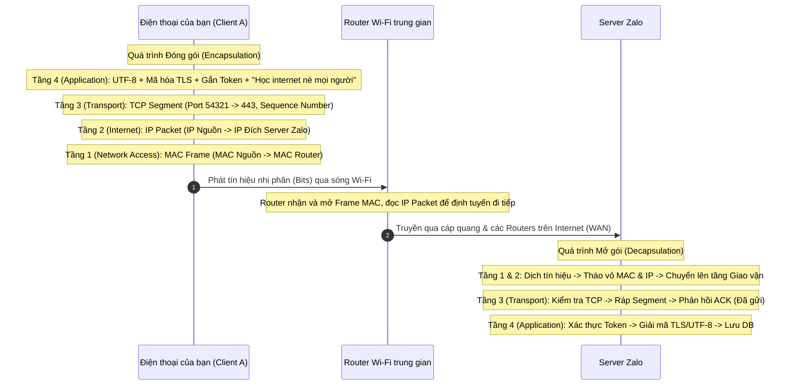
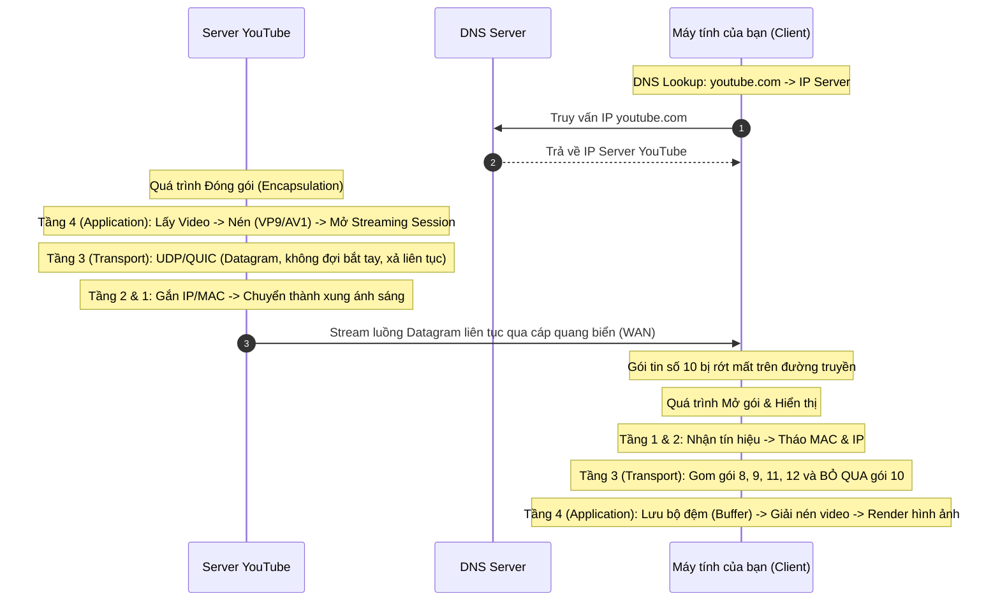

# SƠ ĐỒ TƯ DUY & KIẾN THỨC BẢN CHẤT VỀ MẠNG MÁY TÍNH (NETWORKING MINDMAP)

Tài liệu này hệ thống hóa các kiến thức nền tảng về mạng máy tính, được khai thác và mở rộng từ sơ đồ tư duy (mindmap) cá nhân. Đây là cẩm nang giúp các lập trình viên hiểu rõ cách thức dữ liệu được truyền tải, từ đó tối ưu hóa ứng dụng và xử lý sự cố hệ thống hiệu quả.

---

## 🗺️ 1. SƠ ĐỒ TƯ DUY TỔNG QUAN

```mermaid
graph TD
    Root["🌐 NETWORKING (MẠNG MÁY TÍNH)"]
    
    %% Branch 1: Definition
    Root --> Def["📖 1. ĐỊNH NGHĨA"]
    Def --> Def_Detail["Kết nối các thiết bị (máy tính, điện thoại, máy in...) để giao tiếp, trao đổi dữ liệu và chia sẻ tài nguyên."]
    
    %% Branch 2: Type
    Root --> Type["📶 2. PHÂN LOẠI (TYPE)"]
    Type --> PAN["PAN (Personal Area Network)<br>Mạng cá nhân (Bluetooth, NFC)"]
    Type --> LAN["LAN (Local Area Network)<br>Mạng cục bộ (Wi-Fi, Ethernet)"]
    Type --> MAN["MAN (Metropolitan Area Network)<br>Mạng đô thị (Cáp quang thành phố)"]
    Type --> WAN["WAN (Wide Area Network)<br>Mạng diện rộng (Internet)"]
    
    %% Branch 3: Network Model
    Root --> Model["🏗️ 3. MÔ HÌNH MẠNG (MODEL)"]
    Model --> DoD["DoD / TCP/IP (1970)<br>Thực tế & Phổ biến nhất"]
    Model --> SNA["SNA - IBM (1974)<br>Hệ thống Mainframe cũ"]
    Model --> AppleTalk["AppleTalk / IPX (1980)<br>Mạng cũ của Apple & Novell"]
    Model --> OSI["OSI Model (1984)<br>Chuẩn tham chiếu học thuật"]
    
    %% Branch 4: Flow Working
    Root --> Flow["🔄 4. LUỒNG HOẠT ĐỘNG (FLOW WORKING)"]
    Flow --> Scenario1["💬 Tình huống 1:<br>Gửi tin nhắn (Chat Message)"]
    Flow --> Scenario2["🎥 Tình huống 2:<br>Xem video YouTube"]

    %% Styling
    style Root fill:#4f46e5,stroke:#312e81,stroke-width:3px,color:#fff
    style Def fill:#0d9488,stroke:#115e59,color:#fff
    style Type fill:#0284c7,stroke:#075985,color:#fff
    style Model fill:#7c3aed,stroke:#5b21b6,color:#fff
    style Flow fill:#db2777,stroke:#9d174d,color:#fff
```



---

## 📖 2. ĐỊNH NGHĨA MẠNG MÁY TÍNH (NETWORKING DEFINITION)

### Khái niệm cốt lõi
Mạng máy tính là một hệ thống gồm hai hoặc nhiều thiết bị độc lập (như máy tính cá nhân, điện thoại thông minh, máy in, máy chủ, thiết bị IoT) được kết nối với nhau thông qua các phương tiện truyền dẫn vật lý hoặc không dây. 

Mục đích tối thượng của sự kết nối này là để các thiết bị có thể **"nói chuyện" (giao tiếp)**, **trao đổi dữ liệu** và **chia sẻ tài nguyên** (phần cứng như máy in, phần mềm như cơ sở dữ liệu, hoặc dịch vụ mạng).

### Các thành phần cơ bản của mạng máy tính
1.  **Thiết bị đầu cuối (End Devices / Hosts):** Nơi bắt nguồn hoặc nhận dữ liệu (PC, Laptop, Điện thoại, Máy chủ, Camera IP).
2.  **Thiết bị mạng trung gian (Intermediary Devices):** Chịu trách nhiệm định tuyến, chuyển tiếp và bảo mật luồng thông tin:
    *   **Switch (Bộ chuyển mạch):** Kết nối các thiết bị trong cùng một mạng LAN (hoạt động ở tầng Data Link).
    *   **Router (Bộ định tuyến):** Kết nối các mạng khác nhau lại với nhau và tìm đường đi tối ưu cho gói tin (hoạt động ở tầng Network).
    *   **Access Point (Điểm truy cập không dây):** Phát sóng Wi-Fi để thiết bị đầu cuối kết nối vào mạng dây.
    *   **Firewall (Tường lửa):** Kiểm soát và lọc lưu lượng truy cập dựa trên các quy tắc bảo mật.
3.  **Môi trường truyền dẫn (Transmission Media):** Con đường vật lý để dữ liệu di chuyển:
    *   *Có dây:* Cáp đồng xoắn đôi (UTP/STP - RJ45), cáp quang (truyền tín hiệu ánh sáng với tốc độ cực cao và khoảng cách xa).
    *   *Không dây:* Sóng vô tuyến (Wi-Fi, 4G, 5G, Bluetooth, Vệ tinh).
4.  **Giao thức (Protocols):** Bộ quy tắc chuẩn hóa giúp các thiết bị từ các nhà sản xuất khác nhau có thể hiểu và giao tiếp được với nhau (ví dụ: HTTP, TCP, IP).

---

## 📶 3. PHÂN LOẠI MẠNG THEO QUY MÔ ĐỊA LÝ (TYPES OF NETWORKS)

Mạng máy tính được chia làm nhiều loại tùy thuộc vào phạm vi địa lý mà chúng bao phủ:

### 1. PAN (Personal Area Network - Mạng cá nhân)
*   **Phạm vi:** Rất hẹp, thường trong bán kính dưới 10 mét xung quanh một người.
*   **Đặc điểm:** Kết nối các thiết bị cá nhân gần nhau. Tiêu thụ điện năng cực thấp và thiết lập đơn giản.
*   **Công nghệ tiêu biểu:** Bluetooth (tai nghe không dây, chuột, bàn phím), NFC (thanh toán di động), Zigbee/Z-Wave (cảm biến nhà thông minh).
*   **Ví dụ:** Điện thoại kết nối với tai nghe không dây hoặc đồng hồ thông minh của bạn.

### 2. LAN (Local Area Network - Mạng cục bộ)
*   **Phạm vi:** Hạn chế trong một khu vực nhỏ như văn phòng, nhà ở, trường học hoặc tòa nhà (bán kính dưới 2km).
*   **Đặc điểm:** Băng thông rất lớn, độ trễ cực thấp và tỷ lệ lỗi truyền tải rất nhỏ do đường truyền được bảo vệ vật lý tốt. Thường thuộc quyền sở hữu tư nhân của một cá nhân hoặc tổ chức.
*   **Công nghệ tiêu biểu:** Ethernet (cáp mạng LAN), WLAN/Wi-Fi (chuẩn 802.11).
*   **Ví dụ:** Mạng máy tính trong văn phòng công ty kết nối với máy in chung và máy chủ lưu trữ nội bộ.

### 3. MAN (Metropolitan Area Network - Mạng đô thị)
*   **Phạm vi:** Bao phủ một khu vực đô thị lớn như một thị trấn, thành phố hoặc đặc khu kinh tế (bán kính từ 10km đến 100km).
*   **Đặc điểm:** Kết nối nhiều mạng LAN lại với nhau để phục vụ các cơ quan chính phủ, tập đoàn lớn có nhiều chi nhánh trong cùng một thành phố. Thường được sở hữu bởi một liên minh các doanh nghiệp hoặc nhà cung cấp dịch vụ viễn thông.
*   **Công nghệ tiêu biểu:** Mạng cáp quang đô thị (Metro Ethernet), WiMAX.
*   **Ví dụ:** Mạng lưới camera giám sát giao thông toàn thành phố hoặc mạng nội bộ kết nối các chi nhánh ngân hàng trong cùng một thành phố.

### 4. WAN (Wide Area Network - Mạng diện rộng)
*   **Phạm vi:** Quy mô lớn vượt qua biên giới quốc gia, lục địa hoặc toàn cầu.
*   **Đặc điểm:** Kết nối các mạng LAN và MAN ở cách xa nhau. Băng thông có thể dao động lớn, độ trễ truyền dữ liệu cao do khoảng cách vật lý xa. Việc quản lý phức tạp và thường phải thuê hạ tầng từ các nhà mạng viễn thông. **Internet chính là mạng WAN lớn nhất và nổi tiếng nhất.**
*   **Công nghệ tiêu biểu:** Cáp quang biển (AAG, APG, TGN), Đường truyền thuê riêng (Leased Line), Vệ tinh (Starlink), mạng riêng ảo VPN đường dài.
*   **Ví dụ:** Hệ thống mạng kết nối văn phòng đại diện tại Việt Nam với trụ sở chính tại Mỹ của một tập đoàn đa quốc gia.

---

### Bảng so sánh các loại mạng

| Tiêu chí | PAN | LAN | MAN | WAN |
| :--- | :--- | :--- | :--- | :--- |
| **Phạm vi địa lý** | Rất nhỏ (< 10 mét) | Nhỏ (< 2 km) | Trung bình (10 - 100 km) | Rất lớn (Toàn cầu) |
| **Băng thông (Tốc độ)** | Thấp (1 - 24 Mbps) | Rất cao (1 - 10+ Gbps) | Cao (100 Mbps - 1 Gbps) | Thay đổi (vài Mbps - Gbps) |
| **Độ trễ (Latency)** | Thấp | Cực kỳ thấp (1 - 5 ms) | Trung bình (10 - 20 ms) | Cao (30 - 300+ ms) |
| **Tỷ lệ lỗi (Error Rate)** | Thấp | Cực kỳ thấp | Trung bình | Cao |
| **Chi phí thiết lập** | Rất rẻ | Rẻ / Trung bình | Rất đắt | Cực kỳ đắt đỏ |
| **Thiết bị tiêu biểu** | Chip Bluetooth, NFC tag | Switch, Hub, Wi-Fi Router | Switch Layer 3, Bộ phát quang | Router chuyên dụng, Gateway |

---

## 🏗️ 4. CÁC MÔ HÌNH MẠNG TRONG LỊCH SỬ & THỰC TẾ (NETWORK MODELS)

Để chuẩn hóa cách thức giao tiếp phức tạp trên mạng, các nhà khoa học đã xây dựng các mô hình phân tầng. Dưới đây là 4 mô hình tiêu biểu theo dòng lịch sử:

```
+-------------------------------------------------------------------------+
| Lịch sử phát triển các mô hình mạng                                      |
|                                                                         |
|  1970s                  1974               1980s               1984     |
|  DoD/TCP-IP             SNA (IBM)          AppleTalk / IPX     OSI      |
|  (Chuẩn thực tế)        (Độc quyền)        (Mạng cục bộ cũ)    (Lý thuyết)|
+-------------------------------------------------------------------------+
```

### 1. DoD / TCP/IP (Department of Defense - 1970)
*   **Lịch sử ra đời:** Được phát triển bởi Bộ Quốc phòng Hoa Kỳ cho dự án ARPANET (tiền thân của Internet ngày nay).
*   **Triết lý thiết kế:** Mang tính **thực tiễn cực kỳ cao**. Các giao thức thực tế như TCP và IP được phát triển trước, sau đó mô hình lý thuyết mới được đúc kết lại.
*   **Cấu trúc:** Gốc gồm **4 tầng** (Application, Transport, Internet, Network Access). Ngày nay thường giảng dạy dưới dạng **5 tầng** để dễ hình dung phần cứng.
*   **Trạng thái hiện tại:** **Tiêu chuẩn thực tế toàn cầu (De facto standard)**. Toàn bộ mạng Internet hiện đại đều vận hành dựa trên bộ giao thức này.

### 2. SNA - Systems Network Architecture (1974)
*   **Lịch sử ra đời:** Được giới thiệu bởi tập đoàn IBM vào năm 1974.
*   **Triết lý thiết kế:** Mô hình mạng **độc quyền (proprietary)** thiết kế riêng cho các máy tính lớn (Mainframe) và các thiết bị ngoại vi của IBM giao tiếp với nhau.
*   **Đặc điểm:** Quản lý cực kỳ tập trung, bảo mật tốt nhưng thiếu khả năng tương thích với phần cứng của bên thứ ba.
*   **Trạng thái hiện tại:** Đã bị đào thải trong các mạng thông thường. Tuy nhiên, nó vẫn tồn tại lặng lẽ trong một số hệ thống Core Banking (ngân hàng) hoặc bảo hiểm lâu đời chạy trên các máy chủ IBM Mainframe di sản.

### 3. AppleTalk / IPX (1980s)
*   **AppleTalk:** 
    *   Bộ giao thức mạng độc quyền của Apple phát triển cho máy tính Macintosh.
    *   *Ưu điểm lớn nhất:* Khả năng tự động cấu hình mạng đột phá thời bấy giờ (Plug-and-Play), người dùng chỉ cần cắm cáp là các máy Mac tự nhận diện nhau mà không cần cấu hình IP thủ công.
*   **IPX/SPX (Internetwork Packet Exchange / Sequenced Packet Exchange):**
    *   Do hãng Novell phát triển cho hệ điều hành mạng Novell NetWare cực kỳ thịnh hành những năm 1980-1990.
    *   Cực kỳ tối ưu cho các máy tính chia sẻ file và máy in trong mạng LAN văn phòng doanh nghiệp cũ.
*   **Trạng thái hiện tại:** Đã bị **khai tử hoàn toàn** vào cuối những năm 1990 khi TCP/IP trở nên phổ biến, miễn phí và được tích hợp trực tiếp vào nhân của mọi hệ điều hành hiện đại.

### 4. OSI - Open Systems Interconnection (1984)
*   **Lịch sử ra đời:** Được Tổ chức Tiêu chuẩn hóa Quốc tế (ISO) công bố vào năm 1984.
*   **Triết lý thiết kế:** Mô hình **lý thuyết tham chiếu chuẩn mực (Academic/Reference model)**. Mục tiêu là tạo ra một kiến trúc mở giúp bất kỳ nhà sản xuất phần cứng/phần mềm nào cũng có thể kết nối với nhau.
*   **Cấu trúc:** Gồm **7 tầng** riêng biệt, phân chia nhiệm vụ vô cùng chi tiết và rạch ròi.
*   **Trạng thái hiện tại:** Thất bại trong việc triển khai thực tế thương mại do ra đời quá muộn (khi TCP/IP đã chiếm lĩnh thị trường) và thiết kế quá phức tạp (các tầng Session, Presentation bị thừa thãi). Tuy nhiên, đây là **mô hình tham chiếu bắt buộc** phải học để giảng dạy và phân tích lỗi mạng.

---

### Bảng đối chiếu các tầng giữa các mô hình mạng

| Tầng OSI | Tên tầng OSI | Mô hình TCP/IP (4 tầng) | Mô hình TCP/IP (5 tầng) | Giao thức / Thiết bị tiêu biểu |
| :---: | :--- | :---: | :---: | :--- |
| **7** | Application (Ứng dụng) | . | . | HTTP, HTTPS, DNS, SMTP, FTP |
| **6** | Presentation (Trình diễn) | **Application** | **Application** | SSL/TLS, JSON, XML, JPEG, MP4 |
| **5** | Session (Phiên) | . | . | Sockets, RPC, NetBIOS |
| **4** | Transport (Giao vận) | **Transport** | **Transport** | TCP, UDP |
| **3** | Network (Mạng) | **Internet** | **Network** | IP (IPv4/IPv6), ICMP, Router |
| **2** | Data Link (Liên kết dữ liệu) | . | **Data Link** | Ethernet, Wi-Fi, ARP, Switch L2 |
| **1** | Physical (Vật lý) | **Network Access** | **Physical** | Cáp mạng, Hub, Repeater, Sóng vô tuyến |

---

## 🔄 5. LUỒNG HOẠT ĐỘNG THỰC TẾ (FLOW WORKING)

Để hiểu sâu sắc cách thức mạng vận hành, hãy cùng phân tích hai kịch bản cụ thể:

### 💬 Tình huống 1: Nhắn tin Zalo ("Học internet nè mọi người")
* **Đặc trưng:** Giao tiếp văn bản, yêu cầu độ tin cậy tuyệt đối 100% (Không được mất chữ).



#### 1. Máy Gửi (Điện thoại của bạn) - Quá trình Đóng gói (Encapsulation)
Dữ liệu đi từ tầng cao nhất xuống tầng thấp nhất:
*   **Tầng 4: Application Layer (Tầng Ứng dụng)**
    *   *Chức năng Tầng 7 (Tạo thông điệp):* Ứng dụng Zalo tiếp nhận chuỗi `"Học internet nè mọi người"`. Nhúng vào giao thức giao tiếp (VD: HTTPS) kèm theo metadata (ID người gửi, Thời gian).
    *   *Chức năng Tầng 6 (Dịch & Mã hóa):* Dịch chuỗi văn bản sang mã UTF-8 để không bị lỗi font Tiếng Việt. Sau đó, chạy qua thuật toán Mã hóa (TLS/SSL) xáo trộn dòng chữ thành một chuỗi ký tự mật mã vô nghĩa để bảo mật.
    *   *Chức năng Tầng 5 (Quản lý phiên):* Gắn Token xác thực để chứng minh bạn đang đăng nhập hợp lệ. Đánh dấu số thứ tự hội thoại để phần mềm biết luồng tin nhắn nào hiện trước/sau.
    *   $\rightarrow$ **Kết quả:** Tạo ra một khối Data hoàn chỉnh.
*   **Tầng 3: Transport Layer (Tầng Giao vận)**
    *   *Giao thức:* TCP.
    *   *Xử lý:* Cắt khối Data thành các đoạn nhỏ. Gắn Port đích (VD: 443) và gán Số thứ tự (Sequence Number) cho từng đoạn để máy nhận biết đường ghép lại.
    *   $\rightarrow$ **Kết quả:** Tạo ra các Segment (Đoạn dữ liệu).
*   **Tầng 2: Internet Layer (Tầng Mạng)**
    *   *Giao thức:* IP.
    *   *Xử lý:* Gắn Địa chỉ IP Nguồn (Điện thoại) và Địa chỉ IP Đích (Máy chủ Zalo) vào các Segment để hệ thống mạng toàn cầu biết đường định tuyến.
    *   $\rightarrow$ **Kết quả:** Tạo ra các Packet (Gói tin).
*   **Tầng 1: Network Access Layer (Tầng Truy cập mạng)**
    *   *Xử lý:* Gắn Địa chỉ MAC Nguồn (Card Wi-Fi điện thoại) và MAC Đích (Router Wi-Fi nhà bạn). Băm nhỏ tất cả thành luồng nhị phân (01010) và phát thành Sóng Wi-Fi.
    *   $\rightarrow$ **Kết quả:** Tạo ra Frame $\rightarrow$ Truyền tải dưới dạng Bits.

#### 2. Môi trường truyền dẫn (Internet)
Sóng Wi-Fi bay đến cục Router $\rightarrow$ Chuyển thành tín hiệu quang/điện chạy qua cáp quang của nhà mạng $\rightarrow$ Đi qua nhiều trạm định tuyến (Routers) để tìm đường tối ưu nhất đến Server Zalo.

#### 3. Máy Nhận (Server Zalo) - Quá trình Mở gói (Decapsulation)
Dữ liệu đi ngược từ tầng thấp nhất lên tầng cao nhất:
*   **Tầng 1 & Tầng 2:** Nhận tín hiệu vật lý $\rightarrow$ Dịch thành Frame $\rightarrow$ Tháo vỏ MAC $\rightarrow$ Đẩy lên Tầng 2. Tháo vỏ IP (Xác nhận đúng IP máy chủ của mình) $\rightarrow$ Đẩy lên Tầng 3.
*   **Tầng 3 (Transport Layer):** Đọc lớp vỏ TCP. Ghép các Segment lại theo đúng số thứ tự. Phản hồi lại điện thoại của bạn một tín hiệu xác nhận (ACK) để điện thoại hiện chữ "Đã gửi". Tháo vỏ TCP $\rightarrow$ Đẩy Data lên tầng trên.
*   **Tầng 4 (Application Layer):**
    *   Kiểm tra Token phiên bản (Tầng 5).
    *   Dùng khóa để Giải mã và dịch ngược UTF-8 (Tầng 6).
    *   Ứng dụng Server (Tầng 7) nhận được dòng chữ `"Học internet nè mọi người"` nguyên vẹn, lưu vào cơ sở dữ liệu và chuẩn bị lặp lại quy trình Đóng gói để đẩy tin nhắn đó về điện thoại của các thành viên trong nhóm.

---

### 🎥 Tình huống 2: Xem Video trên YouTube
* **Đặc trưng:** Truyền tải đa phương tiện, yêu cầu tốc độ cực cao, thời gian thực, chấp nhận mất mát dữ liệu nhỏ (Rớt khung hình) nhưng không được dừng tải.



#### 1. Máy Gửi (Máy chủ YouTube) - Quá trình Đóng gói
*   **Tầng 4: Application Layer (Tầng Ứng dụng)**
    *   *Chức năng Tầng 7:* Server lấy tệp video mà bạn yêu cầu xem.
    *   *Chức năng Tầng 6:* Nén video cực mạnh bằng các chuẩn (như VP9, AV1) để tối ưu băng thông. Mã hóa luồng truyền phát.
    *   *Chức năng Tầng 5:* Mở một luồng truyền phát liên tục (Streaming Session).
    *   $\rightarrow$ **Kết quả:** Khối Data video khổng lồ.
*   **Tầng 3: Transport Layer (Tầng Giao vận)**
    *   *Giao thức:* UDP (hoặc giao thức hiện đại QUIC dựa trên UDP).
    *   *Xử lý:* Cắt dữ liệu thành các phần nhỏ. KHÔNG cần bắt tay xác nhận, KHÔNG đợi phản hồi. Cứ thế "xả" dữ liệu liên tục về phía người xem để đảm bảo tốc độ.
    *   $\rightarrow$ **Kết quả:** Tạo ra hàng ngàn Datagram.
*   **Tầng 2 (Internet Layer) & Tầng 1 (Network Access Layer):**
    *   Gắn IP Server (Nguồn) và IP nhà bạn (Đích). Gắn MAC. Bắn tín hiệu dưới dạng chớp sáng qua cáp quang biển.

#### 2. Môi trường truyền dẫn (Internet)
Hàng triệu gói tin mang hình ảnh và âm thanh đua nhau chạy về Việt Nam. Do đường truyền xa và dùng UDP, một vài gói tin bị kẹt xe hoặc rớt mất là chuyện bình thường.

#### 3. Máy Nhận (Máy tính của bạn) - Quá trình Mở gói & Hiển thị
*   **Tầng 1 & Tầng 2:** Nhận tín hiệu, tháo MAC, tháo IP, đưa lên tầng trên.
*   **Tầng 3 (Transport Layer):** Nhận các Datagram (UDP). *Lưu ý quan trọng: Nếu phát hiện gói số 10 bị rớt, Tầng 3 sẽ Bỏ qua luôn, không bắt YouTube gửi lại. Nó gom các gói 8, 9, 11, 12 đưa thẳng lên trên để video chạy tiếp.*
*   **Tầng 4 (Application Layer):**
    *   Duy trì luồng tải vào bộ nhớ đệm (Buffer).
    *   Giải nén liên tục luồng video (Tầng 6).
    *   Trình duyệt web (Tầng 7) nhận dữ liệu và vẽ lên màn hình.
    *   *Kết quả:* Do thiếu gói tin số 10 ở tầng dưới, video của bạn có thể bị vỡ hạt (pixelated) trong 0.1 giây, nhưng hình ảnh vẫn trôi chảy mượt mà, không bị khựng lại bắt bạn phải nhìn vòng tròn "Loading...".3)
    DNS-->>Client: Trả về IP: 172.217.161.206
    
    %% Bước 2: Bắt tay TCP
    Client->>YT_Server: Gói SYN (Yêu cầu kết nối TCP Port 443)
    YT_Server-->>Client: Gói SYN-ACK (Xác nhận & sẵn sàng)
    Client->>YT_Server: Gói ACK (Đã kết nối)
    
    %% Bước 3: TLS Handshake
    Note over Client, YT_Server: Bắt tay TLS/SSL (Thỏa thuận khóa mã hóa HTTPS)
    
    %% Bước 4: Request Video
    Client->>YT_Server: HTTP GET /watch?v=xyz (Yêu cầu video)
    
    %% Bước 5: Stream Video Segments
    YT_Server-->>Client: Gửi các phân đoạn Video ngắn (Segments 1, 2, 3...)
    Note over Client: Trình duyệt lưu vào Buffer (Bộ nhớ đệm)
    
    %% Bước 6: Render
    Note over Client: Giải mã codec (VP9/AV1) & Phát hình ảnh lên màn hình
```

#### Chi tiết các bước:
1.  **Phân giải tên miền (DNS Lookup):**
    *   Trình duyệt không thể kết nối trực tiếp tới từ khóa `youtube.com`. Nó cần địa chỉ IP số.
    *   Máy khách gửi một yêu cầu truy vấn DNS (thường qua giao thức **UDP trên cổng 53** để tối ưu tốc độ nhanh nhất) tới máy chủ DNS (như `8.8.8.8`).
    *   DNS Server trả lời địa chỉ IP của server YouTube gần bạn nhất (ví dụ: `172.217.161.206`).
2.  **Thiết lập kết nối tầng Giao vận (3-Way Handshake):**
    *   Để truyền dữ liệu dung lượng lớn và tin cậy như video, cần giao thức **TCP**.
    *   Trình duyệt gửi gói tin **SYN** (Synchronize) tới IP của YouTube trên cổng **443** (cổng HTTPS).
    *   Server YouTube phản hồi lại bằng gói tin **SYN-ACK**.
    *   Trình duyệt gửi lại gói tin **ACK** để chốt hạ kết nối.
    *   *Xu hướng hiện đại:* YouTube hiện nay sử dụng **HTTP/3 chạy trên giao thức QUIC (nền UDP)**. QUIC gộp quá trình bắt tay kết nối và bảo mật thành một bước duy nhất (0-RTT/1-RTT), giúp video tải nhanh hơn và không bị gián đoạn khi bạn chuyển từ Wi-Fi sang 4G.
3.  **Bắt tay bảo mật (TLS Handshake):**
    *   Do sử dụng HTTPS, client và server tiến hành xác thực chứng chỉ số SSL/TLS và tạo ra một khóa chung dùng để mã hóa tất cả lưu lượng dữ liệu sau đó.
4.  **Gửi yêu cầu tải video (HTTP Request):**
    *   Trình duyệt gửi một yêu cầu: `GET /watch?v=xyz HTTP/2`.
    *   Yêu cầu này chứa các headers khai báo độ phân giải mong muốn, định dạng nén được hỗ trợ, và cookie tài khoản của bạn.
5.  **Phân đoạn video và Stream (Streaming & Buffering):**
    *   Server YouTube không gửi một tệp video lớn dung lượng vài trăm MB cùng một lúc vì sẽ gây nghẽn mạng và lãng phí băng thông nếu người dùng tắt giữa chừng.
    *   Server chia nhỏ video thành hàng ngàn phân đoạn (Video Segments) có thời lượng ngắn (khoảng 2 đến 5 giây mỗi đoạn).
    *   Server gửi liên tục các segment này về máy khách.
    *   Điện thoại/Máy tính của bạn sẽ lưu các phân đoạn này vào **Buffer (Bộ nhớ đệm)**.
    *   *Tại sao video không bị gián đoạn?* Cơ chế Buffering giúp trình duyệt luôn tải trước video khoảng 10-30 giây. Nếu mạng của bạn bị chập chờn tạm thời trong 1-2 giây, trình duyệt vẫn phát tiếp phần video đã tải trong buffer, tạo cảm giác mượt mà tuyệt đối cho người xem.
6.  **Giải mã và Hiển thị (Decoding & Rendering):**
    *   Bộ vi xử lý đồ họa (GPU/CPU) của thiết bị nhận các phân đoạn video thô, sử dụng các thuật toán giải mã video (như codec VP9, AV1 hoặc H.264) để dựng thành các khung hình và phát ra loa/màn hình của bạn.
