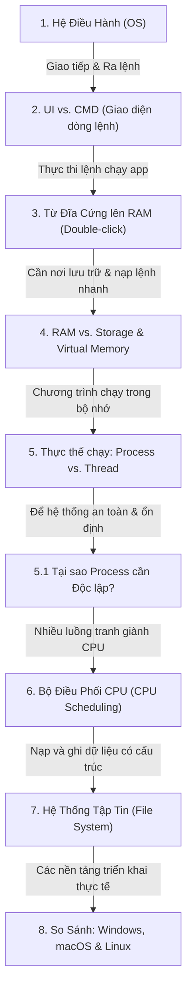

# Nền Tảng Hệ Điều Hành: Mạch Kiến Thức Nhân Quả (Causal Knowledge Flow)

Hệ thống máy tính là sự kết hợp phức tạp giữa phần cứng vật lý và phần mềm ứng dụng. Để hiểu cách chúng hoạt động cùng nhau, chúng ta sẽ đi qua một mạch kiến thức liên kết nhân quả (mối quan hệ nguyên nhân - kết quả) chặt chẽ, bắt đầu từ khái niệm cơ bản nhất của Hệ điều hành cho đến kiến trúc của các hệ thống thực tế.

---

## Sơ Đồ Mạch Liên Kết Nhân Quả (Knowledge Flow)



---

## 1. Hệ Điều Hành (Operating System - OS) là gì?

Hệ điều hành là phần mềm nền tảng **quản lý toàn bộ phần cứng** (CPU, RAM, Đĩa cứng, GPU, thiết bị ngoại vi) và **cung cấp dịch vụ chung** cho các phần mềm ứng dụng (Chrome, VS Code, Game).

* **Nguyên nhân**: Nếu không có OS, mỗi lập trình viên khi viết ứng dụng sẽ phải tự viết driver để giao tiếp trực tiếp với chip nhớ, mạch điện của đĩa cứng, card màn hình. Điều này là bất khả thi và cực kỳ kém hiệu quả.
* **Kết quả**: OS ra đời đóng vai trò là **Người quản trị tài nguyên** và **Cầu nối trung gian**. Nó ẩn đi sự phức tạp của phần cứng và cung cấp các API chuẩn hóa để phần mềm giao tiếp với máy tính.

> [!IMPORTANT]
> **Mối liên kết nhân quả tiếp theo**: Vì OS quản lý mọi tài nguyên, làm thế nào con người (hoặc lập trình viên) có thể giao tiếp và ra lệnh cho OS điều khiển máy tính theo ý mình? Chúng ta cần các giao diện giao tiếp: **UI** và **CMD**.

---

## 2. Giao Tiếp Với OS: UI vs. CMD (Command Line Interface)

Để ra lệnh cho OS, chúng ta có hai phương thức chính:
- **UI (User Interface / GUI)**: Giao diện đồ họa sử dụng chuột, nút bấm, icon trực quan (phù hợp người dùng phổ thông).
- **CMD (Command Line Interface / CLI)**: Giao diện dòng lệnh, nơi người dùng gõ trực tiếp các lệnh văn bản để OS thực thi (như Command Prompt trên Windows, Terminal trên macOS/Linux).

```
   [Người dùng] ──(Gõ chữ)──> [CMD / Shell] ──(Gọi System Call)──> [Hệ Điều Hành (OS)]
```

### Tại sao lập trình viên luôn ưu tiên dùng CMD thay vì UI?

1. **Hiệu suất và Tiết kiệm Tài nguyên**: UI tiêu tốn nhiều RAM và CPU để vẽ đồ họa, hiển thị cửa sổ. CMD cực kỳ nhẹ, không cần dựng đồ họa, giúp tối ưu tối đa tài nguyên cho các máy chủ (Servers) không có màn hình hiển thị (Headless).
2. **Khả năng Tự động hóa (Automation & Scripting)**: Với UI, bạn không thể tự động hóa việc click chuột 100 lần. Với CMD, bạn có thể viết một file script ngắn (Bash, PowerShell) để thực hiện hàng ngàn thao tác phức tạp liên tiếp trong vài giây.
3. **Giao tiếp Trực tiếp và Mạnh mẽ**: CMD cho phép truy cập trực tiếp vào các tính năng cấu hình sâu của hệ thống và các công cụ lập trình (Git, Docker, npm) vốn không hỗ trợ giao diện đồ họa.

### Các lệnh CMD cơ bản thường dùng (Windows CMD vs Linux/macOS Terminal)

| Chức năng | Lệnh Windows CMD | Lệnh Linux/macOS |
| :--- | :--- | :--- |
| **Xem thư mục hiện tại** | `cd` (không tham số) | `pwd` |
| **Liệt kê file/thư mục** | `dir` | `ls -la` |
| **Chuyển thư mục** | `cd <path>` | `cd <path>` |
| **Tạo thư mục mới** | `mkdir <tên>` | `mkdir <tên>` |
| **Xóa file** | `del <tên_file>` | `rm <tên_file>` |
| **Kiểm tra mạng** | `ping <domain>` | `ping <domain>` |

> [!IMPORTANT]
> **Mối liên kết nhân quả tiếp theo**: Khi bạn ra lệnh cho OS chạy một ứng dụng (dù là gõ lệnh chạy trên CMD hay nhấp đúp chuột vào icon trên UI), OS sẽ làm gì để biến một ứng dụng tĩnh lưu trên đĩa cứng thành một chương trình đang chạy thực sự?

---

## 3. Chuyện gì xảy ra khi bạn Double-click (hoặc gõ lệnh CMD) để chạy một chương trình?

Quá trình khởi chạy một chương trình từ trạng thái "tĩnh" sang "động" diễn ra qua 5 bước tuần tự dưới sự điều khiển của OS:

```
[Đĩa Cứng] ──(1. Đọc tệp tin .exe/.app)──> [Bộ nạp Loader của OS] 
                                                  │
                                          (2. Cấp phát RAM & Bộ nhớ ảo)
                                                  │
                                                  ▼
[CPU] <──(5. Chạy luồng chính Main Thread)── [Tạo Process mới trong RAM]
```

1. **Gửi tín hiệu**: Khi bạn nhấp đúp chuột (UI) hoặc nhấn Enter (CMD) trên một tệp tin thực thi (ví dụ: `app.exe`), OS nhận được yêu cầu chạy ứng dụng này qua một **System Call** (Lời gọi hệ thống).
2. **Đọc đĩa cứng**: Bộ nạp của OS (**Loader**) truy cập vào **File System** trên đĩa cứng, tìm file ứng dụng, đọc mã máy (binary code) và các dữ liệu liên quan.
3. **Cấp phát bộ nhớ**: OS cấp phát một vùng không gian bộ nhớ trống trong **RAM** (và thiết lập **Virtual Memory** nếu cần) để nạp mã máy của ứng dụng vào đó.
4. **Khởi tạo Tiến trình (Process)**: OS thiết lập một cấu trúc quản lý gọi là **Process** (Tiến trình), cấp cho nó một ID duy nhất (**PID - Process ID**), cấp phát các tài nguyên như file descriptor, quyền hạn bảo mật.
5. **Thực thi trên CPU**: OS tạo ra luồng thực thi đầu tiên (**Main Thread**), trỏ con trỏ lệnh của CPU đến điểm bắt đầu của chương trình (hàm `main`) để CPU bắt đầu tính toán và chạy code.

> [!IMPORTANT]
> **Mối liên kết nhân quả tiếp theo**: Ở bước 3, chúng ta thấy mã máy được nạp từ đĩa cứng vào RAM. Tại sao máy tính không chạy trực tiếp code trên đĩa cứng cho tiện mà bắt buộc phải nạp vào RAM? RAM và Storage khác nhau như thế nào?

---

## 4. Quản lý Bộ nhớ: Storage vs. RAM và Virtual Memory

Để cân bằng giữa tốc độ và dung lượng lưu trữ, kiến trúc máy tính chia bộ nhớ làm nhiều cấp độ.

```
+---------------------------------------------------------------+
|  [Storage: HDD/SSD]  ==> Rất chậm, Rất lớn (Lưu trữ vĩnh viễn) |
+---------------------------------------------------------------+
                              │  (Loader nạp khi khởi chạy)
                              ▼
+---------------------------------------------------------------+
|  [RAM: Memory]       ==> Cực nhanh, Nhỏ (Lưu trữ tạm thời)     |
+---------------------------------------------------------------+
                              │  (Đọc trực tiếp)
                              ▼
+---------------------------------------------------------------+
|  [CPU]               ==> Trực tiếp thực thi                   |
+---------------------------------------------------------------+
```

### 1. Sự khác biệt giữa Storage (Đĩa cứng HDD/SSD) và RAM (Bộ nhớ trong)

- **Storage (Đĩa lưu trữ)**:
  - *Bản chất*: Bộ nhớ thứ cấp (Secondary Storage).
  - *Đặc điểm*: Tốc độ truy xuất chậm hơn nhiều so với RAM, dung lượng cực lớn (hàng trăm GB đến TB), dữ liệu **vẫn tồn tại** khi tắt máy (Non-volatile).
  - *Vai trò*: Nơi lưu trữ vĩnh viễn hệ điều hành, mã nguồn phần mềm và các file dữ liệu.
- **RAM (Random Access Memory)**:
  - *Bản chất*: Bộ nhớ sơ cấp (Primary Storage).
  - *Đặc điểm*: Tốc độ cực kỳ nhanh (nhanh gấp hàng nghìn lần SSD), dung lượng nhỏ (8GB - 64GB), dữ liệu **biến mất hoàn toàn** khi mất điện (Volatile).
  - *Vai trò*: Bộ nhớ đệm làm việc cho CPU. CPU chỉ có thể đọc và thực thi trực tiếp các lệnh khi chúng đã được nạp sẵn vào RAM.

### 2. Virtual Memory (Bộ nhớ ảo) là gì và tại sao nó quan trọng?

* **Nguyên nhân**: RAM vật lý có giới hạn (ví dụ máy bạn chỉ có 8GB RAM). Khi bạn mở quá nhiều ứng dụng nặng cùng lúc (Chrome ăn 4GB, Game ăn 6GB), tổng dung lượng yêu cầu vượt quá RAM vật lý hiện có. Nếu không có giải pháp, hệ thống sẽ báo lỗi tràn bộ nhớ (Out of Memory) và crash lập tức.
* **Giải pháp (Virtual Memory)**: OS sử dụng một phần đĩa cứng (SSD/HDD) làm "RAM giả" (trên Windows gọi là `pagefile.sys`, trên Linux gọi là `Swap`).
* **Cơ chế**: OS chia bộ nhớ thành các trang (**Pages**). Khi RAM thật bị đầy, OS sẽ tìm các trang bộ nhớ của các ứng dụng đang chạy ẩn (ít dùng nhất) để chuyển (ghi) xuống đĩa cứng (gọi là **Page Out** hoặc **Swapping**), giải phóng RAM thật cho ứng dụng bạn đang dùng. Khi bạn quay lại ứng dụng ẩn kia, OS lại đọc từ đĩa cứng và nạp ngược lại RAM (gọi là **Page In**).

> [!IMPORTANT]
> **Mối liên kết nhân quả tiếp theo**: Một khi ứng dụng đã được nạp vào không gian bộ nhớ (RAM), OS sẽ quản lý thực thể chạy đó dưới dạng một **Process**. Cấu trúc của Process và các phân nhánh thực thi của nó (**Thread**) hoạt động thế nào?

---

## 5. Đơn Vị Thực Thi: Process (Tiến trình) vs. Thread (Luồng)

Khi một chương trình được nạp vào RAM và bắt đầu chạy, nó trở thành một **Process**.

* **Process (Tiến trình)**: Là một chương trình đang trong quá trình thực thi, được OS cấp phát một không gian địa chỉ bộ nhớ riêng độc lập, danh sách file đang mở, tài nguyên hệ thống.
* **Thread (Luồng)**: Là một đơn vị thực thi mã lệnh nhỏ nhất nằm bên trong một Process. Một Process có thể chứa nhiều Thread, tất cả các Thread này chạy song song và **chia sẻ chung không gian bộ nhớ** của Process cha.

```
+-------------------------------------------------------+
|  PROCESS (Tiến trình độc lập)                         |
|  - Không gian bộ nhớ riêng (Memory Space)            |
|  - Tài nguyên hệ thống (Files, I/O)                   |
|                                                       |
|   +-------------------+       +-------------------+   |
|   | THREAD 1          |       | THREAD 2          |   |
|   | (Chạy song song)  |       | (Chạy song song)  |   |
|   +-------------------+       +-------------------+   |
+-------------------------------------------------------+
```

### Bảng so sánh chi tiết Process vs. Thread:

| Đặc điểm | Process (Tiến trình) | Thread (Luồng) |
| :--- | :--- | :--- |
| **Cấp phát bộ nhớ** | Được OS cấp không gian bộ nhớ riêng độc lập. | Chia sẻ chung không gian bộ nhớ với các luồng khác trong cùng Process. |
| **Tài nguyên** | Sở hữu tài nguyên riêng (tập tin, cổng kết nối). | Sử dụng chung tài nguyên của Process cha. |
| **Tốc độ khởi tạo** | Chậm hơn, tốn nhiều tài nguyên của OS để thiết lập. | Rất nhanh, tốn ít tài nguyên. |
| **Giao tiếp với nhau** | Khó khăn, cần các kỹ thuật IPC (Inter-Process Communication) như Socket, Pipe. | Dễ dàng vì chung vùng nhớ (đọc/ghi chung biến toàn cục). |
| **Tính an toàn** | 🟢 Cực kỳ an toàn và cô lập. | 🔴 Kém an toàn (Một thread bị crash có thể kéo theo cả Process sập). |

---

### 5.1 Tại sao các Process cần phải độc lập và cô lập bộ nhớ?

* **Nguyên nhân**: Hãy tưởng tượng máy tính của bạn chạy cùng lúc 2 ứng dụng: Ứng dụng ngân hàng (chứa mã PIN, số dư tài khoản) và một trò chơi tải từ nguồn không tin cậy. 
* Nếu các Process không độc lập và dùng chung vùng nhớ:
  1. Trò chơi có thể đọc trộm vùng nhớ của ứng dụng ngân hàng để lấy mã PIN (Lỗ hổng bảo mật nghiêm trọng).
  2. Trò chơi bị crash, ghi đè dữ liệu rác vào vùng nhớ của ứng dụng ngân hàng làm ứng dụng ngân hàng sập theo.
* **Kết quả**: OS thiết kế cơ chế **Virtual Address Space** để mỗi Process tin rằng nó đang sở hữu toàn bộ bộ nhớ máy tính một mình. Về mặt vật lý, OS sẽ ánh xạ địa chỉ ảo này vào các ô nhớ vật lý khác nhau trong RAM. Một Process **không thể đọc hoặc ghi** vào vùng nhớ của một Process khác trừ khi được OS cho phép. Điều này mang lại sự bảo mật tuyệt đối và tính cô lập lỗi (Fault Isolation) cho hệ thống.

> [!IMPORTANT]
> **Mối liên kết nhân quả tiếp theo**: Bây giờ chúng ta có hàng chục Process đang chạy, mỗi Process lại có hàng trăm Thread cần được xử lý. Nhưng CPU máy tính chỉ có hữu hạn số nhân (Core) vật lý (ví dụ: 4 cores hoặc 8 cores). Làm sao tất cả chúng có thể chạy mượt mà cùng lúc? OS cần đến **CPU Scheduling**.

---

## 6. Bộ Điều Phối CPU (CPU Scheduling - Sơ lược cấp cao)

CPU Scheduling là cơ chế OS lựa chọn Thread nào được phép sử dụng CPU để thực thi lệnh tại một thời điểm cụ thể.

```
[Các luồng đang đợi chạy] ──> [Bộ điều phối Scheduler] ──> [Đưa vào CPU chạy một lúc (Time Slice)] ──> [Đưa ra ngoài đợi tiếp]
```

* **Cơ chế chia thời gian (Time-slicing / Quantum)**: OS không cho phép một Thread chiếm dụng CPU mãi mãi. Nó chia thời gian CPU thành các lát cắt siêu nhỏ (chỉ vài mili-giây). Mỗi Thread sẽ được chạy trên CPU trong một lát cắt, sau đó bị OS tạm dừng để nhường chỗ cho Thread khác.
* **Context Switching (Chuyển đổi ngữ cảnh)**: Khi chuyển đổi giữa các Thread, OS lưu lại toàn bộ trạng thái hiện tại của CPU (thông tin trong các thanh ghi - registers) của Thread cũ và nạp trạng thái của Thread mới vào CPU để chạy tiếp từ điểm bị ngắt quãng.
* **Các thuật toán điều phối phổ biến**:
  1. **FIFO (First In First Out)**: Thread nào đăng ký trước thì chạy trước (đơn giản nhưng dễ gây tắc nghẽn).
  2. **Shortest Job First (SJF)**: Ưu tiên Thread có thời gian thực thi ngắn nhất chạy trước.
  3. **Round Robin (RR)**: Mỗi Thread nhận một khoảng thời gian bằng nhau để chạy luân phiên (phổ biến nhất cho đa nhiệm).
  4. **Priority Scheduling**: Ưu tiên các Thread quan trọng của hệ thống (ví dụ: tiến trình render màn hình, chuột) chạy trước các tiến trình chạy ẩn.

> [!IMPORTANT]
> **Mối liên kết nhân quả tiếp theo**: Khi các chương trình chạy và tính năng hoạt động trên CPU, chúng luôn cần đọc dữ liệu cấu hình hoặc ghi kết quả đầu ra vào các tệp tin trên đĩa cứng. Làm thế nào OS biết cách định vị, tổ chức và quản lý các tệp tin này trên bề mặt vật lý của đĩa cứng? Đó là nhờ **File System**.

---

## 7. Quản lý Dữ liệu Vật lý: File System (Hệ thống tập tin) là gì?

Đĩa cứng vật lý (SSD/HDD) bản chất chỉ là một chuỗi các khối nhớ chứa các bit `0` và `1` thô sơ. Nó không biết khái niệm "file thư mục", "tên file" hay "ngày tạo".

* **Định nghĩa**: File System là cấu trúc và thuật toán của OS dùng để **định dạng, tổ chức, lưu trữ và đặt tên** cho dữ liệu trên thiết bị lưu trữ. Nó biến các khối nhớ 0/1 vật lý khô khan thành cấu trúc thư mục cây trực quan mà chúng ta nhìn thấy hàng ngày.

```
[Bit 0/1 Vật lý trên đĩa] <──(Ánh xạ qua File System)──> [Thư mục Cây / File / metadata (Tên, ngày tạo)]
```

* **Metadata**: Hệ thống tập tin lưu trữ các thông tin phụ của file (Metadata) như: Tên file, kích thước, quyền truy cập (đọc/ghi), thời gian tạo, và quan trọng nhất là danh sách địa chỉ vật lý nơi chứa dữ liệu thực tế của file trên đĩa.
* **Các hệ thống tập tin phổ biến**:
  - **NTFS**: Hệ thống tập tin mặc định của Windows (hỗ trợ bảo mật phân quyền tốt, phục hồi lỗi nhanh).
  - **APFS (Apple File System)**: Dùng trên macOS và iOS (tối ưu hóa cho ổ SSD, mã hóa mạnh mẽ, sao chép siêu nhanh).
  - **ext4**: Hệ thống tập tin tiêu chuẩn của Linux (độ ổn định cực cao, hiệu năng tốt cho máy chủ).

> [!IMPORTANT]
> **Mối liên kết nhân quả tiếp theo**: Các hệ điều hành khác nhau (Windows, macOS, Linux) áp dụng các triết lý thiết kế khác nhau cho các khái niệm Kernel, File System và giao diện CMD. Hãy cùng so sánh chúng ở cấp độ vĩ mô.

---

## 8. So Sánh Cấp Cao: Windows, macOS và Linux

Cả ba hệ điều hành này đều triển khai các khái niệm cơ bản trên (Process, Memory, Scheduling, File System) nhưng theo các triết lý thiết kế và mục tiêu sử dụng khác nhau.

| Tiêu chí | Windows | macOS | Linux |
| :--- | :--- | :--- | :--- |
| **Nhà phát triển** | Microsoft | Apple | Cộng đồng mã nguồn mở (Linus Torvalds khởi xướng) |
| **Bản quyền** | Thương mại (Đóng gói, trả phí) | Thương mại (Độc quyền trên phần cứng của Apple) | Mã nguồn mở (Miễn phí hoàn toàn) |
| **Nhân hệ điều hành (Kernel)** | Hybrid Kernel (Windows NT) | Microkernel hybrid (XNU / Darwin - dựa trên BSD Unix) | Monolithic Kernel (Nhân Linux) |
| **File System mặc định** | **NTFS** (New Technology File System) | **APFS** (Apple File System) | **ext4** (Fourth Extended Filesystem) |
| **Giao diện Dòng lệnh (CLI)** | Command Prompt (CMD), PowerShell | Terminal (Zsh / Bash) | Terminal (Bash / Zsh / Fish) |
| **Triết lý thiết kế** | Tương thích ngược tốt nhất, hướng tới người dùng phổ thông và doanh nghiệp. | Trải nghiệm mượt mà, tối ưu hóa phần cứng đồng bộ, bảo mật cao. | Tự do tùy biến tuyệt đối, bảo mật, nhẹ và cực kỳ ổn định. |
| **Thị phần phổ biến** | 🖥️ Bá chủ trên máy tính cá nhân (Desktop/Laptop). | 🎨 Phổ biến trong giới thiết kế đồ họa, sáng tạo nội dung, lập trình viên. | 🌐 Bá chủ trên máy chủ (Servers), siêu máy tính, điện thoại di động (Android). |
