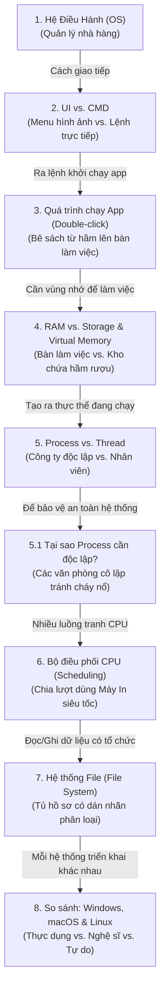

# Hệ Điều Hành Là Gì? (Hiểu Bằng Hình Ảnh Ẩn Dụ Thực Tế)

Hệ thống máy tính rất phức tạp, nhưng bạn có thể hiểu toàn bộ cách thức hoạt động của nó thông qua những hình ảnh ẩn dụ rất gần gũi trong đời sống hàng ngày dưới đây. Các khái niệm sẽ được liên kết với nhau theo mối quan hệ Nhân - Quả tuần tự.

---

## Sơ Đồ Mạch Kiến Thức (Knowledge Flow)



---

## 1. Hệ Điều Hành (OS) là gì?
* **Hình ảnh ẩn dụ**: OS giống như **Người Quản Lý Nhà Hàng**.
* **Giải thích**: Phần cứng máy tính (CPU, RAM, Đĩa cứng) giống như các đầu bếp, nguyên liệu và dụng cụ nấu ăn. Phần mềm ứng dụng (Chrome, Facebook) giống như những người bồi bàn. Nếu không có người quản lý, bồi bàn sẽ tự ý chạy vào bếp tranh giành bếp nấu, đầu bếp không biết phải làm món gì trước, mọi thứ sẽ hỗn loạn.
* **Nguyên nhân - Kết quả**: 
  - *Nguyên nhân*: Phần cứng quá phức tạp để phần mềm có thể tự điều khiển trực tiếp.
  - *Kết quả*: OS ra đời làm trung gian đứng ra quản lý toàn bộ tài nguyên, phân chia thời gian chạy cho các phần mềm một cách hợp lý và an toàn.

> **Mối liên kết**: Vì OS là người quản lý tối cao, làm thế nào để chúng ta (hoặc lập trình viên) ra lệnh cho OS điều khiển máy tính? Chúng ta cần giao diện: **UI** và **CMD**.

---

## 2. Giao Tiếp Với OS: UI vs. CMD (Command Line)

* **Hình ảnh ẩn dụ**: 
  - **UI (Giao diện đồ họa)**: Giống như **Menu có sẵn hình ảnh** tại nhà hàng. Bạn chỉ cần dùng ngón tay chỉ vào hình món ăn (click chuột vào icon) để gọi món. Rất dễ dùng, nhưng bạn chỉ gọi được những món có sẵn trên menu.
  - **CMD (Giao diện dòng lệnh)**: Giống như **Nói chuyện trực tiếp với bếp trưởng**. Bạn phải tự nhớ tên món ăn, công thức và gõ bằng chữ để yêu cầu. Khó dùng hơn vì phải nhớ lệnh, nhưng cực kỳ linh hoạt (có thể gọi những món tùy chỉnh không có trên menu).

```
[Người dùng] ──(Gõ lệnh chữ)──> [CMD] ──(Dịch lệnh)──> [OS (Người quản lý)]
```

### Tại sao lập trình viên luôn thích dùng CMD hơn UI?
1. **Rất nhẹ và nhanh**: Vẽ giao diện đồ họa (UI) tốn rất nhiều RAM và CPU. CMD chỉ hiển thị chữ nên hầu như không tốn tài nguyên. Điều này cực kỳ quan trọng khi quản lý các máy chủ (Servers) khổng lồ ở xa.
2. **Khả năng tự động hóa**: Bạn không thể tự động hóa việc click chuột 100 lần vào 100 nút trên màn hình. Nhưng với CMD, bạn viết 1 dòng lệnh lặp lại và máy tính sẽ tự làm hàng triệu lần trong chớp mắt.

### Lệnh CMD cơ bản (So sánh Windows CMD vs Terminal Linux/macOS):

| Mục tiêu | Lệnh Windows CMD | Lệnh Linux/macOS | Giải thích dễ hiểu |
| :--- | :--- | :--- | :--- |
| **Xem đang đứng ở đâu** | `cd` (không tham số) | `pwd` | Xem vị trí thư mục hiện tại |
| **Xem trong thư mục có gì** | `dir` | `ls` | Liệt kê tất cả file đang có |
| **Chuyển sang thư mục khác** | `cd <tên_thư_mục>` | `cd <tên_thư_mục>` | Đi vào thư mục đó |
| **Tạo thư mục mới** | `mkdir <tên>` | `mkdir <tên>` | Tạo một thư mục trống mới |

> **Mối liên kết**: Khi bạn ra lệnh chạy một ứng dụng (dù là nhấp đúp chuột vào icon trên UI hay gõ lệnh khởi chạy trên CMD), điều gì xảy ra bên trong máy tính?

---

## 3. Chuyện gì xảy ra khi bạn Double-click chạy một ứng dụng?

* **Hình ảnh ẩn dụ**: Giống như hành trình **Bê một cuốn sách hướng dẫn nấu ăn từ kho dưới hầm đặt lên bàn làm việc để đọc**.

```
[Hầm tối lưu trữ (Storage)] ──(Loader bê lên)──> [Bàn làm việc (RAM)] ──> [Đầu bếp đọc & chạy (CPU)]
```

1. **Gửi yêu cầu**: Bạn nhấp đúp vào file `Chrome.exe`. OS nhận tín hiệu yêu cầu chạy Chrome.
2. **Tìm file**: OS tìm file này trên **Đĩa cứng (Storage)** - nơi lưu trữ dữ liệu vĩnh viễn của máy tính.
3. **Nạp vào bộ nhớ**: OS kích hoạt bộ nạp (**Loader**) để sao chép toàn bộ code của Chrome từ đĩa cứng lên **RAM** (Bộ nhớ tạm thời tốc độ cao).
4. **Tạo Tiến trình**: OS cấp cho ứng dụng một không gian hoạt động riêng trong RAM, gọi là **Process (Tiến trình)**.
5. **Chạy**: CPU (Đầu bếp) bắt đầu đọc các dòng code đã nạp trên RAM để thực thi chương trình.

> **Mối liên kết**: Ở bước này, chúng ta thấy dữ liệu được chuyển từ Đĩa cứng (Storage) sang RAM. RAM là gì và tại sao CPU không đọc thẳng từ Đĩa cứng cho tiện?

---

## 4. RAM vs. Storage và Virtual Memory (Bộ nhớ ảo)

* **RAM (Random Access Memory)**: Giống như **Mặt bàn làm việc** của bạn.
  - *Đặc điểm*: Rất nhỏ (8GB - 16GB) nhưng cực kỳ dễ tiếp cận và tốc độ phản hồi siêu nhanh. Khi bạn dọn dẹp hoặc tắt máy (mất điện), mặt bàn sẽ bị lau sạch hoàn toàn (dữ liệu biến mất).
* **Storage (Đĩa cứng HDD/SSD)**: Giống như **Kho lưu trữ dưới hầm**.
  - *Đặc điểm*: Dung lượng khổng lồ (500GB - 2TB), dữ liệu cất ở đây không bị mất khi tắt máy. Nhưng mỗi lần muốn đọc, bạn phải mất thời gian đi xuống hầm để bê lên bàn, tốc độ rất chậm.
* **Tại sao cần cả hai?**: CPU hoạt động với tốc độ siêu ánh sáng, nếu bắt CPU đợi đọc dữ liệu từ đĩa cứng (Storage) thì máy tính sẽ bị đơ cứng. Do đó, mọi thứ muốn chạy đều phải được đưa lên bàn làm việc (RAM) trước.

### Thế còn Virtual Memory (Bộ nhớ ảo) là gì?
* **Hình ảnh ẩn dụ**: Giống như **Hộc tủ/Ngăn kéo tạm thời sát bàn làm việc**.
* **Giải thích**: Khi bàn làm việc (RAM) của bạn quá nhỏ nhưng bạn lại mở cùng lúc hàng chục ứng dụng nặng. Bàn bị tràn. 
* Thay vì báo lỗi sập hệ thống, OS sẽ thông minh tự động bê các tập tài liệu của những ứng dụng bạn đang mở nhưng tạm thời không dùng đến (ví dụ tab Chrome đang mở ẩn phía sau) cất tạm vào ngăn kéo (Virtual Memory trên đĩa cứng) để lấy chỗ trống trên mặt bàn cho ứng dụng bạn đang dùng. Khi bạn click lại tab đó, OS lại bê tài liệu từ ngăn kéo đặt ngược lại lên bàn.

> **Mối liên kết**: Khi ứng dụng đã nằm vững chắc trên RAM để chạy, nó tồn tại dưới dạng một **Process**. Cấu trúc của Process và các phân nhánh thực thi nhỏ hơn của nó (**Thread**) hoạt động ra sao?

---

## 5. Đơn vị thực thi: Process (Tiến trình) vs. Thread (Luồng)

* **Process (Tiến trình)**: Giống như một **Công ty / Văn phòng làm việc độc lập**.
  - Mỗi công ty có trụ sở riêng, tài sản riêng và không chung đụng với công ty khác.
* **Thread (Luồng)**: Giống như các **Nhân viên làm việc trong công ty đó**.
  - Một công ty (Process) có thể có nhiều nhân viên (Threads) cùng làm việc song song để hoàn thành dự án. Tất cả nhân viên trong cùng một công ty sẽ dùng chung bàn ghế, nước uống, hồ sơ tài liệu (chia sẻ chung vùng nhớ của Process).

```
+-------------------------------------------------------+
|  PROCESS (Văn phòng công ty)                          |
|  - Tài sản, tài liệu riêng (Memory Space)             |
|                                                       |
|   +-------------------+       +-------------------+   |
|   | THREAD 1          |       | THREAD 2          |   |
|   | (Nhân viên A)     |       | (Nhân viên B)     |   |
|   +-------------------+       +-------------------+   |
+-------------------------------------------------------+
```

### So sánh nhanh dễ nhớ:
* **Process**: Rất nặng, độc lập hoàn toàn, an toàn tuyệt đối.
* **Thread**: Rất nhẹ, chạy chung vùng nhớ nên giao tiếp với nhau cực kỳ nhanh, nhưng kém an toàn hơn (nếu 1 nhân viên làm cháy văn phòng, cả công ty sẽ bị ảnh hưởng - 1 thread bị lỗi nghiêm trọng có thể làm sập toàn bộ Process).

---

### 5.1 Tại sao các Process cần phải Độc lập và Cô lập bộ nhớ?

* **Hình ảnh ẩn dụ**: Hãy tưởng tượng bạn thuê mặt bằng và chia thành nhiều **văn phòng khóa kín bảo mật**.
* **Giải thích**: 
  - Nếu không cô lập bộ nhớ, nhân viên của "Công ty Trò chơi độc hại" có thể tự ý đi sang văn phòng của "Công ty Ngân hàng" để xem trộm mật khẩu và số dư tài khoản của khách hàng.
  - Hoặc nếu "Công ty Trò chơi" làm ăn đổ bể (crash), nó có thể làm đổ bể lây sang toàn bộ các công ty bên cạnh.
* **Kết quả**: OS thiết lập một bức tường bảo mật nghiêm ngặt. Mỗi Process được cấp một vùng nhớ ảo riêng và tuyệt đối không thể đọc hay ghi đè lên vùng nhớ của Process khác. Điều này bảo vệ an toàn cho dữ liệu của bạn trước các phần mềm độc hại.

> **Mối liên kết**: Có hàng trăm Thread (nhân viên) của nhiều Process khác nhau đang muốn làm việc, nhưng văn phòng chỉ có một vài chiếc máy tính/máy in (nhân CPU). Làm sao chia sẻ tài nguyên này? -> Chúng ta cần **CPU Scheduling**.

---

## 6. Bộ Điều Phối CPU (CPU Scheduling) là gì?

* **Hình ảnh ẩn dụ**: Giống như việc **Chia lượt sử dụng chiếc Máy In siêu tốc duy nhất trong văn phòng**.
* **Giải thích**: 
  - Hàng trăm nhân viên (Threads) đều muốn in tài liệu của mình ngay lập tức. Nhưng máy in (CPU Core) tại một thời điểm chỉ có thể in cho 1 người.
  - Người quản lý (OS Scheduler) sẽ đứng ra điều phối: Cho nhân viên A in trong vòng 5 giây, sau đó bắt nhân viên A dừng lại để nhường cho nhân viên B in 5 giây, rồi đến nhân viên C...
  - Vì tốc độ luân chuyển của máy in này quá nhanh (chỉ tính bằng phần triệu giây - mili-giây), nên ở góc nhìn của con người, ta có cảm giác như tất cả nhân viên đều đang được in tài liệu cùng một lúc (đa nhiệm song song giả lập).

---

## 7. Hệ Thống Tập Tin (File System) là gì?

* **Hình ảnh ẩn dụ**: Giống như **Hệ thống nhãn dán, mã vạch và cách phân chia ngăn kéo trong tủ hồ sơ**.
* **Giải thích**: 
  - Đĩa cứng vật lý giống như một đống giấy trắng thô sơ chất đống dưới hầm. Nếu không có quy ước, bạn sẽ không thể tìm thấy thông tin mình cần nằm ở tờ giấy nào.
  - **File System** là quy tắc do OS đặt ra để tổ chức đống giấy đó thành các tập tài liệu (Files), đặt tên cho chúng, ghi chú ngày tạo (Metadata) và sắp xếp chúng vào các ngăn kéo có dán nhãn (Folders/Thư mục).
* **Các loại phổ biến**: Windows dùng **NTFS**, macOS dùng **APFS**, Linux dùng **ext4**. Chúng là các cách phân loại hồ sơ khác nhau, mỗi cách có ưu điểm riêng về tốc độ tìm kiếm và độ an toàn bảo mật.

---

## 8. So Sánh Tính Cách: Windows vs. macOS vs. Linux

Cả ba hệ điều hành đều làm những nhiệm vụ quản lý giống nhau ở trên, nhưng mang 3 tính cách và triết lý hoàn toàn khác biệt:

```
                  ┌───────────────┐
                  │    KERNEL     │
                  └───────┬───────┘
         ┌────────────────┼────────────────┐
         ▼                ▼                ▼
    [Windows]          [macOS]          [Linux]
  (Thực dụng)        (Nghệ sĩ)         (Tự do)
```

1. **Windows (Người thực dụng)**:
   - *Triết lý*: Tương thích ngược tốt nhất thế giới. Bạn có thể chạy các phần mềm viết từ 20 năm trước trên Windows 11 bình thường.
   - *Nhược điểm*: Vì phải ôm đồm quá nhiều thứ cũ kỹ để tương thích nên hệ thống đôi khi cồng kềnh, dễ gặp lỗi màn hình xanh.
2. **macOS (Người nghệ sĩ kỹ tính)**:
   - *Triết lý*: Đồng bộ và khép kín tối đa. Apple tự làm cả phần cứng (máy Mac) lẫn hệ điều hành nên mọi thứ chạy cực kỳ mượt mà, tối ưu pin và màn hình đẹp.
   - *Nhược điểm*: Rất đắt đỏ và không thể tùy biến phần cứng bên trong.
3. **Linux (Kỹ sư thích tự do)**:
   - *Triết lý*: Mã nguồn mở, miễn phí và cho phép can thiệp vào mọi ngóc ngách của hệ thống. Nhẹ đến mức có thể chạy trên chiếc máy tính tí hon (Raspberry Pi) hay siêu máy tính vũ trụ.
   - *Nhược điểm*: Khó sử dụng đối với người dùng phổ thông vì phải thao tác qua dòng lệnh CMD rất nhiều.
