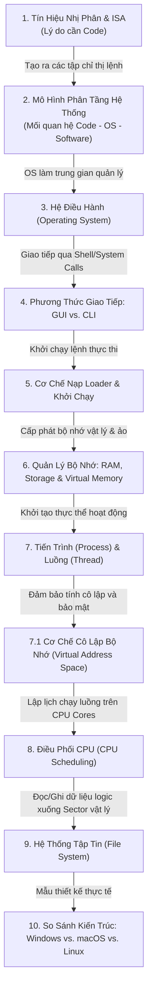

# Kiến Trúc Hệ Điều Hành & Nguyên Lý Vận Hành Hệ Thống

Tài liệu này cung cấp kiến thức nền tảng về cấu trúc và nguyên lý vận hành của Hệ điều hành (Operating System - OS) theo một mạch liên kết nhân quả (causal flow) logic, sử dụng các thuật ngữ chuyên ngành chuẩn xác trong khoa học máy tính.

---

## Sơ Đồ Mạch Liên Kết Nhân Quả (Knowledge Flow)



---

## 1. Bản chất của Máy tính & Tại sao Máy tính cần Code?

### 1.1 Mức độ vật lý (Hardware Level)
Về bản chất vật lý, bộ vi xử lý (CPU) của máy tính được cấu thành từ hàng tỷ transistor hoạt động như các cổng chuyển mạch logic tắt/mở (on/off). Máy tính chỉ hiểu và hoạt động dựa trên hai trạng thái điện áp này, đại diện bởi hệ thống số nhị phân: **0 (không có dòng điện)** và **1 (có dòng điện)**.

### 1.2 Kiến trúc tập chỉ thị (Instruction Set Architecture - ISA)
Để điều khiển CPU thực hiện các phép tính cơ bản (cộng, dịch bit, di chuyển dữ liệu), nhà sản xuất thiết kế một tập hợp các lệnh nhị phân thô gọi là **Mã máy (Machine Code)** dựa trên kiến trúc ISA (như x86-64 của Intel/AMD, hay ARMv9).
- **Mã máy**: Là các chuỗi 0 và 1 trực tiếp điều khiển phần cứng (ví dụ: `10110000 01100001`).

### 1.3 Tại sao máy tính cần Code (Mã nguồn)?
* **Nguyên nhân**: Con người không thể viết, đọc và bảo trì hàng triệu dòng lệnh nhị phân `0` và `1` một cách hiệu quả để tạo ra các ứng dụng phức tạp.
* **Kết quả**: Chúng ta cần **Mã nguồn (Source Code)** - là các ngôn ngữ lập trình bậc cao gần với ngôn ngữ tự nhiên của con người (như C, Java, Python).
* **Quá trình dịch**: Mã nguồn này sẽ được các công cụ biên dịch (**Compiler**) hoặc thông dịch (**Interpreter**) chuyển đổi thành mã máy nhị phân tương ứng để CPU có thể hiểu và thực thi.

---

## 2. Mối quan hệ Kiến trúc: Code - OS - Phần mềm (Software)

Để hệ thống hoạt động thống nhất, các thành phần máy tính được thiết kế theo một mô hình phân tầng chặt chẽ:

```
┌────────────────────────────────────────────────────────┐
│                      Người Dùng                        │
└──────────────────────────┬─────────────────────────────┘
                           ▼
┌────────────────────────────────────────────────────────┐
│                  Phần Mềm (Software)                   │
│   (Gồm mã nguồn/Code được đóng gói và biên dịch sẵn)   │
└──────────────────────────┬─────────────────────────────┘
                           ▼ (System Calls / APIs)
┌────────────────────────────────────────────────────────┐
│                 Hệ Điều Hành (OS)                      │
│     (Môi trường runtime & Quản trị tài nguyên hệ thống)│
└──────────────────────────┬─────────────────────────────┘
                           ▼ (Mã máy / Tín hiệu nhị phân)
┌────────────────────────────────────────────────────────┐
│                   Phần Cứng (Hardware)                 │
│              (CPU, RAM, Storage, Peripherals)          │
└────────────────────────────────────────────────────────┘
```

- **Code (Mã nguồn)**: Là các chỉ thị logic tĩnh được lập trình viên viết ra. Đây là "bản vẽ thiết kế".
- **Software (Phần mềm)**: Là tập hợp các mã nguồn và tài nguyên đã được biên dịch, liên kết thành tệp thực thi hoàn chỉnh (như `.exe` trên Windows, `.app` trên macOS) để giải quyết một nhóm tác vụ cụ thể của người dùng.
- **OS (Hệ điều hành)**: Là môi trường cung cấp runtime và các giao diện lập trình ứng dụng hệ thống (APIs/System Calls). Khi phần mềm khởi chạy, nó không trực tiếp tương tác với phần cứng mà phải gửi yêu cầu (System Call) đến OS để được cấp phát CPU, RAM, ghi file hoặc truyền gói tin qua mạng.

> [!IMPORTANT]
> **Mối liên kết nhân quả**: Vì OS là lớp trung gian quản lý tài nguyên và giao tiếp giữa phần mềm và phần cứng, nó cần một trung tâm điều khiển cốt lõi (Kernel) và các giao diện để người dùng/phần mềm gửi lệnh xuống.

---

## 3. Hệ Điều Hành (Operating System) là gì?

Hệ điều hành là hệ thống phần mềm quản lý tài nguyên phần cứng máy tính và cung cấp các dịch vụ dùng chung cho các chương trình ứng dụng. Thành phần cốt lõi của OS là **Nhân (Kernel)**.

### 3.1 Kernel Space vs. User Space
Hệ điều hành chia bộ nhớ làm hai không gian có mức độ đặc quyền khác nhau để bảo vệ hệ thống:
- **Kernel Space (Không gian nhân)**: Vùng bộ nhớ dành riêng để chạy lõi OS (Kernel) và các driver thiết bị. Vùng này có quyền truy cập trực tiếp và không hạn chế vào toàn bộ phần cứng.
- **User Space (Không gian người dùng)**: Vùng bộ nhớ chạy các ứng dụng thông thường (Chrome, VS Code). Các ứng dụng ở đây bị cấm truy cập trực tiếp vào phần cứng để tránh làm hỏng hệ thống.

---

## 4. Phương thức giao tiếp OS: GUI vs. CLI (Command Line Interface)

Để phần mềm hoặc người dùng gửi lệnh tới Kernel của OS, hệ điều hành cung cấp các giao diện giao tiếp (Shell):

- **GUI (Graphical User Interface)**: Giao diện đồ họa tương tác qua chuột, bàn phím và các thành phần visual (cửa sổ, nút bấm). GUI thực chất là một lớp ứng dụng chạy trên User Space, chuyển đổi các thao tác click chuột của bạn thành các lệnh hệ thống.
- **CLI/CMD (Command Line Interface)**: Giao diện dòng lệnh văn bản. Người dùng nhập các dòng lệnh trực tiếp vào một chương trình dịch lệnh (Shell) để giao tiếp trực tiếp với OS.

### Tại sao lập trình viên ưu tiên sử dụng CLI/CMD thay vì GUI?

1. **Hiệu suất tối đa & Tiết kiệm tài nguyên**: GUI yêu cầu dựng đồ họa 2D/3D liên tục, tiêu tốn lượng RAM và tài nguyên GPU đáng kể. CLI chỉ xử lý văn bản thô, tiêu thụ tài nguyên gần như bằng 0. Do đó, các máy chủ dịch vụ (Servers) lớn luôn chạy ở chế độ **Headless** (không có giao diện đồ họa, chỉ điều khiển qua CLI).
2. **Khả năng tự động hóa và scripting**: Lập trình viên có thể viết các kịch bản lệnh (Shell Script, PowerShell Script) để tự động hóa hàng loạt các tác vụ phức tạp liên tiếp (như deploy code, cấu hình hệ thống), điều mà GUI không thể làm được.
3. **Truy cập API trực tiếp**: Nhiều công cụ chuyên sâu chỉ cung cấp giao diện dòng lệnh để tích hợp trực tiếp vào luồng CI/CD của hệ thống phát triển phần mềm.

---

## 5. Cơ chế Nạp và Thực thi Ứng dụng (Program Loading & Execution)

Khi ta ra lệnh khởi chạy một tệp tin thực thi (qua việc nhấp đúp trên GUI hoặc gọi lệnh trên CLI), OS sẽ thực hiện một quy trình tuần tự:

```
[Storage (Tệp tin tĩnh)] ──(Loader)──> [Physical RAM (Mã máy động)]
                                              │
                                   (Khởi tạo Virtual Address Space)
                                              │
                                              ▼
[CPU (Đăng ký Program Counter)] <─── [Tạo Process & Main Thread]
```

1. **Lời gọi hệ thống (System Call)**: Hệ điều hành nhận tín hiệu yêu cầu thực thi thông qua lời gọi hệ thống (như `execve` trên Unix/Linux).
2. **Phân tích tệp tin**: Bộ nạp (**Loader**) của hệ điều hành đọc cấu trúc tệp tin (định dạng PE trên Windows hoặc ELF trên Linux) để xác định vị trí của các phân đoạn mã lệnh (Code Segment) và dữ liệu (Data Segment).
3. **Cấp phát bộ nhớ**: OS cấp phát không gian địa chỉ bộ nhớ ảo (**Virtual Address Space**) trong RAM để nạp các đoạn mã máy và dữ liệu của chương trình vào đó.
4. **Khởi tạo Tiến trình (Process) & Luồng chính (Main Thread)**: OS gán một định danh tiến trình (**PID**) và tạo một luồng thực thi mặc định.
5. **Thiết lập Đăng ký CPU**: OS trỏ thanh ghi đếm chương trình (**Program Counter - PC**) của CPU đến điểm vào (Entry Point - thường là hàm `main`) của chương trình để CPU bắt đầu chu kỳ nạp-giải mã-thực thi (fetch-decode-execute) các tập lệnh.

---

## 6. Quản lý Bộ nhớ: Physical Memory, Storage & Virtual Memory

### 6.1 So sánh RAM (Physical Memory) và Storage (Disk)

- **RAM (Random Access Memory)**: 
  - *Tác vụ vật lý*: Bộ nhớ truy cập ngẫu nhiên, sử dụng tụ điện và transistor để lưu trạng thái điện thế. Tốc độ truy xuất cực nhanh (độ trễ ~10 nanoseconds), CPU có thể giao tiếp trực tiếp qua Bus bộ nhớ. Có tính chất bay hơi (**Volatile** - mất dữ liệu khi mất nguồn điện).
- **Storage (Solid-State Drive - SSD/HDD)**:
  - *Tác vụ vật lý*: Sử dụng bộ nhớ flash bán dẫn hoặc đĩa từ để lưu trữ dữ liệu vĩnh viễn (**Non-volatile**). Tốc độ truy xuất chậm hơn RAM rất nhiều (độ trễ ~50 microseconds với SSD, ~10 milliseconds với HDD). CPU không thể truy cập trực tiếp dữ liệu trên Storage.

### 6.2 Cơ chế Virtual Memory & Paging/Swapping

Khi dung lượng phần mềm yêu cầu vượt quá dung lượng Physical RAM hiện có của hệ thống, OS sẽ kích hoạt cơ chế **Bộ nhớ ảo (Virtual Memory)**:

* **Paging (Phân trang)**: OS chia không gian bộ nhớ ảo thành các khối có kích thước cố định gọi là **Pages** (thường là 4KB), và chia RAM vật lý thành các **Page Frames**. Bảng trang (**Page Table**) chịu trách nhiệm ánh xạ địa chỉ ảo (Virtual Address) sang địa chỉ vật lý (Physical Address).
* **Swapping & Page Fault**:
  - Khi RAM đầy, OS sẽ di chuyển các trang bộ nhớ ít sử dụng nhất từ RAM xuống một phân vùng đặc biệt trên đĩa cứng (gọi là file Pagefile/Swap).
  - Khi ứng dụng cần truy cập dữ liệu của trang đã bị đưa xuống đĩa, CPU phát hiện trang này không có trong RAM vật lý và kích hoạt sự kiện ngắt gọi là **Page Fault**. OS sẽ dừng tiến trình lại, nạp trang đó từ đĩa cứng trở lại RAM (Page In) rồi mới cho tiến trình tiếp tục chạy.

---

## 7. Đơn vị Thực thi: Process vs. Thread

- **Process (Tiến trình)**: Là một thực thể hoạt động đại diện cho một chương trình đang thực thi. Mỗi Process sở hữu một không gian địa chỉ ảo độc lập (Virtual Address Space), các luồng thực thi riêng, danh sách các file descriptors đang mở và các quyền bảo mật của hệ điều hành.
- **Thread (Luồng)**: Là đơn vị lập lịch nhỏ nhất được OS điều phối để thực thi mã lệnh trên CPU. Một Process chứa ít nhất một Thread (Main Thread) và có thể tạo ra nhiều Thread khác chạy song song. Các Thread trong cùng một Process **chia sẻ chung không gian địa chỉ bộ nhớ** và tài nguyên hệ thống của Process cha.

```
+-------------------------------------------------------+
|  PROCESS                                              |
|  - Virtual Address Space (Code, Data, Heap)           |
|  - System Resources (File Descriptors, Sockets)       |
|                                                       |
|   +-------------------+       +-------------------+   |
|   | THREAD 1          |       | THREAD 2          |   |
|   | - Stack 1         |       | - Stack 2         |   |
|   | - Registers 1     |       | - Registers 2     |   |
|   +-------------------+       +-------------------+   |
+-------------------------------------------------------+
```

### Bảng so sánh kỹ thuật: Process vs. Thread

| Đặc điểm so sánh | Process (Tiến trình) | Thread (Luồng) |
| :--- | :--- | :--- |
| **Không gian bộ nhớ** | Tách biệt hoàn toàn, độc lập. | Dùng chung và chia sẻ không gian bộ nhớ của Process cha. |
| **Tài nguyên** | Được OS cấp phát tài nguyên riêng biệt. | Dùng chung tài nguyên của Process cha, chỉ có vùng nhớ Stack và thanh ghi riêng. |
| **Chi phí khởi tạo** | Cao (Tốn tài nguyên của OS để thiết lập Page Tables, cấp phát PID). | Thấp (Chỉ khởi tạo vùng Stack nhỏ và thanh ghi). |
| **Chuyển đổi ngữ cảnh** | Chậm (Phải đổi bảng trang Page Table và dọn dẹp bộ đệm TLB). | Nhanh (Không cần đổi bảng trang bộ nhớ). |
| **Độ an toàn** | Cao. Lỗi ở một tiến trình không ảnh hưởng trực tiếp đến tiến trình khác. | Thấp. Nếu một Thread bị lỗi Null Pointer hoặc Segmentation Fault, toàn bộ Process sẽ sập. |

---

### 7.1 Tại sao các Process cần phải Độc lập và Cô lập bộ nhớ?

* **Nguyên nhân**: Trong môi trường đa nhiệm đa người dùng, nhiều ứng dụng chạy song song. Nếu không có cơ chế cô lập:
  1. **Rủi ro bảo mật**: Một tiến trình độc hại có thể đọc trực tiếp không gian địa chỉ bộ nhớ của một tiến trình khác (ví dụ Chrome đọc mã PIN/Token phiên làm việc của app Ngân hàng).
  2. **Rủi ro tính ổn định**: Một tiến trình bị lỗi ghi đè dữ liệu rác (Memory Corruption) vào vùng nhớ của tiến trình khác sẽ làm sập hàng loạt ứng dụng đang chạy ổn định.
* **Giải pháp (Virtual Address Space)**: OS thiết lập một bảng ánh xạ bộ nhớ ảo cho từng Process. Địa chỉ bộ nhớ ảo `0x00400000` của Process A trỏ đến ô nhớ vật lý hoàn toàn khác với địa chỉ tương tự của Process B. Do đó, về mặt vật lý, một Process không có cách nào truy cập trực tiếp vào RAM của Process khác trừ khi sử dụng các giao thức IPC (Inter-Process Communication) được OS cấp phép và giám sát.

---

## 8. Bộ Điều Phối CPU (CPU Scheduling)

Vì số lượng CPU Cores vật lý luôn ít hơn số lượng Threads cần chạy, OS cần một bộ lập lịch (**Scheduler**) để điều phối thời gian CPU.

* **Cơ chế Time-slicing (Lát cắt thời gian)**: Mỗi luồng được cấp một khoảng thời gian chạy cực ngắn trên CPU, gọi là một **Quantum** hoặc **Time slice** (thường từ 10ms đến 100ms).
* **Context Switching (Chuyển đổi ngữ cảnh)**: 
  - Khi hết Quantum, OS kích hoạt ngắt phần cứng (Timer Interrupt) để tạm dừng luồng hiện tại.
  - OS lưu trạng thái của CPU hiện tại (các thanh ghi Program Counter, Stack Pointer, Registers) vào cấu trúc dữ liệu lưu trữ luồng (Thread Control Block - TCB).
  - OS chọn luồng tiếp theo từ hàng đợi Ready Queue, khôi phục trạng thái CPU của luồng đó và tiếp tục chạy.
* **Các thuật toán lập lịch phổ biến**:
  - **Round Robin (RR)**: Luân phiên cấp Quantum bằng nhau cho các luồng trong hàng đợi vòng tròn (Công bằng, tốt cho đa nhiệm người dùng).
  - **First-Come, First-Served (FCFS)**: Thực hiện tuần tự theo thứ tự đăng ký (Đơn giản nhưng dễ bị hiệu ứng tắc nghẽn Convoy Effect).
  - **Shortest Job First (SJF)**: Ưu tiên tác vụ có thời gian CPU burst ngắn nhất (Tối ưu thời gian chờ trung bình).
  - **Priority Scheduling**: Điều phối dựa trên mức độ ưu tiên của tiến trình (Thường có độ ưu tiên cao cho các tác vụ I/O hoặc giao diện đồ họa thời gian thực).

---

## 9. Hệ Thống Tập Tin (File System) là gì?

Thiết bị lưu trữ vật lý (như SSD) chỉ lưu dữ liệu dưới dạng các khối nhị phân thô xếp cạnh nhau (**Sectors / Blocks**). Nó hoàn toàn không có khái niệm cấu trúc cây thư mục hay tên tập tin.

* **Định nghĩa**: File System là cấu trúc logic và các thuật toán mà hệ điều hành sử dụng để tổ chức, lưu trữ, đặt tên, phân quyền và quản lý dữ liệu trên thiết bị lưu trữ.
* **Ánh xạ Logic**: Hệ thống tập tin chuyển đổi địa chỉ các khối đĩa vật lý (Logical Block Address - LBA) thành cấu trúc thư mục dạng cây chứa các tập tin mà lập trình viên tương tác.
* **Metadata (Siêu dữ liệu)**: Lưu trữ các thuộc tính của tệp tin như tên tệp, kích thước, quyền sở hữu (owner), phân quyền đọc/ghi (read/write permissions), thời gian tạo/sửa đổi, và danh sách các blocks vật lý chứa nội dung thực tế của file trên đĩa cứng.

### So sánh các File System phổ biến:

- **NTFS (New Technology File System)**: File system mặc định của Windows. Hỗ trợ cơ chế ghi nhật ký (Journaling) giúp khôi phục dữ liệu nhanh khi mất nguồn điện đột ngột, hỗ trợ nén file và phân quyền bảo mật (ACL).
- **APFS (Apple File System)**: Tối ưu chuyên sâu cho ổ SSD, hỗ trợ kỹ thuật clone file tức thời (không tốn thêm không gian đĩa), mã hóa dữ liệu mức độ cao và chống phân mảnh tốt.
- **ext4 (Fourth Extended Filesystem)**: Hệ thống tập tin tiêu chuẩn của Linux. Độ tin cậy cực cao, hiệu năng I/O tốt trên môi trường server, hỗ trợ lưu trữ file dung lượng cực lớn nhờ cấu trúc cây phân bổ index tối ưu.

---

## 10. So Sánh Kiến Trúc: Windows, macOS và Linux

| Tiêu chí so sánh | Windows (Windows NT) | macOS (Darwin/XNU) | Linux |
| :--- | :--- | :--- | :--- |
| **Kiến trúc Kernel** | **Hybrid Kernel**. Kết hợp các ưu điểm của Microkernel (tính mô-đun) và Monolithic Kernel (hiệu năng). | **Hybrid Kernel (XNU)**. Dựa trên Mach microkernel và phần lõi hệ thống BSD Unix. | **Monolithic Kernel**. Toàn bộ dịch vụ hệ thống, driver và quản lý bộ nhớ chạy trực tiếp trong Kernel Space để đạt hiệu năng tối đa. |
| **File System** | NTFS | APFS | ext4 (hoặc XFS, Btrfs) |
| **Môi trường Shell mặc định** | PowerShell, Command Prompt (CMD) | Zsh (Z Shell) | Bash (Bourne Again Shell) |
| **Tính tương thích phần cứng** | Rất cao. Nhờ mô hình Driver phổ biến, tương thích với hầu hết phần cứng PC trên thị trường. | Thấp. Chỉ hỗ trợ chạy trực tiếp trên các cấu hình phần cứng do Apple sản xuất. | Cực cao. Có khả năng biên dịch để chạy trên hầu như mọi kiến trúc CPU (từ router, IoT đến siêu máy tính). |
| **Triết lý phát triển** | Thương mại hóa, chú trọng tính tương thích ngược cho doanh nghiệp. | Thương mại hóa, tập trung tối ưu hóa trải nghiệm đồng bộ hóa và bảo mật. | Mã nguồn mở (Open-source), tự do tùy biến tối đa, đề cao tính ổn định hệ thống. |
