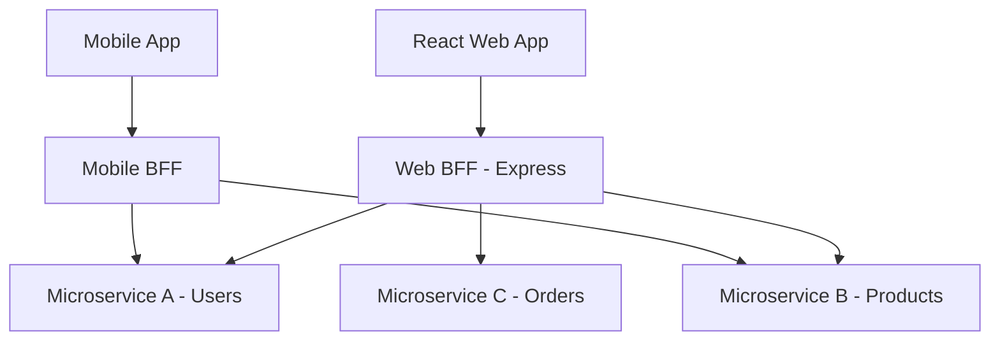

# Kiến Trúc Front-end Cho Hệ Thống Lớn: Micro-frontends & BFF (Backend for Frontend)

Khi các hệ thống phần mềm phát triển đến quy mô doanh nghiệp lớn, việc duy trì một ứng dụng Front-end nguyên khối (Monolithic Frontend) trở nên cực kỳ khó khăn. Hai kiến trúc cốt lõi thường được áp dụng để giải quyết bài toán này là **Micro-frontends** (ở phía Client) và **BFF - Backend for Frontend** (ở phía Server trung gian).

---

## 1. Kiến Trúc Micro-frontends

### 1.1. Khái niệm Micro-frontends
Tương tự như kiến trúc Microservices ở phía Backend, **Micro-frontends** là giải pháp chia nhỏ một ứng dụng Front-end lớn thành các ứng dụng nhỏ hơn, chạy độc lập và có thể tích hợp lại với nhau để tạo thành một giao diện duy nhất cho người dùng.

### 1.2. Tại sao hệ thống lớn cần Micro-frontends?
1.  **Phát triển và triển khai độc lập (Independent Deployments)**:
    *   Mỗi nhóm phát triển (Team) chịu trách nhiệm hoàn toàn cho một tính năng (ví dụ: Team Checkout, Team Search).
    *   Team Checkout có thể commit code, build và deploy tính năng thanh toán lên production mà không cần thông báo hay làm gián đoạn Team Search.
2.  **Mở rộng quy mô đội ngũ (Team Scaling)**:
    *   Nhiều team có thể làm việc song song trên cùng một sản phẩm mà không sợ xung đột code (code conflicts) trong một repo khổng lồ.
3.  **Công nghệ độc lập (Technology Agnostic)**:
    *   Các micro-app có thể sử dụng các phiên bản React khác nhau, hoặc thậm chí một ứng dụng dùng React, ứng dụng khác dùng Vue hoặc Angular (tuy nhiên việc này không được khuyến khích vì làm tăng dung lượng tải trang).
4.  **Cô lập lỗi (Fault Isolation)**:
    *   Nếu trang Thanh toán (Checkout) bị lỗi nghiêm trọng, người dùng vẫn có thể duyệt sản phẩm (Product Catalog) bình thường thay vì sập toàn bộ trang web.

### 1.3. Các phương pháp tích hợp (Composition Methods)
*   **Build-time Composition (Tích hợp lúc Build)**:
    *   Các micro-app được đóng gói thành các thư viện npm. Ứng dụng chính (Container) sẽ cài đặt chúng như các package thông thường.
    *   *Nhược điểm*: Mất đi tính độc lập khi triển khai. Mỗi khi một micro-app cập nhật, ta phải rebuild và redeploy toàn bộ ứng dụng chính.
*   **Run-time Composition (Tích hợp lúc Chạy - Khuyên dùng)**:
    *   Các micro-app được build và deploy lên các server/CDN riêng biệt dưới dạng các file bundle Javascript. Khi người dùng truy cập trang web, ứng dụng chính sẽ tải động các file Javascript này và render lên màn hình.
    *   **Module Federation (Webpack 5 / Vite)**: Cơ chế chia sẻ module và code động lúc runtime phổ biến nhất hiện nay. Cho phép các ứng dụng chia sẻ các thư viện dùng chung (như React, Lodash) để tránh tải lặp lại, tối ưu hiệu năng tuyệt đối.
    *   **iFrames**: Đơn giản nhất nhưng khó tùy biến giao diện, gặp vấn đề về bảo mật, SEO và hiệu năng chia sẻ state.
    *   **Web Components**: Đóng gói các micro-app thành các Custom HTML Elements tiêu chuẩn (ví dụ: `<checkout-module />`), giúp chạy được trên mọi framework.

---

## 2. Kiến Trúc BFF (Backend For Frontend)

### 2.1. Khái niệm BFF là gì?
**BFF (Backend for Frontend)** là một mô hình thiết kế phần mềm, trong đó ta xây dựng một server Backend trung gian chuyên biệt dành riêng cho một giao diện người dùng (Frontend client) cụ thể (ví dụ: một BFF cho ứng dụng Web, một BFF cho ứng dụng Mobile).

### 2.2. Tại sao không cho FE gọi trực tiếp Downstream Microservices?
Trong kiến trúc Microservices, hệ thống phía sau được chia nhỏ thành hàng chục service độc lập. Nếu Frontend gọi trực tiếp các service này:
-   **Quá nhiều Request mạng**: Để hiển thị một trang Dashboard, Frontend có thể phải gọi đồng thời 5-7 APIs từ các service khác nhau, gây trễ mạng rất lớn (đặc biệt trên thiết bị di động).
-   **Over-fetching & Under-fetching**: Các microservice phía sau trả về dữ liệu quá dư thừa (làm nặng băng thông) hoặc thiếu dữ liệu (yêu cầu gọi thêm API khác).
-   **Lộ thông tin bảo mật**: Frontend phải tự quản lý nhiều API tokens của các service khác nhau.
-   **Khó thay đổi cấu trúc**: Nếu backend quyết định gộp hoặc chia tách microservice, Frontend sẽ bị ảnh hưởng trực tiếp và phải sửa code.

### 2.3. Cơ chế hoạt động & Lợi ích của BFF
BFF đóng vai trò là một **Proxy / API Gateway thông minh**:
*   **Gom dữ liệu (Data Aggregation)**: Nhận một yêu cầu duy nhất từ Frontend, tự động gọi song song đến 5 microservices phía sau, tổng hợp kết quả lại thành một cục dữ liệu duy nhất và trả về cho Frontend trong 1 request.
*   **Định hình dữ liệu (Data Shaping & Transformation)**: Lọc bỏ các trường thông tin dư thừa mà Frontend không dùng đến, định dạng lại kiểu dữ liệu phù hợp với giao diện nhằm tiết kiệm tối đa băng thông.
*   **Xử lý Bảo mật & Auth Gateway**: BFF đóng vai trò quản lý Session/Cookie HttpOnly. Frontend chỉ cần gửi Cookie an toàn tới BFF, BFF giải mã lấy token và tự đính kèm Token đó khi giao tiếp với các Downstream Microservices trong mạng nội bộ.

---

## 3. Phối Hợp React (FE) + Express (BFF)

Khi sử dụng **React làm Front-end** và **Express làm BFF**, vai trò của từng bên được phân chia cực kỳ rõ ràng để tối ưu hóa hiệu năng và bảo mật.

### 3.1. Vai trò của React (Frontend)
-   **Trải nghiệm người dùng (UX)**: Chịu trách nhiệm render giao diện, tạo các tương tác mượt mà, quản lý trạng thái hiển thị (Client State).
-   **Đơn giản hóa giao tiếp**: React **chỉ biết duy nhất Express BFF** và gửi toàn bộ API request về Express BFF. React không cần biết địa chỉ IP hay token của 10 microservices phía sau.
-   **Bảo mật**: Chỉ lưu trữ thông tin không nhạy cảm. Không lưu JWT token dài hạn trong LocalStorage.

### 3.2. Vai trò của Express (BFF)
Express đóng vai trò là "người hộ vệ" và "trợ lý" đắc lực cho React:
1.  **Quản lý Session Cookie an toàn**:
    *   Khi React gửi form đăng nhập qua Express, Express sẽ gọi Service Auth phía sau. Sau khi nhận được Access Token và Refresh Token, Express sẽ đóng gói chúng vào Cookie **HttpOnly, Secure, SameSite** và trả về cho trình duyệt.
    *   Mọi API tiếp theo từ React gửi lên sẽ tự động mang theo cookie này. Express sẽ đọc cookie, trích xuất Token và gắn vào header để gọi microservice. Trình duyệt React hoàn toàn không tiếp xúc với token gốc $\rightarrow$ Kháng hoàn toàn tấn công XSS đánh cắp token.
2.  **Tổng hợp & Biến đổi dữ liệu (Aggregator & Transformer)**:
    *   Ví dụ: Trang chi tiết sản phẩm của React cần thông tin sản phẩm, số lượng tồn kho, và đánh giá.
    *   Thay vì React gọi 3 API khác nhau, nó chỉ cần gọi: `GET /api/products/:id` đến Express.
    *   Express sẽ gọi song song:
        *   `GET microservices/products/:id`
        *   `GET microservices/inventory/:id`
        *   `GET microservices/reviews/:id`
    *   Sau đó, Express định dạng lại dữ liệu và trả về một JSON gọn gàng cho React.
3.  **Bộ nhớ đệm (Caching)**:
    *   Express BFF có thể tích hợp Redis cache để lưu trữ các dữ liệu ít biến động (như cấu trúc danh mục, thông tin cấu hình trang web). Khi React yêu cầu, Express trả về ngay lập tức mà không cần gọi xuống hệ thống microservices phía sau.
