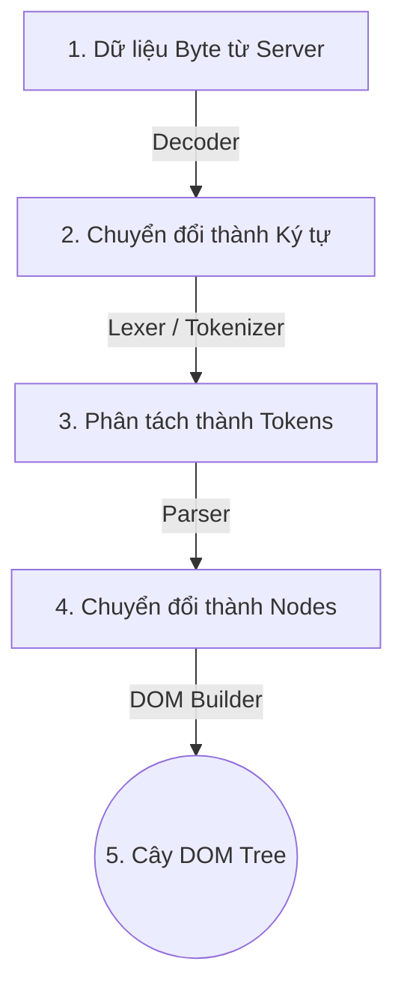
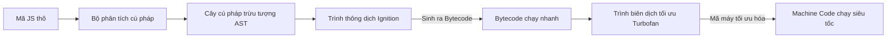
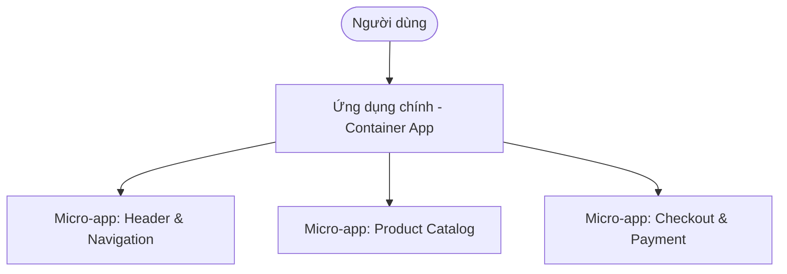
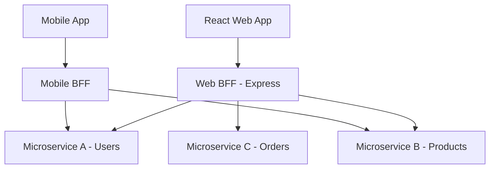

# Kiến Trúc Front-end Cho Hệ Thống Lớn: Nền Tảng Trình Duyệt, Micro-frontends & BFF

Khi phát triển các ứng dụng Front-end hiện đại, ta cần hiểu rõ cả nguyên lý hoạt động cấp thấp của trình duyệt lẫn mô hình cấu trúc hệ thống lớn (Micro-frontends và BFF).

---

## 1. Nền Tảng Web: Trình Duyệt & Bộ Ba HTML, CSS, JavaScript

Trang web hoạt động dựa trên ba trụ cột chính, đại diện cho cấu trúc, thẩm mỹ và hành vi của giao diện:

-   **HTML (HyperText Markup Language)**: Ngôn ngữ đánh dấu siêu văn bản, đóng vai trò xây dựng **khung xương** (Structure) và định nghĩa nội dung hiển thị (tiêu đề, đoạn văn, ảnh, form).
-   **CSS (Cascading Style Sheets)**: Ngôn ngữ định kiểu, đóng vai trò làm **lớp da/quần áo** (Presentation). CSS quyết định màu sắc, bố cục (layout: Flexbox, Grid), phông chữ, và các hiệu ứng chuyển động (animations).
-   **JavaScript (JS)**: Ngôn ngữ lập trình, đóng vai trò làm **bộ não** (Behavior). JS giúp trang web tương tác động với người dùng (bắt sự kiện click, lấy dữ liệu từ server qua API, cập nhật thông tin trên màn hình mà không cần load lại trang).

### 1.1. Tại sao trình duyệt chỉ hiểu duy nhất 3 ngôn ngữ này?

Khi người dùng nhập một địa chỉ website, máy chủ (Server) sẽ phản hồi lại các tệp tin chứa mã nguồn HTML, CSS và JS. Trình duyệt (Web Browser) được lập trình để **chỉ biên dịch và hiển thị duy nhất 3 ngôn ngữ này** vì các lý do kỹ thuật và lịch sử dưới nền:

1.  **Phân tách mối quan tâm thiết kế (Separation of Concerns)**:
    *   Hội đồng Tiêu chuẩn Web toàn cầu (W3C) thiết kế kiến trúc web chia làm 3 lớp độc lập: **Nội dung** (HTML), **Trình bày** (CSS), và **Hành vi** (JS). Sự phân tách này giúp việc phát triển web có cấu trúc rõ ràng, dễ bảo trì và tối ưu hiệu năng truyền tải qua mạng.
2.  **Tích hợp sẵn các Engine biên dịch chuyên biệt**:
    *   Trình duyệt không chạy hệ điều hành trực tiếp; nó là một phần mềm trung gian. Để hiển thị trang web, các kỹ sư phát triển trình duyệt đã tích hợp sẵn:
        *   **Rendering Engine (Bộ máy dựng hình)**: Như *Blink* (Chrome, Edge), *WebKit* (Safari), *Gecko* (Firefox). Chúng được tối ưu hóa ở mức tối đa để đọc mã nguồn HTML/CSS và dựng thành giao diện đồ họa.
        *   **JavaScript Engine (Bộ máy thực thi JS)**: Như *V8* (Chrome), *SpiderMonkey* (Firefox), *JavaScriptCore* (Safari). Chúng thực hiện biên dịch JIT (Just-In-Time) biến mã JS thành mã máy trực tiếp cho CPU chạy.
    *   *Tại sao không có Python/Java?* Việc tích hợp thêm các runtime cho Python, Java, Ruby hay C++ vào trình duyệt sẽ làm trình duyệt có dung lượng cực kỳ khổng lồ, khởi động chậm, và mở ra các lỗ hổng bảo mật nghiêm trọng (do các ngôn ngữ này có khả năng truy cập tài nguyên hệ thống trực tiếp của máy tính người dùng).
3.  **Tiêu chuẩn hóa và Tính tương thích ngược (Backward Compatibility)**:
    *   Mạng Internet là mạng lưới toàn cầu. Nếu mỗi trình duyệt tự hiểu một ngôn ngữ khác nhau (ví dụ Chrome hiểu Python, Safari hiểu Swift), thế giới web sẽ bị chia cắt. W3C ra đời để đảm bảo mọi trình duyệt đều thống nhất đọc bộ ba HTML/CSS/JS.
    *   Đồng thời, thế giới web yêu cầu "tính tương thích ngược vĩnh viễn" - tức là một website viết bằng HTML từ năm 1991 vẫn phải hiển thị được trên trình duyệt Chrome ngày nay. Việc thay đổi ngôn ngữ cốt lõi sẽ làm sập hàng tỷ website cũ trên thế giới.

---

### 1.2. Tại sao bắt buộc phải là HTML mà không phải một ngôn ngữ nào khác?

Nhiều người đặt câu hỏi: *Tại sao không lưu cấu trúc trang web bằng JSON, XML hay Markdown cho đơn giản và gọn nhẹ, mà phải dùng HTML với các thẻ mở/đóng cồng kềnh?*

1.  **Tính bao dung lỗi cực cao (Fault Tolerance - HTML Parser)**:
    *   Đây là đặc điểm quan trọng nhất của HTML. Các ngôn ngữ như JSON hay XML có cú pháp cực kỳ nghiêm ngặt; chỉ cần thiếu một dấu phẩy `,` hoặc một thẻ đóng `</tag>`, trình biên dịch sẽ báo lỗi cú pháp (Syntax Error) và ngừng hoạt động ngay lập tức (sập trang).
    *   HTML được thiết kế với cơ chế phân tích cú pháp **bao dung lỗi** (HTML Parser Specification). Nếu bạn quên đóng thẻ `
`, hoặc viết sai cú pháp, trình duyệt sẽ tự động suy luận logic và sửa lỗi thay bạn để tiếp tục render giao diện. Triết lý thiết kế của Web là: **"Giao diện hiển thị méo mó còn tốt hơn là sập màn hình trắng"** (để giữ chân người dùng).
2.  **Mô hình siêu văn bản (Hypertext) & Liên kết**:
    *   HTML là viết tắt của *HyperText Markup Language* (Ngôn ngữ Đánh dấu Siêu văn bản). Bản chất của Internet là mạng lưới các trang liên kết với nhau. HTML tích hợp sẵn thẻ `<a>` (Anchor) từ cấu trúc nhân, hỗ trợ việc tạo các siêu liên kết (hyperlinks) để đi từ tài liệu này sang tài liệu khác một cách tự nhiên. Các định dạng tĩnh như JSON hay YAML không được thiết kế cho việc tạo liên kết ngữ nghĩa động như vậy.
3.  **Khả năng Render luồng (Streaming Rendering)**:
    *   Khi tải một trang web qua mạng chậm, trình duyệt nhận tệp HTML theo từng gói dữ liệu nhỏ (chunk). Trình duyệt có thể phân tích cú pháp và hiển thị ngay các dòng chữ đầu tiên của HTML lên màn hình **ngay cả khi file HTML chưa tải xong**.
    *   Ngược lại, với các định dạng như JSON hay XML, hệ thống phải tải về toàn bộ 100% file để đóng ngoặc `}` ở cuối cùng thì mới có thể phân tích (parse) cấu trúc được. Điều này làm tăng thời gian chờ đợi của người dùng lên rất nhiều.

---

### 1.3. Chi tiết Vòng đời Biên dịch và Dựng hình của Trình duyệt (Critical Rendering Path)

Khi trình duyệt nhận được luồng dữ liệu byte từ Server gửi về, nó sẽ thực hiện một quy trình phức tạp gồm 6 bước để hiển thị giao diện lên màn hình:

#### Bước 1: Xây dựng cây DOM (Document Object Model)
Trình duyệt thực hiện quá trình chuyển đổi tệp HTML thô sang cây DOM trong bộ nhớ RAM qua các bước:
1.  **Conversion (Chuyển đổi)**: Trình duyệt đọc các byte thô từ ổ đĩa hoặc mạng và chuyển chúng thành các ký tự dựa trên mã hóa (ví dụ: UTF-8).
2.  **Tokenizing (Phân tách thẻ)**: Trình duyệt chuyển các ký tự thành các thẻ tiêu chuẩn (Start tag, End tag) dựa trên tiêu chuẩn W3C.
3.  **Lexing (Tạo Node)**: Các thẻ này được chuyển đổi thành các đối tượng Node (Nút) chứa các thuộc tính và quy tắc riêng.
4.  **DOM Construction**: Do các thẻ HTML có quan hệ lồng nhau, trình duyệt liên kết các Node này lại thành một cấu trúc cây phả hệ gọi là **DOM Tree** (Cây thực thể tài liệu).

#### Bước 2: Xây dựng cây CSSOM (CSS Object Model)
Đồng thời khi gặp các thẻ `<link rel="stylesheet">` hoặc `<style>`, trình duyệt tải CSS về và thực hiện quy trình phân tích tương tự HTML để dựng lên cây **CSSOM Tree**. Cây này định nghĩa quy tắc kiểu dáng cho từng node tương ứng.

#### Bước 3: Tạo Render Tree (Cây Dựng hình)
Trình duyệt kết hợp cây DOM và CSSOM lại với nhau để tạo thành **Render Tree**:
*   Render Tree chỉ chứa các node **thực sự hiển thị trên màn hình**.
*   Các node có thuộc tính `display: none` trong CSSOM sẽ bị loại bỏ hoàn toàn khỏi Render Tree. Tuy nhiên, các node có `visibility: hidden` vẫn được giữ lại vì chúng vẫn chiếm không gian trên màn hình.

#### Bước 4: Giai đoạn Layout (Reflow / Tính toán vị trí)
*   Trình duyệt bắt đầu tính toán kích thước vật lý (chiều rộng, chiều cao) và tọa độ vị trí (x, y) của từng node trên khung màn hình hiển thị (Viewport).
*   Giai đoạn này diễn ra từ trên xuống dưới (top-down), bắt đầu từ node gốc `<html>` và tính toán diện tích tương đối của các node con dựa theo cấu trúc box model.

#### Bước 5: Giai đoạn Paint (Repaint / Vẽ điểm ảnh)
*   Trình duyệt chuyển đổi các node trong Render Tree thành các pixel thực tế trên màn hình. Nó tiến hành vẽ văn bản, màu nền, viền, ảnh, đổ bóng lên các lớp (layers) tương ứng.
*   Giai đoạn này đòi hỏi nhiều tài nguyên CPU/GPU nhất của thiết bị.

#### Bước 6: Giai đoạn Compositing (Hợp nhất lớp)
*   Để tối ưu hiệu năng (nhất là khi có hiệu ứng cuộn trang, chuyển động transform, hoặc layer z-index), trình duyệt không vẽ toàn bộ trang web vào 1 bức ảnh duy nhất.
*   Nó chia giao diện thành nhiều lớp (layers) riêng biệt để vẽ độc lập, sau đó chuyển xuống GPU để hợp nhất (composite) các lớp này lại thành khung hình hoàn chỉnh hiển thị lên màn hình.

---

### 1.4. JavaScript được thực thi thế nào trong vòng đời này?

JavaScript Engine (như V8 của Google Chrome) hoạt động theo cơ chế **JIT Compilation**:

-   **Parser**: Đọc mã JS và phân tích thành **AST (Abstract Syntax Tree)**.
-   **Ignition Interpreter**: Trình thông dịch chuyển AST thành **Bytecode** để chạy ngay lập tức.
-   **Turbofan Compiler**: Trình biên dịch ngầm theo dõi các đoạn code chạy thường xuyên (hot code), lấy Bytecode đó biên dịch trực tiếp sang **Mã máy tối ưu (Optimized Machine Code)** để CPU chạy trực tiếp với tốc độ tối đa.
-   **Đánh chặn Rendering (Render Blocking)**:
    *   Mặc định, khi trình duyệt đang parse HTML mà gặp thẻ `<script>`, nó sẽ **dừng việc parse HTML lại** để tải và thực thi JS (vì JS có thể dùng lệnh `document.write` để sửa đổi DOM đang dựng).
    *   Do đó, để tránh đứng hình trang web, ta thường thêm thuộc tính `defer` hoặc `async` vào thẻ `<script>` để tải JS song song và chỉ thực thi khi HTML đã được phân tích xong.

---

## 2. Kiến Trúc Micro-frontends

### 2.1. Khái niệm Micro-frontends
Tương tự như kiến trúc Microservices ở phía Backend, **Micro-frontends** là giải pháp chia nhỏ một ứng dụng Front-end lớn thành các ứng dụng nhỏ hơn, chạy độc lập và có thể tích hợp lại với nhau để tạo thành một giao diện duy nhất cho người dùng.

### 1.2. Tại sao hệ thống lớn cần Micro-frontends?
1.  **Phát triển và triển khai độc lập (Independent Deployments)**:
    *   Mỗi nhóm phát triển (Team) chịu trách nhiệm hoàn toàn cho một tính năng (ví dụ: Team Checkout, Team Search).
    *   Team Checkout có thể commit code, build và deploy tính năng thanh toán lên production mà không cần thông báo hay làm gián đoạn Team Search.
2.  **Mở rộng quy mô đội ngũ (Team Scaling)**:
    *   Nhiều team có thể làm việc song song trên cùng một sản phẩm mà không sợ xung đột code (code conflicts) trong một repo khổng lồ.
3.  **Công nghệ độc lập (Technology Agnostic)**:
    *   Các micro-app có thể sử dụng các phiên bản React khác nhau, hoặc thậm chí một ứng dụng dùng React, ứng dụng khác dùng Vue hoặc Angular (tuy nhiên việc này không được khuyến khích vì làm tăng dung lượng tải trang).
4.  **Cô lập lỗi (Fault Isolation)**:
    *   Nếu trang Thanh toán (Checkout) bị lỗi nghiêm trọng, người dùng vẫn có thể duyệt sản phẩm (Product Catalog) bình thường thay vì sập toàn bộ trang web.

### 1.3. Các phương pháp tích hợp (Composition Methods)
*   **Build-time Composition (Tích hợp lúc Build)**:
    *   Các micro-app được đóng gói thành các thư viện npm. Ứng dụng chính (Container) sẽ cài đặt chúng như các package thông thường.
    *   *Nhược điểm*: Mất đi tính độc lập khi triển khai. Mỗi khi một micro-app cập nhật, ta phải rebuild và redeploy toàn bộ ứng dụng chính.
*   **Run-time Composition (Tích hợp lúc Chạy - Khuyên dùng)**:
    *   Các micro-app được build và deploy lên các server/CDN riêng biệt dưới dạng các file bundle Javascript. Khi người dùng truy cập trang web, ứng dụng chính sẽ tải động các file Javascript này và render lên màn hình.
    *   **Module Federation (Webpack 5 / Vite)**: Cơ chế chia sẻ module và code động lúc runtime phổ biến nhất hiện nay. Cho phép các ứng dụng chia sẻ các thư viện dùng chung (như React, Lodash) để tránh tải lặp lại, tối ưu hiệu năng tuyệt đối.
    *   **iFrames**: Đơn giản nhất nhưng khó tùy biến giao diện, gặp vấn đề về bảo mật, SEO và hiệu năng chia sẻ state.
    *   **Web Components**: Đóng gói các micro-app thành các Custom HTML Elements tiêu chuẩn (ví dụ: `<checkout-module />`), giúp chạy được trên mọi framework.

---

## 2. Kiến Trúc BFF (Backend For Frontend)

### 2.1. Khái niệm BFF là gì?
**BFF (Backend for Frontend)** là một mô hình thiết kế phần mềm, trong đó ta xây dựng một server Backend trung gian chuyên biệt dành riêng cho một giao diện người dùng (Frontend client) cụ thể (ví dụ: một BFF cho ứng dụng Web, một BFF cho ứng dụng Mobile).

### 2.2. Tại sao không cho FE gọi trực tiếp Downstream Microservices?
Trong kiến trúc Microservices, hệ thống phía sau được chia nhỏ thành hàng chục service độc lập. Nếu Frontend gọi trực tiếp các service này:
-   **Quá nhiều Request mạng**: Để hiển thị một trang Dashboard, Frontend có thể phải gọi đồng thời 5-7 APIs từ các service khác nhau, gây trễ mạng rất lớn (đặc biệt trên thiết bị di động).
-   **Over-fetching & Under-fetching**: Các microservice phía sau trả về dữ liệu quá dư thừa (làm nặng băng thông) hoặc thiếu dữ liệu (yêu cầu gọi thêm API khác).
-   **Lộ thông tin bảo mật**: Frontend phải tự quản lý nhiều API tokens của các service khác nhau.
-   **Khó thay đổi cấu trúc**: Nếu backend quyết định gộp hoặc chia tách microservice, Frontend sẽ bị ảnh hưởng trực tiếp và phải sửa code.

### 2.3. Cơ chế hoạt động & Lợi ích của BFF
BFF đóng vai trò là một **Proxy / API Gateway thông minh**:
*   **Gom dữ liệu (Data Aggregation)**: Nhận một yêu cầu duy nhất từ Frontend, tự động gọi song song đến 5 microservices phía sau, tổng hợp kết quả lại thành một cục dữ liệu duy nhất và trả về cho Frontend trong 1 request.
*   **Định hình dữ liệu (Data Shaping & Transformation)**: Lọc bỏ các trường thông tin dư thừa mà Frontend không dùng đến, định dạng lại kiểu dữ liệu phù hợp với giao diện nhằm tiết kiệm tối đa băng thông.
*   **Xử lý Bảo mật & Auth Gateway**: BFF đóng vai trò quản lý Session/Cookie HttpOnly. Frontend chỉ cần gửi Cookie an toàn tới BFF, BFF giải mã lấy token và tự đính kèm Token đó khi giao tiếp với các Downstream Microservices trong mạng nội bộ.

---

## 3. Phối Hợp React (FE) + Express (BFF)

Khi sử dụng **React làm Front-end** và **Express làm BFF**, vai trò của từng bên được phân chia cực kỳ rõ ràng để tối ưu hóa hiệu năng và bảo mật.

### 3.1. Vai trò của React (Frontend)
-   **Trải nghiệm người dùng (UX)**: Chịu trách nhiệm render giao diện, tạo các tương tác mượt mà, quản lý trạng thái hiển thị (Client State).
-   **Đơn giản hóa giao tiếp**: React **chỉ biết duy nhất Express BFF** và gửi toàn bộ API request về Express BFF. React không cần biết địa chỉ IP hay token của 10 microservices phía sau.
-   **Bảo mật**: Chỉ lưu trữ thông tin không nhạy cảm. Không lưu JWT token dài hạn trong LocalStorage.

### 3.2. Vai trò của Express (BFF)
Express đóng vai trò là "người hộ vệ" và "trợ lý" đắc lực cho React:
1.  **Quản lý Session Cookie an toàn**:
    *   Khi React gửi form đăng nhập qua Express, Express sẽ gọi Service Auth phía sau. Sau khi nhận được Access Token và Refresh Token, Express sẽ đóng gói chúng vào Cookie **HttpOnly, Secure, SameSite** và trả về cho trình duyệt.
    *   Mọi API tiếp theo từ React gửi lên sẽ tự động mang theo cookie này. Express sẽ đọc cookie, trích xuất Token và gắn vào header để gọi microservice. Trình duyệt React hoàn toàn không tiếp xúc với token gốc $\rightarrow$ Kháng hoàn toàn tấn công XSS đánh cắp token.
2.  **Tổng hợp & Biến đổi dữ liệu (Aggregator & Transformer)**:
    *   Ví dụ: Trang chi tiết sản phẩm của React cần thông tin sản phẩm, số lượng tồn kho, và đánh giá.
    *   Thay vì React gọi 3 API khác nhau, nó chỉ cần gọi: `GET /api/products/:id` đến Express.
    *   Express sẽ gọi song song:
        *   `GET microservices/products/:id`
        *   `GET microservices/inventory/:id`
        *   `GET microservices/reviews/:id`
    *   Sau đó, Express định dạng lại dữ liệu và trả về một JSON gọn gàng cho React.
3.  **Bộ nhớ đệm (Caching)**:
    *   Express BFF có thể tích hợp Redis cache để lưu trữ các dữ liệu ít biến động (như cấu trúc danh mục, thông tin cấu hình trang web). Khi React yêu cầu, Express trả về ngay lập tức mà không cần gọi xuống hệ thống microservices phía sau.
