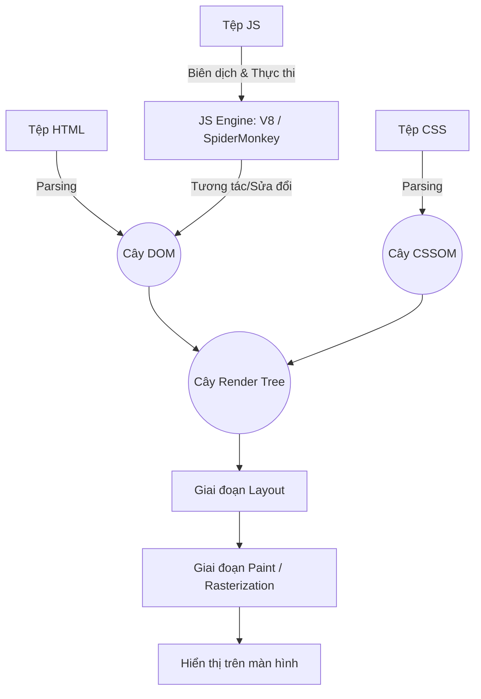
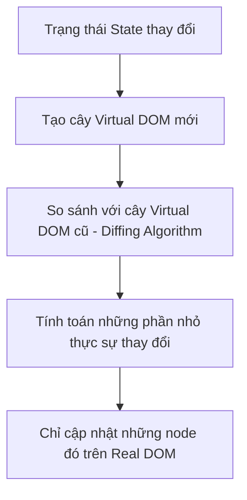

# Nền Tảng Front-end: HTML, CSS, JavaScript, React & Next.js

Để xây dựng giao diện web chuyên nghiệp, ta cần hiểu rõ từ các viên gạch cơ bản nhất (HTML/CSS/JS) cho đến các công cụ nâng cao hỗ trợ xây dựng ứng dụng lớn như React và Next.js.

---

## 1. Bản Chất Của Web: HTML, CSS & JavaScript

Trang web hoạt động dựa trên ba trụ cột chính, đại diện cho cấu trúc, thẩm mỹ và hành vi của giao diện:

-   **HTML (HyperText Markup Language)**: Ngôn ngữ đánh dấu siêu văn bản, đóng vai trò xây dựng **khung xương** (Structure) và định nghĩa nội dung hiển thị (tiêu đề, đoạn văn, ảnh, form).
-   **CSS (Cascading Style Sheets)**: Ngôn ngữ định kiểu, đóng vai trò làm **lớp da/quần áo** (Presentation). CSS quyết định màu sắc, bố cục (layout: Flexbox, Grid), phông chữ, và các hiệu ứng chuyển động (animations).
-   **JavaScript (JS)**: Ngôn ngữ lập trình, đóng vai trò làm **bộ não** (Behavior). JS giúp trang web tương tác động với người dùng (bắt sự kiện click, lấy dữ liệu từ server qua API, cập nhật thông tin trên màn hình mà không cần load lại trang).

---

### 1.1. Tại sao trình duyệt chỉ hiểu duy nhất 3 ngôn ngữ này?

Khi bạn truy cập một website, server sẽ gửi về các tệp tin chứa mã nguồn HTML, CSS và JS. Trình duyệt (Chrome, Safari, Firefox, Edge) được lập trình để **chỉ biên dịch và hiển thị được 3 ngôn ngữ này** vì cấu trúc kỹ thuật bên trong của chúng:

1.  **Kiến trúc Rendering Engine (Bộ máy dựng hình)**:
    *   Mọi trình duyệt đều có một bộ máy dựng hình (ví dụ: **Blink** trong Chrome/Edge, **Gecko** trong Firefox, **WebKit** trong Safari).
    *   Bộ máy này có nhiệm vụ phân tích cú pháp (Parsing) mã **HTML** thành cấu trúc cây gọi là **DOM** (Document Object Model) và mã **CSS** thành **CSSOM** (CSS Object Model). Sau đó gộp lại thành **Render Tree** để thực hiện các bước **Layout** (tính toán vị trí các ô) và **Paint** (vẽ các điểm ảnh lên màn hình).
2.  **Kiến trúc JavaScript Engine (Bộ máy thực thi JS)**:
    *   Mỗi trình duyệt tích hợp một engine chuyên biệt (ví dụ: **V8** trong Chrome/Node.js, **SpiderMonkey** trong Firefox, **JavaScriptCore** trong Safari) để biên dịch trực tiếp mã JavaScript thành mã máy (Machine Code) để CPU thực thi.
3.  **Tính Tiêu Chuẩn Hóa (Standardization)**:
    *   Để đảm bảo mọi người dùng trên thế giới truy cập web đều có trải nghiệm giống nhau, Tổ chức Tiêu chuẩn Web Quốc tế (**W3C**) đã chuẩn hóa bộ ba ngôn ngữ này. Các nhà phát triển trình duyệt bắt buộc phải tuân theo chuẩn này.
    *   **Tại sao không chạy được Python hay C++ trực tiếp?** Bởi vì trình duyệt không tích hợp các trình biên dịch/thông dịch cho Python hay C++. Muốn chạy các ngôn ngữ khác, chúng bắt buộc phải được biên dịch sang một định dạng trung gian tiêu chuẩn mà trình duyệt mới hỗ trợ gần đây là **WebAssembly (Wasm)**.

---

## 2. Thư Viện React

### 2.1. React là gì?
React là một thư viện JavaScript mã nguồn mở được Meta (Facebook) phát triển dùng để xây dựng giao diện người dùng (UI) dựa trên các thành phần độc lập, có thể tái sử dụng gọi là **Components**.

### 2.2. Sự khác biệt cốt lõi giữa React và Vanilla (Thuần) JS

Sự chuyển dịch từ Vanilla JS sang React đại diện cho sự thay đổi tư duy lập trình:

#### A. Tư duy Mệnh lệnh (Imperative - Vanilla JS) vs Tư duy Khai báo (Declarative - React)
*   **Vanilla JS (Mệnh lệnh)**: Bạn phải chỉ ra **từng bước cụ thể** để thay đổi giao diện.
    *   *Ví dụ*: Để tăng số đếm khi bấm nút, bạn phải tự tìm thẻ bằng ID, đọc giá trị cũ, ép kiểu, cộng 1, rồi cập nhật lại nội dung HTML bằng lệnh `document.getElementById('counter').innerText = newValue`.
*   **React (Khai báo)**: Bạn chỉ cần **mô tả giao diện trông như thế nào tương ứng với State (Trạng thái)**. Khi State thay đổi, React sẽ tự động cập nhật giao diện tương ứng mà bạn không cần trực tiếp động vào DOM.

#### B. Cơ chế Virtual DOM (DOM ảo)
Thao tác chỉnh sửa trực tiếp trên Real DOM của trình duyệt là một hoạt động cực kỳ đắt đỏ (chậm) vì mỗi lần thay đổi, trình duyệt phải tính toán lại Layout và vẽ lại (Repaint) giao diện.

*   **Cách hoạt động**:
    1.  Khi dữ liệu thay đổi, React không cập nhật trực tiếp lên đĩa màn hình. Nó tạo ra một cây DOM ảo mới nằm trong bộ nhớ RAM (được biểu diễn dưới dạng các đối tượng JS gọn nhẹ).
    2.  React chạy thuật toán so sánh (**Diffing Algorithm / Reconciliation**) giữa cây DOM ảo mới và cây DOM ảo cũ để tìm ra chính xác những điểm khác biệt.
    3.  React gom tất cả thay đổi đó lại và chỉ cập nhật (patch) những phần thực sự thay đổi lên Real DOM của trình duyệt $\rightarrow$ Tăng hiệu năng ứng dụng lên gấp nhiều lần.

---

## 3. Khung Phát Triển Next.js (Framework)

### 3.1. Phân biệt Thư viện (Library - React) vs Framework (Next.js)
*   **React là Thư viện (Library)**: Chỉ tập trung vào việc render UI. Bạn có toàn quyền tự do lựa chọn các công cụ khác đi kèm (chọn thư viện Router nào, cách tổ chức thư mục ra sao, build tool gì). Nó giống như việc mua các viên gạch và bạn tự phải xây nhà.
*   **Next.js là Khung phát triển (Framework)**: Cung cấp sẵn một bộ khung hoàn chỉnh để phát triển ứng dụng production. Next.js quyết định sẵn cách bạn làm Routing (App Router), cách tối ưu hình ảnh, cách xử lý SSR/SSG. Bạn phải tuân thủ luật chơi của Next.js để đạt được hiệu quả tối ưu. Nó giống như một căn hộ chung cư đã xây thô sẵn khung, bạn chỉ vào hoàn thiện nội thất.

### 3.2. Ưu thế vượt trội của Next.js so với React (CRA - Client-Side Rendering)
React truyền thống sử dụng cơ chế **CSR (Client-Side Rendering)**: Server trả về một file HTML rỗng và một file JS khổng lồ. Trình duyệt tải file JS về rồi mới bắt đầu render giao diện.

| Tiêu chí | React CSR | Next.js (SSR / SSG / ISR) |
| :--- | :--- | :--- |
| **SEO (Search Engine Optimization)** | **Kém**. Bot tìm kiếm của Google quét trang HTML rỗng sẽ thấy không có nội dung, khó index từ khóa. | **Cực tốt**. Nội dung HTML đã được dựng đầy đủ chữ nghĩa trên Server trước khi trả về, bot index lập tức. |
| **Tốc độ tải trang đầu (FCP)** | **Chậm**. Người dùng phải chờ trình duyệt tải xong và thực thi đống file JS mới thấy giao diện (màn hình trắng). | **Nhanh**. Người dùng nhận được HTML hoàn chỉnh từ server và thấy giao diện ngay lập tức. |
| **Cách xử lý Routing** | Sử dụng thư viện ngoài (React Router DOM) chạy ở Client. | Tích hợp sẵn **File-based Routing** (đặt thư mục là tự động sinh Route) chạy ở Server. |
| **Tính bảo mật API** | API keys thường bị lộ trên trình duyệt do JS chạy ở Client. | An toàn hơn nhờ sử dụng **Server Components** và **Server Actions**, API keys được giấu kín hoàn toàn trên Server. |
