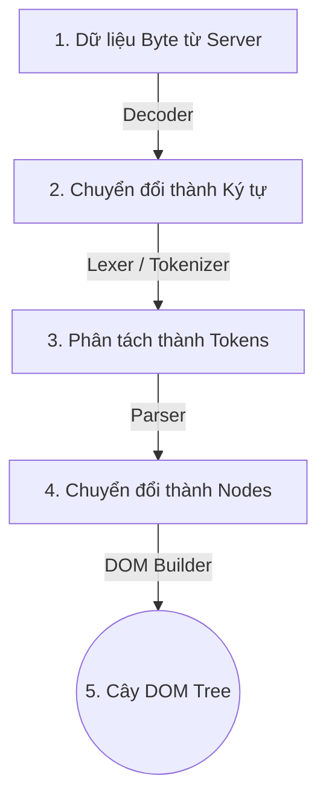
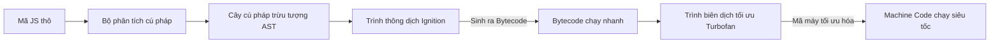
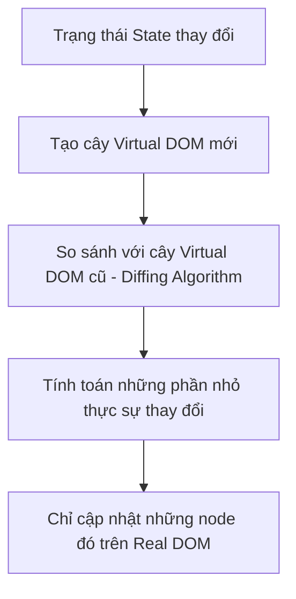

# Nền Tảng Front-end: HTML, CSS, JavaScript, React & Next.js

Để xây dựng giao diện web chuyên nghiệp, ta cần hiểu rõ từ các viên gạch cơ bản nhất (HTML/CSS/JS) cho đến các công cụ nâng cao hỗ trợ xây dựng ứng dụng lớn như React và Next.js.

---

## 1. Bản Chất Của Web: HTML, CSS & JavaScript

Trang web hoạt động dựa trên ba trụ cột chính, đại diện cho cấu trúc, thẩm mỹ và hành vi của giao diện:

-   **HTML (HyperText Markup Language)**: Ngôn ngữ đánh dấu siêu văn bản, đóng vai trò xây dựng **khung xương** (Structure) và định nghĩa nội dung hiển thị (tiêu đề, đoạn văn, ảnh, form).
-   **CSS (Cascading Style Sheets)**: Ngôn ngữ định kiểu, đóng vai trò làm **lớp da/quần áo** (Presentation). CSS quyết định màu sắc, bố cục (layout: Flexbox, Grid), phông chữ, và các hiệu ứng chuyển động (animations).
-   **JavaScript (JS)**: Ngôn ngữ lập trình, đóng vai trò làm **bộ não** (Behavior). JS giúp trang web tương tác động với người dùng (bắt sự kiện click, lấy dữ liệu từ server qua API, cập nhật thông tin trên màn hình mà không cần load lại trang).

---

### 1.1. Tại sao trình duyệt chỉ hiểu duy nhất 3 ngôn ngữ này?

Khi người dùng nhập một địa chỉ website, máy chủ (Server) sẽ phản hồi lại các tệp tin chứa mã nguồn HTML, CSS và JS. Trình duyệt (Web Browser) được lập trình để **chỉ biên dịch và hiển thị duy nhất 3 ngôn ngữ này** vì các lý do kỹ thuật và lịch sử dưới nền:

1.  **Phân tách mối quan tâm thiết kế (Separation of Concerns)**:
    *   Hội đồng Tiêu chuẩn Web toàn cầu (W3C) thiết kế kiến trúc web chia làm 3 lớp độc lập: **Nội dung** (HTML), **Trình bày** (CSS), và **Hành vi** (JS). Sự phân tách này giúp việc phát triển web có cấu trúc rõ ràng, dễ bảo trì và tối ưu hiệu năng truyền tải qua mạng.
2.  **Tích hợp sẵn các Engine biên dịch chuyên biệt**:
    *   Trình duyệt không chạy hệ điều hành trực tiếp; nó là một phần mềm trung gian. Để hiển thị trang web, các kỹ sư phát triển trình duyệt đã tích hợp sẵn:
        *   **Rendering Engine (Bộ máy dựng hình)**: Như *Blink* (Chrome, Edge), *WebKit* (Safari), *Gecko* (Firefox). Chúng được tối ưu hóa ở mức tối đa để đọc mã nguồn HTML/CSS và dựng thành giao diện đồ họa.
        *   **JavaScript Engine (Bộ máy thực thi JS)**: Như *V8* (Chrome), *SpiderMonkey* (Firefox), *JavaScriptCore* (Safari). Chúng thực hiện biên dịch JIT (Just-In-Time) biến mã JS thành mã máy trực tiếp cho CPU chạy.
    *   *Tại sao không có Python/Java?* Việc tích hợp thêm các runtime cho Python, Java, Ruby hay C++ vào trình duyệt sẽ làm trình duyệt có dung lượng cực kỳ khổng lồ, khởi động chậm, và mở ra các lỗ hổng bảo mật nghiêm trọng (do các ngôn ngữ này có khả năng truy cập tài nguyên hệ thống trực tiếp của máy tính người dùng).
3.  **Tiêu chuẩn hóa và Tính tương thích ngược (Backward Compatibility)**:
    *   Mạng Internet là mạng lưới toàn cầu. Nếu mỗi trình duyệt tự hiểu một ngôn ngữ khác nhau (ví dụ Chrome hiểu Python, Safari hiểu Swift), thế giới web sẽ bị chia cắt. W3C ra đời để đảm bảo mọi trình duyệt đều thống nhất đọc bộ ba HTML/CSS/JS.
    *   Đồng thời, thế giới web yêu cầu "tính tương thích ngược vĩnh viễn" - tức là một website viết bằng HTML từ năm 1991 vẫn phải hiển thị được trên trình duyệt Chrome ngày nay. Việc thay đổi ngôn ngữ cốt lõi sẽ làm sập hàng tỷ website cũ trên thế giới.

---

### 1.2. Tại sao bắt buộc phải là HTML mà không phải một ngôn ngữ nào khác?

Nhiều người đặt câu hỏi: *Tại sao không lưu cấu trúc trang web bằng JSON, XML hay Markdown cho đơn giản và gọn nhẹ, mà phải dùng HTML với các thẻ mở/đóng cồng kềnh?*

1.  **Tính bao dung lỗi cực cao (Fault Tolerance - HTML Parser)**:
    *   Đây là đặc điểm quan trọng nhất của HTML. Các ngôn ngữ như JSON hay XML có cú pháp cực kỳ nghiêm ngặt; chỉ cần thiếu một dấu phẩy `,` hoặc một thẻ đóng `</tag>`, trình biên dịch sẽ báo lỗi cú pháp (Syntax Error) và ngừng hoạt động ngay lập tức (sập trang).
    *   HTML được thiết kế với cơ chế phân tích cú pháp **bao dung lỗi** (HTML Parser Specification). Nếu bạn quên đóng thẻ `
`, hoặc viết sai cú pháp, trình duyệt sẽ tự động suy luận logic và sửa lỗi thay bạn để tiếp tục render giao diện. Triết lý thiết kế của Web là: **"Giao diện hiển thị méo mó còn tốt hơn là sập màn hình trắng"** (để giữ chân người dùng).
2.  **Mô hình siêu văn bản (Hypertext) & Liên kết**:
    *   HTML là viết tắt của *HyperText Markup Language* (Ngôn ngữ Đánh dấu Siêu văn bản). Bản chất của Internet là mạng lưới các trang liên kết với nhau. HTML tích hợp sẵn thẻ `<a>` (Anchor) từ cấu trúc nhân, hỗ trợ việc tạo các siêu liên kết (hyperlinks) để đi từ tài liệu này sang tài liệu khác một cách tự nhiên. Các định dạng tĩnh như JSON hay YAML không được thiết kế cho việc tạo liên kết ngữ nghĩa động như vậy.
3.  **Khả năng Render luồng (Streaming Rendering)**:
    *   Khi tải một trang web qua mạng chậm, trình duyệt nhận tệp HTML theo từng gói dữ liệu nhỏ (chunk). Trình duyệt có thể phân tích cú pháp và hiển thị ngay các dòng chữ đầu tiên của HTML lên màn hình **ngay cả khi file HTML chưa tải xong**.
    *   Ngược lại, với các định dạng như JSON hay XML, hệ thống phải tải về toàn bộ 100% file để đóng ngoặc `}` ở cuối cùng thì mới có thể phân tích (parse) cấu trúc được. Điều này làm tăng thời gian chờ đợi của người dùng lên rất nhiều.

---

### 1.3. Chi tiết Vòng đời Biên dịch và Dựng hình của Trình duyệt (Critical Rendering Path)

Khi trình duyệt nhận được luồng dữ liệu byte từ Server gửi về, nó sẽ thực hiện một quy trình phức tạp gồm 6 bước để hiển thị giao diện lên màn hình:

#### Bước 1: Xây dựng cây DOM (Document Object Model)
Trình duyệt thực hiện quá trình chuyển đổi tệp HTML thô sang cây DOM trong bộ nhớ RAM qua các bước:
1.  **Conversion (Chuyển đổi)**: Trình duyệt đọc các byte thô từ ổ đĩa hoặc mạng và chuyển chúng thành các ký tự dựa trên mã hóa (ví dụ: UTF-8).
2.  **Tokenizing (Phân tách thẻ)**: Trình duyệt chuyển các ký tự thành các thẻ tiêu chuẩn (Start tag, End tag) dựa trên tiêu chuẩn W3C.
3.  **Lexing (Tạo Node)**: Các thẻ này được chuyển đổi thành các đối tượng Node (Nút) chứa các thuộc tính và quy tắc riêng.
4.  **DOM Construction**: Do các thẻ HTML có quan hệ lồng nhau, trình duyệt liên kết các Node này lại thành một cấu trúc cây phả hệ gọi là **DOM Tree** (Cây thực thể tài liệu).

#### Bước 2: Xây dựng cây CSSOM (CSS Object Model)
Đồng thời khi gặp các thẻ `<link rel="stylesheet">` hoặc `<style>`, trình duyệt tải CSS về và thực hiện quy trình phân tích tương tự HTML để dựng lên cây **CSSOM Tree**. Cây này định nghĩa quy tắc kiểu dáng cho từng node tương ứng.

#### Bước 3: Tạo Render Tree (Cây Dựng hình)
Trình duyệt kết hợp cây DOM và CSSOM lại với nhau để tạo thành **Render Tree**:
*   Render Tree chỉ chứa các node **thực sự hiển thị trên màn hình**.
*   Các node có thuộc tính `display: none` trong CSSOM sẽ bị loại bỏ hoàn toàn khỏi Render Tree. Tuy nhiên, các node có `visibility: hidden` vẫn được giữ lại vì chúng vẫn chiếm không gian trên màn hình.

#### Bước 4: Giai đoạn Layout (Reflow / Tính toán vị trí)
*   Trình duyệt bắt đầu tính toán kích thước vật lý (chiều rộng, chiều cao) và tọa độ vị trí (x, y) của từng node trên khung màn hình hiển thị (Viewport).
*   Giai đoạn này diễn ra từ trên xuống dưới (top-down), bắt đầu từ node gốc `<html>` và tính toán diện tích tương đối của các node con dựa theo cấu trúc box model.

#### Bước 5: Giai đoạn Paint (Repaint / Vẽ điểm ảnh)
*   Trình duyệt chuyển đổi các node trong Render Tree thành các pixel thực tế trên màn hình. Nó tiến hành vẽ văn bản, màu nền, viền, ảnh, đổ bóng lên các lớp (layers) tương ứng.
*   Giai đoạn này đòi hỏi nhiều tài nguyên CPU/GPU nhất của thiết bị.

#### Bước 6: Giai đoạn Compositing (Hợp nhất lớp)
*   Để tối ưu hiệu năng (nhất là khi có hiệu ứng cuộn trang, chuyển động transform, hoặc layer z-index), trình duyệt không vẽ toàn bộ trang web vào 1 bức ảnh duy nhất.
*   Nó chia giao diện thành nhiều lớp (layers) riêng biệt để vẽ độc lập, sau đó chuyển xuống GPU để hợp nhất (composite) các lớp này lại thành khung hình hoàn chỉnh hiển thị lên màn hình.

---

### 1.4. JavaScript được thực thi thế nào trong vòng đời này?

JavaScript Engine (như V8 của Google Chrome) hoạt động theo cơ chế **JIT Compilation**:

-   **Parser**: Đọc mã JS và phân tích thành **AST (Abstract Syntax Tree)**.
-   **Ignition Interpreter**: Trình thông dịch chuyển AST thành **Bytecode** để chạy ngay lập tức.
-   **Turbofan Compiler**: Trình biên dịch ngầm theo dõi các đoạn code chạy thường xuyên (hot code), lấy Bytecode đó biên dịch trực tiếp sang **Mã máy tối ưu (Optimized Machine Code)** để CPU chạy trực tiếp với tốc độ tối đa.
-   **Đánh chặn Rendering (Render Blocking)**:
    *   Mặc định, khi trình duyệt đang parse HTML mà gặp thẻ `<script>`, nó sẽ **dừng việc parse HTML lại** để tải và thực thi JS (vì JS có thể dùng lệnh `document.write` để sửa đổi DOM đang dựng).
    *   Do đó, để tránh đứng hình trang web, ta thường thêm thuộc tính `defer` hoặc `async` vào thẻ `<script>` để tải JS song song và chỉ thực thi khi HTML đã được phân tích xong.

---

## 2. Thư Viện React

### 2.1. React là gì?
React là một thư viện JavaScript mã nguồn mở được Meta (Facebook) phát triển dùng để xây dựng giao diện người dùng (UI) dựa trên các thành phần độc lập, có thể tái sử dụng gọi là **Components**.

### 2.2. Sự khác biệt cốt lõi giữa React và Vanilla (Thuần) JS

Sự chuyển dịch từ Vanilla JS sang React đại diện cho sự thay đổi tư duy lập trình:

#### A. Tư duy Mệnh lệnh (Imperative - Vanilla JS) vs Tư duy Khai báo (Declarative - React)
*   **Vanilla JS (Mệnh lệnh)**: Bạn phải chỉ ra **từng bước cụ thể** để thay đổi giao diện.
    *   *Ví dụ*: Để tăng số đếm khi bấm nút, bạn phải tự tìm thẻ bằng ID, đọc giá trị cũ, ép kiểu, cộng 1, rồi cập nhật lại nội dung HTML bằng lệnh `document.getElementById('counter').innerText = newValue`.
*   **React (Khai báo)**: Bạn chỉ cần **mô tả giao diện trông như thế nào tương ứng với State (Trạng thái)**. Khi State thay đổi, React sẽ tự động cập nhật giao diện tương ứng mà bạn không cần trực tiếp động vào DOM.

#### B. Cơ chế Virtual DOM (DOM ảo)
Thao tác chỉnh sửa trực tiếp trên Real DOM của trình duyệt là một hoạt động cực kỳ đắt đỏ (chậm) vì mỗi lần thay đổi, trình duyệt phải tính toán lại Layout và vẽ lại (Repaint) giao diện.

*   **Cách hoạt động**:
    1.  Khi dữ liệu thay đổi, React không cập nhật trực tiếp lên đĩa màn hình. Nó tạo ra một cây DOM ảo mới nằm trong bộ nhớ RAM (được biểu diễn dưới dạng các đối tượng JS gọn nhẹ).
    2.  React chạy thuật toán so sánh (**Diffing Algorithm / Reconciliation**) giữa cây DOM ảo mới và cây DOM ảo cũ để tìm ra chính xác những điểm khác biệt.
    3.  React gom tất cả thay đổi đó lại và chỉ cập nhật (patch) những phần thực sự thay đổi lên Real DOM của trình duyệt $\rightarrow$ Tăng hiệu năng ứng dụng lên gấp nhiều lần.

---

## 3. Khung Phát Triển Next.js (Framework)

### 3.1. Phân biệt Thư viện (Library - React) vs Framework (Next.js)
*   **React là Thư viện (Library)**: Chỉ tập trung vào việc render UI. Bạn có toàn quyền tự do lựa chọn các công cụ khác đi kèm (chọn thư viện Router nào, cách tổ chức thư mục ra sao, build tool gì). Nó giống như việc mua các viên gạch và bạn tự phải xây nhà.
*   **Next.js là Khung phát triển (Framework)**: Cung cấp sẵn một bộ khung hoàn chỉnh để phát triển ứng dụng production. Next.js quyết định sẵn cách bạn làm Routing (App Router), cách tối ưu hình ảnh, cách xử lý SSR/SSG. Bạn phải tuân thủ luật chơi của Next.js để đạt được hiệu quả tối ưu. Nó giống như một căn hộ chung cư đã xây thô sẵn khung, bạn chỉ vào hoàn thiện nội thất.

### 3.2. Ưu thế vượt trội của Next.js so với React (CRA - Client-Side Rendering)
React truyền thống sử dụng cơ chế **CSR (Client-Side Rendering)**: Server trả về một file HTML rỗng và một file JS khổng lồ. Trình duyệt tải file JS về rồi mới bắt đầu render giao diện.

| Tiêu chí | React CSR | Next.js (SSR / SSG / ISR) |
| :--- | :--- | :--- |
| **SEO (Search Engine Optimization)** | **Kém**. Bot tìm kiếm của Google quét trang HTML rỗng sẽ thấy không có nội dung, khó index từ khóa. | **Cực tốt**. Nội dung HTML đã được dựng đầy đủ chữ nghĩa trên Server trước khi trả về, bot index lập tức. |
| **Tốc độ tải trang đầu (FCP)** | **Chậm**. Người dùng phải chờ trình duyệt tải xong và thực thi đống file JS mới thấy giao diện (màn hình trắng). | **Nhanh**. Người dùng nhận được HTML hoàn chỉnh từ server và thấy giao diện ngay lập tức. |
| **Cách xử lý Routing** | Sử dụng thư viện ngoài (React Router DOM) chạy ở Client. | Tích hợp sẵn **File-based Routing** (đặt thư mục là tự động sinh Route) chạy ở Server. |
| **Tính bảo mật API** | API keys thường bị lộ trên trình duyệt do JS chạy ở Client. | An toàn hơn nhờ sử dụng **Server Components** và **Server Actions**, API keys được giấu kín hoàn toàn trên Server. |
