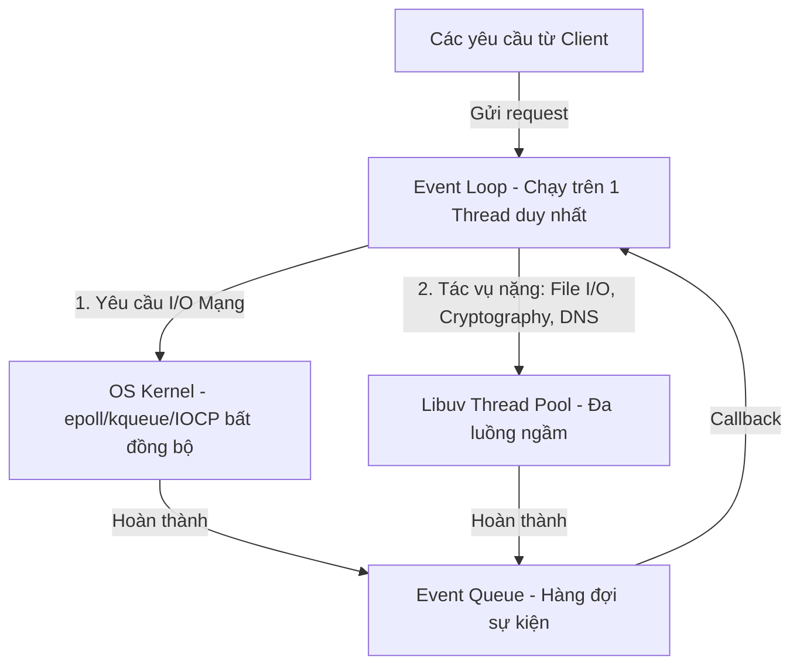

# Nền Tảng Back-end: Node.js & Express Framework

Để làm chủ lập trình Backend với JavaScript, ta cần hiểu sâu sắc về kiến trúc vận hành của **Node.js** (một môi trường runtime bất đồng bộ) và cách xây dựng ứng dụng web hiệu năng cao với **Express**.

---

## 1. Khai Thác Sâu Runtime Node.js

### 1.1. Node.js là gì?
Node.js không phải là một ngôn ngữ lập trình mới hay một framework. Nó là một **môi trường chạy (Runtime Environment)** mã nguồn mở, đa nền tảng, cho phép thực thi mã JavaScript ở phía Server (ngoài trình duyệt). Node.js sử dụng bộ máy biên dịch **V8 Engine** của Google Chrome để dịch mã JavaScript trực tiếp sang mã máy.

---

### 1.2. Mô Hình Luồng: Node.js là Đơn Luồng hay Đa Luồng?

Đây là câu hỏi kinh điển nhất về Node.js. Câu trả lời chính xác là:
> **Môi trường thực thi JavaScript của Node.js là Đơn Luồng (Single-threaded), nhưng hệ thống hỗ trợ dưới nền của nó là Đa Luồng (Multi-threaded)**.

Hãy cùng phân tích kiến trúc chi tiết bên dưới:

#### A. Luồng chính (Single Main Thread)
-   Toàn bộ mã JavaScript của bạn viết ra (như gán biến, tính toán, xử lý logic) đều chạy trên **một luồng duy nhất (Single Thread)**, luồng này điều hành một vòng lặp sự kiện gọi là **Event Loop**.
-   **Hệ quả**: Nếu bạn chạy một tác vụ tính toán CPU cực nặng trên luồng chính (ví dụ: chạy vòng lặp vô hạn, mã hóa file zip khổng lồ bằng JS), luồng này sẽ bị chặn (**Event Loop Blocked**). Lúc đó, toàn bộ request khác gửi đến server sẽ bị treo và không được phản hồi.

#### B. Đa luồng dưới nền (Multi-threaded background)
Để tránh việc luồng chính bị nghẽn khi gặp các tác vụ tốn thời gian (như đọc file từ đĩa cứng hoặc gọi API khác qua mạng), Node.js kết hợp hai cơ chế:

1.  **Hệ điều hành Kernel (OS Kernel)**:
    *   Đối với các tác vụ liên quan đến Network (mạng), Node.js giao hoàn toàn cho OS Kernel xử lý bất đồng bộ (sử dụng các cơ chế hệ thống như `epoll` trên Linux, `kqueue` trên macOS, `IOCP` trên Windows).
    *   Quá trình này diễn ra ở tầng phần cứng hệ điều hành và **không cần sử dụng luồng nào của Node.js**. Khi mạng truyền dữ liệu xong, OS báo về và Event Loop chỉ cần gọi callback để xử lý kết quả.
2.  **Thư viện Libuv (Thread Pool)**:
    *   Với những tác vụ mà OS Kernel không hỗ trợ xử lý bất đồng bộ (như đọc/ghi File I/O, truy vấn DNS, các phép toán mã hóa bảo mật như `crypto/bcrypt`, hay nén tệp tin `zlib`), Node.js chuyển chúng xuống một hồ chứa luồng (**Thread Pool**) do thư viện **Libuv** (viết bằng C++) quản lý.
    *   Mặc định, Thread Pool này có **4 luồng** chạy ngầm song song (có thể tùy chỉnh tối đa lên 128 luồng bằng biến môi trường `UV_THREADPOOL_SIZE`). Khi tác vụ ngầm chạy xong, kết quả được đẩy vào **Event Queue** để luồng chính nhận lại và xử lý.

#### C. Chạy đa luồng thực tế bằng `worker_threads`
Nếu ứng dụng Node.js bắt buộc phải xử lý các tác vụ CPU-bound nặng (như render video, phân tích dữ liệu lớn) mà không muốn làm nghẽn Event Loop, Node.js cung cấp module **`worker_threads`**:
*   Cho phép bạn tạo ra các luồng Worker độc lập, mỗi luồng có một Event Loop và JavaScript Engine riêng để xử lý tính toán song song, sau đó truyền thông điệp (Message Passing) kết quả về luồng chính.

---

## 2. Web Framework Express

### 2.1. Express là gì?
Express là một framework tối giản (minimalist) và linh hoạt cho Node.js, cung cấp tập hợp các tính năng mạnh mẽ để xây dựng API Web và Mobile.

### 2.2. Kiến trúc hoạt động: Chuỗi Middleware (Middleware Chain)
Trọng tâm kiến trúc của Express xoay quanh mô hình **Middleware**:

*   **Middleware** thực chất là các hàm trung gian có quyền truy cập vào đối tượng yêu cầu (`req`), đối tượng phản hồi (`res`), và hàm trung gian tiếp theo (`next`) trong chu kỳ Yêu cầu - Phản hồi của ứng dụng.
*   Khi có một request gửi đến, nó sẽ đi qua một đường ống (pipeline) chứa các middleware đã đăng ký. Mỗi middleware có thể:
    1.  Thực thi bất kỳ đoạn mã nào (ví dụ: ghi log request).
    2.  Thay đổi đối tượng `req` và `res` (ví dụ: giải mã cookie và gán thông tin `req.user`).
    3.  Kết thúc chu kỳ yêu cầu - phản hồi bằng cách trả về dữ liệu (`res.json()`, `res.send()`).
    4.  Hoặc gọi hàm `next()` để chuyển quyền kiểm soát sang middleware kế tiếp trong chuỗi. Nếu một middleware không gọi `next()` và cũng không trả về dữ liệu, request đó sẽ bị treo mãi mãi.

### 2.3. Cơ chế chịu tải cực lớn (Concurrency) của Express
Dù chạy trên đơn luồng chính, tại sao một server Express vẫn có thể xử lý hàng chục ngàn kết nối đồng thời từ các thiết bị khác nhau?

*   **Ủy thác bất đồng bộ (Asynchronous Delegation)**:
    *   Khi Express nhận một request, luồng chính tiếp nhận ngay lập tức.
    *   Nếu request đó cần truy vấn Database (mất 100ms), luồng chính không đứng đợi. Nó gọi hàm truy vấn DB bất đồng bộ (giao việc cho Libuv/OS Kernel) và lập tức quay lại đón nhận request tiếp theo từ khách hàng mới.
    *   100ms sau, khi DB trả về dữ liệu, một sự kiện hoàn thành được bắn vào Event Queue. Luồng chính khi rảnh tay sẽ nhặt sự kiện đó lên và trả dữ liệu về cho client ban đầu.
    *   Nhờ cơ chế này, luồng chính luôn ở trạng thái sẵn sàng tiếp nhận kết nối mới, giúp Express đạt được khả năng xử lý đồng thời cực cao với chi phí tài nguyên phần cứng rất thấp so với mô hình đa luồng cổ điển (Multi-threaded blocking I/O - nơi mỗi kết nối tốn 1 luồng vật lý/RAM riêng của server như trong Java Servlet hay PHP Apache).
