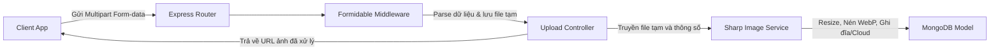
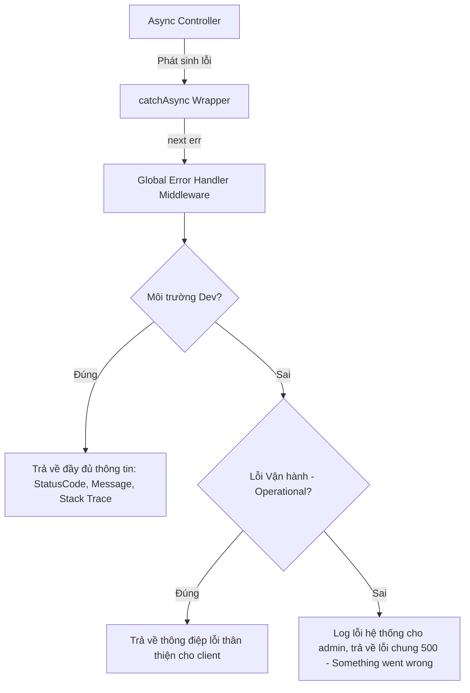

# Cấu Trúc Dự Án & Hệ Thống Xử Lý Lỗi Toàn Diện (FE & BE)

Để xây dựng một sản phẩm phần mềm có khả năng mở rộng tốt (Scalable), dễ bảo trì (Maintainable) và dễ kiểm thử (Testable), việc tổ chức cấu trúc thư mục khoa học cùng một hệ thống xử lý lỗi tập trung là hai yếu tố tiên quyết.

Tài liệu này phân tích chi tiết tư duy tổ chức mã nguồn và quy trình xử lý lỗi cho cả **Backend (Node.js/Express/TS)** và **Frontend (React/Next.js)**.

---

## 1. Tư Duy Thiết Kế Cấu Trúc Mở Rộng (Scalable Mindset)

Trước khi tạo thư mục, nhà phát triển cần nắm vững 3 nguyên tắc thiết kế phần mềm cốt lõi:

*   **Phân tách mối quan tâm (Separation of Concerns - SoC)**:
    *   Chia hệ thống thành các tầng riêng biệt. Mỗi tầng chỉ thực hiện một nhiệm vụ duy nhất.
    *   *Ví dụ*: Tầng Routing chỉ định hướng URL; Tầng Controller chỉ tiếp nhận request và trả về response; Tầng Service chứa logic nghiệp vụ; Tầng Model định nghĩa cấu trúc dữ liệu.
*   **Tính liên kết lỏng (Loose Coupling)**:
    *   Các module nên hoạt động độc lập và giảm thiểu sự phụ thuộc trực tiếp vào nhau. Khi cần thay đổi thư viện (ví dụ: chuyển từ Sharp sang một dịch vụ nén ảnh cloud như Cloudinary), ta chỉ cần sửa đổi code ở tầng Service mà không phải viết lại Controller hay Router.
*   **Tổ chức theo Tính năng (Feature-based)** vs **Tổ chức theo Phân tầng (Layer-based)**:
    *   *Layer-based (Theo tầng)*: Gom tất cả controllers vào một thư mục, tất cả services vào một thư mục. Phù hợp cho dự án nhỏ/trung bình. Khi dự án lớn lên, thư mục sẽ bị phình to và khó tìm file.
    *   *Feature-based (Theo tính năng - Khuyên dùng cho dự án lớn)*: Gom toàn bộ file liên quan đến một nghiệp vụ (ví dụ: Auth, Product, Order) vào một thư mục duy nhất. Trong thư mục `features/auth` sẽ có sẵn controller, service, model và test của riêng tính năng đó. Giúp cô lập code cực tốt.

---

## 2. Tổ Chức Thư Mục & Hoạt Động Của Backend (Express + TS)

Đối với hệ thống sử dụng **Node.js, Express, TypeScript, MongoDB, JWT, Formidable, và Sharp**, dưới đây là cấu trúc thư mục tối ưu:

### 2.1. Sơ đồ Cấu trúc thư mục (Layer-based cấu hình TS)
```
src/
├── @types/              # Khai báo đè kiểu dữ liệu (ví dụ: Express Request type merging)
│   └── express.d.ts
├── config/              # Cấu hình biến môi trường, Database (Mongoose), JWT keys
├── constants/           # Các biến hằng số, mã lỗi, thông điệp hệ thống
├── controllers/         # Tiếp nhận HTTP Request, gọi Services, trả về Response
├── middlewares/         # JWT Authenticator, Formidable Parser, Global Error Handler
├── models/              # Định nghĩa Mongoose Schemas & TypeScript Interfaces
├── routes/              # Khai báo các endpoints của API
├── services/            # Chứa logic nghiệp vụ chính (Sharp, logic tính toán, DB query)
├── utils/               # Tiện ích dùng chung (Custom Error classes, Logger)
├── app.ts               # Khởi tạo Express, đăng ký các middleware toàn cục
└── server.ts            # Khởi động kết nối Database và lắng nghe cổng (Port listener)
```

### 2.2. Phân chia vai trò hoạt động trong luồng Upload & Xử lý Ảnh
Khi người dùng tải ảnh lên, quy trình xử lý không nên viết dồn vào Controller. Ta tổ chức như sau:



1.  **Formidable Middleware**:
    *   Đóng vai trò đánh chặn request gửi lên dưới dạng `multipart/form-data`.
    *   Nó phân tách các trường văn bản (fields) và tệp tin (files), lưu tệp tin tạm thời vào thư mục temp của hệ điều hành, sau đó gán thông tin này vào đối tượng `req` (ví dụ: `req.files`, `req.fields`) và gọi `next()`.
2.  **Upload Controller**:
    *   Nhận thông tin file tạm từ `req.files` đã được Middleware phân tích.
    *   Controller **không** trực tiếp thực hiện việc chỉnh sửa ảnh. Nó chỉ gọi hàm của tầng **Service** (ví dụ: `ImageService.processAndSave(fileTmpPath)`).
3.  **Sharp Image Service**:
    *   Nằm hoàn toàn ở tầng Service. Sử dụng thư viện **Sharp** để đọc file ảnh từ đường dẫn tạm.
    *   Thực hiện các tác vụ nặng: Resize kích thước về chuẩn, nén chất lượng (Optimize), chuyển đổi định dạng sang `.webp` để tối ưu dung lượng tải trang, lưu tệp tin đã xử lý vào thư mục lưu trữ chính hoặc đẩy lên Cloud (AWS S3/Cloudinary).
    *   Sau khi xử lý xong, lưu thông tin đường dẫn ảnh vào **MongoDB** thông qua Mongoose Model và trả kết quả về cho Controller.

### 2.3. TypeScript Type Merging (Express Request)
Khi xác thực JWT thành công, ta muốn lưu thông tin user đã giải mã vào đối tượng `req.user` để các controller phía sau sử dụng. Trong TypeScript, đối tượng `Request` mặc định của Express không có trường `user`. Ta giải quyết bằng **Declaration Merging**:
*   Tạo file `@types/express.d.ts` để khai báo bổ sung thuộc tính `user` (với kiểu dữ liệu tự định nghĩa) vào interface `Request` của namespace `Express`. TypeScript compiler sẽ tự động gộp thuộc tính này vào đối tượng `Request` toàn hệ thống.

---

## 3. Hệ Thống Xử Lý Lỗi Tập Trung Backend (BE Error Handling)

Hệ thống xử lý lỗi tốt giúp server không bao giờ bị crash bất ngờ, đồng thời bảo vệ thông tin hệ thống không bị rò rỉ ra ngoài.



### 3.1. Thiết kế Lớp lỗi Vận hành (Custom AppError)
Chúng ta kế thừa lớp `Error` mặc định của JavaScript để tạo ra lớp `AppError`:
-   Bổ sung thêm thuộc tính `statusCode` (ví dụ: 400, 401, 404).
-   Bổ sung thuộc tính `isOperational: true` (Lỗi vận hành): Đây là những lỗi ta dự tính trước được (ví dụ: sai mật khẩu, thiếu trường dữ liệu, token hết hạn). Ngược lại, những lỗi không có cờ này là lỗi hệ thống/bug lập trình (ví dụ: lỗi kết nối database, biến undefined).
-   Tự động bắt stack trace (`Error.captureStackTrace`) giúp xác định chính xác dòng code gây lỗi khi debug.

### 3.2. Hàm bọc bất đồng bộ (catchAsync / asyncHandler)
Vì các tác vụ Database (MongoDB) hay xử lý ảnh (Sharp) đều là bất đồng bộ (asynchronous), ta phải dùng nhiều khối `try-catch` trong Controller.
-   **Giải pháp**: Viết một hàm bọc `catchAsync` nhận vào một hàm controller async. Hàm bọc này trả về một controller thông thường của Express, bên trong tự động gọi `.catch(next)` cho các Promise.
-   Khi có bất kỳ lỗi nào xảy ra trong controller async, lỗi đó sẽ tự động được chuyển thẳng tới Middleware xử lý lỗi toàn cục mà không cần viết khối `try-catch` thủ công.

### 3.3. Middleware Xử lý Lỗi Toàn cục (Global Error Handler Middleware)
Đây là middleware cuối cùng được đăng ký trong ứng dụng Express, nhận dạng bằng việc có đúng **4 tham số**: `(err, req, res, next)`.
-   **Trong môi trường Development**: Trả về toàn bộ chi tiết lỗi bao gồm `status`, `message`, và `stack` để lập trình viên dễ dàng debug.
-   **Trong môi trường Production**:
    *   Nếu lỗi là `isOperational === true`: Trả về đúng `statusCode` và `message` thân thiện để hiển thị trên UI.
    *   Nếu lỗi là lỗi hệ thống (bug): Ghi log chi tiết lỗi ra file/hệ thống quản lý lỗi (như Winston, Sentry), trả về client mã lỗi 500 cùng lời nhắn chung chung như "Đã có lỗi xảy ra từ phía hệ thống, vui lòng thử lại sau" để tránh lộ thông tin bảo mật hạ tầng.

### 3.4. Crash Safety (Đóng server an toàn)
Với các lỗi cực kỳ nghiêm trọng xảy ra ngoài phạm vi Express (ví dụ: lỗi kết nối DB khi khởi động, lỗi tràn bộ nhớ):
-   Sử dụng `process.on('unhandledRejection')` và `process.on('uncaughtException')` để lắng nghe.
-   Khi gặp các lỗi này, hệ thống sẽ thực hiện **Graceful Shutdown** (đóng toàn bộ các kết nối HTTP hiện có, ngắt kết nối database một cách an toàn) trước khi kết thúc tiến trình (`process.exit(1)`).

---

## 4. Tổ Chức Thư Mục & Xử Lý Lỗi Ở Frontend (React / Next.js)

### 4.1. Cấu trúc thư mục Feature-based ở Frontend
Để đảm bảo dễ mở rộng, ta tổ chức mã nguồn Front-end theo từng phân hệ tính năng lớn (Features):

```
src/
├── components/          # Các UI components dùng chung toàn hệ thống (Button, Input, Modal)
├── features/            # Tổ chức theo từng phân hệ nghiệp vụ lớn
│   ├── auth/            # Tính năng Xác thực
│   │   ├── components/  # Components riêng của trang Auth (LoginForm, RegisterCard)
│   │   ├── hooks/       # Custom hooks riêng cho Auth (useAuthLogin)
│   │   ├── services/    # Các hàm gọi API đăng nhập, logout
│   │   └── types/       # Kiểu dữ liệu TypeScript riêng của Auth
│   └── products/        # Tính năng Quản lý Sản phẩm
├── hooks/               # Custom hooks dùng chung toàn hệ thống
├── services/            # Cấu hình API Client (Axios instance, interceptors)
├── store/               # Quản lý state toàn cục (Zustand, Redux)
└── utils/               # Tiện ích format ngày tháng, tiền tệ
```

### 4.2. Hệ thống Xử lý Lỗi ở Frontend
Hệ thống FE phải hứng và hiển thị lỗi một cách mượt mà, không để ứng dụng bị đơ hoặc trắng màn hình.

1.  **Đánh chặn lỗi mạng (Axios Interceptors)**:
    *   Cấu hình một response interceptor cho Axios để lắng nghe mọi phản hồi lỗi từ API Backend.
    *   **Mã 401**: Tự động kích hoạt luồng Silent Refresh (như đã mô tả ở tài liệu trước).
    *   **Mã 403 / 404 / 500**: Đọc thông điệp lỗi trả về từ Backend (thông qua cấu trúc lỗi chuẩn của `AppError` phía BE) và đẩy trực tiếp lên hệ thống **Toast Notification** toàn cục để hiển thị cảnh báo đẹp mắt dạng popup trên màn hình cho người dùng.
2.  **React Error Boundary (Ranh giới lỗi)**:
    *   Bọc các Component lớn (hoặc bọc toàn bộ trang) bằng lớp `ErrorBoundary`.
    *   Nếu có một lỗi runtime bất ngờ phát sinh trong quá trình render (ví dụ: gọi thuộc tính của một đối tượng bị `null`), `ErrorBoundary` sẽ bắt lại lỗi đó và hiển thị một **Fallback UI** (ví dụ: trang báo lỗi có nút "Tải lại trang") thay vì để trình duyệt crash hoàn toàn và hiển thị màn hình trắng.
3.  **Xử lý lỗi nhập liệu (Form Validation)**:
    *   Sử dụng các thư viện quản lý Form (như **React Hook Form**) kết hợp với các schema định nghĩa dữ liệu đầu vào phía Client (như **Zod** hoặc **Yup**).
    *   Dữ liệu được kiểm tra ngay khi người dùng gõ phím. Nếu sai định dạng (ví dụ: email thiếu ký tự `@`), lỗi được bắt trực tiếp ở Client và hiển thị ngay dưới ô input mà không cần gửi request lên Server, giúp giảm tải cho server và tăng tốc độ phản hồi giao diện.
