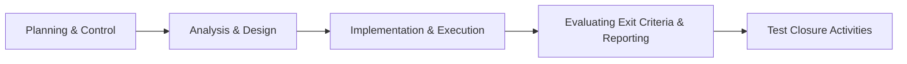

# TESTING FUNDAMENTALS & TEST LEVELS/TYPES

## 1. Testing Fundamentals (Cơ bản về Kiểm thử)

### 1.1 Kiểm thử phần mềm là gì? Tại sao lại cần thiết? (What is testing & Its necessity)

- **Định nghĩa:** Kiểm thử phần mềm (Software Testing) không chỉ đơn thuần là việc tìm lỗi (bugs). Nó là một quá trình bao gồm lập kế hoạch, phân tích, thiết kế, thực thi và đánh giá kết quả nhằm xác minh xem phần mềm có đáp ứng các yêu cầu kỹ thuật hay không và xây dựng niềm tin về chất lượng của sản phẩm.
- **Tại sao cần thiết?**
  - **Giảm thiểu rủi ro:** Phát hiện lỗi sớm giúp tránh lỗi nghiêm trọng khi vận hành thực tế.
  - **Tiết kiệm chi phí:** Chi phí sửa lỗi tăng theo cấp số nhân nếu phát hiện muộn (Sửa lỗi ở môi trường Dev rẻ hơn hàng trăm lần so với sửa lỗi trên Production).
  - **Đáp ứng tiêu chuẩn và quy định:** Đảm bảo hệ thống hoạt động ổn định, bảo mật và tuân thủ các luật định (ví dụ: bảo mật thông tin ngân hàng).
  - **Tăng trải nghiệm khách hàng:** Đảm bảo sản phẩm chạy mượt, đúng kì vọng của người dùng.

### 1.2 7 Nguyên lý kiểm thử cơ bản (7 General Testing Principles)

Đây là các quy tắc "vàng" cốt lõi của kiểm thử:

1.  **Testing shows the presence of defects, not their absence:** Kiểm thử chỉ ra sự hiện diện của lỗi chứ không thể chứng minh phần mềm không còn lỗi. (Kiểm thử tốt giúp tìm được nhiều lỗi, nhưng không có nghĩa là sản phẩm hoàn toàn sạch lỗi).
2.  **Exhaustive testing is impossible:** Kiểm thử toàn bộ (tất cả các trường hợp đầu vào và đường đi) là bất khả thi, trừ những trường hợp cực kỳ đơn giản. Do đó ta cần phân tích rủi ro để tập trung kiểm thử.
3.  **Early testing saves time and money:** Kiểm thử càng sớm càng tốt. Các hoạt động kiểm thử nên bắt đầu từ giai đoạn phân tích yêu cầu (Requirements) trước khi viết code.
4.  **Defect clustering:** Lỗi thường tập trung ở một số module chính. Khoảng 80% lỗi được tìm thấy trong 20% tổng số module của hệ thống (Nguyên lý Pareto).
5.  **Pesticide paradox (Nghịch lý thuốc trừ sâu):** Nếu một bộ test case được chạy lặp đi lặp lại nhiều lần, đến một lúc nào đó nó sẽ không tìm ra lỗi mới. Do đó, test cases cần được cập nhật và làm mới liên tục.
6.  **Testing is context dependent:** Kiểm thử phụ thuộc vào ngữ cảnh. Kiểm thử một ứng dụng thương mại điện tử sẽ khác hoàn toàn với kiểm thử một phần mềm điều khiển thiết bị y tế hoặc trò chơi điện tử.
7.  **Absence-of-errors fallacy (Sự ngộ nhận về việc không có lỗi):** Việc sửa hết lỗi không có nghĩa là hệ thống thành công nếu hệ thống đó không đáp ứng được nhu cầu thực tế của khách hàng hoặc khó sử dụng.

### 1.3 Quy trình kiểm thử cơ bản (5 Hoạt động kiểm thử chính - Fundamental Test Process)

Quy trình kiểm thử tiêu chuẩn gồm các bước đi từ lập kế hoạch đến đóng dự án:

1.  **Test Planning and Control (Lập kế hoạch & Kiểm soát):**
    - Xác định mục tiêu kiểm thử, phạm vi (Scope), nguồn lực, tiến độ và tiêu chí dừng (Exit Criteria).
2.  **Test Analysis and Design (Phân tích & Thiết kế):**
    - Phân tích tài liệu yêu cầu (SRS, User Story) để xác định xem cần test cái gì (Test Conditions).
    - Thiết kế các kịch bản test cụ thể (Test Cases) và chuẩn bị dữ liệu kiểm thử (Test Data).
3.  **Test Implementation and Execution (Triển khai & Thực thi):**
    - Sắp xếp các test cases thành bộ kiểm thử (Test Suites) theo thứ tự ưu tiên.
    - Thực hiện chạy thử nghiệm (chạy tay hoặc chạy tự động), so sánh kết quả thực tế (Actual) với kết quả mong đợi (Expected).
    - Nếu có sai khác, log lỗi (Defect/Bug report).
4.  **Evaluating Exit Criteria and Reporting (Đánh giá tiêu chí dừng & Báo cáo):**
    - Kiểm tra xem kết quả test đã đạt tiêu chí dừng chưa (ví dụ: đã chạy hết 100% test cases quan trọng, không còn bug nghiêm trọng).
    - Viết báo cáo tổng kết kiểm thử (Test Summary Report).
5.  **Test Closure Activities (Hoạt động đóng dự án):**
    - Lưu trữ các tài liệu kiểm thử, bàn giao kết quả.
    - Tổ chức họp rút kinh nghiệm (Retro/Lessons Learned) để cải tiến quy trình cho các dự án sau.

### 1.4 Tâm lý học kiểm thử (The Psychology of Testing)

- **Sự khác biệt về tư duy:** Nhà phát triển (Developer) có tư duy kiến tạo (_"Làm thế nào để xây dựng sản phẩm hoạt động?"_). Người kiểm thử (Tester) có tư duy phân tích, phản biện (_"Làm thế nào để tìm ra điểm yếu và lỗi của sản phẩm?"_).
- **Giao tiếp khéo léo:** Việc tìm ra lỗi dễ gây cảm giác bị chỉ trích cho Developer. Tester cần giữ thái độ khách quan, tập trung vào sản phẩm (không công kích cá nhân), báo cáo lỗi rõ ràng dựa trên dữ kiện thực tế để tránh xung đột.

### 1.5 Quy tắc đạo đức (Code of Ethics)

Người làm kiểm thử cần tuân thủ 8 quy tắc đạo đức (theo ACM/IEEE):

- **Public:** Đặt lợi ích cộng đồng lên hàng đầu.
- **Client and Employer:** Bảo vệ lợi ích của khách hàng và công ty quản lý nhưng phải trung thực.
- **Product:** Đảm bảo sản phẩm bàn giao đạt chất lượng tốt nhất có thể.
- **Judgment:** Giữ vững sự độc lập và tính khách quan trong đánh giá chuyên môn.
- **Management:** Quản lý quy trình kiểm thử một cách có đạo đức và minh bạch.
- **Profession:** Nâng cao uy tín của ngành nghề.
- **Colleagues:** Hỗ trợ đồng nghiệp và luôn tôn trọng lẫn nhau.
- **Self:** Luôn không ngừng học hỏi và nâng cao trình độ chuyên môn cá nhân.

---

## 2. Test Levels (Các cấp độ kiểm thử)

Phần mềm được kiểm thử theo từng cấp độ từ nhỏ đến lớn:

| Cấp độ                  | Tên tiếng Anh      | Đối tượng kiểm thử                                    | Ai thực hiện chủ yếu?      | Mục tiêu                                                         |
| :---------------------- | :----------------- | :---------------------------------------------------- | :------------------------- | :--------------------------------------------------------------- |
| **Unit Testing**        | Kiểm thử đơn vị    | Các hàm, class, module nhỏ độc lập                    | Developer                  | Xác minh các đoạn code chạy đúng thiết kế logic chi tiết         |
| **Integration Testing** | Kiểm thử tích hợp  | Sự tương tác giữa các module                          | Developer / Tester         | Phát hiện lỗi giao tiếp, truyền nhận dữ liệu giữa các thành phần |
| **System Testing**      | Kiểm thử hệ thống  | Toàn bộ hệ thống hoàn chỉnh                           | Tester độc lập             | Đảm bảo hệ thống hoạt động thống nhất, đáp ứng yêu cầu nghiệp vụ |
| **Acceptance Testing**  | Kiểm thử chấp nhận | Hệ thống hoàn chỉnh trong môi trường mô phỏng thực tế | Khách hàng / PO / End-user | Xác nhận hệ thống sẵn sàng bàn giao, đạt kỳ vọng kinh doanh      |

---

## 3. Test Types (Các loại kiểm thử)

Một loại kiểm thử (Test Type) tập trung vào một mục tiêu kiểm thử cụ thể. Có 4 loại chính:

### 3.1 Functional Testing (Kiểm thử chức năng)

- Kiểm tra hệ thống làm được gì (**"What the system does"**).
- Dựa trên các yêu cầu chức năng (functional requirements), use cases, hoặc tài liệu đặc tả.
- _Ví dụ:_ Kiểm tra xem nút "Đăng nhập" có hoạt động đúng khi nhập đúng/sai tài khoản mật khẩu hay không.

### 3.2 Non-functional Testing (Kiểm thử phi chức năng)

- Kiểm tra hệ thống hoạt động như thế nào (**"How well the system behaves"**).
- Đo lường các thuộc tính chất lượng của hệ thống như hiệu năng, độ tin cậy, bảo mật, tính dễ sử dụng.
- _Ví dụ:_
  - **Performance Testing (Kiểm thử hiệu năng):** Hệ thống có tải được 1000 người dùng truy cập cùng lúc không?
  - **Usability Testing (Kiểm thử độ tiện dụng):** Giao diện có dễ dùng không? Có responsive trên điện thoại không?
  - **Security Testing (Kiểm thử bảo mật):** Dữ liệu mật khẩu có bị mã hóa không? Có chống được tấn công SQL Injection không?

### 3.3 Structural Testing (Kiểm thử cấu trúc - White-box testing)

- Dựa trên cấu trúc code bên trong của hệ thống (mã nguồn, luồng dữ liệu, luồng điều khiển).
- Thường đo lường bằng độ bao phủ mã nguồn (**Code Coverage**) để xem bao nhiêu % dòng code đã được chạy qua khi test.

### 3.4 Testing after code has been changed (Kiểm thử sau khi code thay đổi)

Gồm hai dạng cực kỳ quan trọng cần phân biệt rõ:

1.  **Confirmation Testing (Kiểm thử xác nhận - Re-testing):**
    - Chạy lại chính xác kịch bản đã lỗi trước đó để xác nhận xem lỗi (bug) đã được Developer sửa thành công hay chưa.
2.  **Regression Testing (Kiểm thử hồi quy):**
    - Chạy lại các test cases đã pass trước đó để đảm bảo rằng việc sửa lỗi hoặc code mới thêm vào không làm ảnh hưởng đến các chức năng cũ đang chạy bình thường.

---
