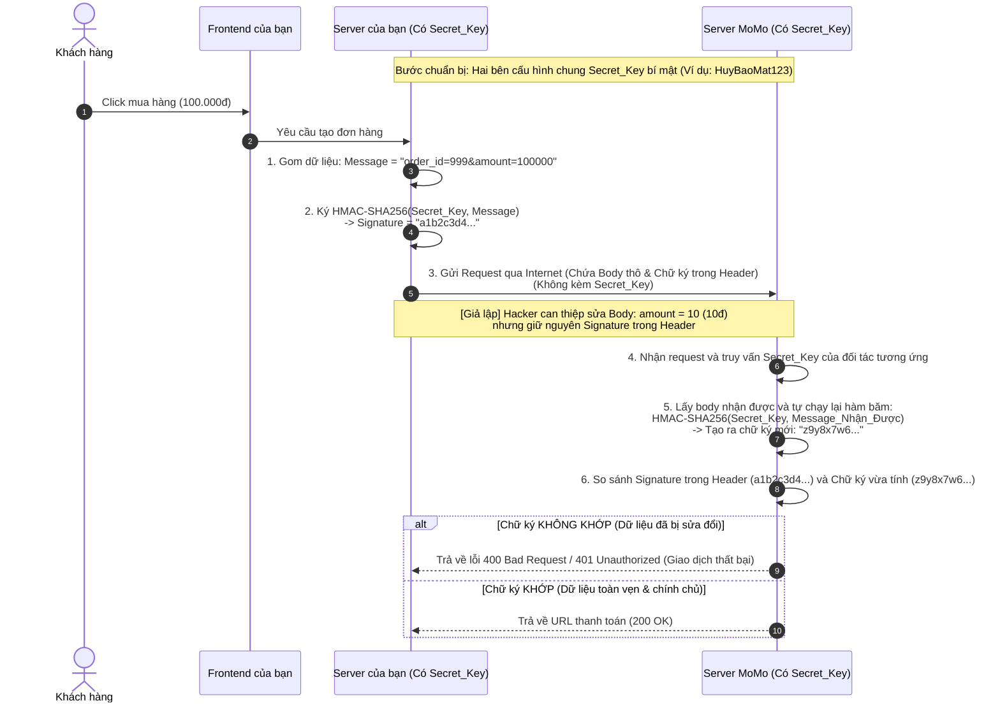

# THIẾT KẾ API CHUẨN: RESTFUL, HTTP STATUS CODE, IDEMPOTENCY & RFC 7807

Tài liệu này hệ thống hóa các kiến thức nền tảng và nâng cao về thiết kế giao diện lập trình ứng dụng (API), bao gồm kiến trúc RESTful, mã trạng thái HTTP, tính lũy đẳng (Idempotency) và chuẩn định dạng lỗi API RFC 7807.

---

## 1. API VÀ KIẾN TRÚC RESTFUL API

### 1.1. API là gì?
**API (Application Programming Interface - Giao diện lập trình ứng dụng)** là một tập hợp các quy tắc, giao thức và công cụ cho phép các phần mềm/ứng dụng khác nhau có thể giao tiếp, trao đổi dữ liệu với nhau.

### 1.2. RESTful API là gì?
- **REST (Representational State Transfer)** KHÔNG PHẢI là một ngôn ngữ lập trình, không phải một thư viện, cũng không phải một phần mềm. REST là một tập hợp các quy tắc (hoặc phong cách kiến trúc) do một nhà khoa học máy tính tên là Roy Fielding định nghĩa ra vào năm 2000, nhằm chuẩn hóa cách các máy tính nói chuyện với nhau trên môi trường Internet.
- **RESTful** đơn giản chỉ là một tính từ dùng để miêu tả một hệ thống hoặc một API đã tuân thủ nghiêm ngặt các quy tắc của REST. Do đó, một hệ thống API tuân thủ các quy tắc của REST được gọi là **RESTful API**.

#### 6 ràng buộc cốt lõi của kiến trúc REST:
1.  **Client-Server (Mô hình Khách - Chủ):** Phân tách rõ ràng giữa giao diện người dùng (Client) và nơi xử lý, lưu trữ dữ liệu (Server). Giúp hai thành phần này phát triển độc lập.
2.  **Stateless (Không lưu trạng thái):** Mỗi request từ Client gửi lên Server phải chứa đầy đủ thông tin để hiểu và thực thi request đó. Server không lưu trữ bất kỳ dữ liệu ngữ cảnh (context) nào của Client trên bộ nhớ của mình giữa các request.
3.  **Cacheable (Khả năng lưu bộ nhớ đệm):** Phản hồi từ Server phải tự định nghĩa xem nó có được phép lưu cache (bộ nhớ đệm) hay không để tối ưu hóa hiệu năng, giảm tải cho Server.
4.  **Uniform Interface (Giao diện đồng nhất):** Đây là ràng buộc quan trọng nhất. Nó yêu cầu việc định danh tài nguyên thông qua URL phải rõ ràng và sử dụng các phương thức chuẩn (như HTTP Method) để thao tác tài nguyên.
5.  **Layered System (Hệ thống phân lớp):** Client không thể biết mình đang kết nối trực tiếp với server đích hay qua các lớp trung gian (Load Balancer, CDN, API Gateway, Proxy). Giúp hệ thống dễ mở rộng và bảo mật.
6.  **Code on Demand (Tùy chọn):** Server có thể gửi mã thực thi (như JavaScript) về cho Client chạy trực tiếp.

#### Quy tắc thiết kế URL trong RESTful API:
- **Sử dụng Danh từ số nhiều, không dùng Động từ:**
  - *Sai:* `GET /getUserProfile`, `POST /createNewUser`, `POST /deleteProduct`
  - *Đúng:* `GET /users/me`, `POST /users`, `DELETE /products/123`
- **Sử dụng đúng HTTP Method tương ứng với hành động CRUD:**
  - `GET`: Lấy thông tin tài nguyên.
  - `POST`: Tạo mới tài nguyên.
  - `PUT`: Cập nhật/Ghi đè hoàn toàn tài nguyên.
  - `PATCH`: Cập nhật một phần tài nguyên.
  - `DELETE`: Xóa tài nguyên.

---

## 2. HTTP STATUS CODES (MÃ TRẠNG THÁI PHẢN HỒI)

Mã trạng thái HTTP giúp Client hiểu nhanh kết quả của request mà không cần phân tích sâu nội dung body. Chúng được chia làm 5 nhóm chính:

| Đầu mã | Loại trạng thái | Ý nghĩa và các mã phổ biến |
| :--- | :--- | :--- |
| **1xx** | Informational (Thông tin) | Server đã nhận request và đang xử lý. Ít dùng trong REST API thông thường. |
| **2xx** | Success (Thành công) | Request được tiếp nhận và xử lý thành công.<br>- **200 OK:** Thành công chung (GET/PUT/PATCH/DELETE).<br>- **201 Created:** Tạo mới tài nguyên thành công (POST).<br>- **204 No Content:** Thành công nhưng không trả dữ liệu về (thường dùng cho DELETE). |
| **3xx** | Redirection (Chuyển hướng) | Client cần thực hiện hành động bổ sung để hoàn thành request.<br>- **301 Moved Permanently:** Tài nguyên đã chuyển vĩnh viễn sang URL khác.<br>- **304 Not Modified:** Tài nguyên chưa thay đổi (Client nên dùng lại bản lưu cache trước đó). |
| **4xx** | Client Error (Lỗi phía Client) | Lỗi do Client gửi sai định dạng request, thiếu thông tin xác thực, v.v.<br>- **400 Bad Request:** Request sai cú pháp dữ liệu.<br>- **401 Unauthorized:** Chưa đăng nhập hoặc token sai/hết hạn.<br>- **403 Forbidden:** Đã đăng nhập nhưng không đủ quyền truy cập tài nguyên.<br>- **404 Not Found:** Tài nguyên không tồn tại.<br>- **409 Conflict:** Xung đột dữ liệu (Ví dụ đăng ký trùng email).<br>- **422 Unprocessable Entity:** Lỗi validate dữ liệu (Dữ liệu gửi lên đúng cú pháp JSON nhưng sai quy định nghiệp vụ). |
| **5xx** | Server Error (Lỗi phía Server) | Server gặp lỗi nội bộ hoặc quá tải không thể xử lý request.<br>- **500 Internal Server Error:** Lỗi code server tự phát sinh.<br>- **502 Bad Gateway:** Server Gateway nhận phản hồi lỗi từ server ứng dụng phía sau.<br>- **503 Service Unavailable:** Server tạm thời quá tải hoặc đang bảo trì.<br>- **504 Gateway Timeout:** Server Gateway hết thời gian chờ phản hồi từ ứng dụng. |

---

## 3. IDEMPOTENT API (TÍNH LŨY ĐẲNG CỦA API)

### 3.1. Tính Lũy Đẳng (Idempotency) là gì?
Một API được gọi là **Lũy đẳng (Idempotent)** khi: **Dù Client có gọi API đó 1 lần hay $N$ lần liên tiếp với cùng một dữ liệu đầu vào, trạng thái của cơ sở dữ liệu và hệ thống vẫn hoàn toàn giống nhau.**

*Ví dụ thực tế:* Hành động click nút "Thanh toán". Nếu API thanh toán không lũy đẳng, việc người dùng double-click do mạng lag sẽ tạo ra 2 giao dịch trừ tiền. Nếu API lũy đẳng, dù click 10 lần hệ thống vẫn chỉ trừ tiền 1 lần duy nhất.

### 3.2. Tính lũy đẳng của các HTTP Method

| HTTP Method | Lũy đẳng? | Giải thích |
| :--- | :--- | :--- |
| **GET** | **Có (Lũy đẳng & Safe)** | Chỉ đọc dữ liệu, không làm thay đổi bất kỳ trạng thái nào của DB. Gọi 100 lần kết quả DB vẫn nguyên vẹn. |
| **PUT** | **Có** | Ghi đè hoàn toàn một tài nguyên. Lần đầu ghi đè dữ liệu mới, các lần sau ghi đè chính dữ liệu mới đó $\rightarrow$ DB không thay đổi trạng thái sau lần đầu tiên. |
| **DELETE** | **Có** | Lần đầu tiên xóa tài nguyên thành công (trả về 200/204). Các lần sau tài nguyên đã mất (trả về 404), nhưng trạng thái của DB vẫn là "tài nguyên đã bị xóa", không có thêm dữ liệu nào bị thay đổi nữa. |
| **POST** | **KHÔNG** | Mỗi lần gọi POST là một lần tạo mới. Gọi 5 lần POST `/users` sẽ tạo ra 5 bản ghi người dùng khác nhau trong cơ sở dữ liệu. |
| **PATCH** | **KHÔNG** | PATCH có thể lũy đẳng hoặc không tùy thiết kế nghiệp vụ. Ví dụ: Nếu PATCH gửi `{ age: 20 }` (lũy đẳng). Nhưng nếu gửi `{ age: age + 1 }` (tăng tuổi lên 1) thì mỗi lần gọi sẽ tăng thêm 1 $\rightarrow$ không lũy đẳng. |

### 3.3. Giải pháp thiết kế API POST lũy đẳng (Idempotency Key)
Để biến một API POST (như Thanh toán/Tạo đơn) thành lũy đẳng nhằm tránh trùng lặp dữ liệu:
1.  **Client** sinh ra một chuỗi ngẫu nhiên duy nhất (UUID) gọi là **`Idempotency-Key`** và đính kèm vào Header của request.
2.  Khi nhận request, **Server** kiểm tra khóa này trong cache nhanh (Redis):
    - **Nếu khóa đã tồn tại:** Chứng tỏ request này đang bị gửi trùng. Server lập tức trả về kết quả đã xử lý lưu sẵn từ lần trước mà không thực hiện lại giao dịch.
    - **Nếu khóa chưa tồn tại:** Server lưu khóa vào Redis kèm trạng thái "đang xử lý", thực thi lưu trữ DB, sau khi thành công thì cập nhật kết quả vào Redis và trả về phản hồi cho Client.

---

## 4. CHUẨN RFC 7807 (PROBLEM DETAILS FOR HTTP APIS)

### 4.1. RFC 7807 là gì? Tại sao cần nó?
Thông thường, các API thiết kế tự phát sẽ trả lỗi về theo nhiều kiểu khác nhau (Chỗ thì `{ "error": "User not found" }`, chỗ thì `{ "success": false, "message": "Wrong password" }`). Điều này khiến Client cực kỳ khó khăn khi viết code xử lý lỗi chung.

**RFC 7807** là một tiêu chuẩn của IETF định nghĩa một định dạng chung (Schema JSON) để báo cáo lỗi trong các API HTTP một cách thống nhất và tường minh.

### 4.2. Cấu trúc JSON chuẩn của RFC 7807
Khi gặp lỗi, Server bắt buộc phải phản hồi về một Content-Type có tên là `application/problem+json` chứa các thuộc tính chuẩn sau:

- **`type`** (string - URI): Đường dẫn tài liệu mô tả chi tiết về loại lỗi này. Giúp lập trình viên click vào để đọc tài liệu sửa lỗi.
- **`title`** (string): Tiêu đề ngắn gọn, dễ hiểu về lỗi (không thay đổi giữa các request có cùng loại lỗi).
- **`status`** (number): Mã trạng thái HTTP (để Client không cần đọc header vẫn biết HTTP status).
- **`detail`** (string): Mô tả chi tiết lý do cụ thể xảy ra lỗi trong lượt request này.
- **`instance`** (string - URI): Đường dẫn URL cụ thể mà Client đã gọi dẫn đến lỗi này (dùng để truy vết log).

#### Các thuộc tính mở rộng (Extension Members):
Bạn có thể tự định nghĩa thêm các trường mở rộng ngoài chuẩn. Ví dụ: trường `invalid_params` hoặc `errors` chứa danh sách chi tiết các lỗi validate dữ liệu đầu vào.

---

### 4.3. Các ví dụ minh họa chuẩn RFC 7807

#### Ví dụ 1: Lỗi 403 Forbidden (Không đủ quyền)
```json
{
  "type": "https://example.com/probs/out-of-credit",
  "title": "You do not have enough credit.",
  "status": 403,
  "detail": "Your current balance is 30 USD, but this action costs 50 USD.",
  "instance": "/account/12345/withdraw"
}
```

#### Ví dụ 2: Lỗi 422 Unprocessable Entity (Validate dữ liệu đầu vào thất bại)
Đây là định dạng tối ưu để phản hồi lỗi validate form cho phía Frontend:
```json
{
  "type": "https://example.com/probs/validation-error",
  "title": "Validation Failed",
  "status": 422,
  "detail": "One or more request parameters failed to validate.",
  "instance": "/users/register",
  "errors": {
    "email": "Email format is invalid.",
    "password": "Password must be at least 8 characters and contain a number.",
    "date_of_birth": "Date of birth must be a valid ISO 8601 string."
  }
}
```
*Việc cấu hình lỗi theo chuẩn RFC 7807 giúp bất kỳ thư viện frontend nào cũng có thể tự động bóc tách lỗi và hiển thị lên UI một cách tự động và nhất quán.*

---

## 5. CÁC CƠ CHẾ XÁC THỰC API THEO NGỮ CẢNH HỆ THỐNG

Việc chọn lựa cơ chế xác thực và bảo mật cho API không có một công thức chung duy nhất, mà phụ thuộc hoàn toàn vào **ngữ cảnh sử dụng** (Who is calling the API?). Dưới đây là phân tích chi tiết 3 ngữ cảnh phổ biến, giải thích lý do tại sao (Why) và sự khác biệt giữa chúng.

### 5.1. Người dùng cuối truy cập trực tiếp (Frontend Web / Mobile App -> Backend)
Ngữ cảnh này có đặc điểm là môi trường phía Client (Trình duyệt, ứng dụng di động) cực kỳ **kém an toàn** (không thể lưu trữ các khóa bí mật dài hạn vì code có thể bị dịch ngược hoặc bị tấn công XSS).

*   **Các cơ chế sử dụng:**
    *   **Bearer Token (JWT - JSON Web Token):**
        *   *Cách hoạt động:* Client gửi username/password để đăng nhập. Server trả về một chuỗi ký tự được mã hóa (JWT). Client lưu JWT trong bộ nhớ tạm (In-memory) hoặc Cookie an toàn, và đính kèm vào Header `Authorization: Bearer <token>` trên mỗi request tiếp theo.
        *   *Vì sao sử dụng:* JWT có tính chất Stateless (Server không cần lưu trạng thái), giúp kiểm tra tính hợp lệ vô cùng nhanh gọn bằng thuật toán mật mã trên RAM, hỗ trợ rất tốt cho việc chia tải hệ thống.
    *   **OAuth 2.0 & OIDC (OpenID Connect):**
        *   *Cách hoạt động:* OAuth 2.0 là khung ủy quyền (Authorization framework) cho phép ứng dụng bên thứ ba truy cập tài nguyên của người dùng mà không cần biết mật khẩu (ví dụ: "Đăng nhập bằng Google"). OIDC là một lớp xác thực (Authentication layer) được xây dựng trên nền OAuth 2.0 để định danh người dùng thông qua `ID Token`.
        *   *Vì sao sử dụng:* Nhằm chuẩn hóa quy trình đăng nhập an toàn, phân tách rõ ràng vai trò giữa Identity Provider (IdP - nơi xác thực như Google/Keycloak) và API Resource Server (nơi chứa dữ liệu).

---

### 5.2. Đối tác bên thứ ba tích hợp (B2B / Server-to-Server)
Ngữ cảnh này diễn ra giữa hai máy chủ độc lập (Server của đối tác gọi sang Server của ta). Môi trường Server-to-Server có tính **an toàn cao** (có thể lưu trữ khóa bí mật một cách bảo mật trong cấu hình môi trường/Vault). Tuy nhiên, đường truyền Internet công cộng vẫn có nguy cơ bị can thiệp dữ liệu (Man-in-the-middle).

*   **Các cơ chế sử dụng:**
    *   **API Keys (Khóa API):**
        *   *Cách hoạt động:* Server cấp cho đối tác một chuỗi ký tự ngẫu nhiên duy nhất (API Key). Đối tác sẽ đính kèm khóa này vào Header hoặc Query Parameter của mỗi request.
        *   *Vì sao sử dụng:* Đơn giản, dễ tích hợp và kiểm soát. Phù hợp cho các API đọc dữ liệu công khai, không đòi hỏi bảo mật quá khắt khe hoặc dùng để giới hạn tần suất gọi API (Rate Limiting) theo từng tài khoản đối tác.
    *   **HMAC (Hash-based Message Authentication Code - Chữ ký điện tử):**
        *   *Cách hoạt động:* Server cấp cho đối tác một cặp `API Key` (Public) và `Secret Key` (Private). Khi gửi request, đối tác sẽ dùng `Secret Key` kết hợp với toàn bộ dữ liệu request (body, timestamp, url) để chạy qua thuật toán băm (ví dụ SHA256) tạo ra một **Chữ ký điện tử (Signature)** gửi đi cùng request. Khi nhận request, Server của ta cũng thực hiện băm tương tự với `Secret Key` đang lưu trong hệ thống để đối chiếu chữ ký.
        *   *Vì sao sử dụng:* Ngăn chặn tuyệt đối việc **giả mạo dữ liệu trên đường truyền (Integrity)** và chống **tấn công phát lại (Replay Attacks)** bằng cách kết hợp trường `timestamp` vào chữ ký. Kẻ tấn công dù bắt được gói tin cũng không thể sửa đổi nội dung vì không có `Secret Key` để tạo lại chữ ký mới. Đây là chuẩn bắt buộc đối với các API thanh toán, ngân hàng (như Momo, Zalopay).

---

#### 💡 Thực tế tích hợp: Case study API của MoMo (Kết hợp API Key & HMAC)
Vì MoMo là hệ thống tài chính (liên quan đến tiền thật), để bảo mật tuyệt đối, họ không chỉ cấp cho bạn 1 cái API Key đơn thuần. Khi đăng ký làm đối tác của MoMo, bạn sẽ được cấp một bộ 3 thông tin xác thực (Credentials):
1. **Partner Code (Mã đối tác):** Định danh duy nhất cho doanh nghiệp của bạn.
2. **Access Key (Khóa truy cập):** Hoạt động như một API Key công khai phục vụ phân quyền.
3. **Secret Key (Khóa bí mật):** Thành phần cốt lõi và quan trọng nhất. Khóa này tuyệt đối **không bao giờ được gửi qua mạng** mà phải cất giấu cẩn thận trong môi trường cấu hình của Server bạn.

Khi nghiên cứu sâu về các giao thức an ninh mạng và luồng trao đổi dữ liệu trong không gian mạng (như quá trình đóng gói dữ liệu tại Record Layer của SSL/TLS), bạn sẽ thấy **HMAC (Hash-based Message Authentication Code)** đóng vai trò như một "chiếc tem niêm phong" bằng toán học không thể bị làm giả.

HMAC sinh ra để đảm bảo 2 yếu tố sinh tử trong đường truyền:
1. **Data Integrity (Tính toàn vẹn):** Đảm bảo dữ liệu không bị thay đổi dọc đường.
2. **Authenticity (Tính xác thực):** Đảm bảo dữ liệu chắc chắn xuất phát từ đúng người đang giữ khóa bí mật (`Secret Key`).

##### Luồng hoạt động chi tiết (HMAC Verification Flow)
Dưới đây là luồng hoạt động khi **Server của bạn** gọi API sang **Cổng thanh toán MoMo** để tạo yêu cầu thanh toán đơn hàng:



##### Chi tiết 6 bước vận hành:
* **Chuẩn bị (Setup):** Hai bên thống nhất lưu trữ bí mật `Secret_Key` (`HuyBaoMat123`). Khóa này được lưu tại server của mỗi bên, không bao giờ truyền qua mạng.
* **Bước 1: Chuẩn bị dữ liệu (Phía Server của bạn):** Gom các thông tin đơn hàng thành chuỗi dữ liệu thô:
  `Message = "order_id=999&amount=100000"`
* **Bước 2: Tạo chữ ký HMAC (Phía Server của bạn):** Đưa `Message` và `Secret_Key` vào hàm băm HMAC-SHA256 để tạo chữ ký độc nhất:
  $$Signature = \text{HMAC-SHA256}(\text{Secret\_Key}, \text{Message})$$
  Thu được signature: `"a1b2c3d4e5f6g7h8..."`
* **Bước 3: Truyền gói tin qua mạng:** Gửi request sang MoMo gồm dữ liệu thô và chữ ký (đính kèm ở header `X-Signature`), tuyệt đối không gửi `Secret_Key`.
* **Bước 4: Hacker can thiệp (Giả thuyết):** Hacker chặn gói tin và sửa số tiền từ `100000` thành `10` trong body, giữ nguyên chữ ký cũ và gửi tiếp đến MoMo.
* **Bước 5: Xác minh (Phía MoMo):** MoMo nhận request, lấy `Secret_Key` tương ứng từ DB của họ và băm lại dữ liệu nhận được để đối chiếu:
  $$Server\_Signature = \text{HMAC-SHA256}(\text{Secret\_Key}, \text{Message\_Nhận\_Được})$$
  Do dữ liệu bị thay đổi, chữ ký mới tạo ra sẽ là `"z9y8x7w6v5u4..."` hoàn toàn khác chữ ký cũ.
* **Bước 6: Đối chiếu và phán quyết:** MoMo so sánh chữ ký nhận được trong header (`a1b2...`) với chữ ký tự tính (`z9y8...`). Do lệch nhau, MoMo lập tức từ chối giao dịch, trả về lỗi validation và chặn đứng cuộc tấn công.

##### 💻 Code mẫu mô phỏng tính toán chữ ký HMAC-SHA256 (Node.js)
```javascript
const crypto = require('crypto');

// 1. Cấu hình khóa bí mật (Secret Key) được chia sẻ giữa 2 hệ thống
const secretKey = 'HuyBaoMat123';

// 2. Dữ liệu thô của đơn hàng (Message)
const message = 'order_id=999&amount=100000';

// 3. Hàm tính toán chữ ký điện tử HMAC-SHA256
const generateSignature = (key, data) => {
    return crypto
        .createHmac('sha256', key)
        .update(data)
        .digest('hex'); // Trả về dạng chuỗi hex
};

// 4. Ký dữ liệu
const signature = generateSignature(secretKey, message);
console.log('--- PHÍA CLIENT/SERVER CỦA BẠN ---');
console.log('Dữ liệu gửi đi:', message);
console.log('Chữ ký tạo ra (Signature):', signature);
// Output: a1b2c3d4e5f6g7h8... (chuỗi hex có độ dài 64 ký tự)

// --- PHÍA SERVER NHẬN (MOMO / CỔNG THANH TOÁN) ---
console.log('\n--- PHÍA CỔNG THANH TOÁN (MOMO/VNPAY) ---');
// Giả lập hacker sửa dữ liệu nhận được
const receivedMessageFromHacker = 'order_id=999&amount=10'; // Bị sửa đổi số tiền
const receivedSignature = signature; // Hacker giữ nguyên chữ ký cũ trong header

// Server nhận tự tính toán lại chữ ký dựa trên dữ liệu nhận được và Secret Key trong DB
const recalculatedSignature = generateSignature(secretKey, receivedMessageFromHacker);

console.log('Chữ ký nhận được trong Header:', receivedSignature);
console.log('Chữ ký tự tính toán lại:', recalculatedSignature);

if (receivedSignature === recalculatedSignature) {
    console.log('=> KẾT QUẢ: Xác minh THÀNH CÔNG! Dữ liệu toàn vẹn.');
} else {
    console.log('=> KẾT QUẢ: Xác minh THẤT BẠI! Dữ liệu đã bị hacker sửa đổi hoặc chữ ký không hợp lệ.');
}
```

> [!TIP]
> Sức mạnh của HMAC nằm ở tính một chiều và sự bí mật của `Secret Key`. Hacker có thể thấy dữ liệu thô và chữ ký, nhưng nếu không sở hữu `Secret_Key`, họ hoàn toàn không thể đoán hoặc tính toán ra một chữ ký hợp lệ cho dữ liệu đã bị chỉnh sửa.

---

### 5.3. Hệ thống nội bộ (Microservices trong doanh nghiệp)
Ngữ cảnh này là các dịch vụ (Services) giao tiếp nội bộ với nhau trong cùng một mạng LAN, VPC hoặc Kubernetes Cluster. Yêu cầu là tốc độ giao tiếp phải **cực kỳ nhanh**, giảm thiểu tối đa overhead mã hóa/xác thực phức tạp, nhưng vẫn phải đảm bảo **Zero Trust** (không tin tưởng bất kỳ dịch vụ nào dù nằm chung mạng nội bộ).

*   **Cơ chế sử dụng:**
    *   **mTLS (Mutual TLS - Xác thực hai chiều):**
        *   *Cách hoạt động:* Nếu như TLS thông thường (HTTPS) chỉ yêu cầu Server chứng minh danh tính với Client bằng chứng chỉ số (Certificate), thì mTLS yêu cầu **cả Client và Server đều phải xác thực chứng chỉ số của nhau**. Mỗi service sẽ được cấp một cặp khóa Private/Public Key và Certificate do một Certificate Authority (CA) nội bộ ký duyệt.
        *   *Vì sao sử dụng:* mTLS hoạt động ở tầng Transport (Lớp 4 - TCP/TLS) nên việc xác thực diễn ra tự động trong quá trình bắt tay kết nối (TLS Handshake), ứng dụng chạy phía trên không cần phải viết code xử lý JWT hay API key. Nó đảm bảo Zero Trust tuyệt đối trong hạ tầng Microservices (ngăn chặn việc hacker đột nhập vào mạng nội bộ và tự do gọi các service nhạy cảm của nhau).

---

### 5.4. Bảng so sánh sự khác biệt và tiêu chí lựa chọn

| Tiêu chí | Bearer Token (JWT / OAuth 2.0) | API Keys & HMAC | mTLS |
| :--- | :--- | :--- | :--- |
| **Đối tượng gọi API** | Người dùng cuối (Web/Mobile Client) | Máy chủ đối tác (Third-party Server) | Dịch vụ nội bộ (Internal Microservices) |
| **Cơ chế lưu trữ Secret** | **Không an toàn**: Client chỉ lưu trữ token ngắn hạn, không được giữ khóa bí mật chính. | **An toàn**: Server đối tác lưu trữ Secret Key trong môi trường bảo mật của họ. | **Rất an toàn**: Sử dụng CA nội bộ cấp phát chứng chỉ trực tiếp cho hạ tầng chạy service. |
| **Vấn đề bảo vệ đường truyền** | Dữ liệu request có thể bị thay đổi nếu hacker can thiệp (chỉ bảo mật qua HTTPS). | **HMAC bảo vệ toàn vẹn**: Bất kỳ thay đổi nào ở body/URL đều làm sai lệch chữ ký. | Mã hóa và xác thực 2 chiều ở cấp độ giao vận mạng (Network/Transport layer). |
| **Tác động hiệu năng** | Trung bình (Giải mã JWT trên RAM). | Thấp đến trung bình (Chạy hàm băm HMAC). | Cao hơn ở bước bắt tay kết nối ban đầu (do trao đổi chứng chỉ 2 chiều), nhưng cực nhanh khi đã giữ kết nối (Keep-Alive). |

---

## 6. CORS (CROSS-ORIGIN RESOURCE SHARING) VÀ CHÍNH SÁCH SAME-ORIGIN POLICY (SOP)

### 6.1. CORS là gì và Luật cấm túc mặc định Same-Origin Policy (SOP)
Để hiểu về **CORS (Cross-Origin Resource Sharing)**, trước hết ta bắt buộc phải hiểu về **Same-Origin Policy (SOP - Chính sách cùng nguồn gốc)**. Đây là một quy tắc bảo mật sinh tử được tích hợp sẵn trong mọi trình duyệt web hiện đại.

*   **SOP quy định:** Frontend chạy ở nguồn (Origin) nào thì chỉ được gọi API đến đúng nguồn đó. Nếu cố tình gửi request sang một nguồn khác (Cross-Origin), trình duyệt sẽ chặn phản hồi đó lại ngay lập tức để bảo vệ dữ liệu người dùng khỏi các cuộc tấn công đánh cắp phiên làm việc.
*   **Thế nào là cùng nguồn (Same-Origin)?** Một nguồn (Origin) được cấu thành từ 3 yếu tố:
    1.  **Giao thức (Protocol):** `http` hoặc `https`
    2.  **Tên miền (Domain / Host):** `example.com`, `api.example.com`
    3.  **Cổng (Port):** `:80`, `:443`, `:3000`

> [!IMPORTANT]
> Chỉ cần thay đổi **bất kỳ yếu tố nào** trong 3 yếu tố trên, trình duyệt sẽ coi đó là một nguồn khác (Cross-Origin).
> *   `https://example.com` và `http://example.com` $\rightarrow$ **Khác nguồn** (khác Giao thức).
> *   `https://example.com` và `https://api.example.com` $\rightarrow$ **Khác nguồn** (khác Tên miền).
> *   `https://localhost:3000` và `https://localhost:4000` $\rightarrow$ **Khác nguồn** (khác Cổng).

---

### 6.2. Cơ chế giải cứu của CORS (Cross-Origin Resource Sharing)
Vì sự phát triển của các ứng dụng web hiện đại (Single Page Application như React, Vue thường chạy ở một server frontend riêng và gọi API tới server backend ở domain/port khác), việc gọi API chéo nguồn là bắt buộc. **CORS** sinh ra như một cơ chế "ngoại lệ" an toàn để nới lỏng chính sách SOP.

CORS cho phép Server backend chủ động khai báo với Trình duyệt những nguồn nào (Origin) được phép vượt rào để lấy dữ liệu từ Server.

*   **Các Header CORS cốt lõi được cấu hình ở Server:**
    *   `Access-Control-Allow-Origin`: Chỉ định origin nào được phép truy cập tài nguyên (ví dụ: `https://myfrontend.com` hoặc `*` cho tất cả).
    *   `Access-Control-Allow-Methods`: Các phương thức HTTP được phép sử dụng (GET, POST, PUT, DELETE, v.v.).
    *   `Access-Control-Allow-Headers`: Các custom header được phép gửi lên.
    *   `Access-Control-Allow-Credentials`: Cho phép gửi kèm Cookie hay thông tin xác thực (như Authorization header) hay không.

### 6.3. Preflight Request (Cơ chế yêu cầu gửi trước)
Đối với các request có khả năng gây ảnh hưởng tới dữ liệu của server (như POST, PUT, DELETE hoặc các request có custom headers), trình duyệt sẽ tự động gửi một request nháp gọi là **Preflight Request** bằng phương thức **`OPTIONS`** trước khi gửi request thật.
*   Server phải phản hồi request `OPTIONS` này với các header CORS hợp lệ.
*   Nếu Server đồng ý, trình duyệt mới tiến hành gửi request thật (POST/PUT/DELETE) của người dùng đi.
