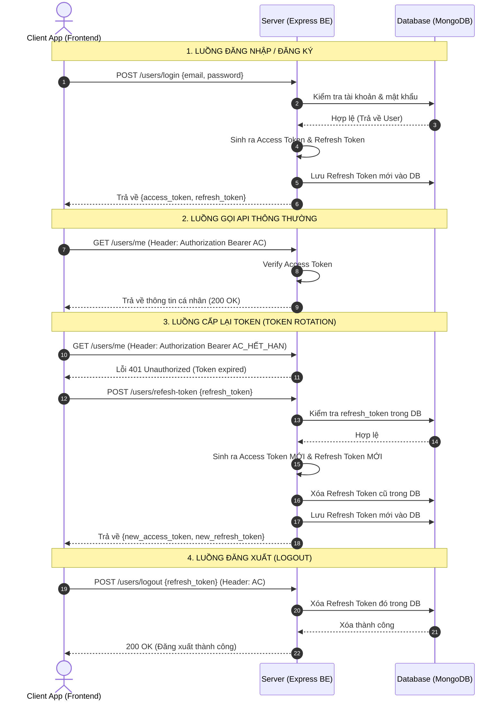

# CHUẨN LUỒNG XÁC THỰC JWT (STANDARD JWT AUTHENTICATION FLOW)

Tài liệu này hướng dẫn chi tiết về cấu trúc và quy trình vận hành của một luồng xác thực người dùng chuẩn trong ứng dụng Web sử dụng JSON Web Token (JWT) với cơ chế **Access Token** & **Refresh Token**.

---

## 1. TỔNG QUAN HỆ THỐNG XÁC THỰC song song (Access Token & Refresh Token)

Trong các ứng dụng hiện đại, việc chỉ sử dụng một token duy nhất để xác thực sẽ đem lại rủi ro bảo mật rất lớn. Do đó, mô hình chuẩn công nghiệp sử dụng hai loại token hoạt động song song:

| Thuộc tính | Access Token | Refresh Token |
| :--- | :--- | :--- |
| **Mục đích** | Xác thực danh tính của người dùng trong các yêu cầu gọi API thông thường. | Dùng để yêu cầu hệ thống cấp một Access Token mới mà không bắt người dùng đăng nhập lại. |
| **Thời gian sống** | Rất ngắn (thường từ 15 phút đến 1 tiếng). | Dài hơn nhiều (thường từ 7 ngày đến vài tháng). |
| **Cách gửi** | Gửi qua HTTP Header (`Authorization: Bearer <token>`). | Gửi qua Body của Request hoặc HttpOnly Cookie. |
| **Lưu trữ phía Server** | Không cần lưu (Stateless). Server chỉ cần dùng khóa bí mật giải mã kiểm tra tính hợp lệ. | Bắt buộc phải lưu trong Database (Stateful) để quản lý phiên đăng nhập và thu hồi khi cần. |

---

## 2. QUY TRÌNH HOẠT ĐỘNG CHI TIẾT (STEP-BY-STEP FLOW)

### Bước 1: Đăng nhập / Đăng ký (Login / Register)
1. **Client** gửi thông tin đăng nhập (`email`, `password`) lên **Server**.
2. **Server** xác thực tài khoản trong DB (đối chiếu mật khẩu đã hash).
3. Nếu khớp, Server sinh ra cặp vé: **Access Token** và **Refresh Token**.
4. Server lưu trữ **Refresh Token** vào Database (bảng `refeshTokens`) để quản lý.
5. Server phản hồi cặp token này về cho **Client**.

### Bước 2: Gọi API cần xác thực (Authentication Middleware)
1. Với mỗi request gửi lên API được bảo vệ (ví dụ lấy thông tin cá nhân `/users/me`), **Client** đính kèm Access Token vào Header:
   `Authorization: Bearer <access_token>`
2. **Middleware** của Server bóc tách và giải mã Access Token bằng khóa bí mật `JWT_SECRET_ACCESS_TOKEN`.
   - **Thành công:** Lưu trữ payload của token (như `user_id`) vào ngữ cảnh của request (`req.decoded_authorization`) và chuyển tiếp sang Controller để xử lý.
   - **Thất bại (Ví dụ: hết hạn):** Trả về mã lỗi `401 Unauthorized` ngay lập tức.

### Bước 3: Cấp lại Token khi hết hạn (Token Rotation / Refresh Token)
Khi Access Token hết hạn, Client tự động gửi Refresh Token lên API `/users/refesh-token`:
1. Server giải mã Refresh Token bằng khóa bí mật `JWT_SECRET_REFRESH_TOKEN`.
2. Server truy vấn Database để kiểm tra Refresh Token này có tồn tại hay không.
   - Nếu **không tồn tại** (do đã bị thu hồi hoặc đăng xuất trước đó), trả về lỗi `401 Unauthorized`.
3. Nếu **hợp lệ**, Server thực hiện cơ chế **Token Rotation**:
   - Tạo mới hoàn toàn một cặp Access Token và Refresh Token mới.
   - Xóa Refresh Token cũ ra khỏi Database.
   - Chèn Refresh Token mới vào Database.
   - Trả cặp token mới về cho Client.
   *Lưu ý: Cơ chế luân chuyển này giúp phát hiện hành vi tấn công giả mạo (Replay Attack). Nếu token cũ bị dùng lại, hệ thống sẽ phát hiện ngay vì nó đã bị xóa khỏi DB.*

### Bước 4: Đăng xuất (Logout)
1. Client gửi yêu cầu đăng xuất lên Server kèm theo **Access Token** trên Header và **Refresh Token** trong Body.
2. Server verify cả 2 token, đảm bảo chúng cùng thuộc sở hữu của một `user_id`.
3. Server tiến hành xóa Refresh Token đó ra khỏi Database.
4. Trả về thông báo thành công. Phiên đăng nhập chính thức kết thúc.

---

## 3. SƠ ĐỒ TRỰC QUAN HÓA (SEQUENCE DIAGRAM)

---

## 4. CÁC QUY TẮC BẢO MẬT CỐT LÕI (SECURITY BEST PRACTICES)

1.  **Cách ly Khóa Bí Mật (Secret Key Isolation):**
    Tuyệt đối không dùng chung một chuỗi Secret Key để ký các loại token khác nhau. Phải định nghĩa 4 khóa riêng biệt trong môi trường (.env):
    - `JWT_SECRET_ACCESS_TOKEN`
    - `JWT_SECRET_REFRESH_TOKEN`
    - `JWT_SECRET_EMAIL_VERIFY_TOKEN`
    - `JWT_SECRET_FORGOT_PASSWORD_TOKEN`
2.  **Khử trùng lặp Payload (Strict Semantic Payload):**
    Đảm bảo trường `token_type` trong payload được thiết lập chính xác theo kiểu Enum tương ứng:
    - Access Token: `0` (`TokenType.AccessToken`)
    - Refresh Token: `1` (`TokenType.RefreshToken`)
    - Forgot Password: `2` (`TokenType.ForgottPasswordToken`)
    - Email Verify: `3` (`TokenType.EmailVerificationToken`)
3.  **Vô hiệu hóa một lần sử dụng (One-time Verification):**
    Các Token đặc thù như `email_verify_token` và `forgot_password_token` sau khi xác thực thành công phải lập tức cập nhật về chuỗi rỗng `''` trong cơ sở dữ liệu để ngăn chặn kẻ tấn công dùng lại URL cũ để bypass hệ thống.
4.  **Lọc dữ liệu đầu vào (Input Sanitization & Filtering):**
    Sử dụng bộ lọc (như `filterMiddleware` áp dụng `lodash/pick`) để thanh lọc dữ liệu đầu vào của API cập nhật dữ liệu, tránh lỗ hổng Parameter Injection (ví dụ hacker truyền thuộc tính nâng quyền hạn như `role: 'admin'`).
5.  **Bảo vệ runtime validator (Error Handling Safety):**
    Các middleware giải mã token phải kiểm tra kỹ giá trị có tồn tại trước khi thao tác chuỗi (như `.split(' ')`), tránh tạo ra lỗi runtime `TypeError` dẫn tới việc trả về sai mã lỗi giao tiếp HTTP (như trả về 422 thay vì 401).
