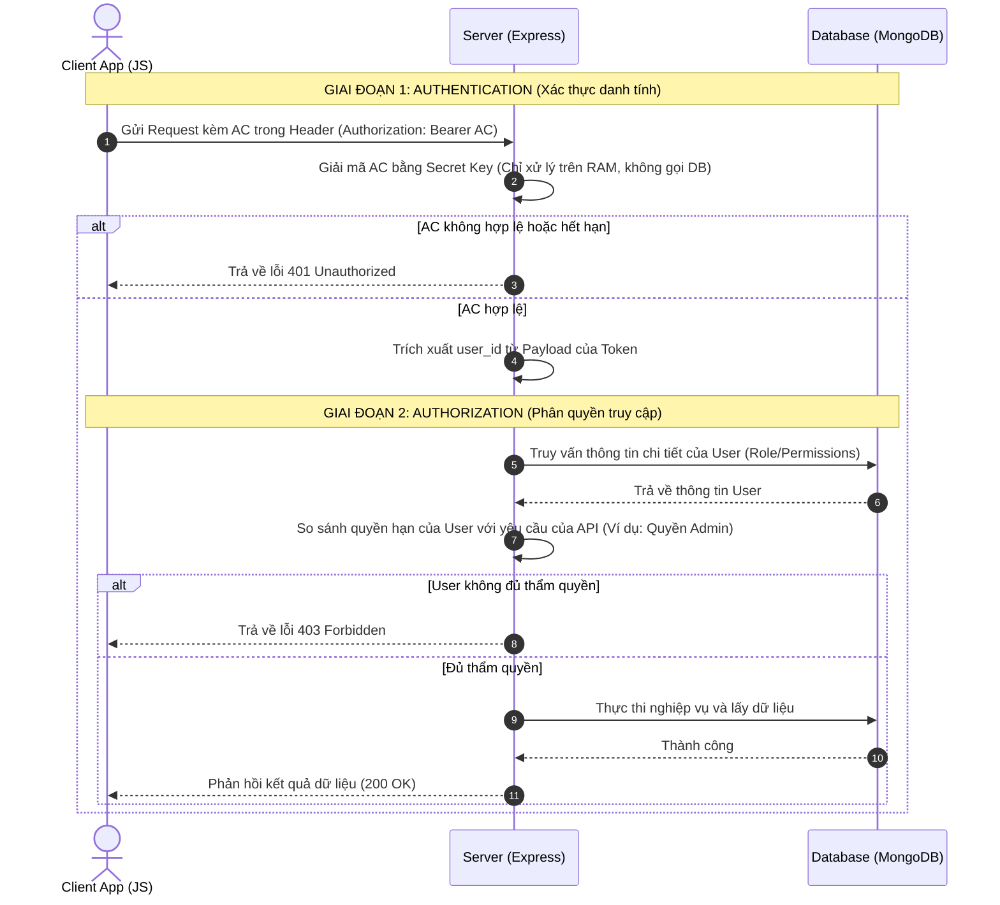

# KIẾN TRÚC VÀ CHUẨN XÁC THỰC WEB (WEB AUTHENTICATION & AUTHORIZATION)

Tài liệu này hệ thống hóa toàn bộ kiến thức chuyên sâu về cơ chế xác thực (Authentication) và phân quyền (Authorization) trong các ứng dụng Web hiện đại, tập trung giải nghĩa bản chất công nghệ và chuẩn thiết kế hệ thống.

---

## 1. CÁC ĐỊNH NGHĨA CỐT LÕI (JWT, ACCESS TOKEN & REFRESH TOKEN)

### 1.1. JWT là gì?
**JWT (JSON Web Token)** là một tiêu chuẩn mở (RFC 7519) định nghĩa phương thức truyền tin an toàn giữa các bên dưới dạng một đối tượng JSON. Dữ liệu này có thể kiểm tra tính xác thực và tin cậy tuyệt đối nhờ chữ ký số (digital signature).

#### Cấu tạo chi tiết của JWT (JWS - JSON Web Signature)
Một JWT thông thường gồm 3 phần được phân tách bằng dấu chấm (`.`), có định dạng: `Header.Payload.Signature`
1.  **Header (Phần đầu):** Thường gồm hai thông tin chính là loại token (`typ: "JWT"`) và thuật toán mã hóa chữ ký (ví dụ: `"alg": "HS256"` hoặc `"RS256"`). Chuỗi này được mã hóa dạng Base64Url.
2.  **Payload (Phần dữ liệu):** Chứa thông tin khai báo (claims), ví dụ: `user_id`, `role`, thời hạn hết hạn (`exp`). **Lưu ý cực kỳ quan trọng:** Phần này chỉ được mã hóa Base64Url chứ không hề được bảo mật thông tin, bất kỳ ai cũng có thể giải mã để xem nội dung bên trong. Do đó, tuyệt đối không được nhét dữ liệu nhạy cảm như mật khẩu vào đây.
3.  **Signature (Chữ ký):** Được tạo ra bằng cách lấy phần Header và Payload đã mã hóa Base64 kết hợp với một **Secret Key** (Khóa bí mật) ở phía Server rồi chạy qua thuật toán băm (Hashing). Chữ ký đảm bảo dữ liệu không bị thay đổi trên đường truyền.

### 1.2. Access Token (AC) & Refresh Token (RC) là gì?
Để giải quyết bài toán cân bằng giữa **bảo mật** và **trải nghiệm người dùng**, hệ thống sử dụng cơ chế hai token hoạt động song song:

*   **Access Token (AC - Vé thông hành):**
    - *Vai trò:* Dùng để đính kèm vào mỗi yêu cầu (request) gửi lên API cần bảo mật. Server sẽ đọc AC để nhận dạng người dùng.
    - *Thời gian sống:* Rất ngắn (thường từ 15 phút đến 1 tiếng). Vì AC liên tục được truyền gửi qua mạng nên có nguy cơ cao bị rò rỉ; thời hạn ngắn giúp hạn chế tối đa thời gian kẻ xấu có thể lợi dụng token này nếu đánh cắp được.
*   **Refresh Token (RC - Chìa khóa dự phòng):**
    - *Vai trò:* Chỉ dùng khi AC cũ đã hết hạn. Client sẽ gửi RC lên Server để xin cấp một cặp AC mới (và RC mới) mà không bắt người dùng phải nhập lại mật khẩu.
    - *Thời gian sống:* Rất dài (từ vài tuần đến vài tháng). RC rất ít khi được gửi qua mạng nên an toàn hơn.

---

## 2. VỊ TRÍ LƯU TRỮ VÀ LÝ DO AN TOÀN

Khi thiết kế hệ thống, lập trình viên cần giải quyết hai lỗ hổng lớn:
- **XSS (Cross-Site Scripting):** Hacker tiêm code JavaScript độc hại để đọc bộ nhớ của trang web.
- **CSRF (Cross-Site Request Forgery):** Kẻ xấu lừa trình duyệt của nạn nhân tự động gửi cookie kèm theo request giả mạo tới server mục tiêu.

### 2.1. Phía Client (Frontend)

| Vị trí lưu trữ | Khả năng chống XSS | Khả năng chống CSRF | Nhận xét & Đánh giá |
| :--- | :--- | :--- | :--- |
| **LocalStorage / SessionStorage** | **Không** (JS đọc được rất dễ dàng) | **Có** (Vì request không tự động đính kèm) | **Kém an toàn.** Tuyệt đối không lưu các token quan trọng/hạn dài (như Refresh Token) ở đây. |
| **HttpOnly, Secure Cookie** | **Tuyệt đối** (JS không thể truy cập) | **Yếu** (Nếu không cấu hình SameSite phù hợp) | **Rất an toàn trước XSS.** Đây là nơi chuẩn nhất để lưu trữ **Refresh Token**. Để chống CSRF, bắt buộc đặt cờ `SameSite=Lax` hoặc `SameSite=Strict`. |
| **In-Memory (Biến JavaScript / Redux)** | **Khá tốt** | **Tuyệt đối** | **Tuyệt vời về bảo mật nhưng bất tiện.** Token nằm trên RAM sẽ mất ngay khi người dùng F5 tải lại trang hoặc mở tab mới. |

#### Chiến lược lưu trữ tối ưu:
- **Access Token (AC):** Lưu trong **In-Memory** của ứng dụng (hoặc Cookie thường có thời hạn siêu ngắn).
- **Refresh Token (RC):** Lưu trong Cookie có cờ **`HttpOnly`**, **`Secure`** và **`SameSite=Lax`**.

### 2.2. Phía Server (Backend)
- **Access Token (AC):** **Không cần lưu trữ ở Server**. Server chỉ cần dùng Secret Key giải mã và xác nhận chữ ký của token là đủ (Cơ chế xác thực **Stateless**).
- **Refresh Token (RC):** **Bắt buộc phải lưu trữ** trong Database (SQL, MongoDB) hoặc **Redis** (In-memory Cache). Vì thời hạn của RC rất dài, Server cần lưu lại để có thể chủ động xóa bỏ (thu hồi quyền hạn) khi người dùng đổi mật khẩu hoặc chọn Đăng xuất toàn bộ thiết bị.

---

## 3. VÌ SAO PHẢI DÙNG JWT THAY VÌ CƠ CHẾ SESSION/COOKIE TRUYỀN THỐNG?

Cơ chế cũ (Session-based) hoạt động bằng cách tạo một Session File trên RAM/Ổ cứng Server khi đăng nhập và trả về cho Client một chuỗi `session_id` để trình duyệt lưu vào Cookie.

### 3.1. Tính Stateful vs Stateless
- **Session (Stateful):** Mỗi lần Client gửi request kèm `session_id` lên, Server bắt buộc phải truy vấn RAM/DB để đối chiếu xem phiên làm việc này có hợp lệ không và lấy thông tin User ra.
- **JWT (Stateless):** Server không lưu trạng thái phiên làm việc của Access Token. Bản thân token đã tự mang đầy đủ thông tin (ID, role, v.v.). Server chỉ cần giải mã kiểm tra tính đúng đắn của chữ ký là hoàn thành.

### 3.2. Khả năng mở rộng hệ thống (Scalability)
- **Session:** Gặp khó khăn lớn khi chạy hệ thống trên cụm nhiều server (Load Balancing). Nếu User đăng nhập ở Server A, khi request tiếp theo được điều hướng sang Server B, Server B sẽ báo lỗi chưa đăng nhập (do Session File nằm ở Server A). Hệ thống phải đồng bộ Session DB gây nghẽn và chậm.
- **JWT:** Cực kỳ dễ scale. Chỉ cần tất cả Server trong cụm sử dụng chung khóa `Secret Key` thì bất kỳ Server nào cũng có thể giải mã và xác thực token ngay lập tức mà không cần kết nối chéo hay đồng bộ.

### 3.3. Hỗ trợ đa nền tảng (Cross-platform)
- **Session:** Phụ thuộc chặt chẽ vào cơ chế hoạt động của Cookie trên trình duyệt Web. Rất khó triển khai và xử lý khi tích hợp với các ứng dụng Native Mobile (iOS/Android) hoặc khi tích hợp hệ thống bên thứ ba.
- **JWT:** Đơn giản chỉ là một chuỗi ký tự. Bất kỳ nền tảng nào (Web, Mobile, IoT, API gateway) cũng có thể dễ dàng lưu trữ và đính kèm vào Header của Request.

---

## 4. JWE LÀ GÌ? MỐI QUAN HỆ GIỮA JWE VÀ JWT (JWS)?

Nhiều người lầm tưởng JWT là tuyệt đối bảo mật. Nhưng bản chất JWT thông thường ta hay dùng là **JWS (JSON Web Signature)**.

### 4.1. JWS (JSON Web Signature)
- Dữ liệu ở phần Payload chỉ được mã hóa định dạng Base64Url để truyền tải chữ không hề bảo mật. Bất kỳ ai bắt được gói tin đều có thể giải mã Base64 dễ dàng để đọc nội dung.
- JWS chỉ đảm bảo **Tính toàn vẹn (Integrity)**: Dữ liệu không bị thay đổi (nếu bị đổi chữ ký sẽ lỗi).

### 4.2. JWE (JSON Web Encryption) là gì?
- **JWE** nâng cấp bảo mật bằng cách mã hóa thực sự phần nội dung Payload bằng các thuật toán mã hóa mạnh mẽ (như AES, RSA).
- Người không giữ khóa giải mã (Private Key) dù lấy được token JWE cũng chỉ nhìn thấy một chuỗi ký tự vô nghĩa đã được mã hóa sâu.
- JWE đảm bảo đồng thời cả **Tính toàn vẹn (Integrity)** và **Tính bảo mật/bí mật (Confidentiality)**.

### 4.3. Mối quan hệ và Ứng dụng
- JWS và JWE đều là con của JWT.
- **Khi nào dùng JWS (JWT thông thường):** Hầu hết các ứng dụng thông thường, chỉ lưu trữ các ID phi nhạy cảm để xác thực.
- **Khi nào dùng JWE:** Dùng trong các dự án tài chính, ngân hàng, bảo hiểm y tế khi bắt buộc phải lưu thông tin nhạy cảm (như thông tin cá nhân, mã số giao dịch) trong token truyền gửi.

---

## 5. THIẾT KẾ LUỒNG CHI TIẾT AUTHENTICATE & AUTHORIZATION QUY CHUẨN

- **Authentication (Xác thực):** Xác định "Bạn là ai?".
- **Authorization (Phân quyền):** Xác định "Bạn được phép làm gì?".

Để tối ưu hóa hiệu năng, giảm tải cho Database và bảo vệ hệ thống khỏi các cuộc tấn công từ chối dịch vụ (DDoS), luồng Auth chuẩn được thiết kế như sau:

### Vì sao thiết kế phân tách hai giai đoạn như vậy?

1.  **Giai đoạn 1 (Authentication) diễn ra ở bộ nhớ tạm thời (RAM - Stateless):**
    Việc xác minh chữ ký của Access Token được thực hiện bằng toán học mật mã trên RAM, diễn ra cực kỳ nhanh mà **không cần tạo kết nối hay truy vấn Database**. Nếu hacker dùng token giả mạo để spam phá hoại hệ thống, Server sẽ chặn đứng ngay lập tức ở middleware ngoài cùng mà không hề gây ảnh hưởng đến hiệu năng của hệ quản trị cơ sở dữ liệu.
2.  **Giai đoạn 2 (Authorization) truy xuất Database (Stateful):**
    Không nên nhồi nhét tất cả thông tin phân quyền chi tiết của User vào trong Payload của JWT vì hai lý do:
    - Khiến kích thước token bị phình to, làm tiêu hao băng thông mạng của tất cả các request.
    - Quyền hạn của người dùng có thể thay đổi bất kỳ lúc nào bởi người quản trị. Việc kiểm tra quyền trực tiếp từ DB/Cache ở mỗi request nhạy cảm giúp đảm bảo tính cập nhật quyền hạn theo thời gian thực (Real-time).

---

## 6. BÀI TOÁN BÀO MẬT & CƠ CHẾ THU HỒI TOKEN (RECOVERY & REVOCATION)

### 6.1. Vì sao không dùng CHỈ 1 loại (Chỉ dùng Access hoặc chỉ dùng Refresh)?
*   **Nếu chỉ dùng Access Token:**
    - *Hạn dài:* Nếu bị lộ, hacker chiếm quyền tài khoản vĩnh viễn vì Server xác thực Stateless không tự thu hồi được chiếc vé đó.
    - *Hạn ngắn:* Người dùng liên tục bị đá ra ngoài và bắt đăng nhập lại sau mỗi 10-15 phút.
*   **Nếu chỉ dùng Refresh Token để gọi API:**
    - Vì Refresh Token là Stateful (phải check DB để quản lý thu hồi), việc dùng nó để gọi mọi API sẽ ép Server phải kết nối Database liên tục $\rightarrow$ Gây nghẽn cổ chai DB và mất hoàn toàn ưu thế Stateless của JWT.

### 6.2. Vì sao không thiết lập thời hạn vĩnh cửu (Never Expire)?
*   JWT là bất biến sau khi được ký. Kẻ tấn công nếu đánh cắp được token vĩnh cửu sẽ có quyền kiểm soát tài khoản đó trọn đời. Do đó, thời hạn hết hạn (`exp`) là chốt chặn an toàn bắt buộc phải có để giới hạn thời gian phơi nhiễm rủi ro.

### 6.3. Cơ chế thu hồi (Revoke) Token
*   **Với Refresh Token (Stateful):** Khi người dùng nhấn **Đăng xuất (Logout)** hoặc **Đổi mật khẩu**, Server chỉ cần chạy lệnh **xóa (Delete)** Refresh Token đó trong Database. Lần kế tiếp khi gửi Refresh Token này lên xin cấp mới, hệ thống kiểm tra DB không thấy sẽ từ chối ngay.
*   **Với Access Token (Stateless):** Do không lưu DB nên việc thu hồi tức thời rất khó khăn. Các cách xử lý chuẩn gồm:
    1.  *Đặt hạn cực ngắn (5-15 phút):* Đây là giải pháp phổ biến nhất. Khi logout chỉ cần xóa Refresh Token. Access Token của kẻ gian dù có giữ cũng chỉ dùng được thêm vài phút rồi tự động vô hiệu.
    2.  *Sử dụng Blacklist trên Redis:* Khi logout, lưu Access Token cũ vào Blacklist của Redis với thời hạn sống bằng thời gian còn lại của token. Middleware sẽ check nhanh trong Redis trước khi cho đi qua.
    3.  *Kiểm tra thời điểm đổi mật khẩu:* So sánh thời điểm phát hành token (`iat`) với thời điểm thay đổi thông tin gần nhất (`updated_at`) trong DB. Nếu `iat < updated_at`, token đó lập tức bị hủy bỏ.
